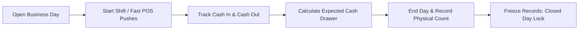

# Module 02: Business Days & Shifts (`business_days_shifts`)

## 1. Domain & Scope
The **Business Days & Shifts** module manages the daily cash register lifecycle for the canteen POS: morning opening float, shift schedules (Breakfast, Lunch, Dinner), automated shift detection, expected cash calculation from all drawer activities, evening physical cash count reconciliation (surplus/shortage), and financial data freeze locks on closed days.

---

## 2. Table Schema Dictionary

| Table | Primary Key | Description |
| :--- | :--- | :--- |
| `business_days` | `id` (UUID) | Daily register instance with opening float, expected cash, actual physical cash, and surplus/shortage discrepancy. |
| `shifts` | `id` (UUID) | Canteen operating time windows (start/end times, sort order, active status). |
| `day_notes` | `id` (UUID) | Handover notes and manager memos attached to a business day. |

---

## 3. Screen & Page Wiring Directory

### 📱 `HomeScreen` (POS & Operations Dashboard)
* **File**: [home_screen.dart](file:///Users/daviditc/Documents/personal_projects/smart-hisab/mobile/lib/features/home/home_screen.dart)
* **Riverpod Provider**: `businessDayNotifierProvider` (`AsyncNotifier<BusinessDayState>`)
* **Read RPCs**:
  * `get_active_business_day(p_tenant_id)` -> Fetches active business day status and opening float.
  * `get_current_shift(p_tenant_id)` -> Resolves current shift by clock time.
* **Intended Actions**:
  * Displays celestial hero animation based on active shift / time of day.
  * When NO day is open: Renders "Start Business Day" card.
  * When day IS open: Renders active stats card, fast meal punch picker trigger, and "Close Day" button.
  * Pull-to-refresh: Refreshes active day status.

---

### 🗂️ `OpenDayBottomSheet` (Start Business Day)
* **File**: [open_day_bottom_sheet.dart](file:///Users/daviditc/Documents/personal_projects/smart-hisab/mobile/lib/features/home/open_day_bottom_sheet.dart)
* **Triggered From**: "Start Business Day" CTA on `HomeScreen`.
* **Riverpod Provider**: `businessDayNotifierProvider`
* **Mutation RPC**: `start_business_day(p_tenant_id, p_opening_balance, p_notes)`
* **Payload**: `{"p_tenant_id": "uuid", "p_opening_balance": 1500.0, "p_notes": "Morning float"}`
* **Response**: `{"success": true, "business_day_id": "uuid", "opening_balance": 1500.0, "opened_at": "..."}`
* **Target Cache Mutation**: Optimistically sets `BusinessDayState(isOpen: true, activeDayId: uuid, openingBalance: 1500.0)` in Riverpod state, instantly unlocking POS tools without full refetch.

---

### 🗂️ `CloseDayBottomSheet` (End Day & Cash Drawer Reconciliation)
* **File**: [close_day_bottom_sheet.dart](file:///Users/daviditc/Documents/personal_projects/smart-hisab/mobile/lib/features/home/close_day_bottom_sheet.dart)
* **Triggered From**: "Close Day" button on `HomeScreen`.
* **Riverpod Provider**: `businessDayNotifierProvider`
* **Pre-fill RPC**: `calculate_expected_cash(p_day_id: "uuid")` -> Fetches expected cash in drawer (Opening float + Drawer Cash In - Drawer Cash Out).
* **Mutation RPC**: `end_business_day(p_day_id, p_actual_closing_cash, p_notes)`
* **Payload**: `{"p_day_id": "uuid", "p_actual_closing_cash": 4500.0, "p_notes": "Drawer counted"}`
* **Response**: `{"success": true, "business_day_id": "uuid", "expected_closing_cash": 4500.0, "cash_difference": 0.0}`
* **Target Cache Mutation**: Sets `BusinessDayState(isOpen: false, activeDayId: null)` in Riverpod, locks closed day transactions.

---

### 📱 `ShiftsScreen` & `ShiftFormBottomSheet`
* **Files**: [shifts_screen.dart](file:///Users/daviditc/Documents/personal_projects/smart-hisab/mobile/lib/features/settings/shifts_screen.dart), [shift_form_bottom_sheet.dart](file:///Users/daviditc/Documents/personal_projects/smart-hisab/mobile/lib/features/settings/shift_form_bottom_sheet.dart)
* **Riverpod Provider**: `shiftsNotifierProvider` (`AsyncNotifier<List<Shift>>`)
* **Read APIs**: `.from('shifts').select('*').eq('tenant_id', tenantId).order('sort_order')`
* **Mutation APIs**:
  * Insert: `.from('shifts').insert(...)`
  * Update: `.from('shifts').update(...).eq('id', shiftId)`
  * Delete/Toggle: `.from('shifts').update({'is_active': active}).eq('id', shiftId)`
* **Target Cache Mutation**: Directly mutates `List<Shift>` in local Riverpod state.

---

## 4. API & RPC Endpoints Summary Table

| Function / RPC | Method | Purpose | Input Payload | Output Response | Calling Screen / UI |
| :--- | :--- | :--- | :--- | :--- | :--- |
| `get_active_business_day` | `POST /rpc/get_active_business_day` | Checks if a business day is currently open | `{"p_tenant_id": "uuid"}` | `{"active": true, "id": "uuid", "opening_balance": 500.0}` | [home_screen.dart](file:///Users/daviditc/Documents/personal_projects/smart-hisab/mobile/lib/features/home/home_screen.dart) |
| `start_business_day` | `POST /rpc/start_business_day` | Opens new day with starting float | `{"p_tenant_id": "uuid", "p_opening_balance": 500.0}` | `{"success": true, "business_day_id": "uuid"}` | [open_day_bottom_sheet.dart](file:///Users/daviditc/Documents/personal_projects/smart-hisab/mobile/lib/features/home/open_day_bottom_sheet.dart) |
| `calculate_expected_cash` | `POST /rpc/calculate_expected_cash` | Computes theoretical drawer balance | `{"p_day_id": "uuid"}` | `{"expected_closing_cash": 1400.0, "cash_in": 1200.0}` | [close_day_bottom_sheet.dart](file:///Users/daviditc/Documents/personal_projects/smart-hisab/mobile/lib/features/home/close_day_bottom_sheet.dart) |
| `end_business_day` | `POST /rpc/end_business_day` | Closes day, reconciles count & locks day | `{"p_day_id": "uuid", "p_actual_closing_cash": 1400.0}` | `{"success": true, "cash_difference": 0.0}` | [close_day_bottom_sheet.dart](file:///Users/daviditc/Documents/personal_projects/smart-hisab/mobile/lib/features/home/close_day_bottom_sheet.dart) |
| `get_current_shift` | `POST /rpc/get_current_shift` | Resolves active shift by clock time | `{"p_tenant_id": "uuid"}` | `{"found": true, "id": "uuid", "name": "Lunch"}` | [home_screen.dart](file:///Users/daviditc/Documents/personal_projects/smart-hisab/mobile/lib/features/home/home_screen.dart) |
