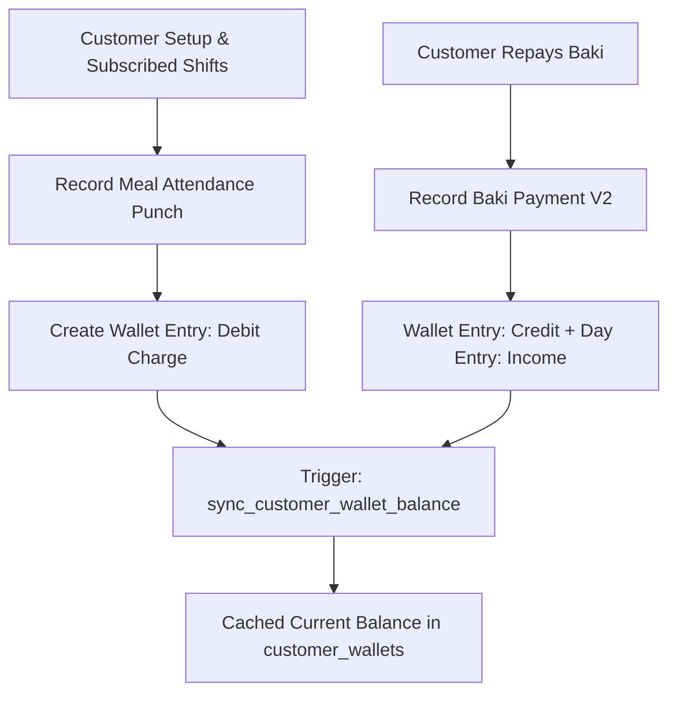

# Module 03: Customers & Meal Attendance / AR (`customers_meal_ar`)

## 1. Domain & Scope
The **Customers & Meal Attendance (Accounts Receivable)** module powers customer profiles, shift subscription rosters, fast 1-tap meal punches with rate snapshots, manual baki charges, debt repayments into canteen accounts, chronological statement generation, and debt protection guards.



---

## 2. Table Schema Dictionary

| Table | Primary Key | Description |
| :--- | :--- | :--- |
| `customers` | `id` (UUID) | Customer identity, phone, opening balance, subscribed shifts list, and status. |
| `customer_wallets` | `id` (UUID) | High-performance cache of customer's current balance (Positive = Due/Debt, Negative = Advance). |
| `meal_configs` | `id` (UUID) | Meal definitions per shift, default pricing rates, and auto-punch flags. |
| `meal_attendance` | `id` (UUID) | Meal punch records with rate snapshot, shift link, and void audit fields. |

---

## 3. API & RPC Endpoints Summary Table

| Function / RPC | Method | Purpose | Input Payload | Output Response |
| :--- | :--- | :--- | :--- | :--- |
| `create_or_reactivate_customer` | `POST /rpc/create_or_reactivate_customer` | Idempotent customer creation or reactivation | `{"p_tenant_id": "uuid", "p_name": "string", "p_phone": "string", "p_opening_balance": 0.0, "p_subscribed_shifts": ["uuid"]}` | `{"success": true, "customer_id": "uuid", "name": "string", "reactivated": false}` |
| `record_meal_attendance` | `POST /rpc/record_meal_attendance` | Punches meal, calculates rate snapshot, charges customer wallet debit | `{"p_tenant_id": "uuid", "p_customer_id": "uuid", "p_shift_id": "uuid", "p_rate": 50.0, "p_business_day_id": "uuid"}` | `{"success": true, "attendance_id": "uuid", "customer_id": "uuid", "rate": 50.0}` |
| `record_baki_payment_v2` | `POST /rpc/record_baki_payment_v2` | Records debt repayment into Canteen Account (Cash Drawer / bKash) | `{"p_tenant_id": "uuid", "p_customer_id": "uuid", "p_canteen_account_id": "uuid", "p_amount": 500.0, "p_business_day_id": "uuid"}` | `{"success": true, "wallet_entry_id": "uuid", "customer_id": "uuid", "amount": 500.0}` |
| `get_customer_balance` | `POST /rpc/get_customer_balance` | Fetches aggregated customer balance & totals | `{"p_customer_id": "uuid"}` | `{"customer_id": "uuid", "customer_name": "string", "current_balance": 250.0, "total_debit": 1250.0, "total_credit": 1000.0}` |
| `get_customer_statement` | `POST /rpc/get_customer_statement` | Chronological transaction statement | `{"p_customer_id": "uuid", "p_start_date": "2026-08-01", "p_end_date": "2026-08-21"}` | `[{"id": "uuid", "entry_type": "debit|credit", "category": "string", "amount": 50.0, "account_name": "string"}]` |
| `sync_customer_wallet_balance` | Trigger | Auto-recomputes customer balance cache on transaction changes | System trigger | `Updates customer_wallets table` |
| `check_customer_debt_before_deactivation` | Trigger Guard | Prevents deactivating a customer with unpaid baki | System trigger | `Raises exception if current_balance > 0` |

---

## 4. Detailed RPC Reference

### `record_meal_attendance`
* **Triggered by**: [quick_customer_picker_bottom_sheet.dart](file:///Users/daviditc/Documents/personal_projects/smart-hisab/mobile/lib/features/home/widgets/quick_customer_picker_bottom_sheet.dart) / [customers_screen.dart](file:///Users/daviditc/Documents/personal_projects/smart-hisab/mobile/lib/features/customers/customers_screen.dart)
* **Payload**:
```json
{
  "p_tenant_id": "e2a3b4c5-0000-0000-0000-000000000001",
  "p_customer_id": "99f8c12a-0000-0000-0000-000000000001",
  "p_shift_id": "33a1b2c3-0000-0000-0000-000000000001",
  "p_rate": 60.00,
  "p_business_day_id": "8f3b6a9c-0000-0000-0000-000000000001",
  "p_is_manual": false,
  "p_notes": "Lunch meal punch"
}
```
* **Success Response**:
```json
{
  "success": true,
  "attendance_id": "77a8b9c0-0000-0000-0000-000000000001",
  "customer_id": "99f8c12a-0000-0000-0000-000000000001",
  "rate": 60.00,
  "meal_date": "2026-08-21"
}
```

---

### `record_baki_payment_v2`
* **Triggered by**: [collect_baki_bottom_sheet.dart](file:///Users/daviditc/Documents/personal_projects/smart-hisab/mobile/lib/features/customers/collect_baki_bottom_sheet.dart)
* **Payload**:
```json
{
  "p_tenant_id": "e2a3b4c5-0000-0000-0000-000000000001",
  "p_customer_id": "99f8c12a-0000-0000-0000-000000000001",
  "p_canteen_account_id": "11a2b3c4-0000-0000-0000-000000000001",
  "p_amount": 500.00,
  "p_business_day_id": "8f3b6a9c-0000-0000-0000-000000000001",
  "p_notes": "Cash repayment received by Manager"
}
```
* **Success Response**:
```json
{
  "success": true,
  "wallet_entry_id": "55a6b7c8-0000-0000-0000-000000000001",
  "customer_id": "99f8c12a-0000-0000-0000-000000000001",
  "canteen_account_id": "11a2b3c4-0000-0000-0000-000000000001",
  "amount": 500.00
}
```

---

## 5. Mobile Screens & Consumers
* [customers_screen.dart](file:///Users/daviditc/Documents/personal_projects/smart-hisab/mobile/lib/features/customers/customers_screen.dart)
* [customer_detail_screen.dart](file:///Users/daviditc/Documents/personal_projects/smart-hisab/mobile/lib/features/customers/customer_detail_screen.dart)
* [customers_notifier.dart](file:///Users/daviditc/Documents/personal_projects/smart-hisab/mobile/lib/features/customers/customers_notifier.dart)
* [add_customer_bottom_sheet.dart](file:///Users/daviditc/Documents/personal_projects/smart-hisab/mobile/lib/features/customers/add_customer_bottom_sheet.dart)
* [edit_customer_bottom_sheet.dart](file:///Users/daviditc/Documents/personal_projects/smart-hisab/mobile/lib/features/customers/edit_customer_bottom_sheet.dart)
* [collect_baki_bottom_sheet.dart](file:///Users/daviditc/Documents/personal_projects/smart-hisab/mobile/lib/features/customers/collect_baki_bottom_sheet.dart)
* [add_manual_baki_bottom_sheet.dart](file:///Users/daviditc/Documents/personal_projects/smart-hisab/mobile/lib/features/customers/add_manual_baki_bottom_sheet.dart)
* [manage_meal_subscription_bottom_sheet.dart](file:///Users/daviditc/Documents/personal_projects/smart-hisab/mobile/lib/features/customers/manage_meal_subscription_bottom_sheet.dart)
* [meal_attendance_calendar_bottom_sheet.dart](file:///Users/daviditc/Documents/personal_projects/smart-hisab/mobile/lib/features/customers/meal_attendance_calendar_bottom_sheet.dart)
* [meal_configs_screen.dart](file:///Users/daviditc/Documents/personal_projects/smart-hisab/mobile/lib/features/settings/meal_configs_screen.dart)
* [meal_config_form_bottom_sheet.dart](file:///Users/daviditc/Documents/personal_projects/smart-hisab/mobile/lib/features/settings/meal_config_form_bottom_sheet.dart)
