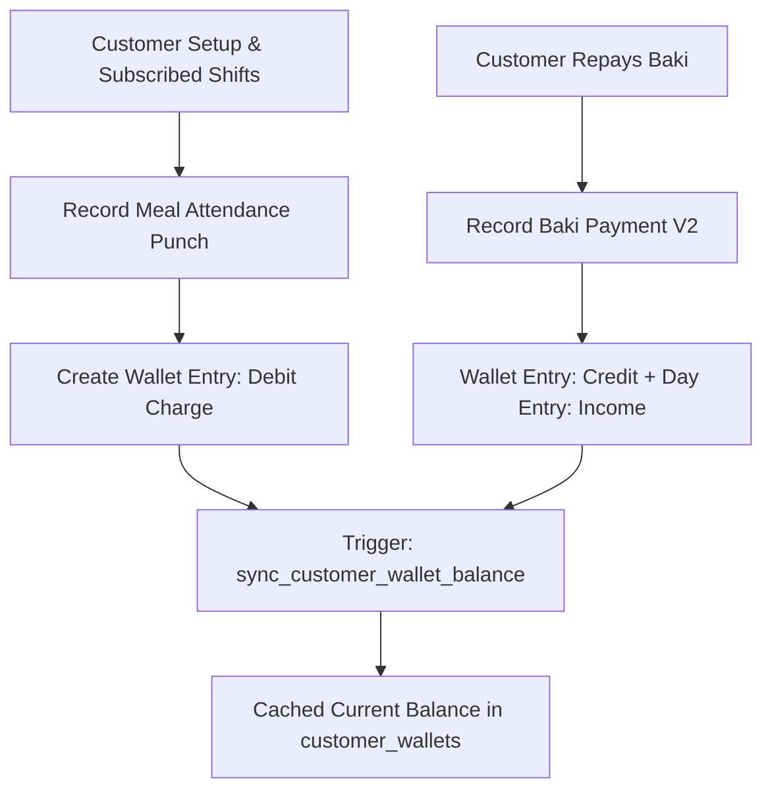

# Module 03: Customers & Meal Attendance / AR (`customers_meal_ar`)

## 1. Domain & Scope
The **Customers & Meal Attendance (Accounts Receivable)** module powers customer profiles, shift subscription rosters, fast 1-tap meal punches with rate snapshots, manual baki charges, debt repayments into canteen accounts, chronological statement generation, and debt protection guards.

---

## 2. Table Schema Dictionary

| Table | Primary Key | Description |
| :--- | :--- | :--- |
| `customers` | `id` (UUID) | Customer identity, phone, opening balance, subscribed shifts list, and status. |
| `customer_wallets` | `id` (UUID) | High-performance cache of customer's current balance (Positive = Due/Debt, Negative = Advance). |
| `meal_configs` | `id` (UUID) | Meal definitions per shift, default pricing rates, and auto-punch flags. |
| `meal_attendance` | `id` (UUID) | Meal punch records with rate snapshot, shift link, and void audit fields. |

---

## 3. Screen & Page Wiring Directory

### 📱 `CustomersScreen` (Customer Directory & Baki List)
* **File**: [customers_screen.dart](file:///Users/daviditc/Documents/personal_projects/smart-hisab/mobile/lib/features/customers/customers_screen.dart)
* **Riverpod Provider**: `customersNotifierProvider` (`AsyncNotifier<List<Customer>>`)
* **Read APIs**: `.from('customers').select('*, customer_wallets(*)').eq('tenant_id', tenantId).order('name')`
* **Intended Actions**:
  * Debounced text search by customer name or phone.
  * Shift filter chips (e.g., Breakfast, Lunch, Dinner subscribers).
  * Customer card tap: Navigates to `CustomerDetailScreen`.
  * Swipe actions: Edit customer, quick collect baki.
  * Header/Floating Button: Opens `AddCustomerBottomSheet`.

---

### 📱 `CustomerDetailScreen` (Customer Ledger & Statement)
* **File**: [customer_detail_screen.dart](file:///Users/daviditc/Documents/personal_projects/smart-hisab/mobile/lib/features/customers/customer_detail_screen.dart)
* **Riverpod Provider**: `customerDetailNotifierProvider(customerId)`
* **Read RPCs**:
  * `get_customer_balance(p_customer_id)` -> Fetches live balance, total debt, total credit.
  * `get_customer_statement(p_customer_id, p_start_date, p_end_date)` -> Fetches chronological statement.
* **Intended Actions**:
  * View balance summary header with total due baki badge.
  * Quick Actions Grid:
    * Tap "Collect Baki" ➔ Opens `CollectBakiBottomSheet`.
    * Tap "Add Baki (Debit)" ➔ Opens `AddManualBakiBottomSheet`.
    * Tap "Subscriptions" ➔ Opens `ManageMealSubscriptionBottomSheet`.
    * Tap "Calendar" ➔ Opens `MealAttendanceCalendarBottomSheet`.
  * Transaction history row: Swipe to void ➔ Opens `VoidTransactionBottomSheet`.

---

### 🗂️ `AddCustomerBottomSheet`
* **File**: [add_customer_bottom_sheet.dart](file:///Users/daviditc/Documents/personal_projects/smart-hisab/mobile/lib/features/customers/add_customer_bottom_sheet.dart)
* **Riverpod Provider**: `customersNotifierProvider`
* **Mutation RPC**: `create_or_reactivate_customer(p_tenant_id, p_name, p_phone, p_opening_balance, p_subscribed_shifts)`
* **Payload**: `{"p_tenant_id": "uuid", "p_name": "Rahim", "p_phone": "01711000000", "p_opening_balance": 0.0, "p_subscribed_shifts": ["uuid"]}`
* **Target Cache Mutation**: Optimistically prepends new `Customer` object with initial `CustomerWallet` to `customersNotifierProvider` state.

---

### 🗂️ `CollectBakiBottomSheet` (Repayment into Canteen Wallet)
* **File**: [collect_baki_bottom_sheet.dart](file:///Users/daviditc/Documents/personal_projects/smart-hisab/mobile/lib/features/customers/collect_baki_bottom_sheet.dart)
* **Riverpod Providers**: `customersNotifierProvider`, `customerDetailNotifierProvider`, `cashbookNotifierProvider`
* **Mutation RPC**: `record_baki_payment_v2(p_tenant_id, p_customer_id, p_canteen_account_id, p_amount, p_business_day_id, p_notes)`
* **Payload**: `{"p_tenant_id": "uuid", "p_customer_id": "uuid", "p_canteen_account_id": "uuid", "p_amount": 500.0, "p_business_day_id": "uuid"}`
* **Target Cache Mutation**:
  * Decrements `customer_wallets.current_balance` by `amount`.
  * Inserts credit transaction into `customerDetailNotifierProvider` ledger list.
  * Appends cashbook income entry in `cashbookNotifierProvider`.

---

### 🗂️ `QuickCustomerPickerBottomSheet` (Fast Meal Punch)
* **File**: [quick_customer_picker_bottom_sheet.dart](file:///Users/daviditc/Documents/personal_projects/smart-hisab/mobile/lib/features/home/widgets/quick_customer_picker_bottom_sheet.dart)
* **Riverpod Provider**: `customersNotifierProvider`
* **Mutation RPC**: `record_meal_attendance(p_tenant_id, p_customer_id, p_shift_id, p_rate, p_business_day_id)`
* **Payload**: `{"p_tenant_id": "uuid", "p_customer_id": "uuid", "p_shift_id": "uuid", "p_rate": 60.0, "p_business_day_id": "uuid"}`
* **Target Cache Mutation**: Increments customer's `current_balance` by `rate` locally for instant feedback.

---

### 📱 `MealConfigsScreen` & `MealConfigFormBottomSheet`
* **Files**: [meal_configs_screen.dart](file:///Users/daviditc/Documents/personal_projects/smart-hisab/mobile/lib/features/settings/meal_configs_screen.dart), [meal_config_form_bottom_sheet.dart](file:///Users/daviditc/Documents/personal_projects/smart-hisab/mobile/lib/features/settings/meal_config_form_bottom_sheet.dart)
* **Riverpod Provider**: `mealConfigsNotifierProvider` (`AsyncNotifier<List<MealConfig>>`)
* **Read APIs**: `.from('meal_configs').select('*').eq('tenant_id', tenantId)`
* **Mutation APIs**: `.from('meal_configs').insert(...)` / `.update(...)`
* **Target Cache Mutation**: Updates meal rate and active flags in local state.

---

## 4. API & RPC Endpoints Summary Table

| Function / RPC | Method | Purpose | Input Payload | Output Response | Calling Screen / UI |
| :--- | :--- | :--- | :--- | :--- | :--- |
| `create_or_reactivate_customer` | `POST /rpc/create_or_reactivate_customer` | Idempotent customer creation | `{"p_tenant_id": "uuid", "p_name": "string", "p_phone": "string"}` | `{"success": true, "customer_id": "uuid"}` | [add_customer_bottom_sheet.dart](file:///Users/daviditc/Documents/personal_projects/smart-hisab/mobile/lib/features/customers/add_customer_bottom_sheet.dart) |
| `record_meal_attendance` | `POST /rpc/record_meal_attendance` | Meal punch & wallet debit | `{"p_tenant_id": "uuid", "p_customer_id": "uuid", "p_rate": 50.0}` | `{"success": true, "attendance_id": "uuid"}` | [quick_customer_picker_bottom_sheet.dart](file:///Users/daviditc/Documents/personal_projects/smart-hisab/mobile/lib/features/home/widgets/quick_customer_picker_bottom_sheet.dart) |
| `record_baki_payment_v2` | `POST /rpc/record_baki_payment_v2` | Repayment into Canteen Wallet | `{"p_tenant_id": "uuid", "p_customer_id": "uuid", "p_canteen_account_id": "uuid", "p_amount": 500.0}` | `{"success": true, "wallet_entry_id": "uuid"}` | [collect_baki_bottom_sheet.dart](file:///Users/daviditc/Documents/personal_projects/smart-hisab/mobile/lib/features/customers/collect_baki_bottom_sheet.dart) |
| `get_customer_balance` | `POST /rpc/get_customer_balance` | Live customer balance & totals | `{"p_customer_id": "uuid"}` | `{"current_balance": 250.0, "total_debit": 1250.0}` | [customer_detail_screen.dart](file:///Users/daviditc/Documents/personal_projects/smart-hisab/mobile/lib/features/customers/customer_detail_screen.dart) |
| `get_customer_statement` | `POST /rpc/get_customer_statement` | Chronological statement | `{"p_customer_id": "uuid", "p_start_date": "...", "p_end_date": "..."}` | `[{"id": "uuid", "amount": 50.0, ...}]` | [customer_detail_screen.dart](file:///Users/daviditc/Documents/personal_projects/smart-hisab/mobile/lib/features/customers/customer_detail_screen.dart) |
