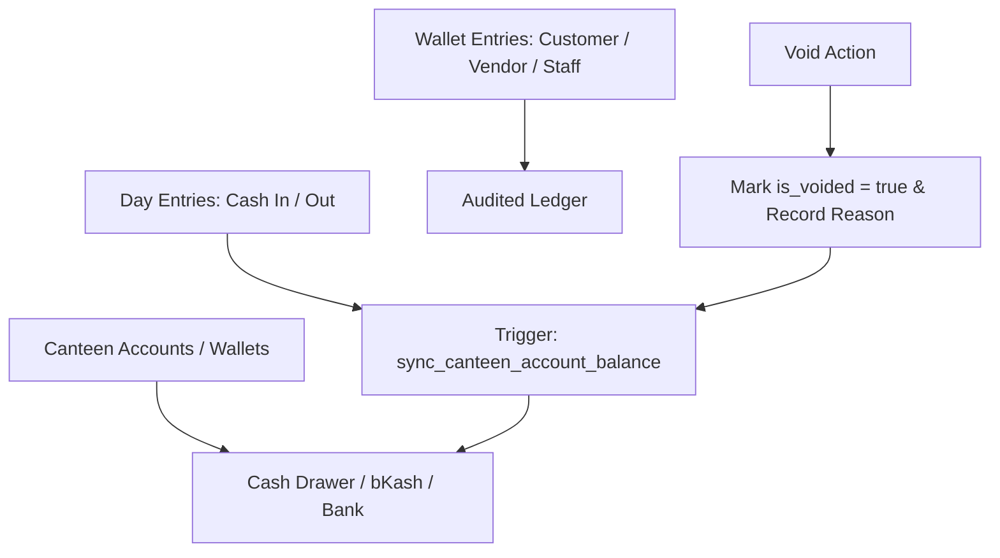

# Module 04: Cashbook & Canteen Wallets (`cashbook_wallets`)

## 1. Domain & Scope
The **Cashbook & Canteen Wallets** module acts as the core double-entry accounting ledger. It tracks multi-account balances (Cash Drawer, bKash, Bank Account), categorizes operating expenses (Bazar, Utilities, Rent, Vendor payout), executes inter-wallet fund transfers, and provides an audit-locked voiding mechanism for erroneous entries.



---

## 2. Table Schema Dictionary

| Table | Primary Key | Description |
| :--- | :--- | :--- |
| `canteen_accounts` | `id` (UUID) | Payment channels / wallets (Cash Drawer, bKash, Bank, Nagad) with live balance. |
| `day_entries` | `id` (UUID) | Cashbook financial entries (Income / Expense) linked to an active business day. |
| `wallet_entries` | `id` (UUID) | Master double-entry journal (Debit / Credit) for Customer, Vendor, and Staff. |

---

## 3. API & RPC Endpoints Summary Table

| Function / RPC | Method | Purpose | Input Payload | Output Response |
| :--- | :--- | :--- | :--- | :--- |
| `record_expense_v2` | `POST /rpc/record_expense_v2` | Records operating expense against specific Canteen Account | `{"p_tenant_id": "uuid", "p_canteen_account_id": "uuid", "p_category": "bazar\|general", "p_amount": 500.0, "p_business_day_id": "uuid"}` | `{"success": true, "day_entry_id": "uuid", "canteen_account_id": "uuid", "amount": 500.0}` |
| `transfer_canteen_funds` | `POST /rpc/transfer_canteen_funds` | Transfers funds between accounts (e.g. Cash Drawer to Bank/bKash) | `{"p_tenant_id": "uuid", "p_from_account_id": "uuid", "p_to_account_id": "uuid", "p_amount": 2000.0}` | `{"success": true, "from_account_id": "uuid", "to_account_id": "uuid", "amount": 2000.0}` |
| `void_wallet_entry` | `POST /rpc/void_wallet_entry` | Voids customer/vendor/staff wallet entry with reason audit & sync | `{"p_entry_id": "uuid", "p_reason": "string"}` | `{"success": true, "entry_id": "uuid", "voided": true}` |
| `void_day_entry` | `POST /rpc/void_day_entry` | Voids cashbook income/expense record | `{"p_entry_id": "uuid", "p_reason": "string"}` | `{"success": true, "entry_id": "uuid", "voided": true}` |
| `sync_canteen_account_balance` | Trigger | Auto-recalculates account balance based on active non-voided transactions | System trigger | `Updates canteen_accounts.current_balance` |
| `seed_default_canteen_accounts` | Internal SQL | Seeds Cash Drawer, bKash Merchant, Bank Account for new canteens | `p_tenant_id UUID` | `VOID` |

---

## 4. Detailed RPC Reference

### `record_expense_v2`
* **Triggered by**: [add_expense_bottom_sheet.dart](file:///Users/daviditc/Documents/personal_projects/smart-hisab/mobile/lib/features/cashbook/add_expense_bottom_sheet.dart) / [bazar_screen.dart](file:///Users/daviditc/Documents/personal_projects/smart-hisab/mobile/lib/features/bazar/bazar_screen.dart)
* **Payload**:
```json
{
  "p_tenant_id": "e2a3b4c5-0000-0000-0000-000000000001",
  "p_canteen_account_id": "11a2b3c4-0000-0000-0000-000000000001",
  "p_category": "bazar",
  "p_amount": 1250.00,
  "p_business_day_id": "8f3b6a9c-0000-0000-0000-000000000001",
  "p_notes": "Morning vegetable & poultry bazar"
}
```
* **Success Response**:
```json
{
  "success": true,
  "day_entry_id": "44a5b6c7-0000-0000-0000-000000000001",
  "canteen_account_id": "11a2b3c4-0000-0000-0000-000000000001",
  "amount": 1250.00,
  "category": "bazar"
}
```

---

### `void_wallet_entry`
* **Triggered by**: [void_transaction_bottom_sheet.dart](file:///Users/daviditc/Documents/personal_projects/smart-hisab/mobile/lib/features/customers/void_transaction_bottom_sheet.dart)
* **Payload**:
```json
{
  "p_entry_id": "55a6b7c8-0000-0000-0000-000000000001",
  "p_reason": "Customer wrongly charged for lunch"
}
```
* **Success Response**:
```json
{
  "success": true,
  "entry_id": "55a6b7c8-0000-0000-0000-000000000001",
  "voided": true
}
```

---

## 5. Mobile Screens & Consumers
* [cashbook_screen.dart](file:///Users/daviditc/Documents/personal_projects/smart-hisab/mobile/lib/features/cashbook/cashbook_screen.dart)
* [cashbook_notifier.dart](file:///Users/daviditc/Documents/personal_projects/smart-hisab/mobile/lib/features/cashbook/cashbook_notifier.dart)
* [add_expense_bottom_sheet.dart](file:///Users/daviditc/Documents/personal_projects/smart-hisab/mobile/lib/features/cashbook/add_expense_bottom_sheet.dart)
* [add_income_bottom_sheet.dart](file:///Users/daviditc/Documents/personal_projects/smart-hisab/mobile/lib/features/cashbook/add_income_bottom_sheet.dart)
* [bazar_screen.dart](file:///Users/daviditc/Documents/personal_projects/smart-hisab/mobile/lib/features/bazar/bazar_screen.dart)
* [bazar_note_detail_screen.dart](file:///Users/daviditc/Documents/personal_projects/smart-hisab/mobile/lib/features/cashbook/bazar_note_detail_screen.dart)
* [void_transaction_bottom_sheet.dart](file:///Users/daviditc/Documents/personal_projects/smart-hisab/mobile/lib/features/customers/void_transaction_bottom_sheet.dart)
