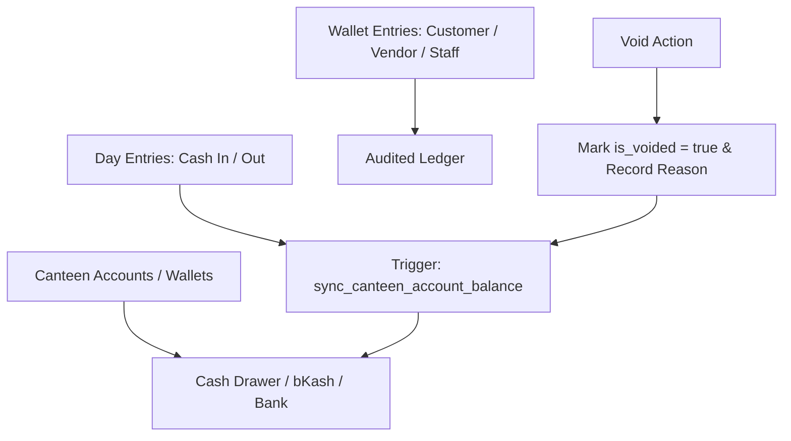

# Module 04: Cashbook & Canteen Wallets (`cashbook_wallets`)

## 1. Domain & Scope
The **Cashbook & Canteen Wallets** module acts as the core double-entry accounting ledger: tracks multi-account balances (Cash Drawer, bKash, Bank Account), categorizes operating expenses (Bazar, Utilities, Rent, Vendor payout), executes inter-wallet fund transfers, and provides an audit-locked voiding mechanism for erroneous entries.

---

## 2. Table Schema Dictionary

| Table | Primary Key | Description |
| :--- | :--- | :--- |
| `canteen_accounts` | `id` (UUID) | Payment channels / wallets (Cash Drawer, bKash, Bank, Nagad) with live balance. |
| `day_entries` | `id` (UUID) | Cashbook financial entries (Income / Expense) linked to an active business day. |
| `wallet_entries` | `id` (UUID) | Master double-entry journal (Debit / Credit) for Customer, Vendor, and Staff. |

---

## 3. Screen & Page Wiring Directory

### 📱 `CashbookScreen` (Cashbook Register & Wallets)
* **File**: [cashbook_screen.dart](file:///Users/daviditc/Documents/personal_projects/smart-hisab/mobile/lib/features/cashbook/cashbook_screen.dart)
* **Riverpod Provider**: `cashbookNotifierProvider` (`AsyncNotifier<CashbookState>`)
* **Read APIs**:
  * `.from('canteen_accounts').select('*').eq('tenant_id', tenantId)`
  * `.from('day_entries').select('*, canteen_accounts(*)').eq('tenant_id', tenantId).order('created_at', ascending: false)`
* **Intended Actions**:
  * Wallet selector chips (All Accounts, Cash Drawer, bKash, Bank).
  * Day In / Out summary cards with net calculation.
  * Filterable transaction list with search by category or notes.
  * Floating action triggers: "Add Expense", "Add Income", "Transfer Funds".
  * Transaction swipe: Void transaction with audit reason.

---

### 🗂️ `AddExpenseBottomSheet`
* **File**: [add_expense_bottom_sheet.dart](file:///Users/daviditc/Documents/personal_projects/smart-hisab/mobile/lib/features/cashbook/add_expense_bottom_sheet.dart)
* **Riverpod Provider**: `cashbookNotifierProvider`
* **Mutation RPC**: `record_expense_v2(p_tenant_id, p_canteen_account_id, p_category, p_amount, p_business_day_id, p_notes)`
* **Payload**: `{"p_tenant_id": "uuid", "p_canteen_account_id": "uuid", "p_category": "bazar|utilities|rent", "p_amount": 1200.0, "p_business_day_id": "uuid"}`
* **Target Cache Mutation**:
  * Prepends expense entry to `day_entries` in local state.
  * Decrements selected `canteen_accounts.current_balance` by `amount`.

---

### 🗂️ `AddIncomeBottomSheet`
* **File**: [add_income_bottom_sheet.dart](file:///Users/daviditc/Documents/personal_projects/smart-hisab/mobile/lib/features/cashbook/add_income_bottom_sheet.dart)
* **Riverpod Provider**: `cashbookNotifierProvider`
* **Mutation API**: `.from('day_entries').insert({'entry_type': 'income', 'canteen_account_id': ..., 'amount': ...})`
* **Target Cache Mutation**: Prepends income entry and increments account balance locally.

---

### 🗂️ Inter-Account Fund Transfer Sheet
* **Riverpod Provider**: `cashbookNotifierProvider`
* **Mutation RPC**: `transfer_canteen_funds(p_tenant_id, p_from_account_id, p_to_account_id, p_amount, p_business_day_id, p_notes)`
* **Payload**: `{"p_tenant_id": "uuid", "p_from_account_id": "uuid", "p_to_account_id": "uuid", "p_amount": 5000.0}`
* **Target Cache Mutation**: Decrements sender account, increments receiver account, appends transfer ledger logs.

---

### 🗂️ `VoidTransactionBottomSheet`
* **File**: [void_transaction_bottom_sheet.dart](file:///Users/daviditc/Documents/personal_projects/smart-hisab/mobile/lib/features/customers/void_transaction_bottom_sheet.dart)
* **Mutation RPCs**:
  * `void_wallet_entry(p_entry_id, p_reason)` -> Voids customer/vendor/staff journal entry & syncs balances.
  * `void_day_entry(p_entry_id, p_reason)` -> Voids cashbook expense/income & syncs account balance.
* **Target Cache Mutation**: Flags `is_voided = true` on the item in local state.

---

### 📱 `BazarScreen` & `BazarNoteDetailScreen`
* **Files**: [bazar_screen.dart](file:///Users/daviditc/Documents/personal_projects/smart-hisab/mobile/lib/features/bazar/bazar_screen.dart), [bazar_note_detail_screen.dart](file:///Users/daviditc/Documents/personal_projects/smart-hisab/mobile/lib/features/cashbook/bazar_note_detail_screen.dart)
* **Read APIs**: `.from('day_entries').select('*').eq('category', 'bazar').eq('tenant_id', tenantId)`
* **Intended Actions**: Daily market procurement logging, itemized grocery cost breakdown, attached receipts.

---

## 4. API & RPC Endpoints Summary Table

| Function / RPC | Method | Purpose | Input Payload | Output Response | Calling Screen / UI |
| :--- | :--- | :--- | :--- | :--- | :--- |
| `record_expense_v2` | `POST /rpc/record_expense_v2` | Records expense against account | `{"p_tenant_id": "uuid", "p_canteen_account_id": "uuid", "p_category": "string", "p_amount": 500.0}` | `{"success": true, "day_entry_id": "uuid"}` | [add_expense_bottom_sheet.dart](file:///Users/daviditc/Documents/personal_projects/smart-hisab/mobile/lib/features/cashbook/add_expense_bottom_sheet.dart) |
| `transfer_canteen_funds` | `POST /rpc/transfer_canteen_funds` | Inter-account fund transfers | `{"p_tenant_id": "uuid", "p_from_account_id": "uuid", "p_to_account_id": "uuid", "p_amount": 1000.0}` | `{"success": true, "from_account_id": "uuid"}` | [cashbook_screen.dart](file:///Users/daviditc/Documents/personal_projects/smart-hisab/mobile/lib/features/cashbook/cashbook_screen.dart) |
| `void_wallet_entry` | `POST /rpc/void_wallet_entry` | Voids journal entry with audit | `{"p_entry_id": "uuid", "p_reason": "string"}` | `{"success": true, "entry_id": "uuid"}` | [void_transaction_bottom_sheet.dart](file:///Users/daviditc/Documents/personal_projects/smart-hisab/mobile/lib/features/customers/void_transaction_bottom_sheet.dart) |
| `void_day_entry` | `POST /rpc/void_day_entry` | Voids cashbook income/expense | `{"p_entry_id": "uuid", "p_reason": "string"}` | `{"success": true, "entry_id": "uuid"}` | [cashbook_screen.dart](file:///Users/daviditc/Documents/personal_projects/smart-hisab/mobile/lib/features/cashbook/cashbook_screen.dart) |
