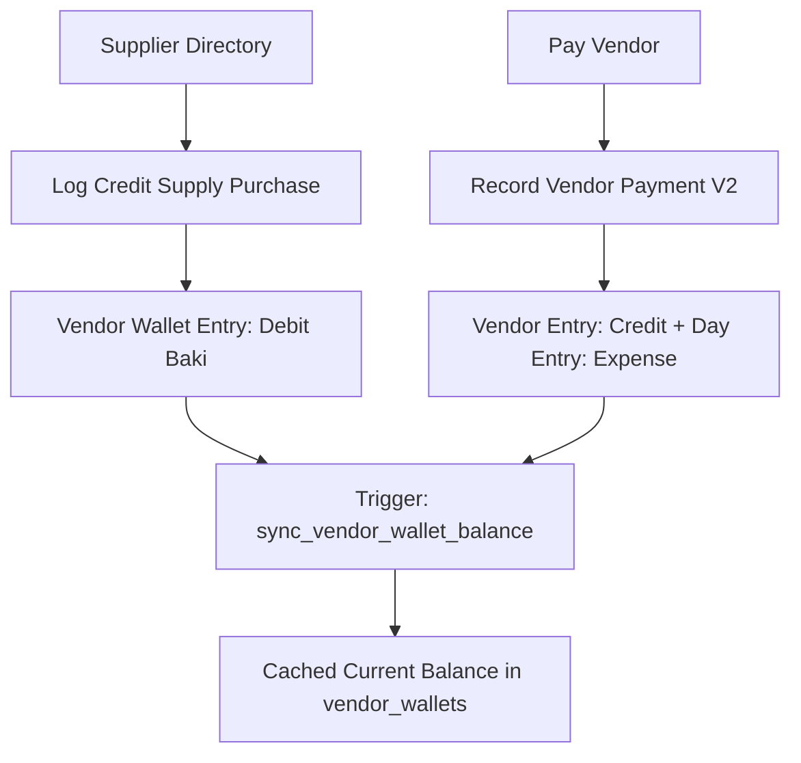

# Module 05: Vendors & Supplies / AP (`vendors_ap`)

## 1. Domain & Scope
The **Vendors & Supplies (Accounts Payable)** module manages suppliers/wholesalers, logs credit purchases (Supply Baki), tracks outstanding canteen debt to each vendor, records settlement disbursements from canteen accounts, and generates itemized vendor statements.

---

## 2. Table Schema Dictionary

| Table | Primary Key | Description |
| :--- | :--- | :--- |
| `vendors` | `id` (UUID) | Supplier directory (name, phone, address, trade category, opening balance). |
| `vendor_wallets` | `id` (UUID) | High-performance cache of canteen's payable debt to each vendor. |
| `vendor_wallet_entries` | `id` (UUID) | Supplier journal (Debit = Goods received on credit, Credit = Payment settled). |

---

## 3. Screen & Page Wiring Directory

### 📱 `VendorsScreen` (Suppliers Directory & AP List)
* **File**: [vendors_screen.dart](file:///Users/daviditc/Documents/personal_projects/smart-hisab/mobile/lib/features/settings/vendors_screen.dart)
* **Riverpod Provider**: `vendorsNotifierProvider` (`AsyncNotifier<List<Vendor>>`)
* **Read APIs**: `.from('vendors').select('*, vendor_wallets(*)').eq('tenant_id', tenantId).order('name')`
* **Intended Actions**:
  * Search suppliers by name, category, or phone.
  * Vendor card tap: Navigates to `VendorDetailScreen`.
  * Swipe actions: Quick settle payment, edit vendor.
  * Header CTA: Opens Add Vendor sheet.

---

### 📱 `VendorDetailScreen` (Vendor Ledger & Statement)
* **File**: [vendor_detail_screen.dart](file:///Users/daviditc/Documents/personal_projects/smart-hisab/mobile/lib/features/settings/vendor_detail_screen.dart)
* **Riverpod Provider**: `vendorDetailNotifierProvider(vendorId)`
* **Read RPC**: `get_vendor_statement(p_vendor_id, p_start_date, p_end_date)`
* **Intended Actions**:
  * Balance card: Displays outstanding payable debt.
  * CTA 1: "Record Payment" ➔ Opens `RecordVendorPaymentBottomSheet`.
  * CTA 2: "Add Supply Baki" ➔ Opens `AddVendorBakiBottomSheet`.
  * Chronological statement listing of supply deliveries vs payments.

---

### 🗂️ `RecordVendorPaymentBottomSheet` (Settlement Disbursement)
* **File**: [record_vendor_payment_bottom_sheet.dart](file:///Users/daviditc/Documents/personal_projects/smart-hisab/mobile/lib/features/settings/record_vendor_payment_bottom_sheet.dart)
* **Riverpod Providers**: `vendorsNotifierProvider`, `vendorDetailNotifierProvider`, `cashbookNotifierProvider`
* **Mutation RPC**: `record_vendor_payment_v2(p_tenant_id, p_vendor_id, p_canteen_account_id, p_amount, p_business_day_id, p_notes)`
* **Payload**: `{"p_tenant_id": "uuid", "p_vendor_id": "uuid", "p_canteen_account_id": "uuid", "p_amount": 2500.0, "p_business_day_id": "uuid"}`
* **Target Cache Mutation**:
  * Decrements payable debt in `vendor_wallets.current_balance`.
  * Appends credit settlement row in `vendorDetailNotifierProvider`.
  * Appends expense outflow row in `cashbookNotifierProvider`.

---

### 🗂️ `AddVendorBakiBottomSheet` (Credit Purchase)
* **File**: [add_vendor_baki_bottom_sheet.dart](file:///Users/daviditc/Documents/personal_projects/smart-hisab/mobile/lib/features/settings/add_vendor_baki_bottom_sheet.dart)
* **Mutation API**: `.from('vendor_wallet_entries').insert({'entry_type': 'debit', 'amount': ..., 'category': 'supplies'})`
* **Target Cache Mutation**: Increments vendor's payable balance cache.

---

## 4. API & RPC Endpoints Summary Table

| Function / RPC | Method | Purpose | Input Payload | Output Response | Calling Screen / UI |
| :--- | :--- | :--- | :--- | :--- | :--- |
| `record_vendor_payment_v2` | `POST /rpc/record_vendor_payment_v2` | Settles supplier payable debt | `{"p_tenant_id": "uuid", "p_vendor_id": "uuid", "p_canteen_account_id": "uuid", "p_amount": 2500.0}` | `{"success": true, "vendor_entry_id": "uuid"}` | [record_vendor_payment_bottom_sheet.dart](file:///Users/daviditc/Documents/personal_projects/smart-hisab/mobile/lib/features/settings/record_vendor_payment_bottom_sheet.dart) |
| `get_vendor_statement` | `POST /rpc/get_vendor_statement` | Chronological supplier ledger | `{"p_vendor_id": "uuid", "p_start_date": "...", "p_end_date": "..."}` | `[{"id": "uuid", "amount": 2500.0, ...}]` | [vendor_detail_screen.dart](file:///Users/daviditc/Documents/personal_projects/smart-hisab/mobile/lib/features/settings/vendor_detail_screen.dart) |
