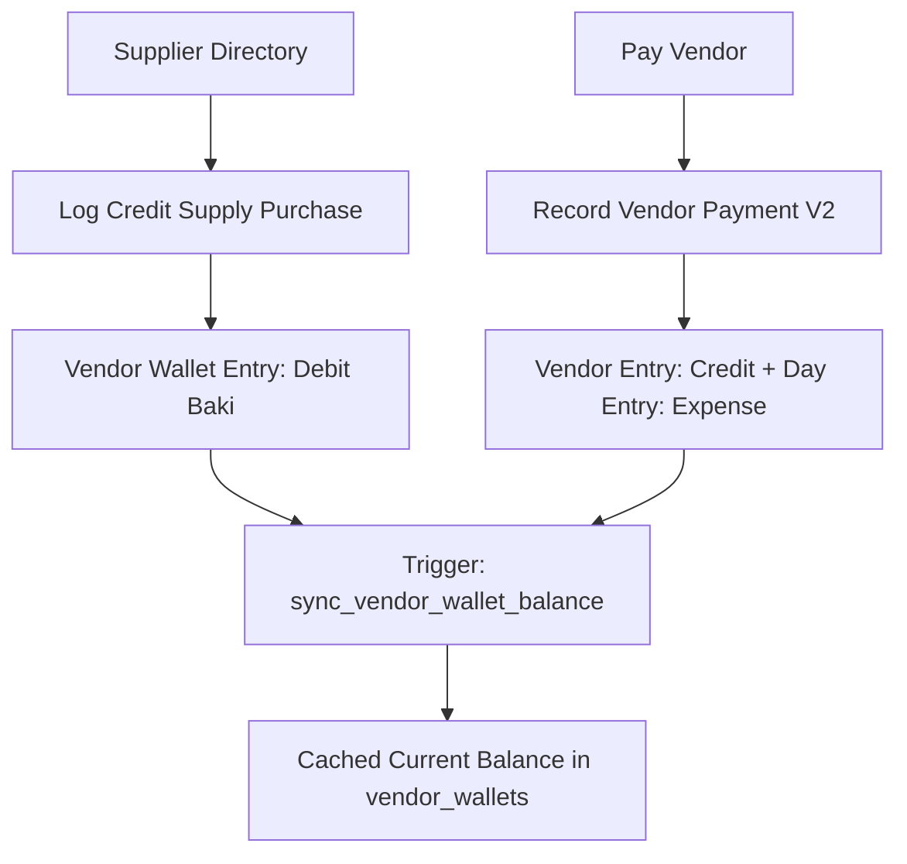

# Module 05: Vendors & Supplies / AP (`vendors_ap`)

## 1. Domain & Scope
The **Vendors & Supplies (Accounts Payable)** module manages suppliers/wholesalers, logs credit purchases (Supply Baki), tracks outstanding canteen debt to each vendor, records settlement disbursements from canteen accounts, and generates itemized vendor statements.



---

## 2. Table Schema Dictionary

| Table | Primary Key | Description |
| :--- | :--- | :--- |
| `vendors` | `id` (UUID) | Supplier directory (name, phone, address, trade category, opening balance). |
| `vendor_wallets` | `id` (UUID) | High-performance cache of canteen's payable debt to each vendor. |
| `vendor_wallet_entries` | `id` (UUID) | Supplier journal (Debit = Goods received on credit, Credit = Payment settled). |

---

## 3. API & RPC Endpoints Summary Table

| Function / RPC | Method | Purpose | Input Payload | Output Response |
| :--- | :--- | :--- | :--- | :--- |
| `record_vendor_payment_v2` | `POST /rpc/record_vendor_payment_v2` | Settles supplier payable debt and creates outflow in Canteen Account | `{"p_tenant_id": "uuid", "p_vendor_id": "uuid", "p_canteen_account_id": "uuid", "p_amount": 2500.0, "p_business_day_id": "uuid"}` | `{"success": true, "vendor_entry_id": "uuid", "vendor_id": "uuid", "amount": 2500.0}` |
| `get_vendor_statement` | `POST /rpc/get_vendor_statement` | Chronological supplier ledger & payments | `{"p_vendor_id": "uuid", "p_start_date": "2026-08-01", "p_end_date": "2026-08-21"}` | `[{"id": "uuid", "entry_type": "debit|credit", "category": "string", "amount": 2500.0, "account_name": "string"}]` |
| `sync_vendor_wallet_balance` | Trigger | Auto-recalculates supplier debt cache on transactions | System trigger | `Updates vendor_wallets.current_balance` |
| `handle_new_vendor` | Trigger | Auto-initializes vendor wallet record on new supplier creation | System trigger | `Inserts into vendor_wallets` |

---

## 4. Detailed RPC Reference

### `record_vendor_payment_v2`
* **Triggered by**: [record_vendor_payment_bottom_sheet.dart](file:///Users/daviditc/Documents/personal_projects/smart-hisab/mobile/lib/features/settings/record_vendor_payment_bottom_sheet.dart)
* **Payload**:
```json
{
  "p_tenant_id": "e2a3b4c5-0000-0000-0000-000000000001",
  "p_vendor_id": "88e7d6c5-0000-0000-0000-000000000001",
  "p_canteen_account_id": "11a2b3c4-0000-0000-0000-000000000001",
  "p_amount": 3500.00,
  "p_business_day_id": "8f3b6a9c-0000-0000-0000-000000000001",
  "p_notes": "Settled weekly vegetable bill via Cash Drawer"
}
```
* **Success Response**:
```json
{
  "success": true,
  "vendor_entry_id": "33b4c5d6-0000-0000-0000-000000000001",
  "vendor_id": "88e7d6c5-0000-0000-0000-000000000001",
  "canteen_account_id": "11a2b3c4-0000-0000-0000-000000000001",
  "amount": 3500.00
}
```

---

## 5. Mobile Screens & Consumers
* [vendors_screen.dart](file:///Users/daviditc/Documents/personal_projects/smart-hisab/mobile/lib/features/settings/vendors_screen.dart)
* [vendor_detail_screen.dart](file:///Users/daviditc/Documents/personal_projects/smart-hisab/mobile/lib/features/settings/vendor_detail_screen.dart)
* [vendors_notifier.dart](file:///Users/daviditc/Documents/personal_projects/smart-hisab/mobile/lib/features/settings/vendors_notifier.dart)
* [edit_vendor_bottom_sheet.dart](file:///Users/daviditc/Documents/personal_projects/smart-hisab/mobile/lib/features/settings/edit_vendor_bottom_sheet.dart)
* [add_vendor_baki_bottom_sheet.dart](file:///Users/daviditc/Documents/personal_projects/smart-hisab/mobile/lib/features/settings/add_vendor_baki_bottom_sheet.dart)
* [record_vendor_payment_bottom_sheet.dart](file:///Users/daviditc/Documents/personal_projects/smart-hisab/mobile/lib/features/settings/record_vendor_payment_bottom_sheet.dart)
