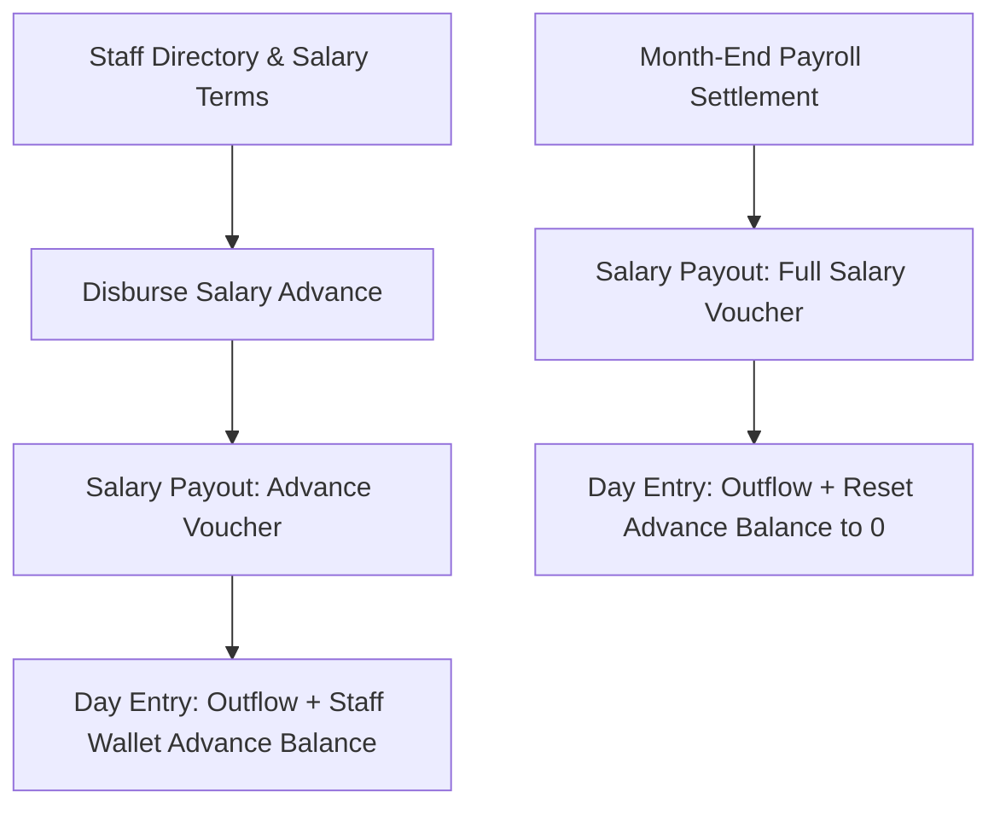

# Module 06: Staff & Payroll (`staff_payroll`)

## 1. Domain & Scope
The **Staff & Payroll** module manages the staff directory, employment terms (monthly fixed salary vs daily wage rate), shift attendance, salary advance disbursements, month-end payroll settlement vouchers, and staff PIN verification for cashier POS operations.



---

## 2. Table Schema Dictionary

| Table | Primary Key | Description |
| :--- | :--- | :--- |
| `staff_members` | `id` (UUID) | Employee identity, contract terms (`monthly` / `daily`), salary amount, PIN code, and status. |
| `staff_wallets` | `id` (UUID) | High-performance cache of employee's accrued advances and total salary paid. |
| `staff_attendance` | `id` (UUID) | Staff attendance tracking per business day. |
| `salary_payouts` | `id` (UUID) | Immutable payroll settlement vouchers (`advance` vs `salary`). |

---

## 3. API & RPC Endpoints Summary Table

| Function / RPC | Method | Purpose | Input Payload | Output Response |
| :--- | :--- | :--- | :--- | :--- |
| `record_salary_payout_v2` | `POST /rpc/record_salary_payout_v2` | Records salary advance or monthly payroll payout from Canteen Account | `{"p_tenant_id": "uuid", "p_staff_id": "uuid", "p_canteen_account_id": "uuid", "p_amount": 5000.0, "p_payout_type": "advance\|salary", "p_payout_month": "2026-08-01"}` | `{"success": true, "salary_payout_id": "uuid", "staff_id": "uuid", "payout_type": "salary", "amount": 5000.0}` |
| `verify_staff_pin` | `POST /rpc/verify_staff_pin` | Verifies 4-digit staff PIN for POS actions | `{"p_tenant_id": "uuid", "p_pin": "1234"}` | `{"valid": true, "staff_id": "uuid", "name": "string", "role": "staff"}` |
| `handle_new_staff` | Trigger | Auto-initializes staff wallet cache row on new employee creation | System trigger | `Inserts into staff_wallets` |

---

## 4. Detailed RPC Reference

### `record_salary_payout_v2`
* **Triggered by**: [record_salary_payout_bottom_sheet.dart](file:///Users/daviditc/Documents/personal_projects/smart-hisab/mobile/lib/features/staff/record_salary_payout_bottom_sheet.dart)
* **Payload (Salary Advance)**:
```json
{
  "p_tenant_id": "e2a3b4c5-0000-0000-0000-000000000001",
  "p_staff_id": "22f3e4d5-0000-0000-0000-000000000001",
  "p_canteen_account_id": "11a2b3c4-0000-0000-0000-000000000001",
  "p_amount": 2000.00,
  "p_payout_type": "advance",
  "p_payout_month": "2026-08-01",
  "p_business_day_id": "8f3b6a9c-0000-0000-0000-000000000001",
  "p_notes": "Mid-month advance for festival"
}
```
* **Success Response**:
```json
{
  "success": true,
  "salary_payout_id": "99c8b7a6-0000-0000-0000-000000000001",
  "staff_id": "22f3e4d5-0000-0000-0000-000000000001",
  "payout_type": "advance",
  "canteen_account_id": "11a2b3c4-0000-0000-0000-000000000001",
  "amount": 2000.00
}
```

---

## 5. Mobile Screens & Consumers
* [staff_screen.dart](file:///Users/daviditc/Documents/personal_projects/smart-hisab/mobile/lib/features/staff/staff_screen.dart)
* [staff_detail_screen.dart](file:///Users/daviditc/Documents/personal_projects/smart-hisab/mobile/lib/features/staff/staff_detail_screen.dart)
* [staff_notifier.dart](file:///Users/daviditc/Documents/personal_projects/smart-hisab/mobile/lib/features/staff/staff_notifier.dart)
* [add_staff_bottom_sheet.dart](file:///Users/daviditc/Documents/personal_projects/smart-hisab/mobile/lib/features/staff/add_staff_bottom_sheet.dart)
* [edit_staff_bottom_sheet.dart](file:///Users/daviditc/Documents/personal_projects/smart-hisab/mobile/lib/features/staff/edit_staff_bottom_sheet.dart)
* [record_salary_payout_bottom_sheet.dart](file:///Users/daviditc/Documents/personal_projects/smart-hisab/mobile/lib/features/staff/record_salary_payout_bottom_sheet.dart)
