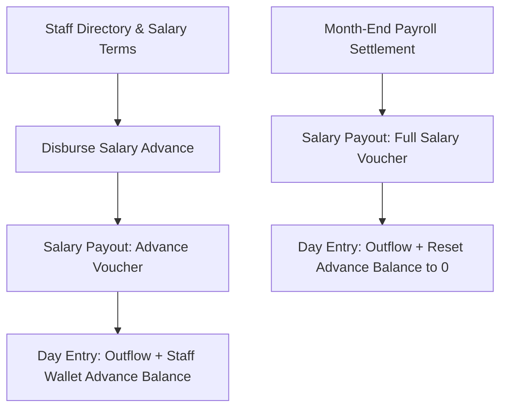

# Module 06: Staff & Payroll (`staff_payroll`)

## 1. Domain & Scope
The **Staff & Payroll** module manages the staff directory, employment terms (monthly fixed salary vs daily wage rate), shift attendance, salary advance disbursements, month-end payroll settlement vouchers, and staff PIN verification for cashier POS operations.

---

## 2. Table Schema Dictionary

| Table | Primary Key | Description |
| :--- | :--- | :--- |
| `staff_members` | `id` (UUID) | Employee identity, contract terms (`monthly` / `daily`), salary amount, PIN code, and status. |
| `staff_wallets` | `id` (UUID) | High-performance cache of employee's accrued advances and total salary paid. |
| `staff_attendance` | `id` (UUID) | Staff attendance tracking per business day. |
| `salary_payouts` | `id` (UUID) | Immutable payroll settlement vouchers (`advance` vs `salary`). |

---

## 3. Screen & Page Wiring Directory

### 📱 `StaffScreen` (Staff Directory & Payroll Overview)
* **File**: [staff_screen.dart](file:///Users/daviditc/Documents/personal_projects/smart-hisab/mobile/lib/features/staff/staff_screen.dart)
* **Riverpod Provider**: `staffNotifierProvider` (`AsyncNotifier<List<StaffMember>>`)
* **Read APIs**: `.from('staff_members').select('*, staff_wallets(*)').eq('tenant_id', tenantId).order('name')`
* **Intended Actions**:
  * Filter active/inactive staff.
  * Summary header card: Total monthly payroll liability & active advances.
  * Staff card tap: Navigates to `StaffDetailScreen`.
  * Swipe actions: Quick payout advance, edit contract.
  * Header CTA: Opens `AddStaffBottomSheet`.

---

### 📱 `StaffDetailScreen` (Staff Profile & Payout Ledger)
* **File**: [staff_detail_screen.dart](file:///Users/daviditc/Documents/personal_projects/smart-hisab/mobile/lib/features/staff/staff_detail_screen.dart)
* **Riverpod Provider**: `staffDetailNotifierProvider(staffId)`
* **Read APIs**: `.from('salary_payouts').select('*').eq('staff_id', staffId).order('created_at', ascending: false)`
* **Intended Actions**:
  * View current advance balance, monthly salary amount, daily wage rate.
  * CTA: "Record Payout" ➔ Opens `RecordSalaryPayoutBottomSheet`.
  * Payout history log (with advance vs full salary indicators).

---

### 🗂️ `RecordSalaryPayoutBottomSheet` (Advance / Monthly Salary)
* **File**: [record_salary_payout_bottom_sheet.dart](file:///Users/daviditc/Documents/personal_projects/smart-hisab/mobile/lib/features/staff/record_salary_payout_bottom_sheet.dart)
* **Riverpod Providers**: `staffNotifierProvider`, `staffDetailNotifierProvider`, `cashbookNotifierProvider`
* **Mutation RPC**: `record_salary_payout_v2(p_tenant_id, p_staff_id, p_canteen_account_id, p_amount, p_payout_type, p_payout_month, p_business_day_id, p_notes)`
* **Payload**: `{"p_tenant_id": "uuid", "p_staff_id": "uuid", "p_canteen_account_id": "uuid", "p_amount": 3000.0, "p_payout_type": "advance|salary"}`
* **Target Cache Mutation**:
  * For Advance: Increments `staff_wallets.current_advance_balance`.
  * For Salary: Increments `total_salary_paid` and resets `current_advance_balance` to 0.
  * Appends salary expense outflow to `cashbookNotifierProvider`.

---

### 📱 POS Staff PIN Authorization
* **RPC**: `verify_staff_pin(p_tenant_id, p_pin)`
* **Payload**: `{"p_tenant_id": "uuid", "p_pin": "1234"}`
* **Response**: `{"valid": true, "staff_id": "uuid", "name": "string", "role": "staff"}`
* **Intended Actions**: Prompts 4-digit numeric keypad before unlocking cashier functions or high-risk overrides.

---

## 4. API & RPC Endpoints Summary Table

| Function / RPC | Method | Purpose | Input Payload | Output Response | Calling Screen / UI |
| :--- | :--- | :--- | :--- | :--- | :--- |
| `record_salary_payout_v2` | `POST /rpc/record_salary_payout_v2` | Pays salary advance or monthly payroll | `{"p_tenant_id": "uuid", "p_staff_id": "uuid", "p_canteen_account_id": "uuid", "p_amount": 3000.0, "p_payout_type": "advance\|salary"}` | `{"success": true, "salary_payout_id": "uuid"}` | [record_salary_payout_bottom_sheet.dart](file:///Users/daviditc/Documents/personal_projects/smart-hisab/mobile/lib/features/staff/record_salary_payout_bottom_sheet.dart) |
| `verify_staff_pin` | `POST /rpc/verify_staff_pin` | Validates 4-digit staff PIN for POS actions | `{"p_tenant_id": "uuid", "p_pin": "1234"}` | `{"valid": true, "staff_id": "uuid", "role": "staff"}` | [home_screen.dart](file:///Users/daviditc/Documents/personal_projects/smart-hisab/mobile/lib/features/home/home_screen.dart) |
