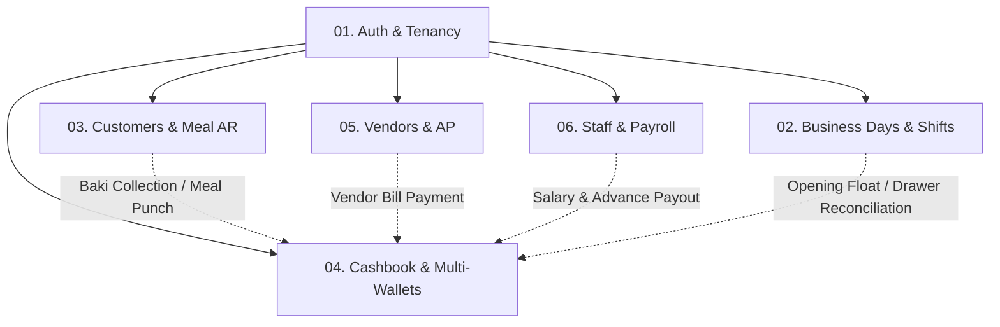
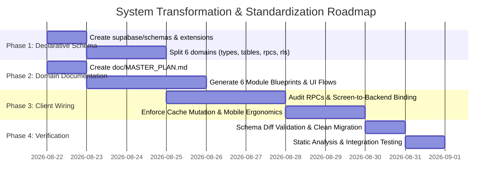

# Smart Hisab — Master Architectural Plan & System Standard

## 1. Executive Summary & System Overview

Smart Hisab is a high-speed, offline-first Point-of-Sale (POS) and canteen ERP accounting platform engineered for mobile environments (Android) powered by Flutter and Supabase (PostgreSQL + RLS + PL/pgSQL).

To eliminate architectural drift, eliminate redundant round-trips over cellular networks, and guarantee deterministic accounting operations, the platform adheres strictly to:
1. **Domain-Driven Modular Documentation (`doc/`)**
2. **Declarative Split Supabase Schema (`supabase/schemas/`)**
3. **RPC-First, Cache-Optimized Flutter Client Architecture**

---

## 2. Standard Directory Layout

```text
├── doc/
│   ├── MASTER_PLAN.md                  # System overview, global architectural rules, domain map & phase plan
│   └── <module_name>/                  # e.g., auth, shifts, customers, cashbook, vendors, staff
│       ├── <MODULE_NAME>.md            # Main domain blueprint (Architecture, Engines, API Matrix, Provider Registry)
│       └── UI_FLOW.md                  # Screen flows, state transitions, dialogs, validation rules
│
├── supabase/
│   ├── schemas/                        # Active declarative schema source of truth (Split by domain)
│   │   ├── README.md                   # Schema status and domain index
│   │   ├── _extensions.sql             # Postgres extensions (uuid-ossp, pgcrypto, citext, etc.)
│   │   └── <domain_name>/              # e.g., auth_tenancy, business_days_shifts, customers_meal_ar
│   │       ├── 01_types.sql            # Postgres enums and composite return types
│   │       ├── 02_tables.sql           # DDL tables, foreign keys, indexes, unique constraints
│   │       ├── 03_rpcs.sql             # Stored procedures & atomic business logic engines
│   │       └── 04_rls.sql              # Row Level Security policies
│   └── migrations/                     # Chronological migrations (generated via supabase db diff)
│
└── mobile/                             # Flutter client codebase (feature-first)
    └── lib/
        ├── core/                       # Core themes, shared widgets, network/supabase clients, utils
        └── features/                   # Feature domain modules
            └── <module_name>/
                ├── data/               # Data sources, Supabase RPC callers, repositories
                ├── domain/             # Models, entities, value objects
                ├── presentation/       # Screens, bottom sheets, widgets
                └── application/        # Riverpod notifiers, controllers, state classes
```

---

## 3. Domain Map & Architecture Overview

The system is partitioned into **6 core business domains**:



### Domain Catalog

| # | Domain Key | Module Path (`doc/`) | Supabase Schema (`supabase/schemas/`) | Core Responsibility |
| :- | :--- | :--- | :--- | :--- |
| **01** | `auth_tenancy` | `doc/auth/` | `auth_tenancy/` | Multi-canteen isolation, user profiles, staff invitations, role-based access. |
| **02** | `business_days_shifts` | `doc/shifts/` | `business_days_shifts/` | Register day open/close, shift scheduling, theoretical vs. actual drawer reconciliation. |
| **03** | `customers_meal_ar` | `doc/customers/` | `customers_meal_ar/` | Customer directory, meal plans, fast POS meal punches, Baki receivable ledger. |
| **04** | `cashbook_wallets` | `doc/cashbook/` | `cashbook_wallets/` | Multi-account cash/online wallets, daily operational expenses, fund transfers, entry voiding. |
| **05** | `vendors_ap` | `doc/vendors/` | `vendors_ap/` | Bazar supplier directory, credit purchase bills (AP), debt settlement ledger. |
| **06** | `staff_payroll` | `doc/staff/` | `staff_payroll/` | Employee contracts, attendance tracking, 4-digit POS PIN validation, salary advances & payouts. |

---

## 4. Supabase Declarative Schema Standards

1. **Declarative Source of Truth**: All database objects reside in `supabase/schemas/<domain>/`. Historical migration logs in `supabase/migrations/` are never manually edited.
2. **Strict 4-Tier Separation per Domain**:
   - `01_types.sql`: Postgres ENUMs (`canteen_role`, `day_entry_type`, `wallet_entry_type`, etc.) and composite return types.
   - `02_tables.sql`: DDL tables, primary keys, foreign keys with explicit cascade rules, indexes, and unique constraints.
   - `03_rpcs.sql`: High-performance, atomic PostgreSQL functions. Multi-table operations (e.g., meal punch + wallet debit + audit record) MUST be executed in a single atomic RPC transaction.
   - `04_rls.sql`: Row Level Security policies enforcing `tenant_id` isolation and role permissions (`owner`, `manager`, `staff`).
3. **Migration Generation Workflow**:
   - Apply edits directly to declarative files in `supabase/schemas/<domain>/`.
   - Run `supabase db diff -f <migration_name>` to automatically generate chronological migration scripts.

---

## 5. Flutter Client Implementation & POS Ergonomics Rules

1. **RPC-First Architecture**: Never execute multiple sequential queries or client-side transactions from Flutter over cellular networks. Encapsulate multi-step logic into an RPC in `03_rpcs.sql`.
2. **Partial Updates (PATCH Style)**: When updating records, send only modified keys in the payload.
3. **Targeted Cache Mutation & Optimistic Updates**: Upon mutating an entity (edit, delete, void, record payment), directly update the local Riverpod state/cache without triggering a full list refetch.
4. **Subscription Cleanup**: When listening to Supabase Realtime channels, always unsubscribe and remove channels inside `ref.onDispose()` or `dispose()`.
5. **Debounced Search Queries**: All search input fields must be debounced by 300ms–500ms before querying backend stores.
6. **Mobile POS Ergonomics (Android Target)**:
   - File size strict limit: $\le 400$ lines of code per file.
   - Modals: Always use `showModalBottomSheet` with `BorderRadius.vertical(top: Radius.circular(32))` and **no top-right 'X' or close button**.
   - Loaders: Use Shimmer skeleton loaders (`shimmer` package) instead of generic spinners.
   - Typography: Item and staff titles $\ge 16\text{pt}$ bold; metadata badges $12\text{pt} - 14\text{pt}$ for arm's length visibility.
   - Empty States: Action buttons placed inside empty state cards rather than top headers.

---

## 6. Implementation & Transformation Roadmap



### Phase 1: Declarative Split Schema (`supabase/schemas/`)

- [ ] **1.1 Directory Initialization**:
  - Create `supabase/schemas/` directory.
  - Create `supabase/schemas/README.md` with schema index and operational guide.
  - Create `supabase/schemas/_extensions.sql` containing required PostgreSQL extensions (`uuid-ossp`, `pgcrypto`, `citext`).
- [ ] **1.2 Domain 01: Auth & Tenancy (`supabase/schemas/auth_tenancy/`)**:
  - `01_types.sql`: User and tenancy roles, invite status enums.
  - `02_tables.sql`: `user_profiles`, `tenants`, `tenant_members`, `tenant_invites`.
  - `03_rpcs.sql`: `create_tenant`, `generate_invite_code`, `join_tenant_by_code`, `leave_canteen`, `delete_canteen`, `delete_user_account`.
  - `04_rls.sql`: Isolation and membership RLS policies.
- [ ] **1.3 Domain 02: Business Days & Shifts (`supabase/schemas/business_days_shifts/`)**:
  - `01_types.sql`: Shift types and day status enums.
  - `02_tables.sql`: `business_days`, `shifts`.
  - `03_rpcs.sql`: `get_active_business_day`, `start_business_day`, `calculate_expected_cash`, `end_business_day`, `resume_business_day`, `get_current_shift`.
  - `04_rls.sql`: Day and shift tenant RLS policies.
- [ ] **1.4 Domain 03: Customers & Meal AR (`supabase/schemas/customers_meal_ar/`)**:
  - `01_types.sql`: Customer wallet entry types, meal config enums.
  - `02_tables.sql`: `customers`, `customer_wallets`, `wallet_entries`, `meal_configs`, `meal_attendance`.
  - `03_rpcs.sql`: `create_or_reactivate_customer`, `record_meal_attendance`, `bulk_record_meal_attendance`, `record_baki_payment_v2`, `get_customer_balance`, `get_customer_statement`.
  - `04_rls.sql`: Customer and AR ledger RLS policies.
- [ ] **1.5 Domain 04: Cashbook & Wallets (`supabase/schemas/cashbook_wallets/`)**:
  - `01_types.sql`: Cashbook entry types (`expense`, `misc_income`, `transfer`), wallet categories.
  - `02_tables.sql`: `canteen_accounts`, `day_entries`, `day_notes`, `account_transfers`.
  - `03_rpcs.sql`: `record_expense_v2`, `record_misc_income_v2`, `transfer_canteen_funds`, `void_wallet_entry`, `void_day_entry`, `get_financial_summary`.
  - `04_rls.sql`: Multi-wallet and expense ledger RLS policies.
- [ ] **1.6 Domain 05: Vendors & AP (`supabase/schemas/vendors_ap/`)**:
  - `01_types.sql`: Vendor transaction types and debt status enums.
  - `02_tables.sql`: `vendors`, `vendor_wallets`, `vendor_wallet_entries`.
  - `03_rpcs.sql`: `record_vendor_payment_v2`, `get_vendor_statement`, `create_vendor`.
  - `04_rls.sql`: Vendor AP ledger RLS policies.
- [ ] **1.7 Domain 06: Staff & Payroll (`supabase/schemas/staff_payroll/`)**:
  - `01_types.sql`: Payout types (`salary`, `advance`), attendance status enums.
  - `02_tables.sql`: `staff_members`, `staff_wallets`, `staff_attendance`, `salary_payouts`.
  - `03_rpcs.sql`: `record_salary_payout_v2`, `verify_staff_pin`, `set_staff_pin`, `reset_staff_pin`.
  - `04_rls.sql`: Staff payroll RLS policies.

---

### Phase 2: Domain-Driven Modular Documentation (`doc/`)

For each domain, generate `<MODULE_NAME>.md` (with the mandatory 5 sections) and `UI_FLOW.md`:

- [ ] **2.1 Module 01: Auth & Tenancy (`doc/auth/`)**:
  - `AUTH.md`: Tenancy state machine, invite code resolution, Screen-to-RPC matrix (`create_tenant`, `join_tenant_by_code`, etc.), Provider registry.
  - `UI_FLOW.md`: Onboarding flow, Canteen switcher modal, Staff PIN verification flow.
- [ ] **2.2 Module 02: Business Days & Shifts (`doc/shifts/`)**:
  - `SHIFTS.md`: Business day state lifecycle, theoretical closing cash formula, Screen-to-RPC matrix (`start_business_day`, `end_business_day`), Provider registry.
  - `UI_FLOW.md`: Open Day modal, Shift switcher, Close Day drawer audit flow.
- [ ] **2.3 Module 03: Customers & Meal AR (`doc/customers/`)**:
  - `CUSTOMERS.md`: Customer lifecycle & Baki credit bounding ($0 \le \text{due} \le \text{limit}$), POS meal punch engine, Screen-to-RPC matrix, Provider registry.
  - `UI_FLOW.md`: Quick customer picker, Meal punch micro-interactions, Collect Baki bottom sheet.
- [ ] **2.4 Module 04: Cashbook & Wallets (`doc/cashbook/`)**:
  - `CASHBOOK.md`: Multi-account double-entry invariants, fund transfer engine, transaction voiding audit, Screen-to-RPC matrix, Provider registry.
  - `UI_FLOW.md`: Add Expense bottom sheet, Wallet transfer dialog, Void transaction bottom sheet.
- [ ] **2.5 Module 05: Vendors & AP (`doc/vendors/`)**:
  - `VENDORS.md`: Vendor accounts payable ledger, credit purchase vs. cash payment engine, Screen-to-RPC matrix, Provider registry.
  - `UI_FLOW.md`: Vendor directory, Record Bazar bill, Vendor debt settlement bottom sheet.
- [ ] **2.6 Module 06: Staff & Payroll (`doc/staff/`)**:
  - `STAFF.md`: Staff contract models, PIN hash verification engine, salary advance calculation, Screen-to-RPC matrix, Provider registry.
  - `UI_FLOW.md`: Staff member setup, Record Salary Payout bottom sheet, PIN reset flow.

---

### Phase 3: Flutter Client Implementation & RPC Compliance

- [ ] **3.1 RPC Binding Audit**:
  - Audit all Flutter Riverpod notifiers and repositories against the `doc/<module>/<MODULE>.md` API contracts.
  - Replace any remaining ad-hoc `.from('...').insert()` or client-side multi-table mutations with atomic RPC calls.
- [ ] **3.2 Targeted Local Cache Mutation**:
  - Verify that create/edit/delete/void actions mutate state directly in Riverpod notifiers rather than triggering full table re-fetches.
- [ ] **3.3 Realtime Lifecycle & Search Debouncing**:
  - Verify `onDispose()` cleanup on all Supabase Realtime channels.
  - Confirm debouncing (300ms–500ms) on customer search, expense filtering, and vendor lists.
- [ ] **3.4 Android Ergonomics & Design Rules**:
  - Check modal bottom sheets for `BorderRadius.vertical(top: Radius.circular(32))` with no 'X' close button.
  - Ensure all list views have `RefreshIndicator` pull-to-refresh.
  - Verify typography scales ($\ge 16\text{pt}$ bold titles, $12\text{pt} - 14\text{pt}$ badges) and Shimmer skeleton loaders.

---

### Phase 4: Migration Generation & Verification

- [ ] **4.1 Schema Diff Validation**:
  - Validate declarative SQL in `supabase/schemas/` against local/staging Supabase instances using `supabase db diff`.
- [ ] **4.2 Code Analysis & Unit Testing**:
  - Run `dart analyze` across `mobile/` to ensure zero compilation or lint errors.
  - Run automated unit and widget test suites.

---

## 7. Master Screen to API / RPC Contract Matrix

| # | Domain | UI Component / Screen | User Action / Trigger | State Controller | Supabase Endpoint / RPC | Cache Strategy |
| :- | :--- | :--- | :--- | :--- | :--- | :--- |
| **1** | `auth` | `CreateCanteenScreen` | Tap "Create Canteen" | `AuthNotifier.createTenant` | `RPC: create_tenant` | Optimistic update $\rightarrow$ set active tenant |
| **2** | `auth` | `JoinCanteenScreen` | Submit 6-digit code | `AuthNotifier.joinByCode` | `RPC: join_tenant_by_code` | Switches active tenant in state |
| **3** | `shifts` | `OpenDayBottomSheet` | Enter starting cash & submit | `BusinessDayNotifier.startDay` | `RPC: start_business_day` | Sets `activeBusinessDayProvider` |
| **4** | `shifts` | `CloseDayBottomSheet` | Enter closing cash count | `BusinessDayNotifier.endDay` | `RPC: end_business_day` | Clears active day, records difference |
| **5** | `customers` | `QuickCustomerPicker` | Tap customer meal punch | `MealAttendanceNotifier.punch` | `RPC: record_meal_attendance` | Optimistic badge update $\rightarrow$ local balance debit |
| **6** | `customers` | `CollectBakiBottomSheet`| Submit received cash/online | `CustomerNotifier.collectBaki` | `RPC: record_baki_payment_v2` | Targeted mutation of customer due balance |
| **7** | `cashbook` | `AddExpenseBottomSheet` | Select category & submit | `CashbookNotifier.recordExpense`| `RPC: record_expense_v2` | Appends item to `cashbookEntriesProvider` |
| **8** | `cashbook` | `VoidTransactionSheet` | Submit reason & confirm | `CashbookNotifier.voidEntry` | `RPC: void_day_entry` / `void_wallet_entry` | Mutates entry status to `voided = true` |
| **9** | `vendors` | `VendorPaymentSheet` | Submit supplier settlement | `VendorNotifier.recordPayment` | `RPC: record_vendor_payment_v2`| Decrements vendor payable balance |
| **10**| `staff` | `SalaryPayoutSheet` | Submit advance or salary | `StaffNotifier.recordPayout` | `RPC: record_salary_payout_v2`| Appends payout record & deducts wallet |
| **11**| `staff` | `PinVerifyModal` | Enter 4-digit staff PIN | `AuthNotifier.verifyPin` | `RPC: verify_staff_pin` | Local session authentication |

---

## 8. Development Setup & Commands

### Prerequisites

| Tool | Purpose |
| :--- | :--- |
| Flutter SDK (stable) | Mobile app development |
| Android Studio / AVD Manager | Android emulator management |
| Supabase CLI | Local DB management & migrations |
| Docker Desktop | Runs local Supabase containers |
| pnpm | Monorepo script runner |

---

### Local Supabase Backend

```bash
# Start local Supabase Docker containers
npx supabase start

# Reset local DB — runs schemas and seeds
npx supabase db reset

# Generate Supabase migration from schema diff
npx supabase db diff -f <migration_name>

# Push local migrations to linked remote
npx supabase db push --linked

# Check container status & local credentials
npx supabase status
```

---

### Flutter Mobile App

```bash
# List connected devices / emulators
flutter devices

# List available emulators
flutter emulators

# Launch a specific emulator
flutter emulators --launch Medium_Phone_API_36.1

# Run the app on connected Android device/emulator
cd mobile && flutter run

# Run static analysis
cd mobile && flutter analyze
```

#### Creating a New Android Emulator (Android Studio)
1. Open **Android Studio** → **Virtual Device Manager**
2. Click **Create Device (+)**
3. Select hardware profile (e.g. *Pixel 8*) → Select system image (API 34+)
4. Click **Finish** → Launch with **▶️** Play button

#### Creating via CLI
```bash
# Download a system image
sdkmanager "system-images;android-34;google_apis;x86_64"

# Create AVD
avdmanager create avd -n MyPhone -k "system-images;android-34;google_apis;x86_64"

# Launch via Flutter
flutter emulators --launch MyPhone
```

---

### Monorepo Scripts (from root)

| Script | Command | Description |
| :--- | :--- | :--- |
| `pnpm run mobile:dev` | `cd mobile && flutter run` | Run Flutter app on emulator |
| `pnpm run mobile:analyze` | `cd mobile && flutter analyze` | Static analysis |
| `pnpm run backend:start` | `npx supabase start` | Start local Supabase |
| `pnpm run backend:stop` | `npx supabase stop` | Stop local Supabase |
| `pnpm run backend:reset` | `npx supabase db reset` | Reset & reseed local DB |
| `pnpm run backend:status` | `npx supabase status` | Show local container config |
| `pnpm run backend:push` | `npx supabase db push --linked` | Push migrations to remote |

