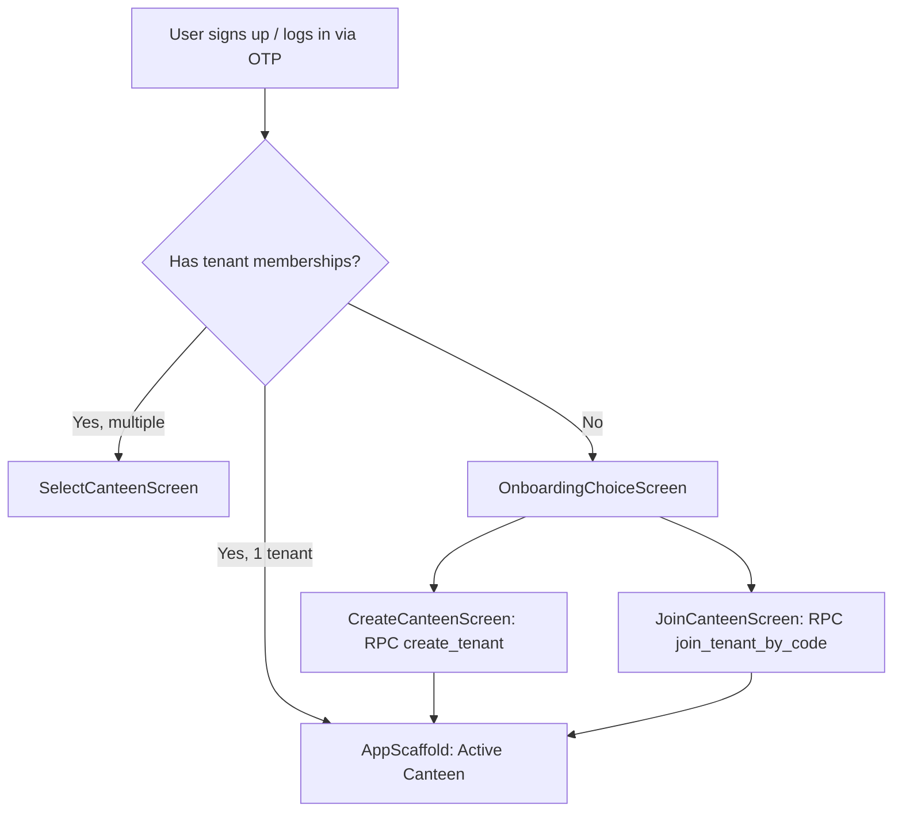

# Module 01: Auth & Multi-Tenancy — Domain Blueprint

> **Source of Truth**: [`supabase/schemas/01_auth_tenancy/`](file:///Users/daviditc/Documents/personal_projects/smart-hisab/supabase/schemas/01_auth_tenancy/)
> **UI Flow**: [`UI_FLOW.md`](file:///Users/daviditc/Documents/personal_projects/smart-hisab/doc/auth/UI_FLOW.md)

---

## 1. Domain & Scope

The **Auth & Multi-Tenancy** module is the security foundation of the entire Smart Hisab platform. It handles:
- **Passwordless OTP auth** (email and phone via Supabase Auth)
- **User profile sync** via database trigger `handle_new_auth_user`
- **Canteen (tenant) creation** — owner role automatically granted
- **Invite code system** — 6-digit alphanumeric codes for adding Managers and Staff
- **Role hierarchy**: `owner` > `manager` > `staff`
- **Account & tenant deletion** with full cascade cleanup

---

## 2. Architecture Engines

| Engine | Description |
| :--- | :--- |
| **Auth Trigger** | `handle_new_auth_user()` — AFTER INSERT on `auth.users` → inserts `user_profiles` row |
| **Security Primitive** | `is_tenant_member(p_tenant_id UUID)` — checks `tenant_members` for `auth.uid()`, used in ALL RLS policies across every domain |
| **Invite Engine** | `generate_invite_code(p_tenant_id, p_role)` — generates 6-digit code stored in `tenant_invites` with 24-hour expiry and multi-use counter |
| **Join Engine** | `join_tenant_by_code(p_code)` — validates expiry, decrements `uses_remaining`, inserts `tenant_members` with specified role |
| **Owner Guard** | `leave_canteen` and `delete_canteen` fail if caller is the sole owner |

---

## 3. Table Schema Dictionary

| Table | Primary Key | Key Columns | Description |
| :--- | :--- | :--- | :--- |
| `user_profiles` | `id UUID → auth.users` | `name`, `email`, `phone`, `is_superadmin` | Extended user metadata, synced via trigger |
| `tenants` | `id UUID` | `name`, `currency`, `address`, `phone` | Canteen organization profile |
| `tenant_members` | `id UUID` | `tenant_id`, `user_id`, `role`, `joined_at` | Role-based membership mapping |
| `tenant_invites` | `id UUID` | `tenant_id`, `code`, `role`, `expires_at`, `uses_remaining` | 6-digit join code with expiry |

---

## 4. Riverpod Provider Map

| Provider | Type | Data | Source |
| :--- | :--- | :--- | :--- |
| `authNotifierProvider` | `AsyncNotifier<AuthState>` | Session, active tenant, memberships | `supabase.auth`, `tenant_members` table |
| `inviteManagerNotifierProvider` | `AsyncNotifier<InviteState>` | Generated invite code | `generate_invite_code` RPC |

---

## 5. API & RPC Endpoints Matrix

| RPC / Function | HTTP | Purpose | Payload | Response | Caller |
| :--- | :--- | :--- | :--- | :--- | :--- |
| `create_tenant` | `POST /rpc/create_tenant` | Creates canteen & grants owner role | `{"p_name": "string"}` | `{"success": true, "tenant_id": "uuid", "role": "owner"}` | [create_canteen_screen.dart](file:///Users/daviditc/Documents/personal_projects/smart-hisab/mobile/lib/features/auth/create_canteen_screen.dart) |
| `generate_invite_code` | `POST /rpc/generate_invite_code` | Generates 6-digit invite code | `{"p_tenant_id": "uuid", "p_role": "manager\|staff"}` | `{"success": true, "invite_code": "AB89X2", "expires_at": "..."}` | [invite_manager_screen.dart](file:///Users/daviditc/Documents/personal_projects/smart-hisab/mobile/lib/features/settings/invite_manager_screen.dart) |
| `join_tenant_by_code` | `POST /rpc/join_tenant_by_code` | Redeems invite code | `{"p_code": "string"}` | `{"success": true, "tenant_id": "uuid", "tenant_name": "...", "role": "manager"}` | [join_canteen_screen.dart](file:///Users/daviditc/Documents/personal_projects/smart-hisab/mobile/lib/features/auth/join_canteen_screen.dart) |
| `leave_canteen` | `POST /rpc/leave_canteen` | Member leaves (blocked if sole owner) | `{"p_tenant_id": "uuid"}` | `{"success": true}` | [canteen_action_sheets.dart](file:///Users/daviditc/Documents/personal_projects/smart-hisab/mobile/lib/features/settings/widgets/canteen_action_sheets.dart) |
| `delete_canteen` | `POST /rpc/delete_canteen` | Hard-deletes canteen + cascades | `{"p_tenant_id": "uuid"}` | `{"success": true}` | [canteen_action_sheets.dart](file:///Users/daviditc/Documents/personal_projects/smart-hisab/mobile/lib/features/settings/widgets/canteen_action_sheets.dart) |
| `delete_user_account` | `POST /rpc/delete_user_account` | Deletes user profile & auth account | `{}` | `{"success": true}` | [my_profile_screen.dart](file:///Users/daviditc/Documents/personal_projects/smart-hisab/mobile/lib/features/settings/my_profile_screen.dart) |

---

## 6. Cache Mutation Rules

| Action | Local Riverpod Mutation |
| :--- | :--- |
| `create_tenant` success | Set `activeTenantId` in state; prepend to `tenants` list |
| `join_tenant_by_code` success | Append membership to `tenants` list; set as active |
| `leave_canteen` success | Remove from `tenants` list; clear `activeTenantId` |
| `delete_canteen` success | Remove from `tenants` list; clear `activeTenantId`; route to `SelectCanteenScreen` |
| `delete_user_account` success | Sign out; clear all state; route to `LandingScreen` |

---

## 7. Security Rules Summary

- All non-auth tables are protected by RLS using `is_tenant_member(tenant_id)`.
- `user_profiles` is readable by the authenticated user themselves only.
- `tenant_invites` codes are single-use or capped by `uses_remaining`.
- `handle_new_auth_user` runs as `SECURITY DEFINER` to bypass RLS for profile bootstrap.

---

## 8. Schema File References

| Tier | File |
| :--- | :--- |
| Types & Enums | [`01_types.sql`](file:///Users/daviditc/Documents/personal_projects/smart-hisab/supabase/schemas/01_auth_tenancy/01_types.sql) |
| Tables & Indexes | [`02_tables.sql`](file:///Users/daviditc/Documents/personal_projects/smart-hisab/supabase/schemas/01_auth_tenancy/02_tables.sql) |
| RPCs, Functions & Triggers | [`03_rpcs.sql`](file:///Users/daviditc/Documents/personal_projects/smart-hisab/supabase/schemas/01_auth_tenancy/03_rpcs.sql) |
| Row Level Security | [`04_rls.sql`](file:///Users/daviditc/Documents/personal_projects/smart-hisab/supabase/schemas/01_auth_tenancy/04_rls.sql) |
