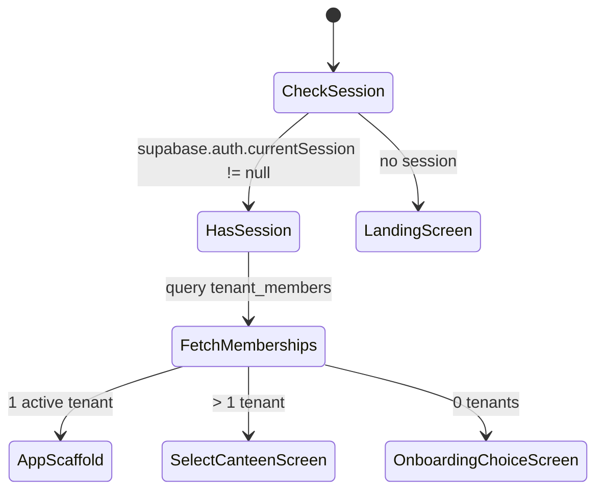

# Auth & Multi-Tenancy — UI Flow

> **Module Blueprint**: [`AUTH.md`](file:///Users/daviditc/Documents/personal_projects/smart-hisab/doc/auth/AUTH.md)

---

## Screen Map

```
LandingScreen
  ├── LoginScreen
  │     └── VerifyEmailScreen (OTP entry)
  │           └── [Auth success] ─► SplashScreen (tenant detection)
  │                 ├── AppScaffold (1 active tenant)
  │                 ├── SelectCanteenScreen (multiple tenants)
  │                 └── OnboardingChoiceScreen (no tenant)
  │                       ├── CreateCanteenScreen ──► AppScaffold
  │                       └── JoinCanteenScreen  ──► AppScaffold
  └── (Settings path)
        ├── InviteManagerScreen (owner only)
        ├── MyProfileScreen
        └── CanteenActionSheets (Leave / Delete)
```

---

## Screen Flows & State Transitions

### 1. `LoginScreen`

| State | UI |
| :--- | :--- |
| Idle | Email / phone input field, "Send OTP" CTA button |
| Loading | CTA shows `CircularProgressIndicator` (inline, not blocking) |
| OTP Sent | Navigates to `VerifyEmailScreen` |
| Error | Inline error text below input field |

**Actions**:
- **"Send OTP"** → `supabase.auth.signInWithOtp(email:)` → navigate to `VerifyEmailScreen`

---

### 2. `VerifyEmailScreen`

| State | UI |
| :--- | :--- |
| Idle | 6-digit OTP input with auto-submit on fill |
| Loading | Shimmer overlay or inline spinner |
| Verified | Navigate to `SplashScreen` |
| Wrong OTP | "Invalid code. Try again." inline error |
| Resend | "Resend Code" link (debounced 60s cooldown) |

---

### 3. `SplashScreen` — Tenant Detection



---

### 4. `OnboardingChoiceScreen`

| Option | Action |
| :--- | :--- |
| "Create New Canteen" | Navigate to `CreateCanteenScreen` |
| "Join Existing" | Navigate to `JoinCanteenScreen` |

---

### 5. `CreateCanteenScreen`

| State | UI |
| :--- | :--- |
| Idle | Canteen name text field, optional phone/currency fields |
| Loading | Button shows spinner |
| Success | Optimistic: `activeTenantId = uuid` → route to `AppScaffold` |
| Error | SnackBar: "Failed to create canteen. Please try again." |

**RPC**: `create_tenant(p_name: string)`
**Cache Mutation**: Set `activeTenantId`, prepend to membership list.

---

### 6. `JoinCanteenScreen`

| State | UI |
| :--- | :--- |
| Idle | 6-digit code input field (uppercase letter + digit mix) |
| Loading | Inline spinner on submit |
| Success | Append membership → set as active → route to `AppScaffold` |
| Invalid Code | "Code not found or expired." inline error |
| Already Member | "You are already a member of this canteen." |

**RPC**: `join_tenant_by_code(p_code: string)`

---

### 7. `InviteManagerScreen`

| State | UI |
| :--- | :--- |
| Idle | Role selector (`Manager` / `Staff`), "Generate Code" button |
| Generated | Large bold code display + Copy button + WhatsApp Share button |
| Expiry | Shows "Expires in 24h" countdown |

**Validation**: Only `owner` role users can access this screen.
**RPC**: `generate_invite_code(p_tenant_id, p_role)`

---

### 8. `CanteenActionSheets` (Modal Bottom Sheets)

> Opened via swipe or settings menu. No "X" close button. Rounded top corners (`BorderRadius.vertical(top: Radius.circular(32))`).

| Sheet | Trigger | RPC | Guard |
| :--- | :--- | :--- | :--- |
| Leave Canteen | Settings → "Leave Canteen" | `leave_canteen(p_tenant_id)` | Blocked if sole owner |
| Delete Canteen | Settings → "Delete Canteen" | `delete_canteen(p_tenant_id)` | Requires owner role |
| Delete Account | Profile → "Delete Account" | `delete_user_account()` | Confirmation required |

**Dismiss**: Backdrop tap or drag handle. Action buttons complete the operation.

---

## Validation Rules

| Field | Rule |
| :--- | :--- |
| Email / Phone | Must be valid format; non-empty |
| OTP Code | 6 digits; auto-submit on last digit |
| Canteen Name | 2–60 characters; non-empty |
| Join Code | 6 alphanumeric characters; uppercase |
| Invite Role | Must be `manager` or `staff` |
