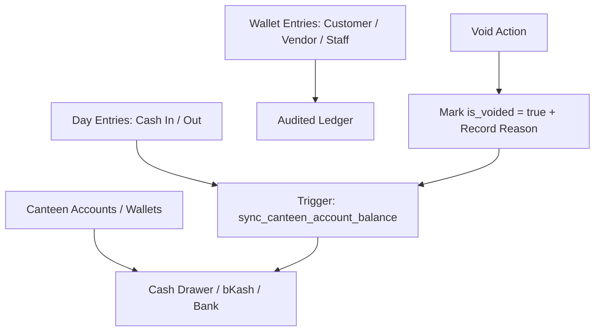

# Module 04: Cashbook & Canteen Wallets — Domain Blueprint

> **Source of Truth**: [`supabase/schemas/04_cashbook_wallets/`](file:///Users/daviditc/Documents/personal_projects/smart-hisab/supabase/schemas/04_cashbook_wallets/)
> **UI Flow**: [`UI_FLOW.md`](file:///Users/daviditc/Documents/personal_projects/smart-hisab/doc/cashbook/UI_FLOW.md)

---

## 1. Domain & Scope

The **Cashbook & Canteen Wallets** module is the **core accounting ledger** of Smart Hisab. It:

- Manages **multi-account balances** (Cash Drawer, bKash, Bank Account, Nagad, etc.)
- Records all **daily cash inflows and outflows** as categorized `day_entries`
- Acts as the **double-entry journal hub** — every payment to/from customers, vendors, and staff ultimately creates a mirrored `day_entries` record here
- Executes **inter-wallet fund transfers** atomically
- Provides an **audit-locked void mechanism** for reversing erroneous entries

> **Integration Hub**: Every cross-domain monetary action (baki payment, vendor settlement, salary payout) writes a mirrored `day_entries` record using the `canteen_account_id` passed by the caller, keeping the cashbook always in sync.

---

## 2. Architecture Engines

| Engine | Description |
| :--- | :--- |
| **Balance Sync Trigger** | `sync_canteen_account_balance()` — AFTER INSERT/UPDATE on `day_entries` → recalculates `canteen_accounts.current_balance` from all non-voided entries |
| **Expense Engine** | `record_expense_v2(...)` — validates open day, inserts `day_entries` with `entry_type = 'expense'`, triggers balance sync |
| **Transfer Engine** | `transfer_canteen_funds(...)` — atomic: inserts expense into source, income into target, balance synced by trigger |
| **Void Engine (Day)** | `void_day_entry(p_entry_id, p_reason)` — marks `is_voided = true`, records `voided_by`, `voided_at`, `void_reason` |
| **Void Engine (Wallet)** | `void_wallet_entry(p_entry_id, p_reason)` — same pattern for customer/vendor/staff journal entries |

---

## 3. Table Schema Dictionary

| Table | Primary Key | Key Columns | Description |
| :--- | :--- | :--- | :--- |
| `canteen_accounts` | `id UUID` | `tenant_id`, `name`, `account_type`, `current_balance`, `is_default` | Payment channels/wallets with live balance cache |
| `day_entries` | `id UUID` | `tenant_id`, `business_day_id`, `canteen_account_id`, `entry_type`, `category`, `amount`, `is_voided`, `voided_by`, `void_reason` | Cashbook income/expense per active business day |
| `wallet_entries` | `id UUID` | `tenant_id`, `customer_id`, `vendor_id`, `entry_type`, `amount`, `is_voided`, `voided_by`, `void_reason` | Master double-entry journal for all entity ledgers |

---

## 4. Expense Categories

| Category Key | Description |
| :--- | :--- |
| `bazar` | Daily market grocery procurement |
| `utilities` | Electricity, water, gas bills |
| `rent` | Premises rental payments |
| `vendor_payment` | Supplier debt settlements (cross-posted from Module 05) |
| `salary_payout` | Monthly payroll disbursements (cross-posted from Module 06) |
| `salary_advance` | Staff advance disbursements (cross-posted from Module 06) |
| `transfer_in` | Incoming side of inter-account transfer |
| `transfer_out` | Outgoing side of inter-account transfer |
| `other` | Miscellaneous expenses |

---

## 5. Riverpod Provider Map

| Provider | Type | Data | Source |
| :--- | :--- | :--- | :--- |
| `cashbookNotifierProvider` | `AsyncNotifier<CashbookState>` | Account list + `day_entries` feed | `.from('canteen_accounts')` + `.from('day_entries')` |

---

## 6. API & RPC Endpoints Matrix

| RPC / Function | HTTP | Purpose | Payload | Response | Caller |
| :--- | :--- | :--- | :--- | :--- | :--- |
| `record_expense_v2` | `POST /rpc/record_expense_v2` | Records expense against account | `{"p_tenant_id": "uuid", "p_canteen_account_id": "uuid", "p_category": "bazar", "p_amount": 500.0, "p_business_day_id": "uuid"}` | `{"success": true, "day_entry_id": "uuid"}` | [add_expense_bottom_sheet.dart](file:///Users/daviditc/Documents/personal_projects/smart-hisab/mobile/lib/features/cashbook/add_expense_bottom_sheet.dart) |
| `transfer_canteen_funds` | `POST /rpc/transfer_canteen_funds` | Inter-account fund transfer | `{"p_tenant_id": "uuid", "p_from_account_id": "uuid", "p_to_account_id": "uuid", "p_amount": 5000.0, "p_business_day_id": "uuid"}` | `{"success": true, "from_account_id": "uuid", "to_account_id": "uuid"}` | [cashbook_screen.dart](file:///Users/daviditc/Documents/personal_projects/smart-hisab/mobile/lib/features/cashbook/cashbook_screen.dart) |
| `void_wallet_entry` | `POST /rpc/void_wallet_entry` | Voids customer/vendor/staff journal entry | `{"p_entry_id": "uuid", "p_reason": "Entered wrong amount"}` | `{"success": true, "entry_id": "uuid"}` | [void_transaction_bottom_sheet.dart](file:///Users/daviditc/Documents/personal_projects/smart-hisab/mobile/lib/features/customers/void_transaction_bottom_sheet.dart) |
| `void_day_entry` | `POST /rpc/void_day_entry` | Voids cashbook income/expense entry | `{"p_entry_id": "uuid", "p_reason": "Duplicate entry"}` | `{"success": true, "entry_id": "uuid"}` | [cashbook_screen.dart](file:///Users/daviditc/Documents/personal_projects/smart-hisab/mobile/lib/features/cashbook/cashbook_screen.dart) |

---

## 7. Cache Mutation Rules

| Action | Local Riverpod Mutation |
| :--- | :--- |
| `record_expense_v2` success | Prepend entry to `day_entries` list; decrement `account.current_balance` |
| Income insert | Prepend entry; increment `account.current_balance` |
| `transfer_canteen_funds` success | Decrement source account; increment target account; append two transfer rows |
| `void_day_entry` success | Set `is_voided = true` on row in local list; reverse balance delta |
| `void_wallet_entry` success | Set `is_voided = true` in entity detail ledger; retrigger balance recalculation |

---

## 8. Schema File References

| Tier | File |
| :--- | :--- |
| Types & Enums | [`01_types.sql`](file:///Users/daviditc/Documents/personal_projects/smart-hisab/supabase/schemas/04_cashbook_wallets/01_types.sql) |
| Tables & Indexes | [`02_tables.sql`](file:///Users/daviditc/Documents/personal_projects/smart-hisab/supabase/schemas/04_cashbook_wallets/02_tables.sql) |
| RPCs, Functions & Triggers | [`03_rpcs.sql`](file:///Users/daviditc/Documents/personal_projects/smart-hisab/supabase/schemas/04_cashbook_wallets/03_rpcs.sql) |
| Row Level Security | [`04_rls.sql`](file:///Users/daviditc/Documents/personal_projects/smart-hisab/supabase/schemas/04_cashbook_wallets/04_rls.sql) |
