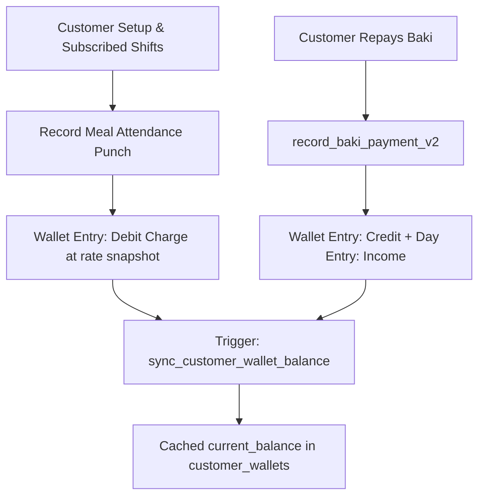

# Module 03: Customers & Meal Attendance / AR — Domain Blueprint

> **Source of Truth**: [`supabase/schemas/03_customers_meal_ar/`](file:///Users/daviditc/Documents/personal_projects/smart-hisab/supabase/schemas/03_customers_meal_ar/)
> **UI Flow**: [`UI_FLOW.md`](file:///Users/daviditc/Documents/personal_projects/smart-hisab/doc/customers/UI_FLOW.md)

---

## 1. Domain & Scope

The **Customers & Meal Attendance (Accounts Receivable)** module powers:

- **Customer profiles** with phone, opening balance, and subscribed shift rosters
- **Fast 1-tap meal punch** via the POS home screen with auto-populated rate snapshot
- **Manual baki (debit) charges** for ad-hoc customer debts
- **Debt repayments** collected into named canteen accounts
- **Chronological statement** generation with date-range filter
- **Debt protection guards** — idempotent reactivation prevents duplicate customer records

> **Balance Convention**: `current_balance > 0` = customer owes debt. `current_balance < 0` = customer has advance credit.

---

## 2. Architecture Engines

| Engine | Description |
| :--- | :--- |
| **Wallet Sync Trigger** | `sync_customer_wallet_balance()` — AFTER INSERT/UPDATE/DELETE on `meal_attendance` and `wallet_entries` → recalculates opening + debit - credit and updates `customer_wallets.current_balance` |
| **Idempotent Create** | `create_or_reactivate_customer` — on phone match with `is_active = false`, reactivates instead of creating a duplicate |
| **Meal Punch Engine** | `record_meal_attendance` — validates open day, resolves rate from `meal_configs`, creates `meal_attendance` + `wallet_entries` debit atomically |
| **Baki Payment Engine** | `record_baki_payment_v2` — creates `wallet_entries` credit + `day_entries` income in one atomic RPC |
| **Void Engine** | `void_meal_attendance` / `void_wallet_entry` — marks `is_voided = true` + records auditor + reason, triggering balance recalculation |

---

## 3. Table Schema Dictionary

| Table | Primary Key | Key Columns | Description |
| :--- | :--- | :--- | :--- |
| `customers` | `id UUID` | `tenant_id`, `name`, `phone`, `opening_balance`, `subscribed_shifts TEXT[]`, `is_active` | Customer identity and shift subscriptions |
| `customer_wallets` | `id UUID` | `customer_id UNIQUE`, `current_balance`, `total_debit`, `total_credit`, `last_transaction_at` | High-performance balance cache |
| `meal_configs` | `id UUID` | `tenant_id`, `shift_id`, `name`, `default_rate`, `is_active`, `auto_punch` | Meal definitions per shift with rate |
| `meal_attendance` | `id UUID` | `customer_id`, `shift_id`, `business_day_id`, `rate`, `is_voided`, `voided_at`, `voided_by`, `void_reason` | Immutable punch records with rate snapshot |

---

## 4. Riverpod Provider Map

| Provider | Type | Data | Source |
| :--- | :--- | :--- | :--- |
| `customersNotifierProvider` | `AsyncNotifier<List<Customer>>` | Customer list with embedded wallet | `.from('customers').select('*, customer_wallets(*)')` |
| `customerDetailNotifierProvider(customerId)` | `AsyncNotifier<CustomerDetailState>` | Balance summary + statement rows | `get_customer_balance`, `get_customer_statement` RPCs |
| `mealConfigsNotifierProvider` | `AsyncNotifier<List<MealConfig>>` | Shift meal rates | `.from('meal_configs').select('*')` |

---

## 5. API & RPC Endpoints Matrix

| RPC / Function | HTTP | Purpose | Payload | Response | Caller |
| :--- | :--- | :--- | :--- | :--- | :--- |
| `create_or_reactivate_customer` | `POST /rpc/create_or_reactivate_customer` | Idempotent customer creation | `{"p_tenant_id": "uuid", "p_name": "Rahim", "p_phone": "01711000000", "p_opening_balance": 0.0, "p_subscribed_shifts": ["uuid"]}` | `{"success": true, "customer_id": "uuid", "reactivated": false}` | [add_customer_bottom_sheet.dart](file:///Users/daviditc/Documents/personal_projects/smart-hisab/mobile/lib/features/customers/add_customer_bottom_sheet.dart) |
| `record_meal_attendance` | `POST /rpc/record_meal_attendance` | Meal punch & wallet debit | `{"p_tenant_id": "uuid", "p_customer_id": "uuid", "p_shift_id": "uuid", "p_rate": 60.0, "p_business_day_id": "uuid"}` | `{"success": true, "attendance_id": "uuid", "wallet_entry_id": "uuid"}` | [quick_customer_picker_bottom_sheet.dart](file:///Users/daviditc/Documents/personal_projects/smart-hisab/mobile/lib/features/home/widgets/quick_customer_picker_bottom_sheet.dart) |
| `record_baki_payment_v2` | `POST /rpc/record_baki_payment_v2` | Repayment into canteen account | `{"p_tenant_id": "uuid", "p_customer_id": "uuid", "p_canteen_account_id": "uuid", "p_amount": 500.0, "p_business_day_id": "uuid"}` | `{"success": true, "wallet_entry_id": "uuid", "day_entry_id": "uuid"}` | [collect_baki_bottom_sheet.dart](file:///Users/daviditc/Documents/personal_projects/smart-hisab/mobile/lib/features/customers/collect_baki_bottom_sheet.dart) |
| `get_customer_balance` | `POST /rpc/get_customer_balance` | Live balance, debit, credit totals | `{"p_customer_id": "uuid"}` | `{"current_balance": 250.0, "total_debit": 1250.0, "total_credit": 1000.0}` | [customer_detail_screen.dart](file:///Users/daviditc/Documents/personal_projects/smart-hisab/mobile/lib/features/customers/customer_detail_screen.dart) |
| `get_customer_statement` | `POST /rpc/get_customer_statement` | Chronological statement rows | `{"p_customer_id": "uuid", "p_start_date": "2024-01-01", "p_end_date": "2024-01-31"}` | `[{"id": "uuid", "entry_type": "debit", "amount": 60.0, ...}]` | [customer_detail_screen.dart](file:///Users/daviditc/Documents/personal_projects/smart-hisab/mobile/lib/features/customers/customer_detail_screen.dart) |

---

## 6. Cache Mutation Rules

| Action | Local Riverpod Mutation |
| :--- | :--- |
| `create_or_reactivate_customer` | Optimistically prepend new `Customer` + default `CustomerWallet(balance: openingBalance)` to list |
| `record_meal_attendance` | Increment `customer.wallet.current_balance += rate` in list; prepend attendance row in detail |
| `record_baki_payment_v2` | Decrement `current_balance -= amount` in list; prepend credit row in detail; append income to cashbook |
| Void meal / void entry | Set `is_voided = true` on row; recalculate balance delta locally |

---

## 7. Schema File References

| Tier | File |
| :--- | :--- |
| Types & Enums | [`01_types.sql`](file:///Users/daviditc/Documents/personal_projects/smart-hisab/supabase/schemas/03_customers_meal_ar/01_types.sql) |
| Tables & Indexes | [`02_tables.sql`](file:///Users/daviditc/Documents/personal_projects/smart-hisab/supabase/schemas/03_customers_meal_ar/02_tables.sql) |
| RPCs, Functions & Triggers | [`03_rpcs.sql`](file:///Users/daviditc/Documents/personal_projects/smart-hisab/supabase/schemas/03_customers_meal_ar/03_rpcs.sql) |
| Row Level Security | [`04_rls.sql`](file:///Users/daviditc/Documents/personal_projects/smart-hisab/supabase/schemas/03_customers_meal_ar/04_rls.sql) |
