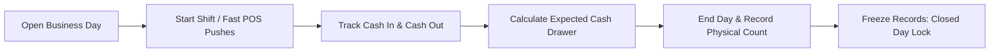

# Module 02: Business Days & Shifts — Domain Blueprint

> **Source of Truth**: [`supabase/schemas/02_business_days_shifts/`](file:///Users/daviditc/Documents/personal_projects/smart-hisab/supabase/schemas/02_business_days_shifts/)
> **UI Flow**: [`UI_FLOW.md`](file:///Users/daviditc/Documents/personal_projects/smart-hisab/doc/shifts/UI_FLOW.md)

---

## 1. Domain & Scope

The **Business Days & Shifts** module manages the **daily cash register lifecycle** for the canteen POS:

- Morning **opening float** entry
- Shift schedule management (Breakfast, Lunch, Dinner)
- **Automated shift detection** by current clock time via `get_current_shift`
- Expected cash drawer calculation from all financial activity
- **Evening reconciliation**: physical count vs expected → surplus/shortage
- **Day lock** on close: frozen records prevent post-close mutations

> **Critical Rule**: No financial transaction (meal punch, expense, payout) can be posted against a closed business day. All mutation RPCs validate `is_open = true` before executing.

---

## 2. Architecture Engines

| Engine | Description |
| :--- | :--- |
| **Shift Resolver** | `get_current_shift(p_tenant_id)` — queries `shifts` table, compares `start_time`/`end_time` to `CURRENT_TIME` |
| **Day State Machine** | `start_business_day` → `is_open = true`; `end_business_day` → `is_open = false`, `closed_at = now()` |
| **Cash Reconciler** | `calculate_expected_cash(p_day_id)` — `opening_balance + SUM(income entries) - SUM(expense entries)` |
| **Void Guard** | Any `void_*` RPC checks `is_open = true` on the linked `business_day_id` |

---

## 3. Table Schema Dictionary

| Table | Primary Key | Key Columns | Description |
| :--- | :--- | :--- | :--- |
| `business_days` | `id UUID` | `tenant_id`, `opening_balance`, `expected_closing_cash`, `actual_closing_cash`, `cash_difference`, `is_open`, `opened_at`, `closed_at` | Daily register instance; financial freeze on close |
| `shifts` | `id UUID` | `tenant_id`, `name`, `start_time`, `end_time`, `sort_order`, `is_active` | Named time windows for POS auto-detection |
| `day_notes` | `id UUID` | `tenant_id`, `business_day_id`, `note`, `created_by` | Manager handover memos attached to a day |

---

## 4. Riverpod Provider Map

| Provider | Type | Data | Source |
| :--- | :--- | :--- | :--- |
| `businessDayNotifierProvider` | `AsyncNotifier<BusinessDayState>` | Active day ID, `isOpen`, `openingBalance`, current shift | `get_active_business_day`, `get_current_shift` RPCs |
| `shiftsNotifierProvider` | `AsyncNotifier<List<Shift>>` | Ordered list of shift configs | `.from('shifts').select('*').order('sort_order')` |

---

## 5. API & RPC Endpoints Matrix

| RPC / Function | HTTP | Purpose | Payload | Response | Caller |
| :--- | :--- | :--- | :--- | :--- | :--- |
| `get_active_business_day` | `POST /rpc/get_active_business_day` | Checks if a day is open | `{"p_tenant_id": "uuid"}` | `{"active": true, "id": "uuid", "opening_balance": 500.0}` | [home_screen.dart](file:///Users/daviditc/Documents/personal_projects/smart-hisab/mobile/lib/features/home/home_screen.dart) |
| `start_business_day` | `POST /rpc/start_business_day` | Opens new day with starting float | `{"p_tenant_id": "uuid", "p_opening_balance": 500.0, "p_notes": "string"}` | `{"success": true, "business_day_id": "uuid", "opened_at": "..."}` | [open_day_bottom_sheet.dart](file:///Users/daviditc/Documents/personal_projects/smart-hisab/mobile/lib/features/home/open_day_bottom_sheet.dart) |
| `calculate_expected_cash` | `POST /rpc/calculate_expected_cash` | Computes theoretical drawer balance | `{"p_day_id": "uuid"}` | `{"expected_closing_cash": 4500.0, "cash_in": 3000.0, "cash_out": 1000.0}` | [close_day_bottom_sheet.dart](file:///Users/daviditc/Documents/personal_projects/smart-hisab/mobile/lib/features/home/close_day_bottom_sheet.dart) |
| `end_business_day` | `POST /rpc/end_business_day` | Closes day, records physical count, locks | `{"p_day_id": "uuid", "p_actual_closing_cash": 4500.0, "p_notes": "string"}` | `{"success": true, "cash_difference": 0.0}` | [close_day_bottom_sheet.dart](file:///Users/daviditc/Documents/personal_projects/smart-hisab/mobile/lib/features/home/close_day_bottom_sheet.dart) |
| `get_current_shift` | `POST /rpc/get_current_shift` | Resolves active shift by clock time | `{"p_tenant_id": "uuid"}` | `{"found": true, "id": "uuid", "name": "Lunch", "start_time": "..."}` | [home_screen.dart](file:///Users/daviditc/Documents/personal_projects/smart-hisab/mobile/lib/features/home/home_screen.dart) |

---

## 6. Cache Mutation Rules

| Action | Local Riverpod Mutation |
| :--- | :--- |
| `start_business_day` success | Set `isOpen = true`, `activeDayId = uuid`, `openingBalance = amount` — **no refetch** |
| `end_business_day` success | Set `isOpen = false`, `activeDayId = null` — locks all POS actions |
| Shift add / edit / toggle | Directly mutate `List<Shift>` in `shiftsNotifierProvider` |

---

## 7. Schema File References

| Tier | File |
| :--- | :--- |
| Types & Enums | [`01_types.sql`](file:///Users/daviditc/Documents/personal_projects/smart-hisab/supabase/schemas/02_business_days_shifts/01_types.sql) |
| Tables & Indexes | [`02_tables.sql`](file:///Users/daviditc/Documents/personal_projects/smart-hisab/supabase/schemas/02_business_days_shifts/02_tables.sql) |
| RPCs, Functions & Triggers | [`03_rpcs.sql`](file:///Users/daviditc/Documents/personal_projects/smart-hisab/supabase/schemas/02_business_days_shifts/03_rpcs.sql) |
| Row Level Security | [`04_rls.sql`](file:///Users/daviditc/Documents/personal_projects/smart-hisab/supabase/schemas/02_business_days_shifts/04_rls.sql) |
