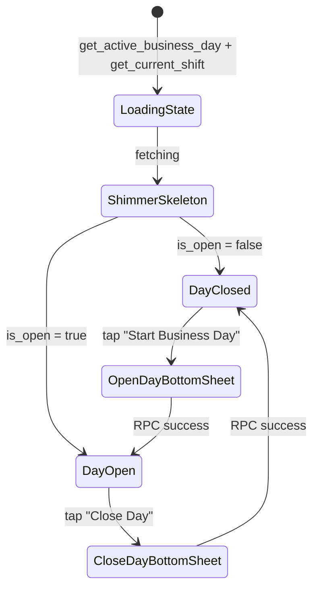

# Business Days & Shifts — UI Flow

> **Module Blueprint**: [`SHIFTS.md`](file:///Users/daviditc/Documents/personal_projects/smart-hisab/doc/shifts/SHIFTS.md)

---

## Screen Map

```
HomeScreen (POS Dashboard)
  ├── [Day Closed] ─► OpenDayBottomSheet ──► Day opens ──► HomeScreen
  ├── [Day Open]   ─► QuickMealPunchPicker / Cashbook tools active
  └── [Day Open]   ─► CloseDayBottomSheet ──► Day closes ──► HomeScreen

Settings
  └── ShiftsScreen
        └── ShiftFormBottomSheet (Add / Edit)
```

---

## Screen Flows & State Transitions

### 1. `HomeScreen` — Day State Modes



| Mode | Visible UI Elements |
| :--- | :--- |
| **Day Closed** | Celestial idle animation, "Start Business Day" primary CTA card, greyed-out POS tools |
| **Day Open** | Active shift badge, opening float chip, live cashbook summary, meal punch button enabled, "Close Day" button |
| **Loading** | Shimmer skeleton over hero area + stats cards |

---

### 2. `OpenDayBottomSheet`

> **Modal**: Rounded top `32px`. No close button. Dismiss via backdrop or drag handle.

| State | UI |
| :--- | :--- |
| Idle | Opening balance `TextField` (numeric keyboard), optional notes field, "Start Day" CTA |
| Pre-fill | Shows yesterday's closing balance as suggestion |
| Loading | CTA button inline spinner |
| Success | Optimistic: `isOpen = true`, `activeDayId = uuid` → sheet dismisses → `HomeScreen` unlocks POS |
| Error | Inline error: "A business day is already open." |

**RPC**: `start_business_day(p_tenant_id, p_opening_balance, p_notes)`
**Optimistic Update**: No full refetch. State set directly in `businessDayNotifierProvider`.

---

### 3. `CloseDayBottomSheet`

> **Modal**: Rounded top `32px`. No close button.

| State | UI |
| :--- | :--- |
| Loading pre-fill | Shimmer over "Expected Cash" card while `calculate_expected_cash` fetches |
| Idle | Expected cash display (read-only), "Actual Cash in Drawer" input field, optional notes |
| Surplus/Shortage | Live color-coded diff badge: green (surplus), red (shortage), grey (balanced) |
| Confirming | "Close Day" CTA requires confirmation tap if `|difference| > configThreshold` |
| Success | `isOpen = false`, `activeDayId = null` → all POS actions locked |

**RPCs**:
1. `calculate_expected_cash(p_day_id)` — on sheet open
2. `end_business_day(p_day_id, p_actual_closing_cash, p_notes)` — on confirm

---

### 4. `ShiftsScreen`

| State | UI |
| :--- | :--- |
| Loading | Shimmer list skeleton (3 rows) |
| Loaded | Ordered shift cards with time range, active toggle, sort handle |
| Empty | Empty state card with "Add Your First Shift" button centered |

**Actions**:
- **Tap card** → opens `ShiftFormBottomSheet` in Edit mode
- **Toggle switch** → `.from('shifts').update({'is_active': !current}).eq('id', id)` → direct local state mutation
- **Drag handle** → reorders `sort_order` in local state, debounced batch update to DB
- **FAB / Header CTA** (only visible when list is non-empty) → opens `ShiftFormBottomSheet` in Add mode

---

### 5. `ShiftFormBottomSheet`

> **Modal**: Rounded top `32px`. No close button.

| Field | Type | Validation |
| :--- | :--- | :--- |
| Shift Name | TextInput | 2–30 chars, non-empty |
| Start Time | TimePicker | Must be < End Time |
| End Time | TimePicker | Must be > Start Time |
| Is Active | Toggle | Default: true |

| Mode | CTA Label | Action |
| :--- | :--- | :--- |
| Add | "Add Shift" | `.from('shifts').insert(...)` → prepend to local list |
| Edit | "Save Changes" | `.from('shifts').update(...).eq('id', id)` → mutate local item |

---

## Empty States

| Screen | Empty Condition | Primary Action Location |
| :--- | :--- | :--- |
| `ShiftsScreen` | No shifts configured | Button inside empty state card (not in header) |
| `HomeScreen` (Day Closed) | No active day | "Start Business Day" CTA card in body |

---

## Validation Rules

| Field | Rule |
| :--- | :--- |
| Opening Balance | `>= 0`; numeric |
| Actual Closing Cash | `>= 0`; numeric |
| Shift Name | 2–30 characters |
| Shift Start Time | Must be earlier than End Time |
