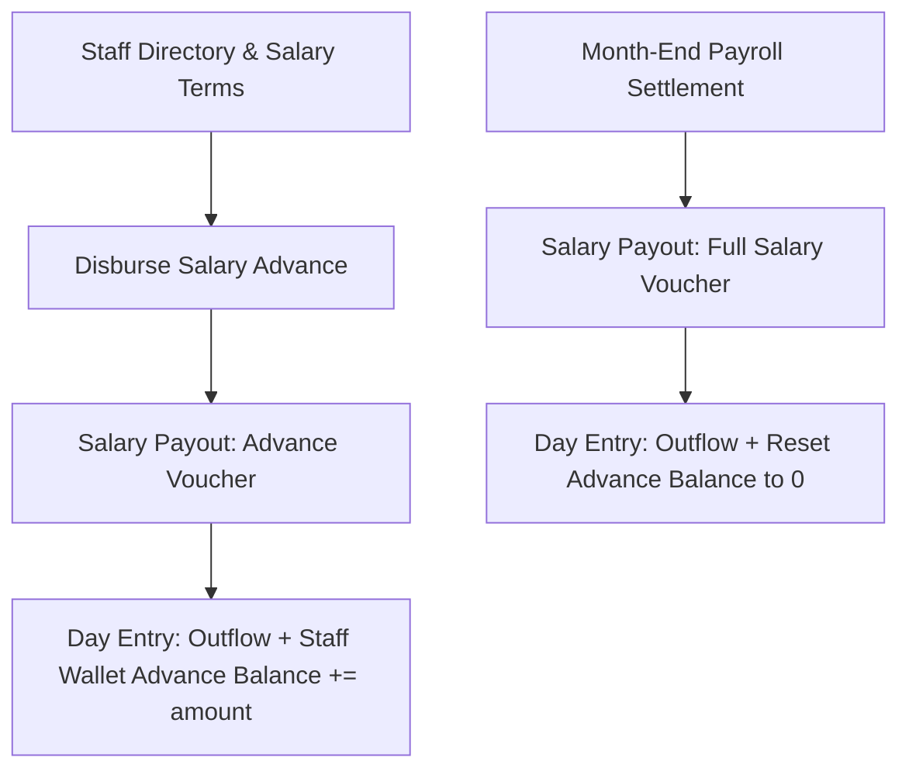

# Module 06: Staff & Payroll — Domain Blueprint

> **Source of Truth**: [`supabase/schemas/06_staff_payroll/`](file:///Users/daviditc/Documents/personal_projects/smart-hisab/supabase/schemas/06_staff_payroll/)
> **UI Flow**: [`UI_FLOW.md`](file:///Users/daviditc/Documents/personal_projects/smart-hisab/doc/staff/UI_FLOW.md)

---

## 1. Domain & Scope

The **Staff & Payroll** module manages:

- **Staff directory** with employment terms (`monthly` salary vs `daily` wage rate)
- **Salary advance disbursements** — tracked in `staff_wallets.current_advance_balance`
- **Month-end payroll settlement** — resets advance balance to 0 on full salary payout
- **Attendance tracking** per business day
- **Staff PIN verification** — 4-digit numeric keypad for cashier POS authorization

> **Advance Convention**: `staff_wallets.current_advance_balance` accumulates advances throughout the month. A full salary payout resets it to 0 and increments `total_salary_paid`.

---

## 2. Architecture Engines

| Engine | Description |
| :--- | :--- |
| **Wallet Init Trigger** | `handle_new_staff()` — AFTER INSERT on `staff_members` → creates `staff_wallets` row |
| **Payout Engine** | `record_salary_payout_v2(...)` — atomic: inserts `salary_payouts` voucher + `day_entries` expense outflow + updates `staff_wallets` cache |
| **PIN Verify Engine** | `verify_staff_pin(p_tenant_id, p_pin)` — secure, single-query PIN validation returning staff identity |
| **PIN Management** | `set_staff_pin(p_staff_id, p_pin)` and `reset_staff_pin(p_staff_id)` — controlled by tenant members |

---

## 3. Table Schema Dictionary

| Table | Primary Key | Key Columns | Description |
| :--- | :--- | :--- | :--- |
| `staff_members` | `id UUID` | `tenant_id`, `user_id`, `name`, `phone`, `role`, `salary_type`, `monthly_salary`, `daily_rate`, `pin_code`, `is_active` | Employee identity and contract terms |
| `staff_wallets` | `id UUID` | `staff_id UNIQUE`, `current_advance_balance`, `total_salary_paid`, `last_payout_at` | Advance and payroll tracker cache |
| `staff_attendance` | `id UUID` | `tenant_id`, `staff_id`, `business_day_id`, `attendance_date`, `status`, `check_in_time`, `check_out_time` | Attendance records per day |
| `salary_payouts` | `id UUID` | `staff_id`, `canteen_account_id`, `business_day_id`, `amount`, `payout_type`, `payout_month`, `is_voided` | Immutable payroll vouchers |

---

## 4. Payout Types

| `payout_type` | Behavior |
| :--- | :--- |
| `advance` | Increments `current_advance_balance`; creates `salary_advance` expense entry |
| `salary` | Increments `total_salary_paid`; **resets** `current_advance_balance = 0`; creates `salary_payout` expense entry |

---

## 5. Attendance Status Values

| Status | Description |
| :--- | :--- |
| `present` | Full shift worked |
| `absent` | No show |
| `half_day` | Half shift worked |
| `leave` | Approved leave |

---

## 6. Riverpod Provider Map

| Provider | Type | Data | Source |
| :--- | :--- | :--- | :--- |
| `staffNotifierProvider` | `AsyncNotifier<List<StaffMember>>` | Staff list with embedded wallet | `.from('staff_members').select('*, staff_wallets(*)')` |
| `staffDetailNotifierProvider(staffId)` | `AsyncNotifier<StaffDetailState>` | Payout history | `.from('salary_payouts').select('*').eq('staff_id', staffId)` |

---

## 7. API & RPC Endpoints Matrix

| RPC / Function | HTTP | Purpose | Payload | Response | Caller |
| :--- | :--- | :--- | :--- | :--- | :--- |
| `record_salary_payout_v2` | `POST /rpc/record_salary_payout_v2` | Pays advance or monthly salary | `{"p_tenant_id": "uuid", "p_staff_id": "uuid", "p_canteen_account_id": "uuid", "p_amount": 3000.0, "p_payout_type": "advance\|salary", "p_payout_month": "2024-01-01"}` | `{"success": true, "salary_payout_id": "uuid"}` | [record_salary_payout_bottom_sheet.dart](file:///Users/daviditc/Documents/personal_projects/smart-hisab/mobile/lib/features/staff/record_salary_payout_bottom_sheet.dart) |
| `verify_staff_pin` | `POST /rpc/verify_staff_pin` | Validates 4-digit PIN for POS | `{"p_tenant_id": "uuid", "p_pin": "1234"}` | `{"valid": true, "staff_id": "uuid", "name": "Karim", "role": "staff"}` | [home_screen.dart](file:///Users/daviditc/Documents/personal_projects/smart-hisab/mobile/lib/features/home/home_screen.dart) |
| `set_staff_pin` | `POST /rpc/set_staff_pin` | Sets 4-digit PIN on staff profile | `{"p_staff_id": "uuid", "p_pin": "4567"}` | `{"success": true, "staff_id": "uuid"}` | [staff_detail_screen.dart](file:///Users/daviditc/Documents/personal_projects/smart-hisab/mobile/lib/features/staff/staff_detail_screen.dart) |
| `reset_staff_pin` | `POST /rpc/reset_staff_pin` | Clears PIN (disables POS access) | `{"p_staff_id": "uuid"}` | `{"success": true, "pin_reset": true}` | [staff_detail_screen.dart](file:///Users/daviditc/Documents/personal_projects/smart-hisab/mobile/lib/features/staff/staff_detail_screen.dart) |

---

## 8. Cache Mutation Rules

| Action | Local Riverpod Mutation |
| :--- | :--- |
| Add new staff | Prepend `StaffMember` + `StaffWallet(advance: 0, paid: 0)` to list |
| Advance payout | Increment `staff_wallets.current_advance_balance += amount`; prepend payout row |
| Salary payout | Increment `total_salary_paid += amount`; **reset** `current_advance_balance = 0`; prepend payout row; append expense to cashbook |
| Attendance mark | Directly insert/update row in attendance list without full refetch |

---

## 9. Schema File References

| Tier | File |
| :--- | :--- |
| Types & Enums | [`01_types.sql`](file:///Users/daviditc/Documents/personal_projects/smart-hisab/supabase/schemas/06_staff_payroll/01_types.sql) |
| Tables & Indexes | [`02_tables.sql`](file:///Users/daviditc/Documents/personal_projects/smart-hisab/supabase/schemas/06_staff_payroll/02_tables.sql) |
| RPCs, Functions & Triggers | [`03_rpcs.sql`](file:///Users/daviditc/Documents/personal_projects/smart-hisab/supabase/schemas/06_staff_payroll/03_rpcs.sql) |
| Row Level Security | [`04_rls.sql`](file:///Users/daviditc/Documents/personal_projects/smart-hisab/supabase/schemas/06_staff_payroll/04_rls.sql) |
