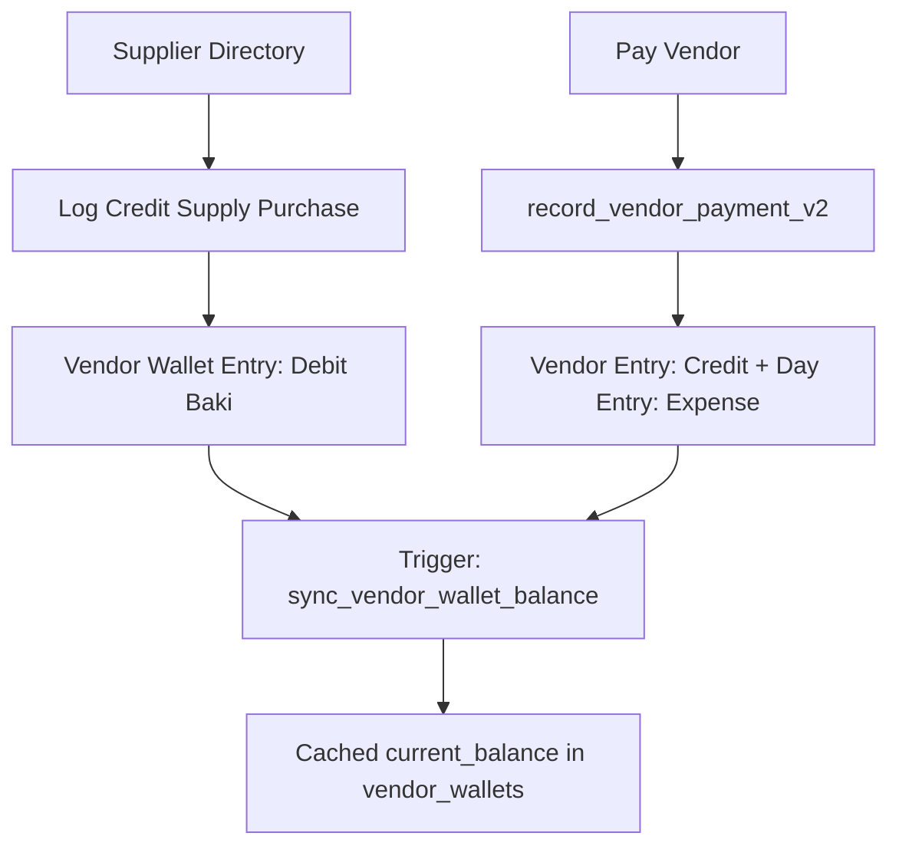

# Module 05: Vendors & Accounts Payable — Domain Blueprint

> **Source of Truth**: [`supabase/schemas/05_vendors_ap/`](file:///Users/daviditc/Documents/personal_projects/smart-hisab/supabase/schemas/05_vendors_ap/)
> **UI Flow**: [`UI_FLOW.md`](file:///Users/daviditc/Documents/personal_projects/smart-hisab/doc/vendors/UI_FLOW.md)

---

## 1. Domain & Scope

The **Vendors & Supplies (Accounts Payable)** module manages the canteen's **supplier relationships and outstanding debt**:

- **Supplier directory** with contact info, trade category, and opening balance
- **Credit purchase logging** (Supply Baki) — goods received before payment
- **Payable balance cache** via `vendor_wallets` — `current_balance > 0` means the canteen owes the vendor
- **Settlement payments** drawn from named canteen accounts
- **Chronological vendor statement** generation with date filter

> **Balance Convention**: `vendor_wallets.current_balance > 0` = canteen owes debt to vendor. Settlement payments reduce this balance.

---

## 2. Architecture Engines

| Engine | Description |
| :--- | :--- |
| **Wallet Init Trigger** | `handle_new_vendor()` — AFTER INSERT on `vendors` → creates `vendor_wallets` row with `current_balance = opening_balance` |
| **Balance Sync Trigger** | `sync_vendor_wallet_balance()` — AFTER INSERT/UPDATE/DELETE on `vendor_wallet_entries` → recalculates `opening_balance + total_debit - total_credit` |
| **Payment Engine** | `record_vendor_payment_v2(...)` — atomic: inserts vendor credit entry + `day_entries` expense outflow |
| **Statement Engine** | `get_vendor_statement(...)` — date-filtered chronological ledger with account name join |

---

## 3. Table Schema Dictionary

| Table | Primary Key | Key Columns | Description |
| :--- | :--- | :--- | :--- |
| `vendors` | `id UUID` | `tenant_id`, `name`, `phone`, `address`, `category`, `opening_balance`, `is_active` | Supplier directory |
| `vendor_wallets` | `id UUID` | `vendor_id UNIQUE`, `current_balance`, `total_debit`, `total_credit`, `last_transaction_at` | Payable debt cache |
| `vendor_wallet_entries` | `id UUID` | `vendor_id`, `business_day_id`, `canteen_account_id`, `entry_type`, `amount`, `category`, `is_voided`, `voided_by`, `void_reason` | Supplier AP journal |

---

## 4. Vendor Entry Types

| `entry_type` | Meaning |
| :--- | :--- |
| `debit` | Goods received on credit — **increases** payable debt |
| `credit` | Settlement payment made — **decreases** payable debt |

---

## 5. Riverpod Provider Map

| Provider | Type | Data | Source |
| :--- | :--- | :--- | :--- |
| `vendorsNotifierProvider` | `AsyncNotifier<List<Vendor>>` | Vendor list with embedded wallet | `.from('vendors').select('*, vendor_wallets(*)')` |
| `vendorDetailNotifierProvider(vendorId)` | `AsyncNotifier<VendorDetailState>` | Balance + statement rows | `get_vendor_statement` RPC |

---

## 6. API & RPC Endpoints Matrix

| RPC / Function | HTTP | Purpose | Payload | Response | Caller |
| :--- | :--- | :--- | :--- | :--- | :--- |
| `record_vendor_payment_v2` | `POST /rpc/record_vendor_payment_v2` | Settles supplier AP debt | `{"p_tenant_id": "uuid", "p_vendor_id": "uuid", "p_canteen_account_id": "uuid", "p_amount": 2500.0, "p_business_day_id": "uuid"}` | `{"success": true, "vendor_entry_id": "uuid"}` | [record_vendor_payment_bottom_sheet.dart](file:///Users/daviditc/Documents/personal_projects/smart-hisab/mobile/lib/features/settings/record_vendor_payment_bottom_sheet.dart) |
| `get_vendor_statement` | `POST /rpc/get_vendor_statement` | Chronological supplier ledger | `{"p_vendor_id": "uuid", "p_start_date": "2024-01-01", "p_end_date": "2024-01-31"}` | `[{"id": "uuid", "entry_type": "debit", "amount": 2500.0, "account_name": "Cash Drawer", ...}]` | [vendor_detail_screen.dart](file:///Users/daviditc/Documents/personal_projects/smart-hisab/mobile/lib/features/settings/vendor_detail_screen.dart) |

---

## 7. Cache Mutation Rules

| Action | Local Riverpod Mutation |
| :--- | :--- |
| Add new vendor | Optimistically prepend `Vendor` + `VendorWallet(balance: openingBalance)` to list |
| `record_vendor_payment_v2` success | Decrement `vendor_wallets.current_balance` in list; append credit row in detail; append expense to cashbook |
| Add supply baki (debit) insert | Increment `vendor_wallets.current_balance` in list; append debit row in detail |

---

## 8. Schema File References

| Tier | File |
| :--- | :--- |
| Types & Enums | [`01_types.sql`](file:///Users/daviditc/Documents/personal_projects/smart-hisab/supabase/schemas/05_vendors_ap/01_types.sql) |
| Tables & Indexes | [`02_tables.sql`](file:///Users/daviditc/Documents/personal_projects/smart-hisab/supabase/schemas/05_vendors_ap/02_tables.sql) |
| RPCs, Functions & Triggers | [`03_rpcs.sql`](file:///Users/daviditc/Documents/personal_projects/smart-hisab/supabase/schemas/05_vendors_ap/03_rpcs.sql) |
| Row Level Security | [`04_rls.sql`](file:///Users/daviditc/Documents/personal_projects/smart-hisab/supabase/schemas/05_vendors_ap/04_rls.sql) |
