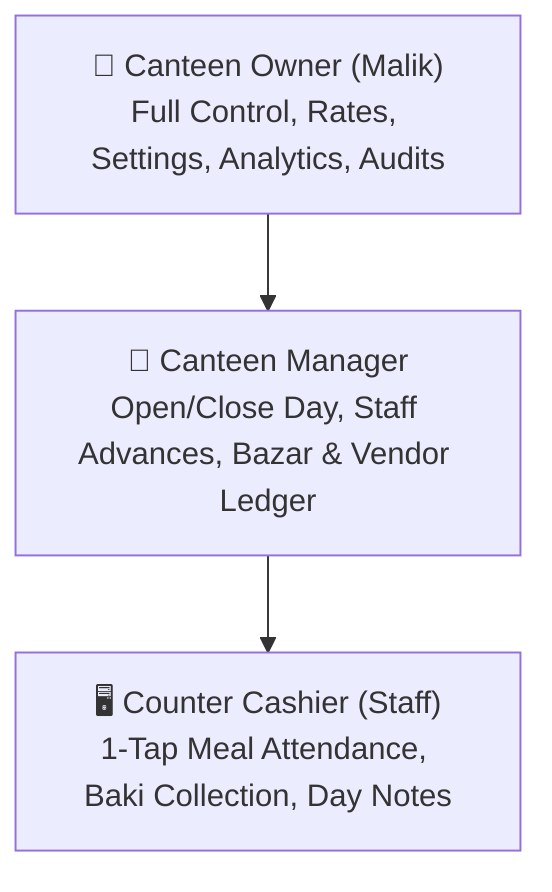
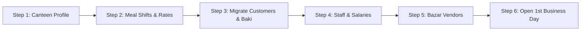

# Smart-Hisab — First-Time Setup Checklist & User Guideline

> **Target Audience**: Canteen Owners (*মালিক*), Canteen Managers (*ম্যানেজার*), and Counter Cashiers (*ক্যাশিয়ার*).  
> **Purpose**: A complete step-by-step onboarding guide to transition from paper *hisab khata* to Smart-Hisab smoothly, alongside standard operating procedures for daily canteen management.

---

## 📑 Table of Contents
1. [Overview & Role Hierarchy](#1-overview--role-hierarchy)
2. [First-Time Setup Checklist (The "0 to Live" Flow)](#2-first-time-setup-checklist-the-0-to-live-flow)
3. [Paper Khata Migration Strategy](#3-paper-khata-migration-strategy)
4. [Daily Operational Guidelines (A Day in the Canteen)](#4-daily-operational-guidelines-a-day-in-the-canteen)
5. [Special Workflows & Edge Cases](#5-special-workflows--edge-cases)
6. [In-App Onboarding & UX Architecture](#6-in-app-onboarding--ux-architecture)
7. [Bangla Counter Quick-Reference (ক্যাশ কাউন্টার নির্দেশিকা)](#7-bangla-counter-quick-reference-ক্যাশ-কাউন্টার-নির্দেশিকা)

---

## 1. Overview & Role Hierarchy

Smart-Hisab is designed to be **faster and simpler than paper** while maintaining total financial accountability.



### Role Permissions Matrix

| Capability / Action | Owner | Manager | Cashier (Staff) |
|---|:---:|:---:|:---:|
| Create / Edit Canteen Profile & Settings | ✅ | ❌ | ❌ |
| Configure Meal Shifts & Rates | ✅ | ❌ | ❌ |
| Add / Edit Staff & Salaries | ✅ | ❌ | ❌ |
| Open & Close Business Day (Reconciliation) | ✅ | ✅ | ❌ (View only) |
| 1-Tap Meal Attendance & POS | ✅ | ✅ | ✅ |
| Collect Customer Baki Payments | ✅ | ✅ | ✅ |
| Record Daily Bazar Expenses & Day Notes | ✅ | ✅ | ✅ |
| Record Staff Cash Advances | ✅ | ✅ | ❌ |
| Finalize Monthly Staff Payroll | ✅ | ❌ | ❌ |

---

## 2. First-Time Setup Checklist (The "0 to Live" Flow)

Follow this 6-step checklist sequentially when configuring a brand new canteen:



### Checklist Steps

| Step | Setup Item | Location in App | Description & Recommended Settings |
|:---:|---|---|---|
| **1** | **Canteen Profile** | `Settings` $\rightarrow$ `Canteen Profile` | Enter canteen name (e.g., *"ঢাকা মেস ও ক্যাফেটারিয়া"*), phone, and address. Sets header for statements. |
| **2** | **Meal Shifts & Rates** | `Settings` $\rightarrow$ `Meal Configurations` | Set standard meal pricing and time windows (e.g. Breakfast ৳50, Lunch ৳80, Dinner ৳70). |
| **3** | **Customers & Opening Baki** | `Customers` $\rightarrow$ `+ Add Customer` | Add regular customers and input their **existing paper khata balance** into *Opening Baki*. |
| **4** | **Staff & Salaries** | `Staff` $\rightarrow$ `+ Add Staff` | Add cooks, cashiers, and helpers with their monthly base salary and assigned role. |
| **5** | **Bazar Vendors (AP)** | `Settings` $\rightarrow$ `Vendors` | Register regular meat/vegetable suppliers and any existing payable balance (*Vendor Baki*). |
| **6** | **Open 1st Business Day** | `Home` $\rightarrow$ `Start Today's Day` | Enter the opening drawer cash float (e.g., ৳2,000) and turn the business day 🟢 **Open**. |

---

## 3. Paper Khata Migration Strategy

Transitioning 40–100 workers from a paper notebook to a digital app can feel daunting. Use this recommended zero-disruption rollout:

```
┌────────────────────────────────────────────────────────────────────────┐
│                        MIGRATION ROADMAP                               │
│                                                                        │
│  [Day -1: Night Audit]      [Day 1: Go-Live]      [Day 7: Full Sync]   │
│  • Total paper khata debts  • Mark all meals on   • Show customers     │
│  • Enter Opening Baki       app only              digital statements   │
│  • Lock old paper notebook  • Collect baki in app • Zero paper usage   │
└────────────────────────────────────────────────────────────────────────┘
```

### Migration Rules
1. **Never Start Mid-Shift**: Migrate balances at night after closing the final paper shift.
2. **Accurate Opening Balance**: When creating each customer in `AddCustomerBottomSheet`, enter their exact closing balance from the paper notebook in the **"Opening Baki / পূর্বের বাকি"** field.
3. **Verify Total Receivables**: Compare the sum in the paper notebook against the total shown under `Customers` $\rightarrow$ `Total Baki Outstanding`.

> [!TIP]
> **Customer Dispute Prevention**: On Day 1, take a clear photo of the customer's last page in the physical khata and keep it as a backup for any initial balance inquiries.

---

## 4. Daily Operational Guidelines (A Day in the Canteen)

The canteen operates in 4 recurring daily phases:

```
  ☀️ Morning               🍽️ Meal Shifts            🛒 Daytime              🌙 Night Closing
┌─────────────────┐      ┌─────────────────┐      ┌─────────────────┐      ┌─────────────────┐
│ Start Business  │ ───► │ 1-Tap Meal      │ ───► │ Record Bazar /  │ ───► │ End Day &       │
│ Day (Enter Cash)│      │ Attendance/POS  │      │ Collect Baki    │      │ Reconcile Cash  │
└─────────────────┘      └─────────────────┘      └─────────────────┘      └─────────────────┘
```

### Phase 1: ☀️ Morning Opening Routine
- **Who**: Owner or Manager.
- **When**: 6:30 AM – 7:30 AM (before breakfast service).
- **Steps**:
  1. Open Smart-Hisab $\rightarrow$ `Home` Tab.
  2. Tap **"Start Today's Day"** (`OpenDayBottomSheet`).
  3. Count and enter the physical cash in the drawer (e.g., ৳2,000 opening float).
  4. Tap **Confirm & Open Day**.
  5. The Home screen status turns 🟢 **Open**, activating live stats and meal actions.

---

### Phase 2: 🍽️ Shift Time: Meal Attendance & Counter POS
- **Who**: Counter Cashier or Manager.
- **When**: During Breakfast (7:30–10:00 AM), Lunch (12:30–3:30 PM), Dinner (7:30–10:30 PM).
- **Steps**:
  1. Go to `Customers` tab or tap **"Mark Meals"** on `Home`.
  2. The app automatically detects the current active shift (e.g. Lunch ৳80).
  3. **One-Tap Attendance**: Tap the customer's meal checkbox/icon once.
  4. The system auto-charges the customer's wallet at the snapshot rate (`rate_applied = ৳80`) and updates their balance instantly.

> [!NOTE]
> **Accidental Tap Correction**: If a meal was marked by mistake, tapping it again immediately unmarks the attendance and reverts the wallet charge.

---

### Phase 3: 🛒 Daytime Operations: Bazar & Baki Collection

#### 1. Recording Daily Bazar & Expenses
- **Action**: Tap **"Add Expense"** on `Home` or `Cashbook` $\rightarrow$ `+ Add Expense`.
- **Payment Method Routing**:
  - **Cash Expense (নগদ খরচ)**: Deducted directly from today's cash drawer (e.g., ৳450 for eggs).
  - **Vendor Baki (মহাজন বাকি)**: Added to the supplier's payable ledger without affecting the counter cash drawer (e.g., ৳3,200 meat bought on credit from *Alam Meat*).

#### 2. Collecting Baki (Cash Receipts from Debtors)
- **Action**: Tap **"Collect Baki"** on `Home` or inside customer's detail page.
- **Steps**:
  1. Select customer (e.g., *Karim*).
  2. Enter the cash amount received (e.g., ৳1,000).
  3. Tap **Record Payment**.
  4. Customer's outstanding debt decrements in real-time, and cash drawer expected total increments.

---

### Phase 4: 🌙 Night Routine: End Day & Cash Reconciliation
- **Who**: Owner or Manager.
- **When**: 10:30 PM – 11:30 PM (after dinner service concludes).
- **Steps**:
  1. Open `Home` tab $\rightarrow$ Tap **"End Day & Reconcile"** (`CloseDayBottomSheet`).
  2. Physically count all notes and coins in the cash drawer.
  3. Enter the **Actual Closing Cash** counted (e.g., ৳18,400).
  4. System executes the **Shift Reconciliation Formula**:

$$\text{Expected Cash} = \text{Opening Float} + \text{Baki Inflows} + \text{Cash Sales} - \text{Cash Expenses}$$
$$\text{Variance} = \text{Actual Cash} - \text{Expected Cash}$$

5. **Variance Feed Analysis**:
   - `Variance = ৳0` 🟢 **Perfect Match**
   - `Variance < ৳0` ⚠️ **Shortage (ঘাটতি)** — Highlights potential unrecorded expenses or cashier shortage.
   - `Variance > ৳0` 🔵 **Overage (উদ্বৃত্ত)** — Highlights untracked cash receipts.
6. Enter optional closing remarks / notes and tap **Confirm & Close Day**. The day's ledger is locked immutably.

---

## 5. Special Workflows & Edge Cases

```
┌───────────────────────────┬────────────────────────────────────────────────────────┐
│ Scenario                  │ Standard Operating Procedure                           │
├───────────────────────────┼────────────────────────────────────────────────────────┤
│ 1. Staff Cash Advance     │ Staff Tab → Select Staff → Record Advance (deducts cash│
│    (অগ্রিম বেতন)           │ from drawer & records advance against monthly salary). │
├───────────────────────────┼────────────────────────────────────────────────────────┤
│ 2. Month-End Payroll      │ Staff Tab → Record Salary Payout (app automatically    │
│    (মাসিক বেতন নিষ্পত্তি)   │ calculates: Base Salary - Total Advances = Net Due).   │
├───────────────────────────┼────────────────────────────────────────────────────────┤
│ 3. Vendor Payment         │ Settings → Vendors → Select Vendor → Record Payment    │
│    (মহাজন বাকি পরিশোধ)     │ (reduces vendor due & records cash outflow).           │
├───────────────────────────┼────────────────────────────────────────────────────────┤
│ 4. Walk-in Customer Baki  │ Customers Tab → + Add Customer (Quick) → Enter name &  │
│    (সাময়িক গ্রাহক বাকি)    │ Add Manual Baki transaction with description.          │
└───────────────────────────┴────────────────────────────────────────────────────────┘
```

---

## 6. In-App Onboarding & UX Architecture

To ensure self-guided adoption without technical friction, Smart-Hisab incorporates the following UX mechanisms:

```
┌─────────────────────────────────────────────────────────────┐
│ 🚀 শুরু করার চেকলিস্ট (Setup Checklist)              3/5 সম্পন্ন │
├─────────────────────────────────────────────────────────────┤
│  [✓] ১. খাবারের শিফট ও রেট ঠিক করুন                       │
│  [✓] ২. পুরোনো খাতা থেকে কাস্টমার ও বাকি যোগ করুন         │
│  [ ] ৩. দোকানের কর্মচারীদের নাম যোগ করুন      [ যোগ করুন ]   │
│  [ ] ৪. আজকের দিনের হিসাব শুরু করুন (Open Day) [ শুরু করুন ] │
└─────────────────────────────────────────────────────────────┘
```

### 1. In-App Setup Checklist Card
- Displayed prominently on top of the `Home` screen for new tenants until all core onboarding steps are finished.
- Each item has a direct action button launching the corresponding bottom sheet.

### 2. Pre-Populated Bangladeshi Canteen Defaults
- New canteens automatically ship with sensible defaults:
  - **Shifts**:
    - সকালের নাস্তা (Breakfast: 7:00 AM – 10:30 AM @ ৳50)
    - দুপুরের খাবার (Lunch: 12:30 PM – 3:30 PM @ ৳80)
    - রাতের খাবার (Dinner: 7:30 PM – 10:30 PM @ ৳70)
  - **Expense Categories**: কাঁচাবাজার (Vegetables), মাছ ও মাংস (Meat & Fish), মুদি মালপত্র (Groceries), সিলিন্ডার গ্যাস/বিদ্যুৎ (Utilities), অন্যান্য (Misc).

### 3. Clear Bangla Empty State CTAs
- **Customers Tab Empty**: Title *"কোনো কাস্টমার যোগ করা হয়নি"* $\rightarrow$ Primary Button `[ + কাস্টমার যোগ করুন ]`.
- **Cashbook Tab Empty**: Title *"আজকের কোনো খরচ বা আয় নেই"* $\rightarrow$ Primary Button `[ + খরচ যোগ করুন ]`.

---

## 7. Bangla Counter Quick-Reference (ক্যাশ কাউন্টার নির্দেশিকা)

> [!IMPORTANT]
> **ক্যাশ কাউন্টারের জন্য জরুরি ৪টি নিয়মাবলী:**
> 
> 1. ☀️ **সকালে প্রথম কাজ**: দোকানে বসে ক্যাশ বাক্সে কত টাকা আছে গুনে **"Start Today's Day"** বাটনে চেপে দিন শুরু করুন।
> 2. 🍽️ **খাবার পরিবেশনের সময়**: কাস্টমারের নামের পাশে এক চাপেই মিল টিক দিন। স্বয়ংক্রিয়ভাবে তার খাতায় টাকা যোগ হবে।
> 3. 💵 **বাকি আদায়ের সময়**: কাস্টমার টাকা দিলে **"Collect Baki"** চাপুন এবং কত টাকা দিল লিখে রাখুন।
> 4. 🌙 **রাতে দোকান বন্ধের সময়**: ক্যাশের সব টাকা গুনে **"End Day & Reconcile"** বাটনে চাপুন। ক্যাশ হিসাবের কোনো অমিল থাকলে অ্যাপ সাথে সাথে জানিয়ে দেবে।
