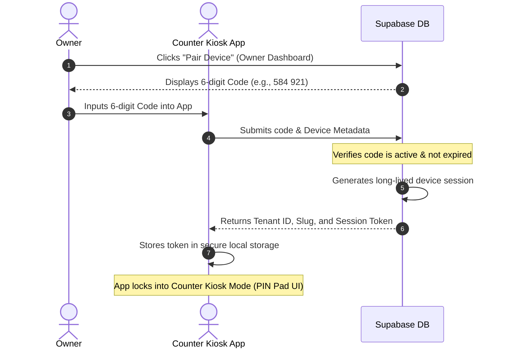
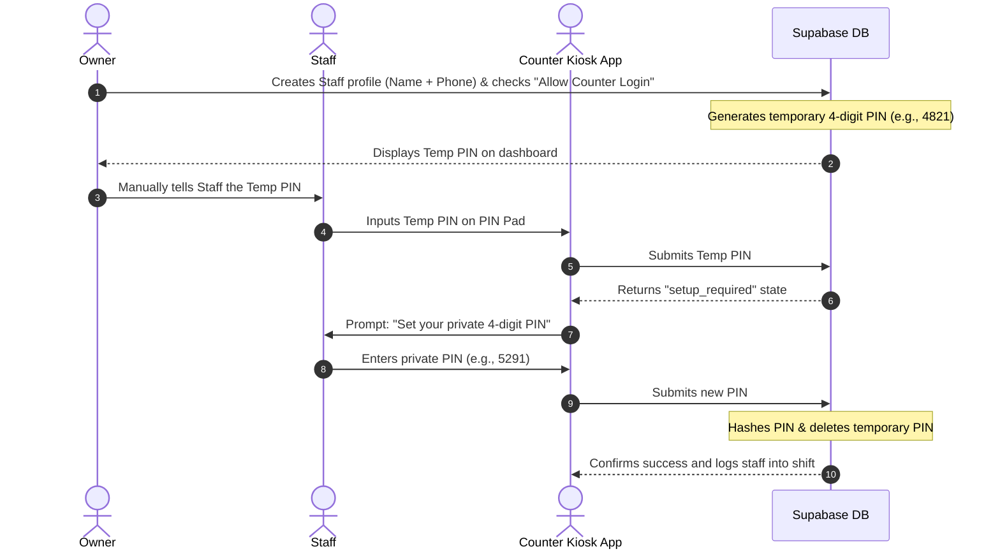
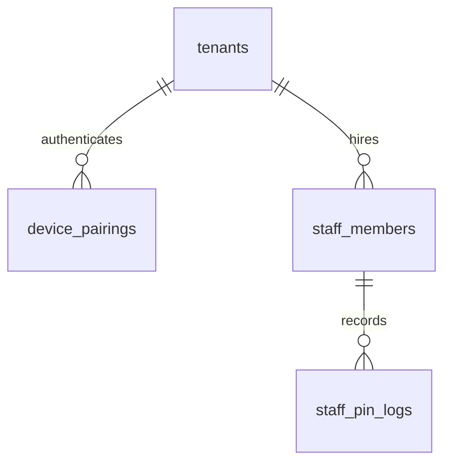

# Specification: Device Pairing & PIN-Based Authentication

This document details the architecture, user flows, and database schema for the **Device Pairing** and **Staff PIN Authentication** systems. These features secure counter terminals and facilitate fast, authenticated actions in high-velocity canteen environments.

---

## 1. Objectives & Scopes
*   **Zero-Password Counter Operations:** Eliminate the need for counter staff to type passwords or emails on shared public kiosk screens.
*   **Accountability & Security:** Each transaction (attendance, sales, advances) is signed by the active staff member's unique, hashed PIN.
*   **Simple Onboarding:** Owners configure devices using short pairing codes, and onboard staff using visual temporary PINs.
*   **Non-Repudiation (Hashed PINs):** Staff PINs are stored as cryptographically secure hashes (e.g., bcrypt/pgcrypto). Owners can reset PINs but cannot view active private PINs.
*   **SMS Delay Handling:** The automated SMS delivery of pairing codes and PINs is postponed. Temporary setup PINs are displayed in the Owner's web dashboard for manual handover.

---

## 2. Onboarding & Authentication Flows

### A. App Startup Landing Page
A fresh installation of the app on a tablet or mobile device presents two options:

1.  **[Create Account / Login]**: Used by Canteen Owners to sign in with email/Google, create a tenant, or manage settings.
2.  **[Pair Device]**: Used to bind a physical tablet/device to a specific canteen's database scope.

---

### B. Device Pairing Flow (6-Digit Code)
To register a shared terminal without exposing owner/admin passwords:



---

### C. Staff Onboarding & PIN Setup Flow
Once the device is paired and locked to a canteen (PIN pad screen):



---

### D. PIN Reset Flow (Forgotten PINs)
If a staff member forgets their private PIN:
1.  **Request Reset:** The staff member asks the Owner to reset their PIN.
2.  **Generate Temp PIN:** The Owner clicks **"Reset PIN"** on the dashboard.
3.  **Invalidation:** The database invalidates the current hashed PIN and generates a new random temporary 4-digit PIN.
4.  **Display & Handover:** The new temporary PIN is displayed to the Owner, who hands it to the staff member.
5.  **Force Setup:** Upon the next PIN pad login, the staff member is forced to set a new private PIN.

---

## 3. Database Schema Extensions

To support this module, we introduce the `device_pairings` table, and extend the `staff_members` table.



### A. Table: `device_pairings`
Stores device association authorizations.

| Column Name | Type | Constraints | Description |
| :--- | :--- | :--- | :--- |
| `id` | `uuid` | Primary Key, `default gen_random_uuid()` | Unique pairing identifier. |
| `tenant_id` | `uuid` | Foreign Key -> `tenants.id`, `not null` | Scoped canteen. |
| `pairing_code` | `text` | `not null` | Unique 6-character code. |
| `device_name` | `text` | `not null` | e.g. "Counter Tablet A". |
| `expires_at` | `timestamptz` | `not null` | Code expiry (default: +30 minutes). |
| `created_at` | `timestamptz` | `default now()`, `not null` | Creation time. |

---

### B. Table Schema: `staff_members`
Updated fields to support phone constraints, login permissions, and hashed credentials.

| Column Name | Type | Constraints | Description |
| :--- | :--- | :--- | :--- |
| `id` | `uuid` | Primary Key, `default gen_random_uuid()` | Unique employee identifier. |
| `tenant_id` | `uuid` | Foreign Key -> `tenants.id`, `not null` | Scopes this profile to a tenant. |
| `full_name` | `text` | `not null` | First and last name of employee. |
| `role` | `text` | `not null` | Employee title (e.g. Cook, Server, Manager). |
| `phone` | `text` | `not null` | **Mandatory.** Contact number. Unique within tenant. |
| `is_active` | `boolean` | `default true`, `not null` | Soft-disable flag. |
| `allow_terminal_login`| `boolean` | `default false`, `not null` | Controls PIN-based counter terminal access. |
| `hashed_pin` | `text` | Nullable | Cryptographic hash of the private 4-digit PIN. |
| `temp_pin` | `text` | Nullable | Clear-text temporary setup PIN (displayed to Owner). |
| `created_at` | `timestamptz` | `default now()`, `not null` | Audit timestamp. |
| `updated_at` | `timestamptz` | `default now()`, `not null` | Audit timestamp. |

*   **Unique Index:**
    ```sql
    CREATE UNIQUE INDEX unique_tenant_staff_phone ON public.staff_members (tenant_id, phone);
    ```

---

## 4. API & Functions (SQL Database Layer)

### 1. `public.generate_pairing_code`
*   **Role:** Tenant Owner / Platform Admin.
*   **Behavior:** Generates a random 6-character alphanumeric code and stores it in `device_pairings`.
*   **Signature:** `generate_pairing_code(p_tenant_id uuid, p_device_name text) RETURNS text`

### 2. `public.verify_pairing_code`
*   **Role:** Unauthenticated (Counter App).
*   **Behavior:** Checks code validity. If active, returns pairing status and initializes a session.
*   **Signature:** `verify_pairing_code(p_code text) RETURNS TABLE (tenant_id uuid, tenant_slug text, success boolean)`

### 3. `public.reset_staff_pin`
*   **Role:** Tenant Owner / Admin.
*   **Behavior:** Generates a new 4-digit random number (e.g., `floor(random() * 9000 + 1000)`), saves it as `temp_pin`, and clears `hashed_pin`.
*   **Signature:** `reset_staff_pin(p_staff_id uuid) RETURNS text`

### 4. `public.verify_staff_pin`
*   **Role:** Paired Counter Terminal.
*   **Behavior:** Verifies the 4-digit PIN. Returns a session if verified, or a `"setup_required"` status if the PIN is temporary.
*   **Signature:** `verify_staff_pin(p_tenant_id uuid, p_pin text) RETURNS jsonb`
