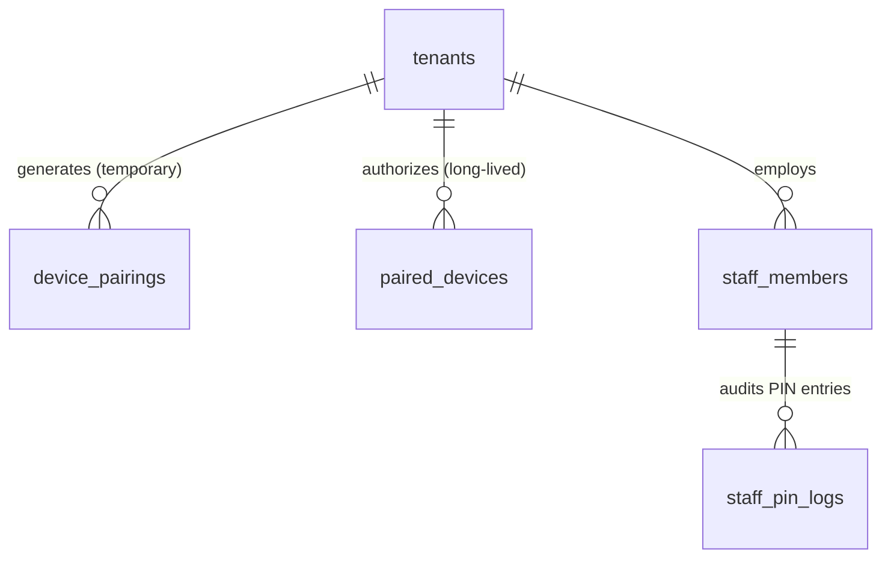
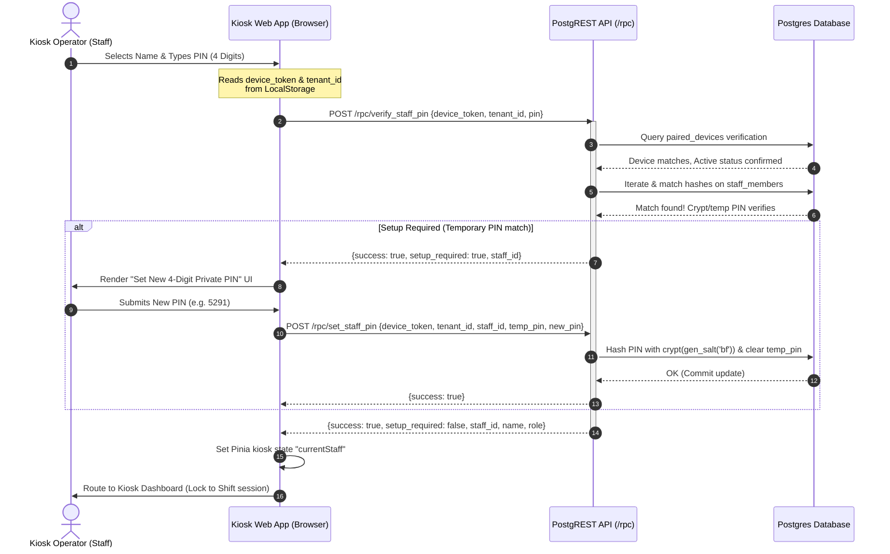

# RFC: Device Pairing & PIN-Based Authentication System

This document outlines the Technical Specification (RFC) for the **Device Pairing** and **Staff PIN Authentication** systems. These features secure counter terminal devices (kiosks) and enable fast, authenticated logging of transactions (such as attendance, POS sales, customer collections, and payroll advances) in high-velocity canteen environments without exposing administrative account credentials.

---

## 1. PRODUCT & SECURITY

### A. User Stories
The system supports three core user personas, each with distinct interfaces and access levels:

1. **Canteen Owner / Workspace Admin**
   - **User Story:** As a Canteen Owner, I want to pair shared counter terminal devices to my canteen scope using a short pairing code and manage staff PINs, so that I can secure kiosk terminals and ensure staff members can execute operations under their own name.
   - **Business Value:** Prevents unauthorized devices from logging canteen transactions, enforces operational audit trails, and allows zero-password terminal logins for kitchen staff.
2. **Kiosk / Counter Terminal Device**
   - **User Story:** As a paired Kiosk Terminal, I want to authenticate myself with the database using a secure device token, fetch only the names of active staff members, and process PIN-based login attempts, so that I can operate securely in a public area without storing admin passwords.
   - **Business Value:** Prevents visual sniffing of admin passwords, isolates terminal access to authorized hardware, and protects sensitive customer/vendor databases from kiosk users.
3. **Canteen Staff Member (Cook, Server, Cashier, Manager)**
   - **User Story:** As a Staff Member, I want to select my name and enter my 4-digit PIN on the shared terminal to authenticate actions, and set a private PIN on my first login, so that I can log my shift attendance, record customer sales, or (if Manager) open/close the operational cash session quickly and securely.
   - **Business Value:** Ensures clear operational accountability and prevents staff members from logging transactions under another colleague's name.

> **Identity note:** Kiosk staff are `staff_members` with a `staff_role_id` → `staff_roles` (capabilities such as `sessions_open`). They are **not** `tenant_members`. Workspace Owner/Admin roles stay on `tenant_roles`. A person who needs both dashboard and counter may optionally set `staff_members.user_id`. Full dual-plane model: [operational_shifts_sessions.md](./operational_shifts_sessions.md) §1.B.

### B. Permission Control Matrix
Access control is enforced at both the database level (via RLS and RPC arguments) and the route/UI layer:

| User Role / Context | Allowed Operations | Guard Enforcement Mechanism |
| :--- | :--- | :--- |
| **Platform Superadmin** | Full read/write on all database tables; bypasses RLS. | Database role (`user_profiles.is_superadmin`) |
| **Tenant Owner** | Generate pairing codes; view/revoke paired devices; view/reset staff profiles & temporary PINs; assign `staff_roles`. | Table RLS (`public.is_tenant_owner(tenant_id)`) |
| **Kiosk Device (Unpaired)** | Enter 6-digit pairing code to authorize the device. | `public.verify_pairing_code` (anonymous RPC) |
| **Kiosk Device (Paired)** | Fetch list of active staff names; verify staff PINs; set private staff PINs. | `device_token` parameter passed to definer RPCs |
| **Kiosk Staff (Not Checked-In)**| View staff selection grid; enter PIN. | UI Kiosk PIN Screen route guard |
| **Kiosk Staff — Cashier** | View active session; log POS / allowed kiosk ops. | `staff_roles.permissions` + active session |
| **Kiosk Staff — Manager** | All Cashier ops + open/close operational session. | `staff_roles` `sessions_open` / `sessions_close` |

### C. Authentication & Authorization Flow
1. **Device Pairing Phase:** The device is unauthenticated. The client inputs a 6-digit numeric pairing code generated by the Tenant Owner. The backend verifies the code, deletes the temporary pairing code, creates a persistent, high-entropy `device_token`, and returns it to the client.
2. **Kiosk Operation Phase:** The client stores the `device_token` in secure local storage. All subsequent database operations from the kiosk must pass this `device_token` as a parameter to the authorized database functions.
3. **Staff Verification Phase:** To execute any transaction, the staff member enters their 4-digit PIN. The database hashes and checks the PIN using `bcrypt` (via `pgcrypto.crypt`) and signs the operational action with the staff member's unique identifier.

---

## 2. BACKEND & DATA

### A. Data Modeling

We introduce the `public.paired_devices` table and extend `public.device_pairings` and `public.staff_members` to implement this design.



#### 1. Table: `public.device_pairings` (Temporary Codes)
Stores active 6-character registration codes valid for 30 minutes.

```sql
create table public.device_pairings (
  id uuid primary key default gen_random_uuid(),
  tenant_id uuid not null references public.tenants(id) on delete cascade,
  pairing_code text not null unique,
  device_name text not null,
  expires_at timestamp with time zone not null,
  created_at timestamp with time zone not null default now()
);

-- Performance Indexes
create index idx_device_pairings_code on public.device_pairings(pairing_code);
create index idx_device_pairings_tenant on public.device_pairings(tenant_id);
```

#### 2. Table: `public.paired_devices` (Authorized Kiosks)
Stores the persistent device tokens after successful verification of the pairing code.

| Column Name | Type | Constraints | Description |
| :--- | :--- | :--- | :--- |
| `id` | `uuid` | Primary Key, `default gen_random_uuid()` | Unique device entry identifier. |
| `tenant_id` | `uuid` | FK -> `tenants.id`, `not null`, `on delete cascade` | Scopes device to specific tenant. |
| `device_name` | `text` | `not null` | Human-readable identifier (e.g. "Counter Tablet A"). |
| `device_token` | `text` | `not null`, `unique` | Persistent SHA-256 hashed device access token. |
| `is_active` | `boolean` | `not null`, `default true` | Admin switch to block a stolen/lost device. |
| `failed_attempts` | `integer` | `not null`, `default 0` | Counter for successive invalid PIN entries. |
| `locked_until` | `timestamptz` | Nullable | Block timestamp for brute-force protection. |
| `paired_at` | `timestamptz` | `not null`, `default now()` | Pairing completion timestamp. |
| `last_active_at` | `timestamptz` | `not null`, `default now()` | Audit track of device ping times. |

```sql
create table public.paired_devices (
  id uuid primary key default gen_random_uuid(),
  tenant_id uuid not null references public.tenants(id) on delete cascade,
  device_name text not null,
  device_token text not null unique,
  is_active boolean not null default true,
  failed_attempts integer not null default 0,
  locked_until timestamp with time zone,
  paired_at timestamp with time zone not null default now(),
  last_active_at timestamp with time zone not null default now()
);

-- Performance Indexes
create index idx_paired_devices_token on public.paired_devices(device_token);
create index idx_paired_devices_tenant_id on public.paired_devices(tenant_id);
```

#### 3. Table Extensions: `public.staff_members`
Add PIN and access flags to the existing `staff_members` table. Role capabilities move to `staff_roles` (see [operational_shifts_sessions.md](./operational_shifts_sessions.md)); free-text `role` is replaced by `staff_role_id`.

```sql
alter table public.staff_members 
  add column allow_terminal_login boolean not null default false,
  add column hashed_pin text,
  add column temp_pin text;
-- Later migration: staff_role_id, user_id; drop free-text role
```

---

### B. Database Integration & Migrations

#### Migration Script (`supabase/migrations/20260715000000_device_token_auth.sql`)
This script creates tables, establishes security boundaries, and registers helper functions.

```sql
-- Enable pgcrypto for password-hashing crypt functions
create extension if not exists pgcrypto;

-- 1. Create Tables
create table public.paired_devices (
  id uuid primary key default gen_random_uuid(),
  tenant_id uuid not null references public.tenants(id) on delete cascade,
  device_name text not null,
  device_token text not null unique,
  is_active boolean not null default true,
  failed_attempts integer not null default 0,
  locked_until timestamp with time zone,
  paired_at timestamp with time zone not null default now(),
  last_active_at timestamp with time zone not null default now()
);

-- 2. Add Indexes
create index idx_paired_devices_token on public.paired_devices(device_token);
create index idx_paired_devices_tenant_id on public.paired_devices(tenant_id);

-- 3. Row-Level Security
alter table public.paired_devices enable row level security;

-- Policies for paired_devices
create policy "Tenant members can view paired devices" on public.paired_devices
  for select using (
    public.is_tenant_member(tenant_id)
  );

create policy "Owners and superadmins can manage paired devices" on public.paired_devices
  for all using (
    public.is_tenant_owner(tenant_id) or public.is_superadmin()
  ) with check (
    public.is_tenant_owner(tenant_id) or public.is_superadmin()
  );
```

---

### C. API Surface & Design (RPC Functions)

Since the kiosk operates on an anonymous browser/app window, it connects to Supabase via PostgREST `rpc` calls. The following database functions are defined:

#### 1. `public.generate_pairing_code`
- **Caller:** Tenant Owner or Superadmin (authenticated via JWT).
- **HTTP Endpoint:** `POST /rest/v1/rpc/generate_pairing_code`
- **SQL Signature:**
  ```sql
  create or replace function public.generate_pairing_code(
    p_tenant_id uuid,
    p_device_name text
  )
  returns text
  security definer
  set search_path = public
  language plpgsql
  as $$
  declare
    v_code text;
  begin
    if not (public.is_tenant_owner(p_tenant_id) or public.is_superadmin()) then
      raise exception 'Unauthorized operation.' using errcode = '42501';
    end if;

    -- Generate random 6-digit numeric string
    v_code := lpad((floor(random() * 900000) + 100000)::text, 6, '0');

    -- Remove prior pending pairings for the same device name
    delete from public.device_pairings 
    where tenant_id = p_tenant_id and device_name = p_device_name;

    insert into public.device_pairings (tenant_id, pairing_code, device_name, expires_at)
    values (p_tenant_id, v_code, p_device_name, now() + interval '30 minutes');

    return v_code;
  end;
  $$;
  ```
- **Response JSON:**
  ```json
  "854921"
  ```

#### 1b. `public.unpair_device` / `public.prepare_device_repair`
- **`unpair_device(p_device_token, p_tenant_id?)`:** Kiosk self-service. Deletes the matching `paired_devices` row (idempotent). Granted to `anon` + `authenticated`. Called from `kioskStore.unpairDevice` before clearing localStorage so accidental terminal unpair does not leave orphan rows in Settings.
- **`prepare_device_repair(p_tenant_id, p_device_id)`:** Owner/superadmin. Deletes that paired device and returns a fresh 6-digit code (same `device_name`, 30 min TTL). Workspace Settings **Re-pair** action uses this.

#### 2. `public.verify_pairing_code`
- **Caller:** Anonymous Client (Device App).
- **HTTP Endpoint:** `POST /rest/v1/rpc/verify_pairing_code`
- **SQL Signature:**
  ```sql
  create or replace function public.verify_pairing_code(
    p_code text,
    p_device_name text
  )
  returns jsonb
  security definer
  set search_path = public, extensions
  language plpgsql
  as $$
  declare
    v_pairing record;
    v_tenant record;
    v_token text;
  begin
    p_code := trim(p_code);

    select id, tenant_id, expires_at 
    into v_pairing 
    from public.device_pairings 
    where pairing_code = p_code;

    if not found then
      return jsonb_build_object('success', false, 'message', 'Invalid pairing code.');
    end if;

    if v_pairing.expires_at < now() then
      delete from public.device_pairings where id = v_pairing.id;
      return jsonb_build_object('success', false, 'message', 'Pairing code has expired.');
    end if;

    select id, name, slug into v_tenant 
    from public.tenants 
    where id = v_pairing.tenant_id;

    -- Generate secure cryptographic device token
    v_token := encode(gen_random_bytes(32), 'hex');

    -- Insert into active paired devices
    insert into public.paired_devices (tenant_id, device_name, device_token)
    values (v_pairing.tenant_id, p_device_name, v_token);

    -- Invalidate pairing code
    delete from public.device_pairings where id = v_pairing.id;

    return jsonb_build_object(
      'success', true,
      'device_token', v_token,
      'tenant_id', v_tenant.id,
      'tenant_name', v_tenant.name,
      'tenant_slug', v_tenant.slug
    );
  end;
  $$;
  ```
- **Response JSON:**
  ```json
  {
    "success": true,
    "device_token": "a1b2c3d4e5f6...",
    "tenant_id": "8e3c4d5b-fc1a-4293-8b7e-95cf0182bb2b",
    "tenant_name": "ACME Canteen",
    "tenant_slug": "acme-canteen"
  }
  ```

#### 3. `public.get_paired_device_staff`
- **Caller:** Paired Device (via device token verification).
- **HTTP Endpoint:** `POST /rest/v1/rpc/get_paired_device_staff`
- **SQL Signature:**
  ```sql
  create or replace function public.get_paired_device_staff(
    p_device_token text,
    p_tenant_id uuid
  )
  returns table (
    id uuid,
    full_name text,
    role text
  )
  security definer
  set search_path = public
  language plpgsql
  as $$
  begin
    if not exists (
      select 1 from public.paired_devices 
      where tenant_id = p_tenant_id and device_token = p_device_token and is_active = true
    ) then
      raise exception 'Unauthorized device token.' using errcode = '42501';
    end if;

    update public.paired_devices 
    set last_active_at = now() 
    where device_token = p_device_token;

    return query
    select sm.id, sm.full_name, sm.role
    from public.staff_members sm
    where sm.tenant_id = p_tenant_id and sm.is_active = true and sm.allow_terminal_login = true
    order by sm.full_name asc;
  end;
  $$;
  ```

#### 4. `public.verify_staff_pin`
- **Caller:** Paired Device (incorporating device token and brute force prevention).
- **HTTP Endpoint:** `POST /rest/v1/rpc/verify_staff_pin`
- **SQL Signature:**
  ```sql
  create or replace function public.verify_staff_pin(
    p_device_token text,
    p_tenant_id uuid,
    p_pin text
  )
  returns jsonb
  security definer
  set search_path = public, extensions
  language plpgsql
  as $$
  declare
    v_device record;
    v_staff record;
  begin
    -- 1. Check device status
    select id, is_active, failed_attempts, locked_until 
    into v_device 
    from public.paired_devices 
    where tenant_id = p_tenant_id and device_token = p_device_token;

    if not found or v_device.is_active = false then
      return jsonb_build_object(
        'success', false, 
        'code', 'DEVICE_BLOCKED', 
        'message', 'Device is disabled or unauthorized.'
      );
    end if;

    if v_device.locked_until is not null and v_device.locked_until > now() then
      return jsonb_build_object(
        'success', false, 
        'code', 'DEVICE_LOCKED', 
        'message', 'Device temporarily locked. Try again in ' || 
                    ceil(extract(epoch from (v_device.locked_until - now())) / 60) || ' mins.'
      );
    end if;

    p_pin := trim(p_pin);

    -- 2. Verify PIN
    for v_staff in 
      select sm.id, sm.full_name, sm.role, sm.hashed_pin, sm.temp_pin
      from public.staff_members sm
      where sm.tenant_id = p_tenant_id and sm.is_active = true and sm.allow_terminal_login = true
    loop
      -- Case A: Temporary PIN matches
      if v_staff.temp_pin is not null and v_staff.temp_pin = p_pin then
        update public.paired_devices 
        set failed_attempts = 0, locked_until = null, last_active_at = now() 
        where id = v_device.id;

        return jsonb_build_object(
          'success', true,
          'setup_required', true,
          'staff_id', v_staff.id,
          'full_name', v_staff.full_name,
          'role', v_staff.role
        );
      end if;

      -- Case B: Cryptographic PIN matches
      if v_staff.hashed_pin is not null and v_staff.hashed_pin = crypt(p_pin, v_staff.hashed_pin) then
        update public.paired_devices 
        set failed_attempts = 0, locked_until = null, last_active_at = now() 
        where id = v_device.id;

        return jsonb_build_object(
          'success', true,
          'setup_required', false,
          'staff_id', v_staff.id,
          'full_name', v_staff.full_name,
          'role', v_staff.role
        );
      end if;
    end loop;

    -- 3. Log Failure & Apply Throttle Rate Limit
    if v_device.failed_attempts + 1 >= 5 then
      update public.paired_devices 
      set failed_attempts = failed_attempts + 1, 
          locked_until = now() + interval '15 minutes', 
          last_active_at = now() 
      where id = v_device.id;
      return jsonb_build_object(
        'success', false, 
        'code', 'DEVICE_LOCKED', 
        'message', 'Too many invalid attempts. Device locked for 15 minutes.'
      );
    else
      update public.paired_devices 
      set failed_attempts = failed_attempts + 1, 
          last_active_at = now() 
      where id = v_device.id;
      return jsonb_build_object(
        'success', false, 
        'code', 'INVALID_PIN', 
        'message', 'Invalid PIN. Attempts remaining: ' || (5 - (v_device.failed_attempts + 1))
      );
    end if;
  end;
  $$;
  ```

#### 5. `public.set_staff_pin`
- **Caller:** Paired Device (to finalize private PIN setup).
- **HTTP Endpoint:** `POST /rest/v1/rpc/set_staff_pin`
- **SQL Signature:**
  ```sql
  create or replace function public.set_staff_pin(
    p_device_token text,
    p_tenant_id uuid,
    p_staff_id uuid,
    p_temp_pin text,
    p_new_pin text
  )
  returns boolean
  security definer
  set search_path = public, extensions
  language plpgsql
  as $$
  declare
    v_current_temp_pin text;
    v_staff_tenant_id uuid;
  begin
    -- 1. Device Token Authorization
    if not exists (
      select 1 from public.paired_devices 
      where tenant_id = p_tenant_id and device_token = p_device_token and is_active = true
    ) then
      raise exception 'Unauthorized device.' using errcode = '42501';
    end if;

    p_new_pin := trim(p_new_pin);
    if length(p_new_pin) != 4 or p_new_pin !~ '^\d{4}$' then
      raise exception 'PIN must be exactly 4 digits.' using errcode = 'P0002';
    end if;

    select sm.temp_pin, sm.tenant_id into v_current_temp_pin, v_staff_tenant_id
    from public.staff_members sm
    where sm.id = p_staff_id and sm.is_active = true and sm.allow_terminal_login = true;

    if not found then
      raise exception 'Staff member not found.' using errcode = 'P0003';
    end if;

    if v_staff_tenant_id != p_tenant_id then
      raise exception 'Mismatched tenant scope.' using errcode = 'P0004';
    end if;

    if v_current_temp_pin is null or v_current_temp_pin != trim(p_temp_pin) then
      raise exception 'Verification failed. Mismatched setup PIN.' using errcode = 'P0005';
    end if;

    update public.staff_members
    set hashed_pin = crypt(p_new_pin, gen_salt('bf')),
        temp_pin = null,
        updated_at = now()
    where id = p_staff_id;

    return true;
  end;
  $$;
  ```

---

### D. API Flow Diagram (Sequential Data Flow)



---

### E. Backend Error Handling Specification
The database RPC endpoints and PostgREST will return structured JSON responses on failure. Handled codes include:

| Scenario | HTTP Status | Error JSON Payload |
| :--- | :--- | :--- |
| **Invalid Pairing Code** | `200 OK` | `{"success": false, "message": "Invalid pairing code."}` |
| **Expired Pairing Code** | `200 OK` | `{"success": false, "message": "Pairing code has expired."}` |
| **Deactivated Device Token**| `200 OK` | `{"success": false, "code": "DEVICE_BLOCKED", "message": "Device is disabled..."}` |
| **Brute Force Lockout** | `200 OK` | `{"success": false, "code": "DEVICE_LOCKED", "message": "Device temporarily locked..."}` |
| **Invalid Staff PIN** | `200 OK` | `{"success": false, "code": "INVALID_PIN", "message": "Invalid PIN. Attempts remaining: 3"}` |
| **Missing/Incorrect Header** | `400 Bad Request`| `{"hint": null, "details": null, "code": "42809", "message": "Mismatched parameters..."}` |
| **Database Server Outage** | `500 Internal Error`| `{"code": "500", "message": "Internal Database Connection Timeout"}` |

---

## 3. FRONTEND ARCHITECTURE

### A. State Management Store (`web/src/stores/kiosk.ts`)
A dedicated Pinia store manages device pairing configurations and session lifecycles:

```typescript
import { ref, computed } from 'vue';
import { defineStore } from 'pinia';
import { supabase } from '../boot/supabase';

export interface KioskStaff {
  id: string;
  fullName: string;
  role: string;
}

export const useKioskStore = defineStore('kiosk', () => {
  // State variables
  const deviceToken = ref<string | null>(localStorage.getItem('kiosk.device_token'));
  const tenantId = ref<string | null>(localStorage.getItem('kiosk.tenant_id'));
  const tenantSlug = ref<string | null>(localStorage.getItem('kiosk.tenant_slug'));
  const tenantName = ref<string | null>(localStorage.getItem('kiosk.tenant_name'));
  const deviceName = ref<string | null>(localStorage.getItem('kiosk.device_name'));
  
  const currentStaff = ref<KioskStaff | null>(null);
  const isSetupRequired = ref<boolean>(false);
  const failedPinMessage = ref<string | null>(null);
  const loading = ref<boolean>(false);

  // Getters
  const isDevicePaired = computed(() => !!deviceToken.value && !!tenantId.value);
  const isStaffAuthenticated = computed(() => !!currentStaff.value);

  // Actions
  async function pairDevice(pairingCode: string, nameOfDevice: string): Promise<boolean> {
    loading.value = true;
    try {
      const { data, error } = await supabase.rpc('verify_pairing_code', {
        p_code: pairingCode,
        p_device_name: nameOfDevice
      });

      if (error) throw error;
      
      const res = data as { 
        success: boolean; 
        device_token?: string; 
        tenant_id?: string; 
        tenant_name?: string; 
        tenant_slug?: string;
        message?: string;
      };

      if (!res.success) {
        throw new Error(res.message || 'Verification failed');
      }

      // Commit to state and storage
      deviceToken.value = res.device_token!;
      tenantId.value = res.tenant_id!;
      tenantSlug.value = res.tenant_slug!;
      tenantName.value = res.tenant_name!;
      deviceName.value = nameOfDevice;

      localStorage.setItem('kiosk.device_token', res.device_token!);
      localStorage.setItem('kiosk.tenant_id', res.tenant_id!);
      localStorage.setItem('kiosk.tenant_slug', res.tenant_slug!);
      localStorage.setItem('kiosk.tenant_name', res.tenant_name!);
      localStorage.setItem('kiosk.device_name', nameOfDevice);

      return true;
    } catch (err) {
      console.error('Device pairing error:', err);
      throw err;
    } finally {
      loading.value = false;
    }
  }

  async function loginStaff(staffId: string, pin: string): Promise<{ success: boolean; setupRequired?: boolean }> {
    loading.value = true;
    failedPinMessage.value = null;
    try {
      const { data, error } = await supabase.rpc('verify_staff_pin', {
        p_device_token: deviceToken.value,
        p_tenant_id: tenantId.value,
        p_pin: pin
      });

      if (error) throw error;

      const res = data as {
        success: boolean;
        setup_required?: boolean;
        staff_id?: string;
        full_name?: string;
        role?: string;
        message?: string;
        code?: string;
      };

      if (!res.success) {
        failedPinMessage.value = res.message || 'Verification failed';
        return { success: false };
      }

      if (res.setup_required) {
        isSetupRequired.value = true;
        currentStaff.value = {
          id: res.staff_id!,
          fullName: res.full_name!,
          role: res.role!
        };
        return { success: true, setupRequired: true };
      }

      currentStaff.value = {
        id: res.staff_id!,
        fullName: res.full_name!,
        role: res.role!
      };
      isSetupRequired.value = false;
      return { success: true, setupRequired: false };
    } catch (err) {
      console.error('PIN Login Exception:', err);
      failedPinMessage.value = 'Network error during authorization.';
      return { success: false };
    } finally {
      loading.value = false;
    }
  }

  async function setPrivatePin(staffId: string, tempPin: string, newPin: string): Promise<boolean> {
    loading.value = true;
    try {
      const { data, error } = await supabase.rpc('set_staff_pin', {
        p_device_token: deviceToken.value,
        p_tenant_id: tenantId.value,
        p_staff_id: staffId,
        p_temp_pin: tempPin,
        p_new_pin: newPin
      });

      if (error) throw error;
      if (data) {
        isSetupRequired.value = false;
        return true;
      }
      return false;
    } catch (err) {
      console.error('Set Private PIN Error:', err);
      throw err;
    } finally {
      loading.value = false;
    }
  }

  function logoutStaff() {
    currentStaff.value = null;
    isSetupRequired.value = false;
    failedPinMessage.value = null;
  }

  function unpairDevice() {
    logoutStaff();
    deviceToken.value = null;
    tenantId.value = null;
    tenantSlug.value = null;
    tenantName.value = null;
    deviceName.value = null;

    localStorage.removeItem('kiosk.device_token');
    localStorage.removeItem('kiosk.tenant_id');
    localStorage.removeItem('kiosk.tenant_slug');
    localStorage.removeItem('kiosk.tenant_name');
    localStorage.removeItem('kiosk.device_name');
  }

  return {
    deviceToken,
    tenantId,
    tenantSlug,
    tenantName,
    deviceName,
    currentStaff,
    isSetupRequired,
    failedPinMessage,
    loading,
    isDevicePaired,
    isStaffAuthenticated,
    pairDevice,
    loginStaff,
    setPrivatePin,
    logoutStaff,
    unpairDevice
  };
});
```

---

### B. Routing & Route Guards

#### Router Config (`web/src/router/routes.ts` snippet)
Kiosk layouts are completely isolated from standard customer portal paths.

```typescript
const routes = [
  {
    path: '/kiosk',
    component: () => import('layouts/KioskLayout.vue'),
    children: [
      {
        path: '',
        redirect: '/kiosk/login'
      },
      {
        path: 'pair',
        name: 'kiosk-pair',
        component: () => import('pages/kiosk/PairDevice.vue')
      },
      {
        path: 'login',
        name: 'kiosk-login',
        component: () => import('pages/kiosk/PINLogin.vue'),
        meta: { requiresPairing: true }
      },
      {
        path: 'workspace',
        name: 'kiosk-workspace',
        component: () => import('pages/kiosk/StaffWorkspace.vue'),
        meta: { requiresPairing: true, requiresStaffAuth: true }
      }
    ]
  }
];
```

#### Route Guard Validation (`web/src/router/index.ts` hook)
```typescript
router.beforeEach((to, from, next) => {
  const kioskStore = useKioskStore();

  // 1. Check if route is a Kiosk route
  if (to.path.startsWith('/kiosk')) {
    const isPaired = kioskStore.isDevicePaired;
    const isAuth = kioskStore.isStaffAuthenticated;

    if (to.meta.requiresPairing && !isPaired) {
      // Force pairing if the device is not paired
      return next({ name: 'kiosk-pair' });
    }
    
    if (to.name === 'kiosk-pair' && isPaired) {
      // Direct back to terminal login if already paired
      return next({ name: 'kiosk-login' });
    }

    if (to.meta.requiresStaffAuth && !isAuth) {
      // Re-route to PIN pad if staff verification is absent
      return next({ name: 'kiosk-login' });
    }
  }
  
  next();
});
```

---

### C. Code Splitting & Lazy Loading
To optimize bundle payloads for slow mobile internet networks, kiosk bundles are dynamically imported:
- Layout and sub-routes are code-split using standard Vue lazy-imports.
- UI elements (specifically the heavy PIN pad grid assets) are consolidated under the Kiosk chunk.
- Prefetching is disabled for the `/kiosk` chunk on main administrative dashboards, separating staff POS screens from the back-office dashboard metrics.

---

## 4. UI & ACCESSIBILITY

### A. Component Specification (Props & Events)

#### 1. Component: `KioskPinPad.vue`
The virtual digit layout keypad component.

- **Properties (Props):**
  - `maxDigits: number` (Default: `4`): Cap for active code input fields.
  - `disabled: boolean` (Default: `false`): Lock inputs during request loading.
- **Events Emitted:**
  - `@submit(pin: string)`: Fires when `maxDigits` is reached.
  - `@change(length: number)`: Feeds back current number count.
- **Structure:**
  - Grid layout showing 1-9, Clear (Backspace), 0, and Submit.

#### 2. Component: `StaffSelectorGrid.vue`
Grid display enabling staff to tap their profile.

- **Properties (Props):**
  - `staffList: Array<KioskStaff>`: Array of names, roles, and ids.
  - `selectedStaffId: string | null`: Highlights selected member.
- **Events Emitted:**
  - `@select(staff: KioskStaff)`: Toggles active selection context.

---

### B. Responsive & Visual Styling Layout (Quasar)

The interface scales smoothly across multiple devices, optimized primarily for terminal tablets.

- **Breakpoint Configuration:**
  - **Desktop / Tablet (gt-sm):** Split 2-column format.
    - Left column (`col-7`): Staff Selector Grid with vertical scroll containment to list up to 20 staff names.
    - Right column (`col-5`): Flat, bordered card centering the virtual `KioskPinPad`.
  - **Mobile Phone / Small Viewport (lt-md):** Standard single panel view.
    - Screen shows the list of staff members. Selecting a staff card switches routes/panels to display a full-screen digit keyboard overlay (facilitating a touch-safe keyboard hitbox of `52px` per key).

#### Styling System Utility Classes
- Design complies strictly with UI rules:
  - Cards: `<q-card class="flat bordered bg-white">`
  - Gutter containers: `<div class="row q-col-gutter-md">`
  - Text highlights: `text-subtitle2 text-weight-medium text-grey-8`
  - Feedback active states: Button uses `v-ripple` and `cursor-pointer` to indicate tactile interaction.
  - Touch hitbox: Keypad keys are custom styled with `.q-btn--dense` but enforce a custom CSS height of `56px` to maintain a touch target size exceeding the standard mobile threshold of `48px`.

---

### C. Accessibility (a11y)
- **Keyboard Navigation Support:**
  - Listens to keydown hooks on lifecycle register. Keys `0-9` input digits.
  - `Backspace` deletes digits.
  - `Escape` resets input array.
  - `Enter` triggers login action.
- **ARIA Implementations:**
  - Pad buttons labeled cleanly (`aria-label="Number 9"`, `aria-label="Delete last digit"`).
  - PIN indicator displays are marked `role="status"` and `aria-live="polite"` to read changes securely to screen readers.
  - Staff selection card wraps have `role="button"` and `tabindex="0"`.

---

### D. Data Fetching & Error Management (Frontend UI)

- **Form Validation:** The digit inputs only allow numeric digits (`/^\d+$/`). Non-digits are ignored.
- **Offline / Network Drops:**
  - Window listener checks for `online` / `offline` states.
  - Displays a persistent, top-docked orange banner: `Network connection lost. Offline operations enabled (Read Only).`
- **Error Boundaries:** If the database RPC fails, the error message from the database is captured by the store and displayed as a red helper block under the PIN display dots.
- **Empty States:** If `get_paired_device_staff` returns an empty array, the selector displays a vector illustration: `"No staff members configured for counter access. Please check dashboard settings."`

---

## 5. IMPLEMENTATION ROADMAP & CHECKLISTS

### Phase 1: Backend & Data
- [ ] Create database migration file `20260715000000_device_token_auth.sql`.
- [ ] Implement `paired_devices` table structure with indexes.
- [ ] Enable RLS and define member/owner policies on `paired_devices`.
- [ ] Create SQL function `public.generate_pairing_code`.
- [ ] Create SQL function `public.verify_pairing_code` (includes generating high-entropy `device_token`).
- [ ] Create SQL function `public.get_paired_device_staff` (filters out sensitive credentials).
- [ ] Create SQL function `public.verify_staff_pin` (includes failed attempt increments and temporary locks).
- [ ] Create SQL function `public.set_staff_pin` (validates 4-digit input format).
- [ ] Verify migration executes cleanly with `supabase db reset`.

### Phase 2: UI & Frontend Infrastructure
- [ ] Initialize Pinia store `useKioskStore` in `web/src/stores/kiosk.ts` to manage token storage and RPC bindings.
- [ ] Add route declarations `/kiosk/pair`, `/kiosk/login`, and `/kiosk/workspace` in `web/src/router/routes.ts`.
- [ ] Implement global router guards in `web/src/router/index.ts` to prevent terminal usage of unpaired devices.
- [ ] Create base kiosk layout wrapper `web/src/layouts/KioskLayout.vue`.
- [ ] Design the virtual keypad component `web/src/components/kiosk/KioskPinPad.vue` (enforcing a minimum 48px touch hitbox).
- [ ] Design the staff selector component `web/src/components/kiosk/StaffSelectorGrid.vue`.

### Phase 3: Assembly & Integration
- [ ] Build device pairing interface page `web/src/pages/kiosk/PairDevice.vue`.
- [ ] Build staff login interface page `web/src/pages/kiosk/PINLogin.vue` connecting grid selection to the digit pin pad.
- [ ] Create staff password reset and temporary PIN visual card in the Tenant Owner dashboard.
- [ ] Implement the first-time PIN change overlay prompt (`setup_required = true` redirect path).
- [ ] Integrate Kiosk shift logging requests using `device_token` params.

### Phase 4: Optimization & Polish
- [ ] Implement local database caching and off-line detection indicator states.
- [ ] Add full screen keyboard event listener hook (`0-9`, `Backspace`, `Enter`, `Escape`) to PIN pad.
- [ ] Enforce visual disabled/loading layouts on buttons during active async RPC requests.
- [ ] Add ARIA accessibility markers to buttons, grid cards, and live-status alerts.
- [ ] Perform cross-browser compatibility testing (Safari, Chrome, Android System WebView).
