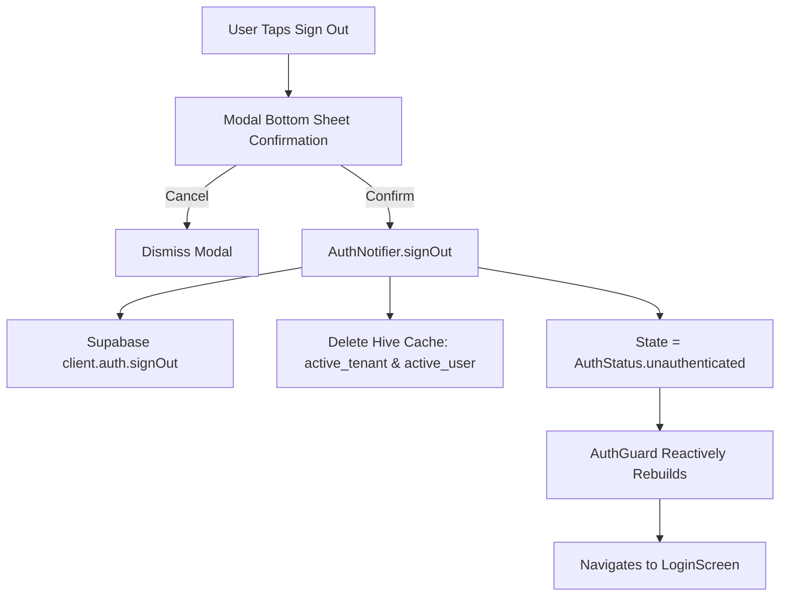

# Authentication & Logout Flow

> Technical documentation for session management, logout workflow, local cache invalidation, and reactive routing in Smart-Hisab.

---

## Architecture Overview

Authentication in Smart-Hisab is managed centrally via `AuthNotifier` (`lib/core/auth/auth_notifier.dart`) using Supabase Auth and Riverpod state management.

---

## 1. Logout Entrypoints

The Sign Out action is accessible across key screens in the application:

1. **`SettingsScreen`** (`lib/features/settings/settings_screen.dart`)
   - Prominent, danger-styled list tile at the bottom of settings.
2. **`MyProfileScreen`** (`lib/features/settings/my_profile_screen.dart`)
   - Dedicated "Sign Out" button at the bottom of the profile overview.
3. **`OnboardingChoiceScreen`** (`lib/features/auth/onboarding_choice_screen.dart`)
   - Header logout icon button for users in tenant setup state.

---

## 2. Modal Bottom Sheet Confirmation

All sign out actions trigger `CustomModalBottomSheet.show()` adhering strictly to project standards:
- **Rounded top corners**: `BorderRadius.vertical(top: Radius.circular(32))`
- **No close button**: Dismissible via backdrop tap or explicit action buttons (`Cancel` / `Sign Out`).
- **Destructive styling**: Primary action uses `AppColors.danger`.

---

## 3. Session & Cache Cleanup

When the user confirms sign out, `AuthNotifier.signOut()` executes:

1. **Supabase Auth Sign Out**: Invokes `SupabaseService.client.auth.signOut()` to invalidate backend refresh tokens.
2. **Offline Cache Purging**: Deletes Hive stored keys (`active_tenant` and `active_user`).
3. **State Mutation**: Resets `authState` to `AuthState(status: AuthStatus.unauthenticated)`.
4. **Reactive Routing**: `AuthGuard` in `main.dart` reacts to `AuthStatus.unauthenticated` and renders `LoginScreen`.
5. **User Feedback**: Displays a success snackbar toast via `NotificationService`.
