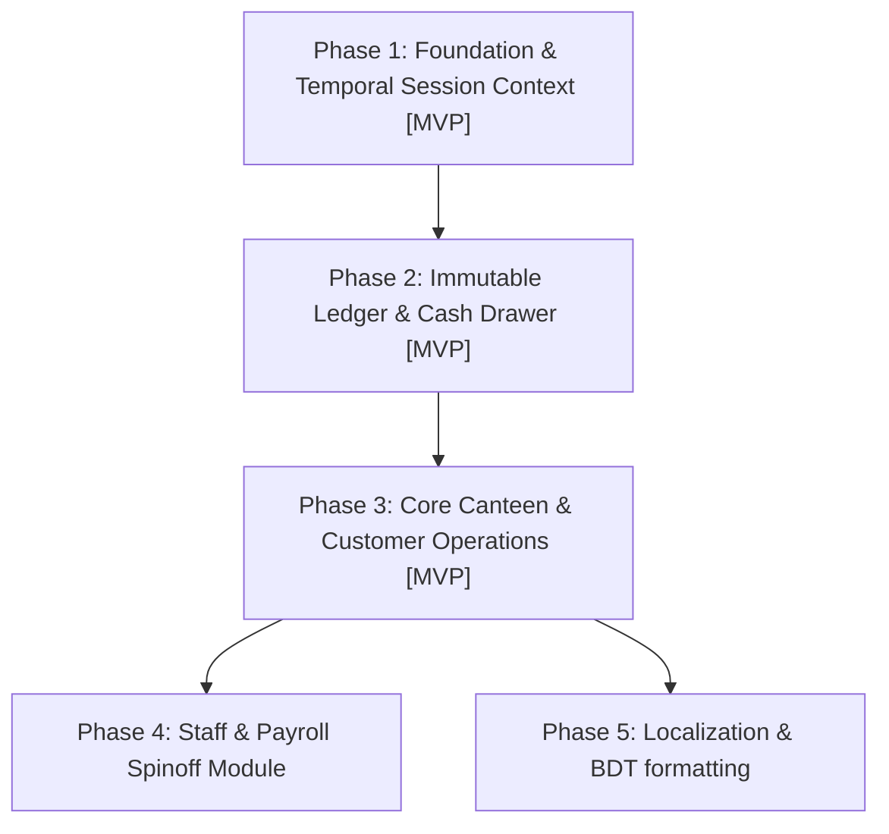

# Canteen Management System - Master Specifications

This document outlines the decoupled, multi-tenant modular architecture of the Canteen Management System. Each module is designed to operate independently as a separate application/service, interacting through clean event boundaries and generic references.

---

## Table of Contents
* [1. System-Wide Decoupling & Integration Strategy](#decoupling-strategy)
* [2. Phase-Based Implementation Roadmap (MVP & Spinoff Order)](#roadmap)
* [3. Core Module: Operational Shifts & Sessions (`shift-sessions`)](#shift-sessions)
* [4. Module: Staff Attendance & Payroll (`staff-payroll`)](#staff-payroll)
* [5. Module: Meal & Customer Management (`meal-management`)](#meal-management)
* [6. Module: Procurement & Supplier Management (`procurement`)](#procurement)
* [7. Module: Transaction Ledger (`financial-ledger`)](#financial-ledger)
* [8. System-Wide Localization & Currency Strategy](#localization-currency)

---

## 1. System-Wide Decoupling & Integration Strategy <a id="decoupling-strategy"></a>

To allow each module (and its submodules) to be split into separate microservices or standalone apps in the future, the system adheres to the following decoupling principles:
*   **Database Isolation:** Modules do not execute direct SQL `JOIN` statements across boundaries. References between modules (e.g., linking a transaction to an employee) are stored as simple foreign IDs (`uuid`), treated as external references.
*   **Event-Driven Communication:** When an action in one module has financial or operational side-effects in another, the originating module publishes an integration event. A central event coordinator (or API gateway) routes these.
*   **Decoupled Schema Reference Map:**
    ```
    ┌──────────────────────────┐          ┌──────────────────────────┐
    │  Shift & Session Module  │◄─────────┤ Staff & Payroll Module   │
    │  (Temporal Context)      │◄─────────┤ (attendance, payroll)    │
    └──────────────▲───────────┘          └──────────────────────────┘
                   │
                   │                      ┌──────────────────────────┐
                   ├──────────────────────┤ Meal & Customer Module   │
                   │                      │ (attendance meals, baki) │
                   │                      └──────────────────────────┘
                   │
                   │                      ┌──────────────────────────┐
                   └──────────────────────┤ Procurement Module       │
                                          │ (bazar buying, vendors)  │
                                          └──────────────────────────┘
    ```

---

## 2. Phase-Based Implementation Roadmap (MVP & Spinoff Order) <a id="roadmap"></a>

To construct this system systematically while remaining adaptable for spinoff services (like standalone staff management or micro-POS applications), development is structured into clear phases. Items marked **[MVP]** constitute the essential core required to run a local canteen drawer operation.



### Phase 1: Foundation & Operational Session Context [MVP]
*   **Objective:** Establish workspace scopes and temporal operational limits.
*   **Detailed specs:** 
    *   Tenant/Role setup: [Multi-Tenant Architecture Specifications](file:///Users/daviditc/Documents/Personal%20Project/smart-hisab/docs/multi_tenant_architecture.md)
    *   Shift drawers: [Operational Shifts & Sessions Specifications](file:///Users/daviditc/Documents/Personal%20Project/smart-hisab/docs/operational_shifts_sessions.md) (refer to [Section 3: Operational Shifts & Sessions](#shift-sessions))

### Phase 2: Ledger & Cash Register [MVP]
*   **Objective:** Build append-only audit ledger and dynamic dashboards.
*   **Detailed specs:** 
    *   Immutable book of logs: [Transaction Ledger Specifications](file:///Users/daviditc/Documents/Personal%20Project/smart-hisab/docs/transaction_ledger.md) (refer to [Section 7: Transaction Ledger](#financial-ledger))

### Phase 3: Core Canteen & Customer Operations [MVP]
*   **Objective:** Support billing contract workers, credit (baki) logs, collections, daily raw material (bazar) shopping, and vendor invoices.
*   **Detailed specs:**
    *   Billing and Credit: [Meal & Customer Management Specifications](file:///Users/daviditc/Documents/Personal%20Project/smart-hisab/docs/meal_customer_management.md) (refer to [Section 5: Meal & Customer Management](#meal-management))
    *   Expenses and Vendors: [Procurement & Supplier Management Specifications](file:///Users/daviditc/Documents/Personal%20Project/smart-hisab/docs/procurement_supplier_management.md) (refer to [Section 6: Procurement & Supplier Management](#procurement))

### Phase 4: Staff Management & Payroll [Spinoff Module]
*   **Objective:** Manage staff directory, clock attendance, record cash advances, and run payroll settlement payouts.
*   **Spinoff Potential:** This module has low temporal coupling and generic user references, enabling a straightforward spinoff to a dedicated payroll/workforce management app.
*   **Detailed specs:**
    *   Workforce: [Staff Attendance & Payroll Specifications](file:///Users/daviditc/Documents/Personal%20Project/smart-hisab/docs/staff_attendance_payroll.md) (refer to [Section 4: Staff Attendance & Payroll](#staff-payroll))

### Phase 5: Localization & BDT formatting
*   **Objective:** Enable English/Bangla language switching and dynamic currency rendering.
*   **Detailed specs:**
    *   Settings & i18n layouts: Refer to [Section 8: Localization & Currency Strategy](#localization-currency).

---

## 3. Core Module: Operational Shifts & Sessions (`shift-sessions`) <a id="shift-sessions"></a>

> [!NOTE]
> For the complete data models, security controls, database triggers, and API flows of this module, refer to the [Operational Shifts & Sessions Specifications](file:///Users/daviditc/Documents/Personal%20Project/smart-hisab/docs/operational_shifts_sessions.md).

This module manages the temporal and physical cash drawer context for all operations. Instead of treating "date and shift" as mere attributes on transactions, the system models them as a formal **Operational Session**. Almost all records generated in other modules refer back to an active `session_id`.

### Submodules
1.  **Shift Configuration:**
    *   Defines recurring operational shifts (e.g., Breakfast, Lunch, Afternoon Snacks, Dinner).
    *   Tracks shift window rules (start/end target times).
2.  **Session Lifecycle Controller:**
    *   **Open Session:** Manager clocks in, selects the active shift, and inputs the **Opening Drawer Cash** amount.
    *   **Active Session Monitoring:** Serves as the system-wide active context. Any log created during this time (POS sale, bazar purchase, staff advance) automatically links to this `session_id` and the current business `date`.
    *   **Close Session:** Manager records a single aggregated counter money entry representing walk-in regular meal sales (Category: `POS`) for the session, counts physical drawer cash, enters the **Closing Drawer Cash** amount, and closes the session.
3.  **Shift Reconciliation Engine:**
    *   Aggregates expected figures from all modules linked to the active `session_id`:
        *   `Expected Cash = Opening Cash + Cash POS Sales (Counter Sales Entry) + Cash Customer Collections - Cash Bazar Expenses - Cash Staff Advances - Cash Vendor Payments`
    *   Compares `Expected Cash` against the entered `Closing Drawer Cash` to log the variance.
    *   Locks all transactions linked to the session once closed (read-only enforcement).

---

## 4. Module: Staff Attendance & Payroll (`staff-payroll`) <a id="staff-payroll"></a>

> [!NOTE]
> For the complete data models, security controls, database triggers, and API flows of this module, refer to the [Staff Attendance & Payroll Specifications](file:///Users/daviditc/Documents/Personal%20Project/smart-hisab/docs/staff_attendance_payroll.md).

Handles employee registry, attendance logs, mid-month cash advances, and periodic salary disbursals.

### Submodules
1.  **Staff Directory & Roster:**
    *   Registry of cooks, servers, and managers with contact details.
    *   Pay rates configuration (hourly rates, fixed daily rates, weekly wages, or monthly salary structures).
2.  **Staff Attendance Tracker:**
    *   Daily shift-based attendance logging (Present / Absent / Half-day).
    *   References the current active `session_id`.
3.  **Cash Advance Registry:**
    *   Records early payouts/advances requested by employees during a shift.
    *   Requires Employee ID, cash amount, reason, date, and active `session_id`.
4.  **Payroll Settlement Engine:**
    *   Compiles monthly/weekly base pay, adds calculated daily/hourly attendance earnings, and subtracts accumulated cash advances.
    *   Generates payroll summary records showing net wages due.
5.  **Salary Disbursal:**
    *   Finalizes and logs payout payments. Once disbursed, records are locked.
    *   Triggers financial outflow events to the Ledger.

---

## 5. Module: Meal & Customer Management (`meal-management`) <a id="meal-management"></a>

> [!NOTE]
> For the complete data models, security controls, database triggers, and API flows of this module, refer to the [Meal & Customer Management Specifications](file:///Users/daviditc/Documents/Personal%20Project/smart-hisab/docs/meal_customer_management.md).

Manages flat-rate contract workers (charged a fixed daily rate if present for any contracted shifts), walk-in credit (baki) customers, and collections.

### Submodules
1.  **Customer Profiles:**
    *   Registry of customers with categories: `Contract Workers` (daily flat rate, e.g., 200 taka, for selected shifts) or `Walk-in Baki` (credit items).
    *   Tracks a running `outstanding_balance` per customer (supporting segment payments and prepaid advances).
2.  **Daily Contract Attendance Tracker:**
    *   Fast-access grid UI of active contract workers.
    *   One-tap shift attendance toggling (Breakfast, Lunch, Dinner, Snack).
    *   Charges the daily rate exactly once per day if marked present for any contracted shifts.
3.  **Baki (Credit) & Extra Charges Ledger:**
    *   Record walk-in credit entries and extra charges (above the daily rate) for contract workers.
    *   Stores a description note of what they ate and its cost.
    *   Links to active `session_id` for audits.
4.  **Customer Collections (Receivables):**
    *   Records payments collected from customers to clear outstanding debts (paid in segments or advance).
    *   Generates a real-time central ledger inflow event (`received_collection`) containing payment details.

---

## 6. Module: Procurement & Supplier Management (`procurement`) <a id="procurement"></a>

> [!NOTE]
> For the complete data models, security controls, database triggers, and API flows of this module, refer to the [Procurement & Supplier Management Specifications](file:///Users/daviditc/Documents/Personal%20Project/smart-hisab/docs/procurement_supplier_management.md).

Manages vendor ledgers, daily market expense lists, and payment tracking.

### Submodules
1.  **Vendor & Supplier Registry:**
    *   Database of wholesale suppliers (e.g., rice mills, meat vendors, vegetable markets) tracking outstanding dues.
2.  **Daily Bazar List Planner:**
    *   Draft checklist for morning raw ingredient shopping, specifying quantities and estimates.
3.  **Bazar Expense Logger:**
    *   Log actual purchases (item name, quantity, category, unit price, total price).
    *   Links to active `session_id`.
    *   **Payment Routing Toggle:** Select either `Cash Purchase` (deducted directly from the active shift cash drawer) or `Vendor Baki` (added to supplier outstanding ledger balance).
4.  **Vendor Payout Tracker:**
    *   Records payments made to suppliers to clear accumulated vendor dues.

---

## 7. Module: Transaction Ledger (`financial-ledger`) <a id="financial-ledger"></a>

> [!NOTE]
> For the complete data models, security controls, database triggers, and API flows of this module, refer to the [Transaction Ledger Specifications](file:///Users/daviditc/Documents/Personal%20Project/smart-hisab/docs/transaction_ledger.md).

A clean, high-performance financial register acting as the tenant's single bookkeeping book.

### Submodules
1.  **Unified Cash Register:**
    *   Tracks physical cash changes inside the drawer.
    *   Receives entries from other modules (Procurement, Customer Collections, Staff Payroll, Vendor Payments) associated with a `session_id`.
2.  **Transaction Audit Log:**
    *   An append-only, immutable transaction ledger.
    *   Fields: `id`, `tenant_id`, `session_id`, `type` (Inflow / Outflow), `category` (POS, Debt Collection, Raw Materials, Payroll, Supplier Payout), `amount`, `payment_method` (Cash, Mobile Wallet, Bank Transfer), `operator_id`, and `created_at`.
3.  **Tenant Financial Dashboard:**
    *   Aggregated reports: Net Profit/Loss, Outstanding Receivables (Customer Credit), Outstanding Payables (Supplier Credit), and Total Expenses.

---

## 8. System-Wide Localization & Currency Strategy <a id="localization-currency"></a>

To ensure ground-level operability in canteen environments (where kitchen staff and managers prefer localized interfaces) and to provide robust bookkeeping compliance, the system implements a dynamic localization and multi-currency layer:
1. **Bilingual Translations (i18n):**
   * Support for **English (`en-US`)** and **Bangla (`bn`)** translations across all modules.
   * Tenant default languages are defined at the tenant configuration layer, with user-level overrides stored in individual `user_profiles.preferences.language` to allow staff-specific display options.
2. **Multi-Currency Framework (Default BDT):**
   * Financial ledger and modules record transaction amounts as standard numeric decimals without hardcoding specific symbols.
   * The display currency defaults to **Bangladeshi Taka (BDT, ৳)**, dynamically loaded from the active `tenant_settings.preferences.localization.currency`.
   * Currency formatting is applied at the presentation layer using the browser's `Intl.NumberFormat` localization standard.

