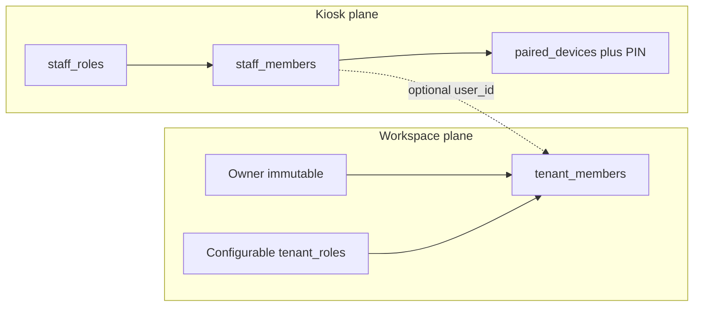
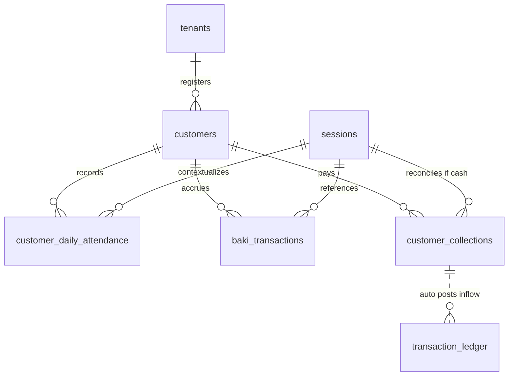
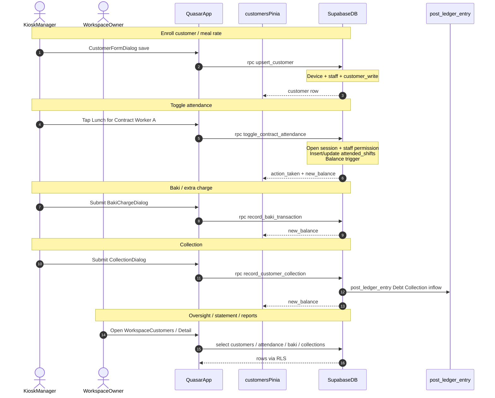

# RFC: Meal & Customer Management (`meal-management`)

This document is the Technical Specification (RFC) for the **Meal & Customer Management** module. It covers contract worker profiles, daily contract attendance, credit (baki) / extra charges, customer collections (segment or advance payments), cached outstanding balances, and automated ledger inflow on collection.

### Key Objectives
* **Customer Segmentation:** `contract_worker` (flat daily rate charged once per day if present for any contracted shift) vs `walk_in_baki` (itemized credit only).
* **Daily Contract Attendance Grid:** Zero-latency toggle of Breakfast / Lunch / Dinner / Snack; first present shift of the day applies `contract_daily_rate` once; further shifts that day do not double-charge; toggling off the last shift refunds the rate.
* **Baki & Extra Charges:** Itemized note + amount for walk-in credit or contract-worker extras beyond the daily rate.
* **Collections:** Segment debt clearing or advance (negative `outstanding_balance` = prepaid). Cash collections require an open session; non-cash may omit `session_id`.
* **Cached Balance:** `customers.outstanding_balance` maintained by DB triggers (`attendance` / `baki` increase; `collections` decrease).
* **Ledger Integration:** On collection insert, call internal `post_ledger_entry` (`inflow`, category `Debt Collection`).
* **Closed-Session Lock:** No mutate of attendance / baki / session-linked collections once the operational session is closed.
* **Localization:** UI strings in **English (`en-US`)** and **Bangla (`bn`)**; amounts via `formatMoney` (default BDT / `bn`).

### Implementation Status (as of this RFC)
| Layer | Status |
| :--- | :--- |
| Feature flag `meal-management` | Seeded in migration |
| DB tables / RPCs / RLS / balance + lock triggers | Migrated; kiosk customer upsert RPC still missing |
| Pinia / workspace UI | Built (`WorkspaceCustomers`, detail, dialogs) |
| Kiosk Manager customer CRUD UI | **Gap** — see [temp_restructure.md](./temp_restructure.md) |
| Upstream `sessions` + `enforce_closed_session_lock` | Migrated ([operational_shifts_sessions.md](./operational_shifts_sessions.md)) |
| Upstream `post_ledger_entry` | Migrated ([transaction_ledger.md](./transaction_ledger.md)) |

**Product correction:** Terminal Manager is the primary operator for customer/meal enrollment and cashier money flow. Workspace Owner/Admin retain full access for reports and oversight but are not the expected enrollment path. Tracking: [temp_restructure.md](./temp_restructure.md).

---

## 1. PRODUCT & SECURITY

### A. User Stories

#### Persona A: Shift Manager (Kiosk — primary daily ops)
**Manager ⊃ Cashier:** a Manager can perform every cashier money action, plus session open/close and customer / meal-rate master data.

1. **As a** Shift Manager, **I want to** register customers on the terminal (Contract Worker or Walk-in Baki), set `contract_daily_rate` and contracted shifts (“meal plan” fields), **so that** enrollment happens at the counter without Owner login.
2. **As a** Shift Manager, **I want to** open and close the operational session and manage drawer money flow (POS, expense, advance as permitted), **so that** the day runs entirely from the terminal.
3. **As a** Shift Manager, **I want** a grid of active contract workers with one-tap shift attendance, **so that** I can mark present during service with minimal latency.
4. **As a** Shift Manager, **I want to** log walk-in baki / extras and record collections, **so that** balances and cash stay correct during the shift.

#### Persona B: Cashier (Kiosk — money ops only)
1. **As a** Cashier, **I want to** log baki, collections, attendance, and POS/expense (as permitted), **so that** I can run the counter under an already-open session.
2. **As a** Cashier, **I do not** open/close sessions or create/edit customer master data.

#### Persona C: Owner / Tenant Admin (Workspace — oversight + reports)
1. **As an** Owner or Admin, **I want to** see customer balances, statements, and reports, **so that** receivables and billing are transparent without standing at the counter.
2. **As an** Owner or Admin, **I can** also create/edit customers and (with permission) perform writes, **but** daily enrollment and cashier work are expected on the terminal Manager.
3. **As an** Owner, **I want** meal logs and collections locked when a session is closed, **so that** staff cannot retroactively hide consumption or cash receipts.

### B. Identity & Role Planes (conjunct, not conflated)

Two permission planes share a tenant but use different identities. **Do not merge Manager into `tenant_members`.**

| Plane | Who | Auth | Permission source |
| :--- | :--- | :--- | :--- |
| **Workspace** | Owner (immutable) + configurable `tenant_roles` | Supabase Auth | `tenant_roles.permissions` |
| **Kiosk / floor** | Manager, Cashier, Staff | Device token + PIN | `staff_roles.permissions` |



**Rules:**
* **Terminal (Manager)** is the primary plane for customer CRUD (`customer_write`), attendance / baki / collections, and session open/close + cashier money flow.
* **Cashier** shares floor money/attendance writes; **no** `customer_write`, **no** session open/close.
* **Workspace (Owner / Admin)** is primary for statements (`statement_read`), reports, and history; customer CRUD remains available as a secondary path.
* Collection ledger posts never go through the client; they call `post_ledger_entry` inside `security definer` RPCs.

### C. Permission Control Matrices

#### C1. Workspace (`tenant_roles`)

Module key: `meal_management`. Feature gate: `enabled_features['meal-management'] === true`.

```json
{
  "modules": {
    "meal_management": {
      "customer_read": true,
      "customer_write": false,
      "attendance_read": true,
      "attendance_write": false,
      "baki_read": true,
      "baki_write": false,
      "collections_read": true,
      "collections_write": false,
      "statement_read": true
    }
  }
}
```

| Operation | Configurable office role (e.g. Admin) | Owner (immutable) | Platform Superadmin |
| :--- | :--- | :--- | :--- |
| Customer Read | configurable (default true) | Yes | Bypass RLS |
| Customer Write | configurable (default false for Admin) | Yes | Bypass RLS |
| Attendance / Baki / Collections Read | configurable | Yes | Bypass RLS |
| Attendance / Baki / Collections Write | usually false on workspace (floor uses kiosk) | Yes | Bypass RLS |
| Statement Read | configurable | Yes | Bypass RLS |

**Owner immutability:** System `Owner` (`tenant_id is null`, `permissions = {"all": true}`) cannot be edited or deleted.

**Suggested defaults for seeded office roles:**
| Role | `customer_read` | `customer_write` | `statement_read` | Floor writes |
| :--- | :--- | :--- | :--- | :--- |
| Admin | true | true | true | false |
| Accountant (if seeded) | true | false | true | false |
| Owner | via `permissions.all` | Yes | Yes | Yes |

#### C2. Kiosk (`staff_roles`)

**Manager (default)** — includes all Cashier meal money ops **plus** customer master-data write:

```json
{
  "modules": {
    "meal_management": {
      "customer_read": true,
      "customer_write": true,
      "attendance_read": true,
      "attendance_write": true,
      "baki_read": true,
      "baki_write": true,
      "collections_read": true,
      "collections_write": true
    }
  }
}
```

**Cashier (default)** — same floor writes, **no** `customer_write`:

```json
{
  "modules": {
    "meal_management": {
      "customer_read": true,
      "customer_write": false,
      "attendance_read": true,
      "attendance_write": true,
      "baki_read": true,
      "baki_write": true,
      "collections_read": true,
      "collections_write": true
    }
  }
}
```

| Operation | Manager (default) | Cashier (default) | Staff (generic) |
| :--- | :--- | :--- | :--- |
| Customer read (list / pickers / grid) | true | true | false |
| Customer write (create / edit / meal rate+shifts) | **true** | false | false |
| Attendance toggle | true | true | false |
| Baki / extra charge write | true | true | false |
| Collections write | true | true | false |
| Sessions open / close | true (see shifts RFC) | false | false |

**Feature gate:** Workspace routes use `requiredFeature: 'meal-management'`. Kiosk tiles also require the feature flag + staff permission.

### D. Authentication & Authorization

1. **Kiosk (Manager / Cashier — primary ops):** Device token + PIN. Attendance / baki / collection / **customer upsert** RPCs take `p_device_token` + `p_staff_id`. Capabilities from `has_staff_permission(staff_id, 'meal_management', …)`.
2. **Workspace (Owner / office — oversight + reports):** Supabase Auth + `tenant_members`. Customer directory, statements, optional CRUD via RLS `has_module_permission`.
3. **Route guards:** Workspace — `requiredFeature` + `requiredModulePermission`. Kiosk — pairing + staff PIN; hide tiles unless staff role grants the action.
4. **Database:** RLS on all meal tables for Auth paths. Kiosk mutations (including customer upsert) go through `security definer` RPCs. Closed-session lock triggers block retroactive floor edits.

---

## 2. BACKEND & DATA

### A. Data Modeling



#### 1. Table: `public.customers`

| Column | Type | Constraints | Description |
| :--- | :--- | :--- | :--- |
| `id` | `uuid` | PK, `default gen_random_uuid()` | Customer id |
| `tenant_id` | `uuid` | FK → `tenants.id`, `not null` | Tenant scope |
| `full_name` | `text` | `not null` | Display name |
| `category` | `text` | `not null`, `check in ('contract_worker','walk_in_baki')` | Billing class |
| `phone` | `text` | nullable | Contact |
| `outstanding_balance` | `numeric(12,2)` | `not null`, `default 0` | Debts − payments; negative = prepaid |
| `contract_daily_rate` | `numeric(12,2)` | nullable, `check >= 0` | Flat daily rate; null for walk-in |
| `contract_shifts` | `text[]` | nullable | Allowed shift names under contract |
| `factory_unit` | `text` | nullable | Optional sort/group key for grid |
| `is_active` | `boolean` | `not null`, `default true` | Soft disable |
| `created_at` | `timestamptz` | `not null`, `default now()` | Audit |
| `updated_at` | `timestamptz` | `not null`, `default now()` | Audit |

#### 2. Table: `public.customer_daily_attendance`

| Column | Type | Constraints | Description |
| :--- | :--- | :--- | :--- |
| `id` | `uuid` | PK | Row id |
| `tenant_id` | `uuid` | FK → `tenants`, `not null` | Scope |
| `customer_id` | `uuid` | FK → `customers`, `not null` | Contract worker |
| `session_id` | `uuid` | FK → `sessions`, `not null` | Session that first/last mutated |
| `business_date` | `date` | `not null` | Attendance day |
| `attended_shifts` | `text[]` | `not null` | Shifts present that day |
| `rate_applied` | `numeric(12,2)` | `not null`, `check >= 0` | Daily rate snapshotted on first present |
| `created_at` | `timestamptz` | `not null`, `default now()` | Audit |
| `updated_at` | `timestamptz` | `not null`, `default now()` | Audit |

#### 3. Table: `public.baki_transactions`

| Column | Type | Constraints | Description |
| :--- | :--- | :--- | :--- |
| `id` | `uuid` | PK | Row id |
| `tenant_id` | `uuid` | FK → `tenants`, `not null` | Scope |
| `customer_id` | `uuid` | FK → `customers`, `not null` | Debtor |
| `session_id` | `uuid` | FK → `sessions`, `not null` | Open session context |
| `business_date` | `date` | `not null` | Credit date |
| `items_description` | `text` | `not null` | What was consumed |
| `amount` | `numeric(12,2)` | `not null`, `check (amount > 0)` | Credit amount |
| `created_by_staff_id` | `uuid` | FK → `staff_members`, nullable | Kiosk actor |
| `created_by_user_id` | `uuid` | FK → `auth.users`, nullable | Workspace actor |
| `created_at` | `timestamptz` | `not null`, `default now()` | Audit |
| `updated_at` | `timestamptz` | `not null`, `default now()` | Audit |

#### 4. Table: `public.customer_collections`

| Column | Type | Constraints | Description |
| :--- | :--- | :--- | :--- |
| `id` | `uuid` | PK | Row id |
| `tenant_id` | `uuid` | FK → `tenants`, `not null` | Scope |
| `customer_id` | `uuid` | FK → `customers`, `not null` | Payer |
| `session_id` | `uuid` | FK → `sessions`, nullable | Required when `payment_method = 'cash'` |
| `amount` | `numeric(12,2)` | `not null`, `check (amount > 0)` | Paid amount |
| `payment_method` | `text` | `not null`, `check in ('cash','mobile_wallet','bank_transfer')` | Mode |
| `collected_by_user_id` | `uuid` | FK → `auth.users`, nullable | Workspace collector |
| `collected_by_staff_id` | `uuid` | FK → `staff_members`, nullable | Kiosk collector |
| `collected_at` | `timestamptz` | `not null`, `default now()` | Receipt time |
| `notes` | `text` | nullable | Txn ids / comments |
| `created_at` | `timestamptz` | `not null`, `default now()` | Audit |

At least one of `collected_by_user_id` / `collected_by_staff_id` must be set for human-initiated collections (enforced in RPC).

### Constraints & Indexes

```sql
create unique index unique_customer_attendance_per_date
  on public.customer_daily_attendance (tenant_id, customer_id, business_date);

create index idx_customers_tenant_id on public.customers (tenant_id);
create index idx_customers_tenant_active on public.customers (tenant_id, is_active);
create index idx_customers_tenant_category on public.customers (tenant_id, category);

create index idx_cust_attendance_session on public.customer_daily_attendance (session_id);
create index idx_cust_attendance_customer on public.customer_daily_attendance (customer_id);
create index idx_cust_attendance_date on public.customer_daily_attendance (business_date);

create index idx_baki_transactions_session on public.baki_transactions (session_id);
create index idx_baki_transactions_customer on public.baki_transactions (customer_id);

create index idx_customer_collections_session on public.customer_collections (session_id);
create index idx_customer_collections_customer on public.customer_collections (customer_id);
```

### B. Database Integration

* **Migration file:** `supabase/migrations/YYYYMMDDHHMMSS_meal_customer_management.sql`
* **Depends on:** `operational_shifts_sessions` (`sessions`, `enforce_closed_session_lock`, `has_module_permission`, `has_staff_permission`) and `transaction_ledger` (`post_ledger_entry`).
* **Contents:** four tables, indexes, RLS, balance + lock triggers, public RPCs, permission JSONB seeds for `tenant_roles` / `staff_roles`, feature flag seed `meal-management`.
* **Existing data:** greenfield for meal tables; no backfill.
* **Types:** regenerate `web/src/types/supabase.ts` after migrate.

### C. API Surface & Design

#### 1. List / CRUD customers

| Op | Client | Auth |
| :--- | :--- | :--- |
| List (workspace or kiosk with Auth) | `from('customers').select('*').eq('tenant_id', tid).order('full_name')` + filters | RLS `customer_read` |
| Insert / Update (workspace) | `from('customers').insert` / `.update` | RLS `customer_write` |
| Upsert (kiosk Manager — primary) | `rpc('upsert_customer', { p_tenant_id, p_device_token, p_staff_id, …fields, p_id? })` | `has_staff_permission(..., 'customer_write')` |
| Soft disable (workspace) | `update({ is_active: false })` | `customer_write` |
| Soft disable (kiosk) | same RPC with `is_active: false` or dedicated helper | `customer_write` |

**List response row (JSON):**
```json
{
  "id": "uuid",
  "tenant_id": "uuid",
  "full_name": "Karim Hossain",
  "category": "contract_worker",
  "phone": "01700000000",
  "outstanding_balance": 400.00,
  "contract_daily_rate": 200.00,
  "contract_shifts": ["Lunch", "Dinner"],
  "factory_unit": "Unit A",
  "is_active": true,
  "created_at": "2026-07-18T08:00:00Z",
  "updated_at": "2026-07-18T08:00:00Z"
}
```

#### 2. Customer statement (workspace oversight)

Compose via three selects (no cross-module JOIN required beyond `customers`):

* Attendance: `customer_daily_attendance` for `customer_id` + date range
* Baki: `baki_transactions` for `customer_id` + date range
* Collections: `customer_collections` for `customer_id` + date range

Optional RPC `get_customer_statement(p_tenant_id, p_customer_id, p_start, p_end)` returning a unified timeline — ship if UI needs a single call; MVP may use three store fetches.

#### 3. `rpc('toggle_contract_attendance')` — kiosk primary

**Request:**
```json
{
  "p_tenant_id": "uuid",
  "p_customer_id": "uuid",
  "p_session_id": "uuid",
  "p_shift_name": "Lunch",
  "p_device_token": "string",
  "p_staff_id": "uuid"
}
```

**Success response:**
```json
{ "action_taken": "added_first_present", "new_balance": 200.00 }
```

`action_taken`: `added_first_present` | `added_shift` | `removed_shift` | `removed_last_present`.

#### 4. `rpc('record_baki_transaction')` — kiosk primary

**Request:**
```json
{
  "p_tenant_id": "uuid",
  "p_customer_id": "uuid",
  "p_session_id": "uuid",
  "p_items_description": "Special Beef Curry + 3 Parathas",
  "p_amount": 350.00,
  "p_device_token": "string",
  "p_staff_id": "uuid"
}
```

**Success response:** `numeric` (new `outstanding_balance`).

#### 5. `rpc('record_customer_collection')` — kiosk or workspace

**Request:**
```json
{
  "p_tenant_id": "uuid",
  "p_customer_id": "uuid",
  "p_session_id": "uuid-or-null",
  "p_amount": 500.00,
  "p_payment_method": "cash",
  "p_notes": "Partial clear",
  "p_device_token": "string-or-null",
  "p_staff_id": "uuid-or-null"
}
```

**Success response:** `numeric` (new `outstanding_balance`). Side effect: `post_ledger_entry` inflow `Debt Collection`.

Kiosk: pass device + staff. Workspace Auth path: omit device/staff; set `collected_by_user_id = auth.uid()` and require `collections_write` on `tenant_roles`.

#### 6. Attendance grid payload (kiosk)

MVP: select active `contract_worker` customers + today’s `customer_daily_attendance` rows for `business_date` of active session. Client merges into grid state.

### D. API Flow



### E. Error Handling (Backend)

Map Postgres exceptions to client-facing messages via `showApiError` / `apiError` util. Prefer stable `raise exception` text (or SQLSTATE) the frontend can key.

| Condition | Example exception / behavior |
| :--- | :--- |
| Feature / permission denied | Permission check fails inside RPC / RLS blocks select |
| Session missing | `Session does not exist.` |
| Session closed | `Cannot edit attendance. Operational session is closed.` (or baki/collection variants) |
| Cash collection without session | `Session ID is required for cash collections.` |
| Not a contract worker / no rate | `Customer is not registered as a contract worker or has no daily rate configured.` |
| Invalid amount / empty description | Check constraint / RPC validation |
| Closed-session lock trigger | `enforce_closed_session_lock` / `enforce_collection_session_lock` |
| Device / staff invalid | Same patterns as `open_session` (pairing RFC) |

HTTP: Supabase RPC surfaces as PostgREST errors (typically 400 / 403 / 500). No custom REST layer.

### F. RLS Policies (sketch)

```sql
alter table public.customers enable row level security;
alter table public.customer_daily_attendance enable row level security;
alter table public.baki_transactions enable row level security;
alter table public.customer_collections enable row level security;

-- Customers
create policy "Users can view customers in their tenant"
  on public.customers for select
  using (public.has_module_permission(tenant_id, 'meal_management', 'customer_read'));

create policy "Users can manage customers in their tenant"
  on public.customers for all
  using (public.has_module_permission(tenant_id, 'meal_management', 'customer_write'))
  with check (public.has_module_permission(tenant_id, 'meal_management', 'customer_write'));

-- Attendance / baki / collections: mirror read/write keys
-- (same pattern as customers; see meal_management permission keys above)
```

Kiosk mutations go through RPCs (`security definer`) that call `has_staff_permission` after validating device + staff. Direct table insert from anon is not the primary path.

**Kiosk customer CRUD:** ship `rpc('upsert_customer')` (and optional soft-disable helper) with the same device/staff validation pattern as attendance/baki/collection; require `meal_management.customer_write`. Workspace Auth continues to use RLS insert/update. See [temp_restructure.md](./temp_restructure.md).

### G. RPC & Trigger Implementations

#### 1. `toggle_contract_attendance`

```sql
create or replace function public.toggle_contract_attendance(
  p_tenant_id uuid,
  p_customer_id uuid,
  p_session_id uuid,
  p_shift_name text,
  p_device_token text default null,
  p_staff_id uuid default null
)
returns table (
  action_taken text,
  new_balance numeric
)
security definer
set search_path = public
language plpgsql
as $$
declare
  v_session_status text;
  v_business_date date;
  v_daily_rate numeric;
  v_attended_shifts text[];
  v_action text;
  v_updated_balance numeric;
begin
  -- Validate kiosk device/staff when provided; else require workspace attendance_write
  -- ⚠️ verify: match open_session device validation helper from shifts RFC

  if p_staff_id is not null then
    if not public.has_staff_permission(p_staff_id, 'meal_management', 'attendance_write') then
      raise exception 'Permission denied.';
    end if;
  elsif not public.has_module_permission(p_tenant_id, 'meal_management', 'attendance_write') then
    raise exception 'Permission denied.';
  end if;

  select status, business_date into v_session_status, v_business_date
  from public.sessions
  where id = p_session_id and tenant_id = p_tenant_id;

  if v_session_status is null then
    raise exception 'Session does not exist.';
  elsif v_session_status = 'closed' then
    raise exception 'Cannot edit attendance. Operational session is closed.';
  end if;

  select contract_daily_rate into v_daily_rate
  from public.customers
  where id = p_customer_id and tenant_id = p_tenant_id
    and category = 'contract_worker' and is_active = true;

  if v_daily_rate is null then
    raise exception 'Customer is not registered as a contract worker or has no daily rate configured.';
  end if;

  select attended_shifts into v_attended_shifts
  from public.customer_daily_attendance
  where tenant_id = p_tenant_id and customer_id = p_customer_id and business_date = v_business_date;

  if v_attended_shifts is null then
    insert into public.customer_daily_attendance (
      tenant_id, customer_id, session_id, business_date, attended_shifts, rate_applied, updated_at
    ) values (
      p_tenant_id, p_customer_id, p_session_id, v_business_date, array[p_shift_name], v_daily_rate, now()
    );
    v_action := 'added_first_present';
  else
    if p_shift_name = any(v_attended_shifts) then
      v_attended_shifts := array_remove(v_attended_shifts, p_shift_name);
      if cardinality(v_attended_shifts) = 0 then
        delete from public.customer_daily_attendance
        where tenant_id = p_tenant_id and customer_id = p_customer_id and business_date = v_business_date;
        v_action := 'removed_last_present';
      else
        update public.customer_daily_attendance
        set attended_shifts = v_attended_shifts, updated_at = now()
        where tenant_id = p_tenant_id and customer_id = p_customer_id and business_date = v_business_date;
        v_action := 'removed_shift';
      end if;
    else
      v_attended_shifts := array_append(v_attended_shifts, p_shift_name);
      update public.customer_daily_attendance
      set attended_shifts = v_attended_shifts, updated_at = now()
      where tenant_id = p_tenant_id and customer_id = p_customer_id and business_date = v_business_date;
      v_action := 'added_shift';
    end if;
  end if;

  select outstanding_balance into v_updated_balance
  from public.customers where id = p_customer_id;

  return query select v_action, v_updated_balance;
end;
$$;
```

#### 2. `record_baki_transaction`

```sql
create or replace function public.record_baki_transaction(
  p_tenant_id uuid,
  p_customer_id uuid,
  p_session_id uuid,
  p_items_description text,
  p_amount numeric,
  p_device_token text default null,
  p_staff_id uuid default null
)
returns numeric
security definer
set search_path = public
language plpgsql
as $$
declare
  v_session_status text;
  v_business_date date;
  v_updated_balance numeric;
begin
  if p_amount is null or p_amount <= 0 then
    raise exception 'Amount must be greater than zero.';
  end if;
  if p_items_description is null or length(trim(p_items_description)) = 0 then
    raise exception 'Items description is required.';
  end if;

  if p_staff_id is not null then
    if not public.has_staff_permission(p_staff_id, 'meal_management', 'baki_write') then
      raise exception 'Permission denied.';
    end if;
  elsif not public.has_module_permission(p_tenant_id, 'meal_management', 'baki_write') then
    raise exception 'Permission denied.';
  end if;

  select status, business_date into v_session_status, v_business_date
  from public.sessions
  where id = p_session_id and tenant_id = p_tenant_id;

  if v_session_status is null then
    raise exception 'Session does not exist.';
  elsif v_session_status = 'closed' then
    raise exception 'Cannot record credit. Operational session is closed.';
  end if;

  insert into public.baki_transactions (
    tenant_id, customer_id, session_id, business_date,
    items_description, amount, created_by_staff_id, created_by_user_id
  ) values (
    p_tenant_id, p_customer_id, p_session_id, v_business_date,
    trim(p_items_description), p_amount, p_staff_id, auth.uid()
  );

  select outstanding_balance into v_updated_balance
  from public.customers where id = p_customer_id;

  return v_updated_balance;
end;
$$;
```

#### 3. `record_customer_collection` (+ ledger post)

```sql
create or replace function public.record_customer_collection(
  p_tenant_id uuid,
  p_customer_id uuid,
  p_session_id uuid,
  p_amount numeric,
  p_payment_method text,
  p_notes text default null,
  p_device_token text default null,
  p_staff_id uuid default null
)
returns numeric
security definer
set search_path = public
language plpgsql
as $$
declare
  v_session_status text;
  v_updated_balance numeric;
  v_collection_id uuid;
begin
  if p_amount is null or p_amount <= 0 then
    raise exception 'Amount must be greater than zero.';
  end if;
  if p_payment_method not in ('cash', 'mobile_wallet', 'bank_transfer') then
    raise exception 'Invalid payment method.';
  end if;

  if p_staff_id is not null then
    if not public.has_staff_permission(p_staff_id, 'meal_management', 'collections_write') then
      raise exception 'Permission denied.';
    end if;
  elsif not public.has_module_permission(p_tenant_id, 'meal_management', 'collections_write') then
    raise exception 'Permission denied.';
  end if;

  if p_payment_method = 'cash' then
    if p_session_id is null then
      raise exception 'Session ID is required for cash collections.';
    end if;
    select status into v_session_status
    from public.sessions
    where id = p_session_id and tenant_id = p_tenant_id;
    if v_session_status is null then
      raise exception 'Session not found.';
    elsif v_session_status = 'closed' then
      raise exception 'Cannot collect cash during a closed operational session.';
    end if;
  end if;

  insert into public.customer_collections (
    tenant_id, customer_id, session_id, amount, payment_method,
    collected_by_user_id, collected_by_staff_id, collected_at, notes
  ) values (
    p_tenant_id, p_customer_id, p_session_id, p_amount, p_payment_method,
    case when p_staff_id is null then auth.uid() else null end,
    p_staff_id, now(), p_notes
  )
  returning id into v_collection_id;

  perform public.post_ledger_entry(
    p_tenant_id := p_tenant_id,
    p_session_id := p_session_id,
    p_type := 'inflow',
    p_category := 'Debt Collection',
    p_amount := p_amount,
    p_payment_method := p_payment_method,
    p_operator_user_id := case when p_staff_id is null then auth.uid() else null end,
    p_operator_staff_id := p_staff_id,
    p_notes := coalesce(p_notes, 'Customer collection ' || v_collection_id::text)
  );

  select outstanding_balance into v_updated_balance
  from public.customers where id = p_customer_id;

  return v_updated_balance;
end;
$$;
```

> Do **not** insert into `transaction_ledger` directly. Always use `post_ledger_entry`.

#### 4. Closed-session lock triggers

```sql
create trigger check_customer_daily_attendance_lock
before insert or update or delete
on public.customer_daily_attendance
for each row
execute function public.enforce_closed_session_lock();

create trigger check_baki_transactions_lock
before insert or update or delete
on public.baki_transactions
for each row
execute function public.enforce_closed_session_lock();

create or replace function public.enforce_collection_session_lock()
returns trigger
language plpgsql
as $$
declare
  v_session_status text;
begin
  if TG_OP = 'DELETE' then
    if OLD.session_id is not null then
      select status into v_session_status from public.sessions where id = OLD.session_id;
      if v_session_status = 'closed' then
        raise exception 'Collection locked. Associated session % is closed.', OLD.session_id;
      end if;
    end if;
    return OLD;
  end if;

  if NEW.session_id is not null then
    select status into v_session_status from public.sessions where id = NEW.session_id;
    if v_session_status = 'closed' then
      raise exception 'Collection locked. Associated session % is closed.', NEW.session_id;
    end if;
  end if;
  return NEW;
end;
$$;

create trigger check_customer_collections_lock
before insert or update or delete
on public.customer_collections
for each row
execute function public.enforce_collection_session_lock();
```

#### 5. Outstanding balance sync trigger

```sql
create or replace function public.sync_customer_outstanding_balance()
returns trigger
language plpgsql
as $$
declare
  v_diff numeric := 0.00;
  v_customer_id uuid;
begin
  if TG_OP = 'INSERT' then
    v_customer_id := NEW.customer_id;
    if TG_TABLE_NAME = 'customer_daily_attendance' then
      v_diff := NEW.rate_applied;
    elsif TG_TABLE_NAME = 'baki_transactions' then
      v_diff := NEW.amount;
    elsif TG_TABLE_NAME = 'customer_collections' then
      v_diff := -NEW.amount;
    end if;
  elsif TG_OP = 'UPDATE' then
    v_customer_id := NEW.customer_id;
    if TG_TABLE_NAME = 'customer_daily_attendance' then
      v_diff := NEW.rate_applied - OLD.rate_applied;
    elsif TG_TABLE_NAME = 'baki_transactions' then
      v_diff := NEW.amount - OLD.amount;
    elsif TG_TABLE_NAME = 'customer_collections' then
      v_diff := OLD.amount - NEW.amount;
    end if;
  elsif TG_OP = 'DELETE' then
    v_customer_id := OLD.customer_id;
    if TG_TABLE_NAME = 'customer_daily_attendance' then
      v_diff := -OLD.rate_applied;
    elsif TG_TABLE_NAME = 'baki_transactions' then
      v_diff := -OLD.amount;
    elsif TG_TABLE_NAME = 'customer_collections' then
      v_diff := OLD.amount;
    end if;
  end if;

  update public.customers
  set outstanding_balance = outstanding_balance + v_diff,
      updated_at = now()
  where id = v_customer_id;

  return null;
end;
$$;

create trigger sync_balance_daily_attendance
after insert or update or delete on public.customer_daily_attendance
for each row execute function public.sync_customer_outstanding_balance();

create trigger sync_balance_baki
after insert or update or delete on public.baki_transactions
for each row execute function public.sync_customer_outstanding_balance();

create trigger sync_balance_collections
after insert or update or delete on public.customer_collections
for each row execute function public.sync_customer_outstanding_balance();
```

> Collection ledger posting is done **inside the RPC**, not a second insert trigger, so operator identity and `post_ledger_entry` validation stay in one place.

### H. Grants

```sql
grant execute on function public.toggle_contract_attendance(uuid, uuid, uuid, text, text, uuid) to authenticated;
grant execute on function public.record_baki_transaction(uuid, uuid, uuid, text, numeric, text, uuid) to authenticated;
grant execute on function public.record_customer_collection(uuid, uuid, uuid, numeric, text, text, text, uuid) to authenticated;
-- anon grants only if kiosk uses anon + device token path consistently with open_session
```

---

## 3. FRONTEND ARCHITECTURE

### A. State Management

| State | Scope | Location |
| :--- | :--- | :--- |
| Customer list + filters | Page / store | Pinia `web/src/stores/customers.ts` |
| Selected customer + statement slices | Store / detail page | Same store |
| Attendance grid (today) | Store keyed by `business_date` | Same store |
| Baki / Collection dialog forms | Local dialog state | Dialog components |
| Active session | Existing | `web/src/stores/session.ts` |
| Feature / role gates | Existing | `web/src/stores/tenant.ts` / kiosk store |

#### Store sketch: `useCustomersStore`

```typescript
// web/src/stores/customers.ts
import { ref } from 'vue';
import { defineStore } from 'pinia';
import { supabase } from '@/boot/supabase';
import { useTenantStore } from './tenant';

export type CustomerCategory = 'contract_worker' | 'walk_in_baki';

export interface Customer {
  id: string;
  tenant_id: string;
  full_name: string;
  category: CustomerCategory;
  phone: string | null;
  outstanding_balance: number;
  contract_daily_rate: number | null;
  contract_shifts: string[] | null;
  factory_unit: string | null;
  is_active: boolean;
  created_at: string;
  updated_at: string;
}

export interface DailyAttendance {
  id: string;
  customer_id: string;
  session_id: string;
  business_date: string;
  attended_shifts: string[];
  rate_applied: number;
}

export const useCustomersStore = defineStore('customers', () => {
  const customers = ref<Customer[]>([]);
  const attendanceToday = ref<DailyAttendance[]>([]);
  const loading = ref(false);
  const lastError = ref<string | null>(null);

  async function fetchCustomers(filters: {
    category?: CustomerCategory;
    activeOnly?: boolean;
    search?: string;
  } = {}) {
    const tenant = useTenantStore().activeTenant;
    if (!tenant) return;
    loading.value = true;
    lastError.value = null;
    try {
      let q = supabase
        .from('customers')
        .select('*')
        .eq('tenant_id', tenant.id)
        .order('full_name', { ascending: true });
      if (filters.category) q = q.eq('category', filters.category);
      if (filters.activeOnly !== false) q = q.eq('is_active', true);
      if (filters.search) q = q.ilike('full_name', `%${filters.search}%`);
      const { data, error } = await q;
      if (error) throw error;
      customers.value = (data ?? []) as Customer[];
    } catch (e) {
      lastError.value = e instanceof Error ? e.message : 'Failed to load customers';
      throw e;
    } finally {
      loading.value = false;
    }
  }

  async function upsertCustomer(payload: Partial<Customer> & { full_name: string; category: CustomerCategory }) {
    const tenant = useTenantStore().activeTenant;
    if (!tenant) throw new Error('No active tenant');
    const row = { ...payload, tenant_id: tenant.id };
    const { error } = payload.id
      ? await supabase.from('customers').update(row).eq('id', payload.id)
      : await supabase.from('customers').insert(row);
    if (error) throw error;
    await fetchCustomers();
  }

  async function fetchAttendanceForDate(businessDate: string) {
    const tenant = useTenantStore().activeTenant;
    if (!tenant) return;
    const { data, error } = await supabase
      .from('customer_daily_attendance')
      .select('*')
      .eq('tenant_id', tenant.id)
      .eq('business_date', businessDate);
    if (error) throw error;
    attendanceToday.value = (data ?? []) as DailyAttendance[];
  }

  async function toggleAttendance(params: {
    customerId: string;
    sessionId: string;
    shiftName: string;
    deviceToken: string;
    staffId: string;
  }) {
    const tenant = useTenantStore().activeTenant;
    if (!tenant) throw new Error('No active tenant');
    const { data, error } = await supabase.rpc('toggle_contract_attendance', {
      p_tenant_id: tenant.id,
      p_customer_id: params.customerId,
      p_session_id: params.sessionId,
      p_shift_name: params.shiftName,
      p_device_token: params.deviceToken,
      p_staff_id: params.staffId,
    });
    if (error) throw error;
    return data as { action_taken: string; new_balance: number };
  }

  async function recordBaki(params: {
    customerId: string;
    sessionId: string;
    itemsDescription: string;
    amount: number;
    deviceToken: string;
    staffId: string;
  }) {
    const tenant = useTenantStore().activeTenant;
    if (!tenant) throw new Error('No active tenant');
    const { data, error } = await supabase.rpc('record_baki_transaction', {
      p_tenant_id: tenant.id,
      p_customer_id: params.customerId,
      p_session_id: params.sessionId,
      p_items_description: params.itemsDescription,
      p_amount: params.amount,
      p_device_token: params.deviceToken,
      p_staff_id: params.staffId,
    });
    if (error) throw error;
    return data as number;
  }

  async function recordCollection(params: {
    customerId: string;
    sessionId: string | null;
    amount: number;
    paymentMethod: string;
    notes?: string;
    deviceToken?: string | null;
    staffId?: string | null;
  }) {
    const tenant = useTenantStore().activeTenant;
    if (!tenant) throw new Error('No active tenant');
    const { data, error } = await supabase.rpc('record_customer_collection', {
      p_tenant_id: tenant.id,
      p_customer_id: params.customerId,
      p_session_id: params.sessionId,
      p_amount: params.amount,
      p_payment_method: params.paymentMethod,
      p_notes: params.notes ?? null,
      p_device_token: params.deviceToken ?? null,
      p_staff_id: params.staffId ?? null,
    });
    if (error) throw error;
    return data as number;
  }

  function clearCustomers() {
    customers.value = [];
    attendanceToday.value = [];
    lastError.value = null;
  }

  return {
    customers,
    attendanceToday,
    loading,
    lastError,
    fetchCustomers,
    upsertCustomer,
    fetchAttendanceForDate,
    toggleAttendance,
    recordBaki,
    recordCollection,
    clearCustomers,
  };
});
```

Cache policy: refetch list after upsert; after attendance/baki/collection, patch local `outstanding_balance` from RPC return and refresh attendance grid for the session date.

### B. Routing

Extend workspace children in `web/src/router/routes.ts`:

```typescript
{
  path: 'customers',
  name: 'workspace-customers',
  component: () => import('@/pages/workspace/WorkspaceCustomers.vue'),
  meta: {
    requiredFeature: 'meal-management',
    requiredModulePermission: {
      module: 'meal_management',
      permission: 'customer_read',
    },
  },
},
{
  path: 'customers/:customerId',
  name: 'workspace-customer-detail',
  component: () => import('@/pages/workspace/WorkspaceCustomerDetail.vue'),
  meta: {
    requiredFeature: 'meal-management',
    requiredModulePermission: {
      module: 'meal_management',
      permission: 'statement_read',
    },
  },
},
```

**Nav:** Add Customers item in `WorkspaceLayout.vue` when `isFeatureEnabled('meal-management')` and `customer_read` (Owner/Admin oversight).

**Kiosk (primary ops UI):** No dedicated deep routes required. `StaffWorkspace` shows:
* **Customers** — list/search + Create/Edit via `CustomerFormDialog` (Manager + `customer_write`; list needs `customer_read`)
* Attendance grid (Manager/Cashier + `attendance_write`)
* Baki charge CTA (`baki_write`)
* Collection CTA (`collections_write`)
* Existing session open/close + POS/expense money flow (shifts / ledger modules)

Floor money tiles (attendance / baki / cash collection) require open session + feature flag. Customer create/edit may be allowed without an open session (enrollment is master data).

### C. Lazy Loading

* Pages: route-level dynamic import.
* Dialogs: `defineAsyncComponent` for `CustomerFormDialog`, `BakiChargeDialog`, `CollectionDialog`.
* Keep `customers.ts` out of auth entry chunk; kiosk imports attendance/baki/collection **and** customer upsert actions.

---

## 4. UI & ACCESSIBILITY

### A. Component Specification

#### 1. `CustomerFiltersBar.vue`
- **Props:** `modelValue` (search, category, activeOnly), `loading`
- **Emits:** `update:modelValue`, `@apply`
- **Fields:** search name/phone, category select, active toggle

#### 2. `CustomerTable.vue`
- **Props:** `rows: Customer[]`, `loading`
- **Columns:** name, category, phone, outstanding (formatted), factory unit, active
- **Mobile:** card list; tap row → detail

#### 3. `CustomerFormDialog.vue`
- **Props:** `modelValue: boolean`, `customer: Customer | null`
- **Emits:** `update:modelValue`, `@saved`
- **Fields:** full_name, category, phone, contract_daily_rate, contract_shifts (multi), factory_unit, is_active
- **Gated by:** `customer_write`

#### 4. `OutstandingBalanceChip.vue`
- **Props:** `balance: number`
- **UI:** Positive debt → warning/negative color; prepaid (negative balance) → positive/info

#### 5. `CustomerStatementTable.vue`
- **Props:** `attendance`, `baki`, `collections`, `loading`
- **UI:** Unified timeline or tabbed sections; amounts via `formatMoney`

#### 6. `AttendanceGrid.vue` (kiosk)
- **Props:** `customers`, `attendanceToday`, `shiftNames: string[]`, `loading`, `disabled`
- **Emits:** `@toggle({ customerId, shiftName })`
- **UI:** Dense grid; large touch targets; present cells filled/active

#### 7. `BakiChargeDialog.vue`
- **Props:** `modelValue`, optional `customerId` preselect
- **Fields:** customer picker, items_description, amount
- **Requires:** open session

#### 8. `CollectionDialog.vue`
- **Props:** `modelValue`, optional `customerId`
- **Fields:** customer, amount, payment_method, notes; session auto from store when cash
- **Requires:** open session for cash

#### 9. Pages
- `WorkspaceCustomers.vue` — Owner/Admin filters + table + Create CTA (secondary path)
- `WorkspaceCustomerDetail.vue` — profile header + balance chip + statement + optional Collect CTA if workspace write
- Kiosk `StaffWorkspace`: Customers list/Create/Edit + `AttendanceGrid` + baki/collection dialogs (Manager primary)

### B. Responsive Design

| Breakpoint | Behavior |
| :--- | :--- |
| Desktop (`gt-md`) | Full tables; attendance grid multi-column |
| Tablet (`sm`–`md`) | Table horizontal scroll; grid 2–3 columns |
| Mobile (`lt-sm`) | Customer cards; attendance as stacked chips per worker; dialogs full-width |

Touch targets ≥ 48px for attendance toggles and primary CTAs on counter tablet.

### C. Style & Visual States

* Match workspace Quasar tokens: flat bordered sections, `q-col-gutter-md`, `text-grey-8` secondary labels.
* **States:**
  * Debt balance: `text-negative`; prepaid: `text-positive`
  * Attendance present: filled primary toggle; absent: outline
  * Loading: `q-inner-loading` / skeleton
  * Disabled: no open session → disable floor write CTAs
* Currency: shared `formatMoney` (BDT / `bn` default).

### D. Accessibility (a11y)

* Dialogs: Quasar focus trap; Esc closes when not saving.
* Attendance toggles: `role="button"`, `aria-pressed`, labelled by customer + shift name.
* Tables: proper `<th>` / `scope`; card lists use headings per customer.
* Forms: visible labels; `aria-invalid` + helper text on validation.
* Keyboard: Tab order logical; Enter submits dialogs when focus in form.

### E. Data Fetching & Error Handling (Frontend)

| Case | UI |
| :--- | :--- |
| Empty customers | Empty state + Create CTA if `customer_write` |
| Empty statement | “No activity in this range” |
| Network drop | `showApiError` + retry; dialogs keep local form |
| Validation | Client: amount > 0, description required; server via `showApiError` |
| No permission | Hide routes/nav/tiles |
| Feature off | `requiredFeature` redirect |
| Kiosk no session | Disable attendance/baki/cash collection; message “No open operational session” |

Use `web/src/composables/useFeedback.ts` only — no ad-hoc `$q.notify` for errors.

### F. Localization (i18n) — English + Bangla per page

Add nested keys under `customers` in both [`web/src/i18n/en-US/index.ts`](../web/src/i18n/en-US/index.ts) and [`web/src/i18n/bn/index.ts`](../web/src/i18n/bn/index.ts). Wire pages with `$t('customers.…')` / `t('customers.…')`.

#### F1. English (`en-US`)

```typescript
customers: {
  nav: {
    label: 'Customers',
  },
  list: {
    title: 'Customers',
    subtitle: 'Contract workers and walk-in credit customers',
    empty: 'No customers yet.',
    createBtn: 'Add Customer',
    searchPlaceholder: 'Search by name or phone',
    filterCategory: 'Category',
    filterActive: 'Active only',
    applyBtn: 'Apply',
    clearBtn: 'Clear',
    categories: {
      all: 'All categories',
      contract_worker: 'Contract Worker',
      walk_in_baki: 'Walk-in Baki',
    },
    cols: {
      name: 'Name',
      category: 'Category',
      phone: 'Phone',
      outstanding: 'Outstanding',
      factoryUnit: 'Unit',
      status: 'Status',
      active: 'Active',
      inactive: 'Inactive',
    },
  },
  detail: {
    title: 'Customer Statement',
    backBtn: 'Back to customers',
    outstanding: 'Outstanding Balance',
    prepaid: 'Prepaid Credit',
    editBtn: 'Edit profile',
    collectBtn: 'Record collection',
    emptyStatement: 'No activity in this range.',
    tabs: {
      all: 'All',
      attendance: 'Attendance',
      baki: 'Baki / Extras',
      collections: 'Collections',
    },
    cols: {
      date: 'Date',
      type: 'Type',
      description: 'Description',
      amount: 'Amount',
      method: 'Method',
      session: 'Session',
    },
    types: {
      attendance: 'Daily contract charge',
      baki: 'Credit / extra',
      collection: 'Collection',
    },
  },
  form: {
    createTitle: 'Add Customer',
    editTitle: 'Edit Customer',
    fullName: 'Full name',
    fullNameRequired: 'Name is required',
    category: 'Category',
    categoryRequired: 'Category is required',
    phone: 'Phone',
    dailyRate: 'Daily contract rate',
    dailyRateRequired: 'Daily rate is required for contract workers',
    contractShifts: 'Contracted shifts',
    factoryUnit: 'Factory / unit',
    isActive: 'Active',
    cancelBtn: 'Cancel',
    saveBtn: 'Save',
    categories: {
      contract_worker: 'Contract Worker',
      walk_in_baki: 'Walk-in Baki',
    },
  },
  attendance: {
    title: 'Contract Attendance',
    subtitle: 'Tap a shift to mark present',
    empty: 'No active contract workers.',
    noSession: 'No open operational session',
    present: 'Present',
    absent: 'Absent',
    rateCharged: 'Daily rate applied',
    rateRefunded: 'Daily rate refunded',
  },
  baki: {
    title: 'Baki / Extra Charge',
    customer: 'Customer',
    customerRequired: 'Select a customer',
    itemsDescription: 'Items / note',
    itemsRequired: 'Description is required',
    amount: 'Amount',
    amountRequired: 'Amount is required',
    amountMin: 'Amount must be greater than zero',
    cancelBtn: 'Cancel',
    saveBtn: 'Save charge',
    success: 'Charge recorded',
  },
  collections: {
    title: 'Record Collection',
    customer: 'Customer',
    customerRequired: 'Select a customer',
    amount: 'Amount',
    amountRequired: 'Amount is required',
    amountMin: 'Amount must be greater than zero',
    paymentMethod: 'Payment method',
    paymentMethodRequired: 'Payment method is required',
    notes: 'Notes',
    cancelBtn: 'Cancel',
    saveBtn: 'Record payment',
    success: 'Collection recorded',
    methods: {
      cash: 'Cash',
      mobile_wallet: 'Mobile Wallet',
      bank_transfer: 'Bank Transfer',
    },
  },
  errors: {
    sessionClosed: 'This operational session is closed.',
    sessionRequiredCash: 'An open session is required for cash collections.',
    notContractWorker: 'Customer is not a contract worker or has no daily rate.',
    permissionDenied: 'You do not have permission for this action.',
    loadFailed: 'Failed to load customers.',
  },
  feedback: {
    saved: 'Customer saved',
    attendanceUpdated: 'Attendance updated',
  },
},
```

#### F2. Bangla (`bn`)

```typescript
customers: {
  nav: {
    label: 'গ্রাহক',
  },
  list: {
    title: 'গ্রাহক',
    subtitle: 'চুক্তিভিত্তিক কর্মী ও ওয়াক-ইন বাকি গ্রাহক',
    empty: 'এখনো কোনো গ্রাহক নেই।',
    createBtn: 'গ্রাহক যোগ করুন',
    searchPlaceholder: 'নাম বা ফোন দিয়ে খুঁজুন',
    filterCategory: 'ক্যাটাগরি',
    filterActive: 'শুধু সক্রিয়',
    applyBtn: 'প্রয়োগ করুন',
    clearBtn: 'মুছে ফেলুন',
    categories: {
      all: 'সব ক্যাটাগরি',
      contract_worker: 'চুক্তিভিত্তিক কর্মী',
      walk_in_baki: 'ওয়াক-ইন বাকি',
    },
    cols: {
      name: 'নাম',
      category: 'ক্যাটাগরি',
      phone: 'ফোন',
      outstanding: 'বকেয়া',
      factoryUnit: 'ইউনিট',
      status: 'স্ট্যাটাস',
      active: 'সক্রিয়',
      inactive: 'নিষ্ক্রিয়',
    },
  },
  detail: {
    title: 'গ্রাহক স্টেটমেন্ট',
    backBtn: 'গ্রাহক তালিকায় ফিরুন',
    outstanding: 'বকেয়া ব্যালেন্স',
    prepaid: 'অগ্রিম জমা',
    editBtn: 'প্রোফাইল সম্পাদনা',
    collectBtn: 'কালেকশন রেকর্ড করুন',
    emptyStatement: 'এই সময়সীমায় কোনো কার্যক্রম নেই।',
    tabs: {
      all: 'সব',
      attendance: 'উপস্থিতি',
      baki: 'বাকি / অতিরিক্ত',
      collections: 'কালেকশন',
    },
    cols: {
      date: 'তারিখ',
      type: 'ধরণ',
      description: 'বিবরণ',
      amount: 'পরিমাণ',
      method: 'পদ্ধতি',
      session: 'সেশন',
    },
    types: {
      attendance: 'দৈনিক চুক্তি চার্জ',
      baki: 'বাকি / অতিরিক্ত',
      collection: 'কালেকশন',
    },
  },
  form: {
    createTitle: 'গ্রাহক যোগ করুন',
    editTitle: 'গ্রাহক সম্পাদনা',
    fullName: 'পূর্ণ নাম',
    fullNameRequired: 'নাম আবশ্যক',
    category: 'ক্যাটাগরি',
    categoryRequired: 'ক্যাটাগরি আবশ্যক',
    phone: 'ফোন',
    dailyRate: 'দৈনিক চুক্তি রেট',
    dailyRateRequired: 'চুক্তিভিত্তিক কর্মীর জন্য দৈনিক রেট আবশ্যক',
    contractShifts: 'চুক্তিভুক্ত শিফট',
    factoryUnit: 'ফ্যাক্টরি / ইউনিট',
    isActive: 'সক্রিয়',
    cancelBtn: 'বাতিল করুন',
    saveBtn: 'সংরক্ষণ করুন',
    categories: {
      contract_worker: 'চুক্তিভিত্তিক কর্মী',
      walk_in_baki: 'ওয়াক-ইন বাকি',
    },
  },
  attendance: {
    title: 'চুক্তি উপস্থিতি',
    subtitle: 'উপস্থিত চিহ্নিত করতে শিফটে ট্যাপ করুন',
    empty: 'কোনো সক্রিয় চুক্তিভিত্তিক কর্মী নেই।',
    noSession: 'কোনো খোলা অপারেশনাল সেশন নেই',
    present: 'উপস্থিত',
    absent: 'অনুপস্থিত',
    rateCharged: 'দৈনিক রেট প্রয়োগ হয়েছে',
    rateRefunded: 'দৈনিক রেট ফেরত হয়েছে',
  },
  baki: {
    title: 'বাকি / অতিরিক্ত চার্জ',
    customer: 'গ্রাহক',
    customerRequired: 'একজন গ্রাহক নির্বাচন করুন',
    itemsDescription: 'আইটেম / নোট',
    itemsRequired: 'বিবরণ আবশ্যক',
    amount: 'পরিমাণ',
    amountRequired: 'পরিমাণ আবশ্যক',
    amountMin: 'পরিমাণ অবশ্যই শূন্যের চেয়ে বেশি হতে হবে',
    cancelBtn: 'বাতিল করুন',
    saveBtn: 'চার্জ সংরক্ষণ করুন',
    success: 'চার্জ রেকর্ড হয়েছে',
  },
  collections: {
    title: 'কালেকশন রেকর্ড করুন',
    customer: 'গ্রাহক',
    customerRequired: 'একজন গ্রাহক নির্বাচন করুন',
    amount: 'পরিমাণ',
    amountRequired: 'পরিমাণ আবশ্যক',
    amountMin: 'পরিমাণ অবশ্যই শূন্যের চেয়ে বেশি হতে হবে',
    paymentMethod: 'পেমেন্ট পদ্ধতি',
    paymentMethodRequired: 'পেমেন্ট পদ্ধতি আবশ্যক',
    notes: 'নোট',
    cancelBtn: 'বাতিল করুন',
    saveBtn: 'পেমেন্ট রেকর্ড করুন',
    success: 'কালেকশন রেকর্ড হয়েছে',
    methods: {
      cash: 'নগদ ক্যাশ',
      mobile_wallet: 'মোবাইল ওয়ালেট',
      bank_transfer: 'ব্যাংক ট্রান্সফার',
    },
  },
  errors: {
    sessionClosed: 'এই অপারেশনাল সেশন বন্ধ।',
    sessionRequiredCash: 'নগদ কালেকশনের জন্য খোলা সেশন প্রয়োজন।',
    notContractWorker: 'গ্রাহক চুক্তিভিত্তিক কর্মী নন বা দৈনিক রেট নেই।',
    permissionDenied: 'এই কাজের অনুমতি আপনার নেই।',
    loadFailed: 'গ্রাহক লোড করা যায়নি।',
  },
  feedback: {
    saved: 'গ্রাহক সংরক্ষিত হয়েছে',
    attendanceUpdated: 'উপস্থিতি আপডেট হয়েছে',
  },
},
```

Nav label keys: also add workspace menu entries that reference `customers.nav.label` in both locales (mirror how `ledger` / `sessions` nav is wired).

---

## 5. IMPLEMENTATION ROADMAP & CHECKLISTS

### Phase 1: Backend & Data
- [x] Ensure shifts/sessions + transaction ledger migrations applied (`enforce_closed_session_lock`, `post_ledger_entry`).
- [x] Create migration `*_meal_customer_management.sql` for tables, indexes, checks.
- [x] Implement RPCs: `toggle_contract_attendance`, `record_baki_transaction`, `record_customer_collection` (calls `post_ledger_entry`).
- [x] Attach balance sync + closed-session / collection lock triggers.
- [x] Enable RLS policies for workspace Auth paths.
- [ ] **Restructure:** Split Manager vs Cashier seeds — Manager `customer_write: true`; add `rpc('upsert_customer')` for kiosk path ([temp_restructure.md](./temp_restructure.md)).
- [x] Seed feature flag `meal-management`.
- [ ] Grant EXECUTE on `upsert_customer`; regenerate TypeScript DB types; verify migrate / `db reset`.

### Phase 2: UI & Frontend Infrastructure
- [x] Add Pinia `useCustomersStore`.
- [x] Add routes `/:tenantSlug/customers` and `/:tenantSlug/customers/:customerId` with feature + permission meta.
- [x] Add nav entry in `WorkspaceLayout.vue`.
- [x] Scaffold `web/src/components/customers/` (filters, table, form, balance chip, statement, attendance grid, baki/collection dialogs).
- [x] Add full `customers` i18n trees to `en-US` and `bn` (§4.F).
- [ ] Add kiosk i18n keys for Customers / Create meal-plan customer actions.

### Phase 3: Assembly & Integration
- [x] Build `WorkspaceCustomers.vue` and `WorkspaceCustomerDetail.vue` (oversight path).
- [x] Wire kiosk `StaffWorkspace` tiles: attendance grid, baki dialog, collection dialog (gated by feature + staff permission + open session).
- [ ] **Restructure:** Wire kiosk Customers list + `CustomerFormDialog` for Manager `customer_write`; store dual-path upsert (RPC vs RLS).
- [ ] Wire `useFeedback` success/error paths for kiosk customer mutations.
- [ ] Confirm feature toggle off → routes redirect with existing guard message.
- [ ] Confirm cash collection posts `Debt Collection` inflow visible in ledger.
- [ ] Confirm Cashier cannot create customers; Manager can without workspace login.

### Phase 4: Optimization & Polish
- [ ] a11y pass on attendance grid (`aria-pressed`, labels).
- [ ] Mobile card layouts for list + statement.
- [ ] Optimistic UI or local balance patch after toggles to keep grid snappy.
- [ ] Optional: virtualized attendance grid for large contract lists.
- [ ] Empty/error copy QA in both `en-US` and `bn`.
- [ ] Remove or archive [temp_restructure.md](./temp_restructure.md) after merge.

---

## Related Docs

| Doc | Relationship |
| :--- | :--- |
| [temp_restructure.md](./temp_restructure.md) | Temporary change map: Manager terminal primary for customer CRUD |
| [operational_shifts_sessions.md](./operational_shifts_sessions.md) | Open session context; `enforce_closed_session_lock`; dual-plane roles; Manager ⊃ Cashier |
| [transaction_ledger.md](./transaction_ledger.md) | `post_ledger_entry`; category `Debt Collection`; cash expected math |
| [device_pairing_and_pin_auth.md](./device_pairing_and_pin_auth.md) | Kiosk identity for `p_device_token` / `p_staff_id` |
| [multi_tenant_architecture.md](./multi_tenant_architecture.md) | Feature flag `meal-management`; `tenant_roles` vs `staff_roles` |
| [master_specifications.md](./master_specifications.md) | Phase 4 MVP roadmap entry for this module |
