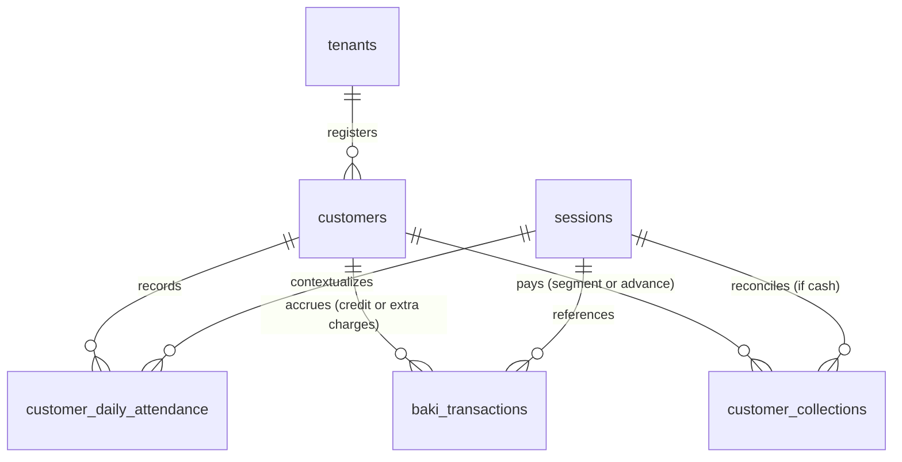
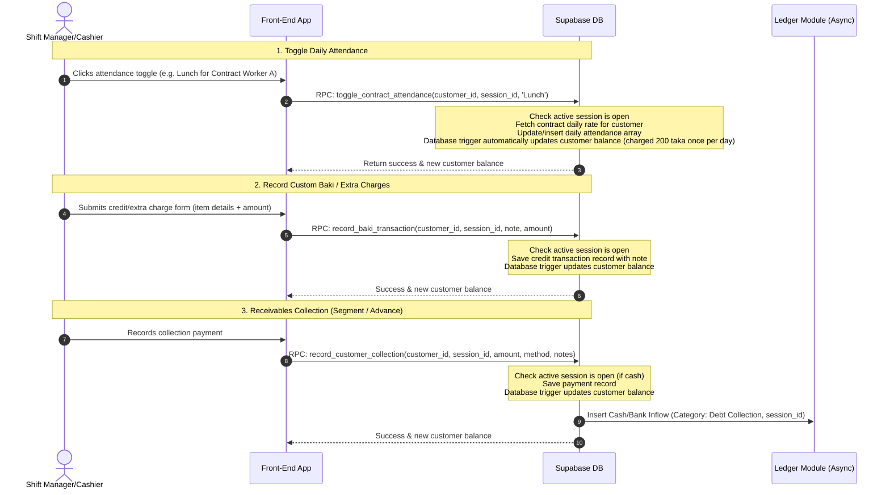

# Detailed Specification: Meal & Customer Management (`meal-management`)

This document provides a detailed specification for the **Meal & Customer Management** module. This module handles contract worker profiles, daily contract attendance, credit (baki) transactions, customer collections (debt payments/receivables), and automatic balance updates.

---

## 1. Feature Overview & Objectives

The **Meal & Customer Management** module is a decoupled, multi-tenant system. It manages individual and subscription-based customer relationships, tracks outstanding balances, and processes payments. It links operational transactions directly to the temporal contexts (**Operational Sessions**) defined in the `shift-sessions` module.

### Key Objectives:
*   **Customer Segmentation:** 
    *   `Contract Workers`: Subscription-style customers who are billed a fixed daily flat rate (e.g., 200 taka) if they attend *any* of their contracted shifts for the day.
    *   `Walk-in Baki`: Credit-only customers who consume food items on credit (baki). Every entry must record what they ate (itemized note) and what it cost.
*   **Daily Contract Attendance Toggling:** Shift managers can mark a contract worker present for a specific shift in a zero-latency grid. Toggling any shift "Present" checks if they attended any other shift that day. If not, it charges the daily rate once. If they did, it logs the shift attendance without extra charge.
*   **Segment and Advance Payments:** Customers can make collections payments in segments (partial debt clearing) or in advance (creating a negative running balance representing prepaid credit).
*   **Extra Charges Logging:** If a contract worker consumes extra food items outside their daily contract agreement, shift managers can record these extra charges with a note (e.g. "1 portion chicken curry") which is appended to their credit balance.
*   **Cached running outstanding balance:** A cached running balance `outstanding_balance` is maintained on the customer's profile, updated automatically in real-time by database triggers.
*   **Double-Entry Financial Registry Integration:** Automatically create a matching inflow record in the unified ledger (`transaction_ledger`) whenever a collection payment is processed.
*   **Retroactive Tamper Isolation:** Prevent updates to attendance logs, credit sales, or collection receipts once the associated operational session has been closed.

---

## 2. User Stories

### Persona A: Canteen Owner (Admin/Owner Role)
1.  **As a** Canteen Owner,  
    **I want to** register customer profiles, assign them to a category (Contract Worker or Walk-in Baki), and configure custom daily rates and shift restrictions for contract workers,  
    **So that** subscription pricing is automated correctly based on contract terms.
2.  **As a** Canteen Owner,  
    **I want to** see at any moment what each customer owes (or their prepaid balance if they paid in advance),  
    **So that** I have a real-time overview of canteen receivables.
3.  **As a** Canteen Owner,  
    **I want to** generate detailed statement history for a customer showing daily attendance charges, itemized credit transactions, and cash collections over any date range,  
    **So that** I can present transparent billing statements.
4.  **As a** Canteen Owner,  
    **I want to** ensure all historical collections and meal consumption logs are locked when a shift session is finalized,  
    **So that** operators cannot retroactively delete logs or hide cash receipts.

### Persona B: Shift Manager / Cashier (Member Role)
1.  **As a** Shift Manager,  
    **I want to** see a grid layout of active contract workers sorted alphabetically or by factory unit,  
    **So that** I can toggle their attendance (Breakfast/Lunch/Dinner) with a single tap during service times.
2.  **As a** Shift Manager,  
    **I want to** log a walk-in credit transaction (Baki) or an extra charge for a contract worker by entering a note of what they ate and the price,  
    **So that** their outstanding balance is immediately updated.
3.  **As a** Shift Manager,  
    **I want to** record a debt payment (Collection) when a customer pays cash (either a segment payment or advance),  
    **So that** the cash is accounted for in my active drawer balance and their debt is reduced.

---

## 3. Data Model

All customer records, attendance, and transactions are isolated by tenant using a `tenant_id` column protected by Row-Level Security (RLS).



### Table Definitions

#### 1. `customers` (Customer Profiles)
Contains identity, classifications, and running financial balances.

| Column Name | Type | Constraints | Description |
| :--- | :--- | :--- | :--- |
| `id` | `uuid` | Primary Key, `default gen_random_uuid()` | Unique customer profile identifier. |
| `tenant_id` | `uuid` | Foreign Key -> `tenants.id`, `not null` | Scopes this profile to a tenant. |
| `full_name` | `text` | `not null` | Name of the customer or factory unit contact. |
| `category` | `text` | `not null`, `check (category in ('contract_worker', 'walk_in_baki'))` | Classification for billing behaviors. |
| `phone` | `text` | Nullable | Contact number for updates or collection reminders. |
| `outstanding_balance` | `numeric(12, 2)` | `not null`, `default 0.00` | Running balance (`total_debts - total_payments`). Negative indicates advance payment (prepaid). |
| `contract_daily_rate` | `numeric(12, 2)` | Nullable, `check (contract_daily_rate >= 0)` | Flat rate charged daily for contract workers. Null for walk-in baki. |
| `contract_shifts` | `text[]` | Nullable | Array of shifts allowed under the contract (e.g. `{'Lunch', 'Dinner'}`). |
| `is_active` | `boolean` | `default true`, `not null` | Soft-disable flag. |
| `created_at` | `timestamptz` | `default now()`, `not null` | Audit tracking. |
| `updated_at` | `timestamptz` | `default now()`, `not null` | Audit tracking. |

#### 2. `customer_daily_attendance` (Daily Contract Attendance Logs)
Daily record of contract workers' shift presence. Ensures a flat daily rate is charged once per day.

| Column Name | Type | Constraints | Description |
| :--- | :--- | :--- | :--- |
| `id` | `uuid` | Primary Key, `default gen_random_uuid()` | Unique log identifier. |
| `tenant_id` | `uuid` | Foreign Key -> `tenants.id`, `not null` | Scopes log to a tenant. |
| `customer_id` | `uuid` | Foreign Key -> `customers.id`, `not null` | Customer who consumed the meal. |
| `session_id` | `uuid` | Foreign Key -> `sessions.id`, `not null` | Active operational session context when logged. |
| `business_date` | `date` | `not null` | Date of attendance. |
| `attended_shifts` | `text[]` | `not null` | Array of shifts attended on this day (e.g. `{'Lunch'}`). |
| `rate_applied` | `numeric(12, 2)` | `not null`, `check (rate_applied >= 0)` | The flat daily contract rate applied at insertion. |
| `created_at` | `timestamptz` | `default now()`, `not null` | Audit tracking. |
| `updated_at` | `timestamptz` | `default now()`, `not null` | Audit tracking. |

#### 3. `baki_transactions` (Itemized Credit & Extra Charges)
Records custom credit transactions for walk-in baki customers, and extra charges (above daily contract rates) for contract workers.

| Column Name | Type | Constraints | Description |
| :--- | :--- | :--- | :--- |
| `id` | `uuid` | Primary Key, `default gen_random_uuid()` | Unique credit transaction identifier. |
| `tenant_id` | `uuid` | Foreign Key -> `tenants.id`, `not null` | Scopes this ledger record to a tenant. |
| `customer_id` | `uuid` | Foreign Key -> `customers.id`, `not null` | Customer receiving credit or extra charge. |
| `session_id` | `uuid` | Foreign Key -> `sessions.id`, `not null` | Operational session context. |
| `business_date` | `date` | `not null` | Date of credit. |
| `items_description` | `text` | `not null` | Details of items consumed (e.g., "Special Beef Curry + 3 Parathas" or "Extra Chicken Curry"). |
| `amount` | `numeric(12, 2)` | `not null`, `check (amount > 0)` | Amount of credit/charge extended. |
| `created_at` | `timestamptz` | `default now()`, `not null` | Audit tracking. |
| `updated_at` | `timestamptz` | `default now()`, `not null` | Audit tracking. |

#### 4. `customer_collections` (Receivables Receipts - Segment / Advance Payments)
Logs collections/payments received from customers to clear outstanding debts or add advance credit.

| Column Name | Type | Constraints | Description |
| :--- | :--- | :--- | :--- |
| `id` | `uuid` | Primary Key, `default gen_random_uuid()` | Unique payment collection identifier. |
| `tenant_id` | `uuid` | Foreign Key -> `tenants.id`, `not null` | Scopes this collection to a tenant. |
| `customer_id` | `uuid` | Foreign Key -> `customers.id`, `not null` | Customer making the payment. |
| `session_id` | `uuid` | Foreign Key -> `sessions.id` | Nullable. Operational session ID if collected in cash. |
| `amount` | `numeric(12, 2)` | `not null`, `check (amount > 0)` | Amount paid (fully, partially in segments, or in advance). |
| `payment_method` | `text` | `not null`, `check (payment_method in ('cash', 'mobile_wallet', 'bank_transfer'))` | Mode of payment. |
| `collected_by` | `uuid` | Foreign Key -> `auth.users`, `not null` | Employee profile who accepted payment. |
| `collected_at` | `timestamptz` | `default now()`, `not null` | Timestamp of payment receipt. |
| `notes` | `text` | Nullable | Receipt numbers, transaction IDs, or comments. |
| `created_at` | `timestamptz` | `default now()`, `not null` | Audit tracking. |

### Constraints & Indexes

1.  **Unique Daily Attendance Log:** Ensure there is only one daily attendance record per customer on any given date.
    ```sql
    create unique index unique_customer_attendance_per_date 
    on public.customer_daily_attendance (tenant_id, customer_id, business_date);
    ```
2.  **Performance Indexes:**
    ```sql
    create index idx_customers_tenant_id on public.customers(tenant_id);
    create index idx_cust_attendance_session on public.customer_daily_attendance(session_id);
    create index idx_cust_attendance_customer on public.customer_daily_attendance(customer_id);
    create index idx_cust_attendance_date on public.customer_daily_attendance(business_date);
    create index idx_baki_transactions_session on public.baki_transactions(session_id);
    create index idx_baki_transactions_customer on public.baki_transactions(customer_id);
    create index idx_customer_collections_session on public.customer_collections(session_id);
    create index idx_customer_collections_customer on public.customer_collections(customer_id);
    ```

---

## 4. Permission Control & Row-Level Security (RLS)

Tables enforce access isolation using the tenant parameter checking dynamic permissions under `tenant_roles.permissions`.

### Dynamic Permission Schema

The JSONB configuration under `tenant_roles.permissions` for the **Meal & Customer Management** module is structured as follows:

```json
{
  "modules": {
    "meal_management": {
      "customer_read": true,
      "customer_write": false,
      "attendance_read": true,
      "attendance_write": true,
      "baki_read": true,
      "baki_write": true,
      "collections_read": true,
      "collections_write": true
    }
  }
}
```

### Default Role Mapping Matrix

| Operations | Cashier / Operator (Default Member) | Shift Manager (Default Admin) | Owner (Default Immutable) | Platform Superadmin |
| :--- | :--- | :--- | :--- | :--- |
| **Customer Directory (Read)** | `customer_read` = `true` | `customer_read` = `true` | Yes (All) | Yes (Bypass RLS) |
| **Customer Directory (Write)**| `customer_write` = `false` | `customer_write` = `true` | Yes (All) | Yes (Bypass RLS) |
| **Attendance Toggling (Read/Write)**| `attendance_read` = `true`<br/>`attendance_write` = `true` | `attendance_read` = `true`<br/>`attendance_write` = `true` | Yes (All) | Yes (Bypass RLS) |
| **Baki / Extra Charges (Read/Write)**| `baki_read` = `true`<br/>`baki_write` = `true` | `baki_read` = `true`<br/>`baki_write` = `true` | Yes (All) | Yes (Bypass RLS) |
| **Collections (Read)** | `collections_read` = `true` | `collections_read` = `true` | Yes (All) | Yes (Bypass RLS) |
| **Collections (Write/Log)** | `collections_write` = `true` | `collections_write` = `true` | Yes (All) | Yes (Bypass RLS) |

### Core RLS Policies (SQL Implementation)

```sql
-- Enable Row-Level Security
alter table public.customers enable row level security;
alter table public.customer_daily_attendance enable row level security;
alter table public.baki_transactions enable row level security;
alter table public.customer_collections enable row level security;

-- Policies for Customers
create policy "Users can view customers in their tenant"
  on public.customers
  for select
  using (
    public.has_module_permission(tenant_id, 'meal_management', 'customer_read')
  );

create policy "Users can manage customers in their tenant"
  on public.customers
  for all
  using (
    public.has_module_permission(tenant_id, 'meal_management', 'customer_write')
  )
  with check (
    public.has_module_permission(tenant_id, 'meal_management', 'customer_write')
  );

-- Policies for Daily Attendance
create policy "Users can view daily attendance in their tenant"
  on public.customer_daily_attendance
  for select
  using (
    public.has_module_permission(tenant_id, 'meal_management', 'attendance_read')
  );

create policy "Users can manage daily attendance in their tenant"
  on public.customer_daily_attendance
  for all
  using (
    public.has_module_permission(tenant_id, 'meal_management', 'attendance_write')
  )
  with check (
    public.has_module_permission(tenant_id, 'meal_management', 'attendance_write')
  );

-- Policies for Baki Transactions
create policy "Users can view baki logs in their tenant"
  on public.baki_transactions
  for select
  using (
    public.has_module_permission(tenant_id, 'meal_management', 'baki_read')
  );

create policy "Users can write baki logs in their tenant"
  on public.baki_transactions
  for all
  using (
    public.has_module_permission(tenant_id, 'meal_management', 'baki_write')
  )
  with check (
    public.has_module_permission(tenant_id, 'meal_management', 'baki_write')
  );

-- Policies for Collections
create policy "Users can view collections in their tenant"
  on public.customer_collections
  for select
  using (
    public.has_module_permission(tenant_id, 'meal_management', 'collections_read')
  );

create policy "Users can write collections in their tenant"
  on public.customer_collections
  for insert
  with check (
    public.has_module_permission(tenant_id, 'meal_management', 'collections_write')
  );
```

---

## 5. API Flow & Lifecycle Operations



### Database RPC Functions

#### 1. Toggle Daily Attendance: `toggle_contract_attendance`
Registers or toggles attendance for a contract worker. Applying a flat daily rate once per day.

```sql
create or replace function public.toggle_contract_attendance(
  p_tenant_id uuid,
  p_customer_id uuid,
  p_session_id uuid,
  p_shift_name text
)
returns table (
  action_taken text,
  new_balance numeric
)
security definer
language plpgsql
as $$
declare
  v_session_status text;
  v_business_date date;
  v_daily_rate numeric;
  v_attended_shifts text[];
  v_action text;
  v_updated_balance numeric;
begin
  -- 1. Verify active session context is open
  select status, business_date into v_session_status, v_business_date
  from public.sessions
  where id = p_session_id and tenant_id = p_tenant_id;

  if v_session_status is null then
    raise exception 'Session does not exist.';
  elsif v_session_status = 'closed' then
    raise exception 'Cannot edit attendance. Operational session is closed.';
  end if;

  -- 2. Fetch customer daily rate contract details
  select contract_daily_rate into v_daily_rate
  from public.customers
  where id = p_customer_id and tenant_id = p_tenant_id and category = 'contract_worker';

  if v_daily_rate is null then
    raise exception 'Customer is not registered as a contract worker or has no daily rate configured.';
  end if;

  -- 3. Fetch current attended shifts for the date
  select attended_shifts into v_attended_shifts
  from public.customer_daily_attendance
  where tenant_id = p_tenant_id and customer_id = p_customer_id and business_date = v_business_date;

  if v_attended_shifts is null then
    -- Attendance doesn't exist for the day yet. Insert new record and apply the daily rate charge.
    insert into public.customer_daily_attendance (
      tenant_id,
      customer_id,
      session_id,
      business_date,
      attended_shifts,
      rate_applied,
      updated_at
    )
    values (
      p_tenant_id,
      p_customer_id,
      p_session_id,
      v_business_date,
      array[p_shift_name],
      v_daily_rate,
      now()
    );
    v_action := 'added_first_present';
  else
    -- Attendance exists for the day. Check if the shift name is already in the array.
    if p_shift_name = any(v_attended_shifts) then
      -- Toggle OFF: Remove shift from array
      v_attended_shifts := array_remove(v_attended_shifts, p_shift_name);
      
      if cardinality(v_attended_shifts) = 0 then
        -- No shifts attended anymore. Delete daily record (refunds rate_applied via balance trigger).
        delete from public.customer_daily_attendance
        where tenant_id = p_tenant_id and customer_id = p_customer_id and business_date = v_business_date;
        v_action := 'removed_last_present';
      else
        -- Still has other shifts. Update record, rate_applied remains the same.
        update public.customer_daily_attendance
        set attended_shifts = v_attended_shifts,
            updated_at = now()
        where tenant_id = p_tenant_id and customer_id = p_customer_id and business_date = v_business_date;
        v_action := 'removed_shift';
      end if;
    else
      -- Toggle ON: Add shift to array. Daily rate remains the same.
      v_attended_shifts := array_append(v_attended_shifts, p_shift_name);
      
      update public.customer_daily_attendance
      set attended_shifts = v_attended_shifts,
          updated_at = now()
      where tenant_id = p_tenant_id and customer_id = p_customer_id and business_date = v_business_date;
      v_action := 'added_shift';
    end if;
  end if;

  -- 4. Get updated balance (automatically calculated via triggers)
  select outstanding_balance into v_updated_balance
  from public.customers
  where id = p_customer_id;

  return query select v_action, v_updated_balance;
end;
$$;
```

#### 2. Record Baki (Credit / Extra Charges): `record_baki_transaction`
Registers credit items (description and cost) consumed by walk-ins, or extra items consumed by contract workers.

```sql
create or replace function public.record_baki_transaction(
  p_tenant_id uuid,
  p_customer_id uuid,
  p_session_id uuid,
  p_items_description text,
  p_amount numeric
)
returns numeric
security definer
language plpgsql
as $$
declare
  v_session_status text;
  v_business_date date;
  v_updated_balance numeric;
begin
  -- 1. Check session status
  select status, business_date into v_session_status, v_business_date
  from public.sessions
  where id = p_session_id and tenant_id = p_tenant_id;

  if v_session_status is null then
    raise exception 'Session does not exist.';
  elsif v_session_status = 'closed' then
    raise exception 'Cannot record credit. Operational session is closed.';
  end if;

  -- 2. Insert transaction
  insert into public.baki_transactions (
    tenant_id,
    customer_id,
    session_id,
    business_date,
    items_description,
    amount
  )
  values (
    p_tenant_id,
    p_customer_id,
    p_session_id,
    v_business_date,
    p_items_description,
    p_amount
  );

  -- Fetch updated balance
  select outstanding_balance into v_updated_balance
  from public.customers
  where id = p_customer_id;

  return v_updated_balance;
end;
$$;
```

#### 3. Record Receivables Collection: `record_customer_collection`
Registers segment debt clearings or advance prepayments.

```sql
create or replace function public.record_customer_collection(
  p_tenant_id uuid,
  p_customer_id uuid,
  p_session_id uuid, -- Nullable if not cash
  p_amount numeric,
  p_payment_method text,
  p_notes text default null
)
returns numeric
security definer
language plpgsql
as $$
declare
  v_session_status text;
  v_updated_balance numeric;
begin
  -- 1. Check operational session if paid in cash
  if p_payment_method = 'cash' then
    if p_session_id is null then
      raise exception 'Session ID is required for cash collections.';
    end if;

    select status into v_session_status
    from public.sessions
    where id = p_session_id and tenant_id = p_tenant_id;

    if v_session_status is null then
      raise exception 'Session not found.';
    elsif v_session_status = 'closed' then
      raise exception 'Cannot collect cash during a closed operational session.';
    end if;
  end if;

  -- 2. Log collection record
  insert into public.customer_collections (
    tenant_id,
    customer_id,
    session_id,
    amount,
    payment_method,
    collected_by,
    collected_at,
    notes
  )
  values (
    p_tenant_id,
    p_customer_id,
    p_session_id,
    p_amount,
    p_payment_method,
    auth.uid(),
    now(),
    p_notes
  );

  -- Fetch updated balance
  select outstanding_balance into v_updated_balance
  from public.customers
  where id = p_customer_id;

  return v_updated_balance;
end;
$$;
```

---

## 6. Ledger Constraints & Automation Triggers

### 1. Closed Operational Session Lock Trigger
Prevents retroactive changes to shift registries once a session is finalized.

```sql
create trigger check_customer_daily_attendance_lock
before insert or update or delete
on public.customer_daily_attendance
for each row
execute function public.enforce_closed_session_lock();

create trigger check_baki_transactions_lock
before insert or update or delete
on public.baki_transactions
for each row
execute function public.enforce_closed_session_lock();

-- customer_collections uses custom lock validator to accommodate bank collections lacking session IDs
create or replace function public.enforce_collection_session_lock()
returns trigger as $$
declare
  v_session_status text;
begin
  if NEW.session_id is not null then
    select status into v_session_status 
    from public.sessions 
    where id = NEW.session_id;

    if v_session_status = 'closed' then
      raise exception 'Collection locked. Associated session % is closed.', NEW.session_id;
    end if;
  end if;
  return NEW;
end;
$$ language plpgsql;

create trigger check_customer_collections_lock
before insert or update or delete
on public.customer_collections
for each row
execute function public.enforce_collection_session_lock();
```

### 2. Outstanding Balance Auto-Calculation Trigger
Maintains customer `outstanding_balance` in real-time.

```sql
create or replace function public.sync_customer_outstanding_balance()
returns trigger as $$
declare
  v_diff numeric := 0.00;
  v_customer_id uuid;
begin
  -- Resolve entity context
  if TG_OP = 'INSERT' then
    v_customer_id := NEW.customer_id;
    if TG_TABLE_NAME = 'customer_daily_attendance' then
      v_diff := NEW.rate_applied;
    elsif TG_TABLE_NAME = 'baki_transactions' then
      v_diff := NEW.amount;
    elsif TG_TABLE_NAME = 'customer_collections' then
      v_diff := -NEW.amount; -- Collections reduce balance
    end if;
  
  elsif TG_OP = 'UPDATE' then
    v_customer_id := NEW.customer_id;
    if TG_TABLE_NAME = 'customer_daily_attendance' then
      v_diff := NEW.rate_applied - OLD.rate_applied;
    elsif TG_TABLE_NAME = 'baki_transactions' then
      v_diff := NEW.amount - OLD.amount;
    elsif TG_TABLE_NAME = 'customer_collections' then
      v_diff := OLD.amount - NEW.amount; -- If new payment amount is larger, balance reduces more
    end if;

  elsif TG_OP = 'DELETE' then
    v_customer_id := OLD.customer_id;
    if TG_TABLE_NAME = 'customer_daily_attendance' then
      v_diff := -OLD.rate_applied; -- Deleting attendance refunds daily rate
    elsif TG_TABLE_NAME = 'baki_transactions' then
      v_diff := -OLD.amount;
    elsif TG_TABLE_NAME = 'customer_collections' then
      v_diff := OLD.amount; -- Deleting payment restores outstanding balance
    end if;
  end if;

  -- Apply incremental balance adjust
  update public.customers
  set outstanding_balance = outstanding_balance + v_diff,
      updated_at = now()
  where id = v_customer_id;

  return null;
end;
$$ language plpgsql;

-- Attach balance update triggers
create trigger sync_balance_daily_attendance
after insert or update or delete
on public.customer_daily_attendance
for each row
execute function public.sync_customer_outstanding_balance();

create trigger sync_balance_baki
after insert or update or delete
on public.baki_transactions
for each row
execute function public.sync_customer_outstanding_balance();

create trigger sync_balance_collections
after insert or update or delete
on public.customer_collections
for each row
execute function public.sync_customer_outstanding_balance();
```

### 3. Transaction Ledger Auto-Reporting Inflow Trigger
Automates recording collections payments into the cash ledger.

```sql
create or replace function public.handle_customer_financial_inflow()
returns trigger as $$
declare
  v_operator_id uuid;
  v_category text;
  v_payment_method text;
  v_desc text;
begin
  v_operator_id := NEW.collected_by;
  v_category := 'Debt Collection';
  v_payment_method := NEW.payment_method;
  v_desc := 'Customer Collection Received - Customer ID: ' || NEW.customer_id;

  -- Insert entry into unified ledger
  insert into public.transaction_ledger (
    tenant_id,
    session_id,
    type,
    category,
    amount,
    payment_method,
    operator_id,
    notes,
    created_at
  )
  values (
    NEW.tenant_id,
    NEW.session_id,
    'inflow',
    v_category,
    NEW.amount,
    v_payment_method,
    v_operator_id,
    v_desc,
    now()
  );

  return NEW;
end;
$$ language plpgsql;

-- Attach financial reporting trigger
create trigger report_customer_collection_inflow
after insert
on public.customer_collections
for each row
execute function public.handle_customer_financial_inflow();
```
