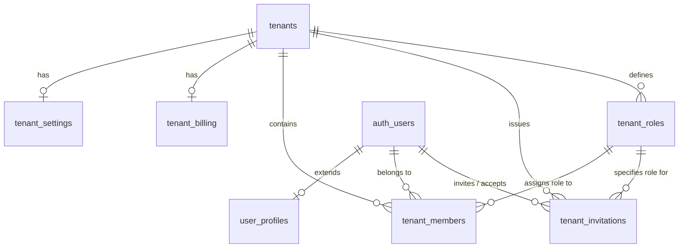

# Multi-Tenant Architecture Specifications

This document outlines the architecture, database models, user flows, and API surface for the multi-tenant SaaS boilerplate built on **Supabase** and **Quasar**.

---

## 1. Conceptual Data Model

The database uses a single-database design. Tenant separation is achieved through Row-Level Security (RLS) policies on tenant-specific tables using a `tenant_id` column.



### Table Definitions

#### 1. `tenants`
*   `id` (UUID, Primary Key): Unique tenant identifier.
*   `name` (Text): Display name of the tenant organization.
*   `slug` (Text, Unique): URL-friendly routing slug (e.g., `acme-corp`).
*   `parent_id` (UUID, Nullable, Foreign Key -> `tenants.id`): For optional future hierarchy.
*   `status` (Text): Administrative state (`active`, `suspended`, `pending_onboarding`).
*   `created_at` / `updated_at` (Timestamp)

#### 2. `tenant_settings`
*   `tenant_id` (UUID, Primary Key, Foreign Key -> `tenants.id`): 1:1 mapping.
*   `logo_url` (Text, Nullable): URL to company branding logo.
*   `theme_color` (Text, Nullable): UI theme settings.
*   `enabled_features` (JSONB): Dynamic feature flags mapped by code-defined slugs.
    ```json
    {
      "crm": true,
      "invoicing": false,
      "chat": true
    }
    ```
*   `preferences` (JSONB): Tenant-wide business settings.
    ```json
    {
      "localization": {
        "timezone": "UTC",
        "currency": "USD",
        "date_format": "YYYY-MM-DD"
      },
      "security": {
        "mfa_required": false,
        "allowed_email_domains": []
      }
    }
    ```

#### 3. `tenant_roles`
*   `id` (UUID, Primary Key): Unique role identifier.
*   `tenant_id` (UUID, Nullable, Foreign Key -> `tenants.id`): NULL for system-wide defaults (Owner, Admin, Member); populated for custom tenant roles.
*   `name` (Text): Display name of the role (e.g., `Invoicing Agent`).
*   `description` (Text): Summary of role permissions.
*   `permissions` (JSONB): Map of features to permitted actions.
    ```json
    {
      "modules": {
        "projects": { "create": true, "read": true, "update": true, "delete": false }
      }
    }
    ```
*   `is_system_role` (Boolean): Protected status flag.

#### 4. `user_profiles`
*   `id` (UUID, Primary Key, Foreign Key -> `auth.users`): Corresponds to Supabase authentication identity.
*   `full_name` (Text): Display name.
*   `avatar_url` (Text, Nullable)
*   `preferences` (JSONB): User-specific app settings.
    ```json
    {
      "ui": {
        "theme": "dark",
        "sidebar_collapsed": false
      },
      "notifications": {
        "email": true,
        "push": false
      }
    }
    ```

#### 5. `tenant_members`
*   `id` (UUID, Primary Key): Member map index.
*   `tenant_id` (UUID, Foreign Key -> `tenants.id`)
*   `user_id` (UUID, Foreign Key -> `auth.users`)
*   `role_id` (UUID, Foreign Key -> `tenant_roles.id`)
*   `status` (Text): Account standing inside this specific tenant (`active`, `suspended`).
*   `joined_at` (Timestamp)

#### 6. `tenant_invitations`
*   `id` (UUID, Primary Key)
*   `tenant_id` (UUID, Foreign Key -> `tenants.id`)
*   `email` (Text): Email of invitee.
*   `role_id` (UUID, Foreign Key -> `tenant_roles.id`): Target role.
*   `token` (Text, Unique): Verification token.
*   `invited_by` (UUID, Foreign Key -> `auth.users`)
*   `expires_at` (Timestamp)
*   `status` (Text): `pending`, `accepted`, `expired`, `revoked`.

#### 7. `tenant_billing`
*   `tenant_id` (UUID, Primary Key, Foreign Key -> `tenants.id`)
*   `stripe_customer_id` (Text)
*   `stripe_subscription_id` (Text)
*   `subscription_tier` (Text): Tier catalog (e.g., `free`, `pro`, `enterprise`).
*   `status` (Text): Payment state (`active`, `past_due`, `canceled`).
*   `current_period_end` (Timestamp)

---

## 2. Core User Flows

### Flow A: Authentication & Access
```
[User Login] ──► [Select Authentication Method]
                       ├── Email & Password
                       ├── OAuth (Google, GitHub)
                       └── Phone OTP
                                │
                                ▼
                       [Validate Profile]
                                │
                                ▼
                   [Retrieve Tenant Memberships]
                                │
                                ▼
                 [Switch to Last Active Tenant]
```

1.  **Login**: User logs in using Email/Password, OAuth, or Phone OTP.
2.  **Verify Profile**: System retrieves the user's `user_profiles` row to load user preferences.
3.  **Resolve Tenants**: System queries `tenant_members` to resolve all tenants this user belongs to.
4.  **Auto-Select**: System automatically routes user to their default or last-active tenant workspace.

---

### Flow B: Onboarding & Tenant Creation
```
[Authorized User] ──► [Onboarding Form] ──► [Create Tenant & Base Settings]
                                                    │
                                                    ▼
                                            [Assign Owner Role]
                                                    │
                                                    ▼
                                          [Generate Workspace]
```

1.  **Register/Login**: User completes authenticated sign-up.
2.  **Organization Details**: User fills out organization name and customized slug.
3.  **DB Actions**:
    *   Creates a new row in `tenants`.
    *   Creates a corresponding record in `tenant_settings` with default preferences and features.
    *   Creates a system default `Owner` role mapping in `tenant_members` for the creator.
    *   Creates a billing mapping profile in `tenant_billing`.
4.  **Route Workspace**: Frontend routes the user into the active dashboard of the newly created tenant.

---

### Flow C: Inviting Members
```
[Tenant Admin] ──► [Invite Form] ──► [Create Invitation Token]
                                                 │
                                                 ▼
                                     [Send Email to Recipient]
                                                 │
                                                 ▼
                                      [User Clicks Email Link]
                                                 │
                                                 ▼
                                      [Join Organization]
```

1.  **Trigger Invite**: Tenant Admin enters invitee email and assigns a Role.
2.  **Generate Token**: System creates a pending row in `tenant_invitations` with a secure token.
3.  **Deliver**: Email service sends a verification link containing the token to the recipient.
4.  **Acceptance**:
    *   If user does not have an account: Recipient signs up, then invitation is processed.
    *   If user has an account: Recipient logs in.
    *   Invitation status updates to `accepted`.
    *   New row is added to `tenant_members` mapping the user to the tenant with the selected role.

---

### Flow D: Tenant Switching
1.  **Click Selector**: User clicks the organization switcher dropdown in the Quasar top header.
2.  **Select Target**: User selects another tenant from their membership list.
3.  **Reload Context**:
    *   App updates active tenant state.
    *   App loads new tenant settings (logo, color, locale, enabled features).
    *   Vue Router updates navigation sidebar according to the dynamic `enabled_features` config.
    *   Supabase client queries use RLS policies matching the new `tenant_id`.

---

## 3. Conceptual API Surface

These represent the core API functions exposed by the boilerplate’s services (e.g., Supabase database queries and client calls).

### 1. Authentication Services
*   **`signUpWithEmail(email, password)`**: Registers a new user.
*   **`signInWithEmail(email, password)`**: Logs in with email/password.
*   **`signInWithOAuth(provider)`**: Triggers OAuth redirect flow.
*   **`sendPhoneOtp(phone)`**: Sends validation SMS.
*   **`verifyPhoneOtp(phone, token)`**: Verifies SMS passcode to authenticate user.

### 2. Tenant Management Services
*   **`createTenant(name, slug)`**: Initializes a tenant, configuration profile, settings, and billing placeholder.
*   **`getUserTenants(userId)`**: Retrieves a list of all tenants the authenticated user belongs to.
*   **`getTenantSettings(tenantId)`**: Fetches theme customization, localization details, and enabled feature flags.
*   **`updateTenantSettings(tenantId, settings)`**: Updates settings and preferences JSON object.

### 3. Roles & Permissions Services
*   **`getTenantRoles(tenantId)`**: Retrieves custom roles and system roles defined for the tenant.
*   **`createTenantRole(tenantId, roleName, permissions)`**: Configures a new custom role with custom module permission mappings.
*   **`assignMemberRole(memberId, roleId)`**: Updates a user's role mapping inside the tenant.

### 4. Membership & Invitation Services
*   **`inviteUser(tenantId, email, roleId)`**: Inserts a pending invitation record and triggers delivery.
*   **`acceptInvitation(token)`**: Validates token and creates a `tenant_members` record.
*   **`getTenantMembers(tenantId)`**: Lists members active within the selected tenant.
*   **`removeMember(tenantId, userId)`**: Revokes user access to the tenant workspace.
