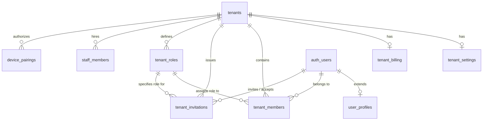

# Multi-Tenant Architecture Specifications

This document outlines the architecture, database models, user flows, and API surface for the multi-tenant SaaS boilerplate built on **Supabase** and **Quasar**.

---

## 1. System Roles Hierarchy: Platform vs. Tenant Level

To support enterprise administration, billing control, and provisioning, the system divides users into two distinct scopes: **Platform-Level (Superadmins)** and **Tenant-Level (Owners/Members)**.

```
                  ┌─────────────────────────────────────────┐
                  │          Platform Superadmin            │
                  │  (Manage Tenants, Billing & Features)   │
                  └───────────────────┬─────────────────────┘
                                      │
                                      ▼
                  ┌─────────────────────────────────────────┐
                  │              Tenant Owner               │
                  │  (Manage Organization Team & Settings)  │
                  └───────────────────┬─────────────────────┘
                                      │
                                      ▼
                  ┌─────────────────────────────────────────┐
                  │             Tenant Member               │
                  │       (Access Scoped Feature Data)      │
                  └───────────────────┬─────────────────────┘
                                      │
                                      ▼
                  ┌─────────────────────────────────────────┐
                  │             Counter Staff               │
                  │   (PIN-only Auth on Paired Terminals)   │
                  └─────────────────────────────────────────┘
```

### 1. Platform-Level Scope (Superadmin)
*   **Role**: `user_profiles.is_superadmin = true`.
*   **Permissions**: 
    *   Bypass Row-Level Security (RLS) policies to view all tenants, members, and data logs.
    *   Manually provision/create new tenants.
    *   Assign the initial **Tenant Owner** to a tenant.
    *   Toggle **Feature Slugs** (active modules) and subscription plans for any tenant.
    *   Create nested/child tenants (linking `parent_id` hierarchies).
    *   Access the central administration dashboard (`/admin`).

### 2. Tenant-Level Scope (Owner, Admin, Member)
*   **Role**: Set on the `tenant_members` mapping table.
*   **Permissions**:
    *   **Tenant Owner**: Full control *only* within their organization scope. Can invite users, configure internal visual settings, switch subscription plans (within limits allowed by the superadmin), and manage team roles.
    *   **Tenant Admin/Member**: Access features, edit project/module data, and view settings as permitted by their custom assigned `tenant_roles` permissions.
    *   **Counter Staff**: PIN-only operators who do not have platform (email) accounts. They operate on paired terminal devices and log POS items, attendance meals, or cash advances.

---

## 2. Conceptual Data Model

The database uses a single-database design. Tenant separation is achieved through Row-Level Security (RLS) policies on tenant-specific tables using a `tenant_id` column.



### Table Definitions

#### 1. `tenants`
*   `id` (UUID, Primary Key): Unique tenant identifier.
*   `name` (Text): Display name of the tenant organization.
*   `slug` (Text, Unique): URL-friendly routing slug (e.g., `acme-corp`).
*   `parent_id` (UUID, Nullable, Foreign Key -> `tenants.id`): Points to parent tenant to construct hierarchies (e.g., corporate headquarters and local branches).
*   `status` (Text): Administrative state (`active`, `suspended`, `pending_onboarding`).
*   `created_at` / `updated_at` (Timestamp)

#### 2. `tenant_settings`
*   `tenant_id` (UUID, Primary Key, Foreign Key -> `tenants.id`): 1:1 mapping.
*   `logo_url` (Text, Nullable): URL to company branding logo.
*   `theme_color` (Text, Nullable): UI theme settings.
*   `enabled_features` (JSONB): Dynamic feature flags mapped by code-defined slugs. Editable *only* by Platform Superadmins.
    ```json
    {
      "crm": true,
      "invoicing": false,
      "chat": true
    }
    ```
*   `preferences` (JSONB): Tenant-wide business settings. Editable by Tenant Owners.
    ```json
    {
      "localization": {
        "timezone": "Asia/Dhaka",
        "currency": "BDT",
        "language": "bn",
        "date_format": "DD/MM/YYYY"
      },
      "security": {
        "mfa_required": false,
        "allowed_email_domains": []
      }
    }
    ```

#### 3. `tenant_roles`
*   `id` (UUID, Primary Key): Unique role identifier.
*   `tenant_id` (UUID, Nullable, Foreign Key -> `tenants.id`): NULL for system-wide defaults (Owner, Admin, Member); populated for custom tenant roles.
*   `name` (Text): Display name of the role.
*   `description` (Text): Summary of role permissions.
*   `permissions` (JSONB): Map of features to permitted actions.
    ```json
    {
      "modules": {
        "projects": { "create": true, "read": true, "update": true, "delete": false }
      }
    }
    ```
*   `is_system_role` (Boolean): Protected status flag (e.g., `Owner` role is immutable).

#### 4. `user_profiles`
*   `id` (UUID, Primary Key, Foreign Key -> `auth.users`): Corresponds to Supabase authentication identity.
*   `full_name` (Text): Display name.
*   `avatar_url` (Text, Nullable)
*   `is_superadmin` (Boolean, Default `false`): System-wide flag granting access to administrative endpoints and bypassing tenant RLS scopes.
*   `preferences` (JSONB): User-specific app settings.
    ```json
    {
      "ui": {
        "theme": "dark",
        "sidebar_collapsed": false
      },
      "notifications": {
        "email": true,
        "push": false
      },
      "language": "bn"
    }
    ```

#### 5. `tenant_members`
*   `id` (UUID, Primary Key): Member map index.
*   `tenant_id` (UUID, Foreign Key -> `tenants.id`)
*   `user_id` (UUID, Foreign Key -> `auth.users`)
*   `role_id` (UUID, Foreign Key -> `tenant_roles.id`)
*   `status` (Text): Account standing inside this specific tenant (`active`, `suspended`).
*   `joined_at` (Timestamp)

#### 6. `tenant_invitations`
*   `id` (UUID, Primary Key)
*   `tenant_id` (UUID, Foreign Key -> `tenants.id`)
*   `email` (Text): Email of invitee.
*   `role_id` (UUID, Foreign Key -> `tenant_roles.id`): Target role.
*   `token` (Text, Unique): Verification token.
*   `invited_by` (UUID, Foreign Key -> `auth.users`)
*   `expires_at` (Timestamp)
*   `status` (Text): `pending`, `accepted`, `expired`, `revoked`.

#### 7. `tenant_billing`
*   `tenant_id` (UUID, Primary Key, Foreign Key -> `tenants.id`)
*   `stripe_customer_id` (Text)
*   `stripe_subscription_id` (Text)
*   `subscription_tier` (Text): Tier catalog (e.g., `free`, `pro`, `enterprise`).
*   `status` (Text): Payment state (`active`, `past_due`, `canceled`).
*   `current_period_end` (Timestamp)

#### 8. `staff_members`
*   `id` (UUID, Primary Key): Unique staff employee identifier.
*   `tenant_id` (UUID, Foreign Key -> `tenants.id`)
*   `full_name` (Text): Employee name.
*   `role` (Text): Employee duty (e.g. Cook, Server, Manager).
*   `phone` (Text): Mandatory, unique contact number within the tenant.
*   `is_active` (Boolean): Status flag.
*   `allow_terminal_login` (Boolean): Activates PIN logins on paired kiosks.
*   `hashed_pin` (Text, Nullable): Blowfish-hashed 4-digit PIN.
*   `temp_pin` (Text, Nullable): Masked temporary PIN displayed on Owner dashboards.

#### 9. `device_pairings`
*   `id` (UUID, Primary Key): Pairing session record index.
*   `tenant_id` (UUID, Foreign Key -> `tenants.id`)
*   `pairing_code` (Text, Unique): Short 6-digit random pairing passcode.
*   `device_name` (Text): Identifier (e.g., "Counter Tablet B").
*   `expires_at` (Timestamp): Expiry validation (+30 minutes limit).

---

## 3. Core User Flows

### Flow A: Superadmin Provisioning a Tenant & Assigning Tenant Owner
```
[Superadmin] ──► [Admin Portal] ──► [Fill Org Info, Feature Set, Select Owner]
                                                 │
                                                 ▼
                                     [Create Tenant Database Record]
                                                 │
                                                 ▼
                                     [Assign User as Tenant Owner]
```
1.  **Superadmin Input**: Superadmin logs into `/admin` and inputs the new company name, URL slug, enabled modules, subscription tier, and the email of the target **Tenant Owner**.
2.  **Verify/Create Owner Profile**: The system checks if a user profile exists for that email. If not, it creates a profile placeholder.
3.  **DB Provision Transaction**:
    *   Inserts row into `tenants`.
    *   Inserts settings row in `tenant_settings` enabling selected feature slugs.
    *   Binds user to the tenant in `tenant_members` using the system default `Owner` role.
4.  **Welcome Delivery**: The Tenant Owner receives an email notification with login/activation instructions.

---

### Flow B: Self-Service Tenant Creation (Optional SaaS Flow)
*If your system allows users to sign up and provision their organization automatically without admin intervention:*

1. **User Sign Up**: The guest user registers via the `/auth/signup` page, supplying their credentials and a desired **Workspace/Company Name**.
2. **Auto-Provisioning database function**: Upon successful registration, the client invokes a Supabase Remote Procedure Call (RPC) to atomically set up their tenant:

#### Database Function (SQL)
Create a Postgres function `provision_new_tenant` in your migrations or the SQL Editor:
```sql
create or replace function public.provision_new_tenant(
  p_tenant_name text,
  p_slug text
)
returns uuid
security definer
set search_path = public
language plpgsql
as $$
declare
  v_tenant_id uuid;
  v_owner_role_id uuid;
begin
  -- 1. Create the tenant
  insert into public.tenants (name, slug)
  values (p_tenant_name, p_slug)
  returning id into v_tenant_id;

  -- 2. Enable default features for new tenants
  insert into public.tenant_settings (tenant_id, enabled_features)
  values (
    v_tenant_id,
    '{"crm": true, "invoicing": true, "chat": true}'::jsonb
  );

  -- 3. Retrieve default system 'Owner' role ID
  select id into v_owner_role_id 
  from public.tenant_roles 
  where name = 'Owner' and tenant_id is null;

  -- 4. Map the authenticated user as the Tenant Owner
  insert into public.tenant_members (tenant_id, user_id, role_id)
  values (v_tenant_id, auth.uid(), v_owner_role_id);

  -- 5. Initialize active free-tier billing
  insert into public.tenant_billing (tenant_id, subscription_tier, status)
  values (v_tenant_id, 'free', 'active');

  return v_tenant_id;
end;
$$;
```

#### Frontend Client Integration
Invoke the RPC from your frontend registration action (e.g. `SignupPage.vue`):
```typescript
import { supabase } from '@/boot/supabase';

// 1. Sign up the user with email & password
const { data: authData, error: authError } = await supabase.auth.signUp({
  email: email.value,
  password: password.value,
  options: {
    data: { full_name: fullName.value }
  }
});

// 2. Call the provisioning function on success
if (authData.user && !authError) {
  const generatedSlug = companyName.value.toLowerCase().replace(/[^a-z0-9]+/g, '-');
  
  const { data: tenantId, error: provisionError } = await supabase.rpc(
    'provision_new_tenant', 
    {
      p_tenant_name: companyName.value,
      p_slug: generatedSlug
    }
  );

  if (!provisionError) {
    // Redirect user to their brand new workspace
    router.push(`/${generatedSlug}/dashboard`);
  }
}
```

---

### Flow C: Inviting Members (Within a Tenant)
1.  **Trigger Invite**: Tenant Owner/Admin enters invitee email and assigns a Role.
2.  **Generate Token**: System creates a pending row in `tenant_invitations`.
3.  **Deliver**: Email service sends a verification link containing the token to the recipient.
4.  **Acceptance**:
    *   Recipient logs in or signs up.
    *   Invitation status updates to `accepted`.
    *   New row is added to `tenant_members` mapping the user to the tenant with the selected role.

---

### Flow D: Tenant Switching
1.  **Click Selector**: User clicks the organization switcher dropdown in the Quasar top header.
2.  **Select Target**: User selects another tenant from their membership list.
3.  **Reload Context**:
    *   App updates active tenant state.
    *   App loads new tenant settings (logo, color, locale, enabled features).
    *   Vue Router updates navigation sidebar according to the dynamic `enabled_features` config.
    *   Supabase client queries use RLS policies matching the new `tenant_id`.

### Flow C: Kiosk Device Pairing
```
[Owner Dashboard (Web)] ──► [Generate 6-Digit Code] ──► [Displays code (e.g. 584921)]
                                                                     │
                                                                     ▼
[Counter Terminal (App)] ◄── [Enter Pairing Code] ◄───────── [Manual handover]
         │
         ▼
[Verify Pairing RPC] ──► [Generate Device Session Token] ──► [App locks to PIN Pad]
```
1.  **Request Code**: The Owner/Manager clicks "Pair Device" inside the workspace dashboard. The system calls `generate_pairing_code` which creates a 6-digit random code linked to the tenant (valid for 30 minutes).
2.  **Kiosk Input**: On a fresh app setup, the cashier clicks "Pair Device" and inputs this code.
3.  **Activation**: The app executes `verify_pairing_code`. On success, the backend cleans up the pairing code (single-use) and returns the tenant's details.
4.  **Lockdown**: The app stores the paired device credentials locally, locks its routing path to `/auth/counter-login`, and displays the branded PIN Pad screen.

### Flow D: Staff PIN Onboarding & Authentication
```
[Owner Dashboard] ──► [Create Staff Member] ──► [System generates Temp PIN (e.g. 4821)]
                                                                     │
                                                                     ▼
[PIN Pad Kiosk] ◄── [Enter Temp PIN & Prompt for Private PIN] ◄── [Manual Handover]
         │
         ▼
[Hash & Store Private PIN] ──► [Save in DB & Clear Temp PIN] ──► [Shift Session starts]
```
1.  **Create Member**: The Owner adds a new employee profile in the admin portal, supplying their name and unique phone number. If "Allow Counter Login" is toggled, a random temporary 4-digit PIN (e.g., `4821`) is generated and displayed.
2.  **First Login**: The staff member enters `4821` on the paired kiosk terminal PIN pad. The database recognizes that `temp_pin` is set.
3.  **PIN Registration**: The terminal prompts the user to enter their new private 4-digit PIN. The system calls `set_staff_pin` to encrypt this private PIN (blowfish hash) into `hashed_pin` and clear `temp_pin`.
4.  **Subsequent Logs**: The employee enters their private PIN on the pad. The terminal validates the PIN hash, signs the shift attendance/sale with the staff member's UUID, and grants session access.

---

## 4. UI Routing & Layout Architecture

To separate Superadmin controls from Tenant workspaces within a single codebase, the application utilizes Quasar's layout systems and Vue Router route guards.

```
src/
├── layouts/
│   ├── AuthLayout.vue         # Layout for login, sign-up, password reset pages
│   ├── WorkspaceLayout.vue    # Layout for tenant dashboards (sidebar, tenant switcher)
│   └── AdminLayout.vue        # Layout for platform administrators (global controls)
├── pages/
│   ├── auth/                  # Page components for login and sign-up
│   ├── workspace/             # Page components for workspace apps (CRM, Invoices, etc.)
│   └── admin/                 # Page components for the system dashboard
└── router/
    ├── guards.ts              # Contains logic to verify authentication and roles
    └── routes.ts              # Route configurations mapping paths to layouts
```

### Route Configurations
1.  **Auth Route Group (`/auth/*`)**
    *   **Layout**: `AuthLayout.vue`
    *   **Access**: Anonymous Users
    *   **Paths**: `/auth/login`, `/auth/signup`, `/auth/verify`, `/auth/pair-device`, `/auth/counter-login`
2.  **Superadmin Route Group (`/admin/*`)**
    *   **Layout**: `AdminLayout.vue`
    *   **Access**: Logged in users where `user_profiles.is_superadmin === true`
    *   **Paths**: `/admin/dashboard`, `/admin/tenants`, `/admin/billing`
3.  **Tenant Workspace Route Group (`/:tenantSlug/*`)**
    *   **Layout**: `WorkspaceLayout.vue`
    *   **Access**: Logged in users verified as a member of the requested `:tenantSlug`
    *   **Paths**: `/:tenantSlug/dashboard`, `/:tenantSlug/projects`, `/:tenantSlug/settings`, `/:tenantSlug/counter/dashboard`

### Security Guard Workflow
*   **Superadmin Guard**: When accessing `/admin/*`, middleware retrieves the current user profile. If `is_superadmin` is `false`, it redirects the user to their default workspace or a 403 error page.
*   **Workspace Guard**: When accessing `/:tenantSlug/*`, middleware queries the active memberships of the user. If the user is not a member of the tenant matching the URL slug, access is denied.

---

## 5. Conceptual API Surface

### 1. Superadmin Platform Management API
*   **`adminCreateTenant(name, slug, parentId)`**: Registers a tenant, parent binding, and maps default configurations.
*   **`adminAssignTenantOwner(tenantId, userId)`**: Binds a user to the tenant with an immutable Owner role.
*   **`adminToggleTenantFeatures(tenantId, featureSlugsJSON)`**: Manually updates a tenant's feature toggles (`enabled_features` column) directly from the platform controller.
*   **`adminUpdateBilling(tenantId, tier, billingStatus)`**: Directly overrides a tenant's pricing level.

### 2. Authentication Services
*   **`signUpWithEmail(email, password)`**: Registers a new user.
*   **`signInWithEmail(email, password)`**: Logs in with email/password.
*   **`signInWithOAuth(provider)`**: Triggers OAuth redirect flow.
*   **`sendPhoneOtp(phone)`**: Sends validation SMS.
*   **`verifyPhoneOtp(phone, token)`**: Verifies SMS passcode to authenticate user.
*   **`generatePairingCode(tenantId, deviceName)`**: Generates a 6-digit kiosk pairing token.
*   **`verifyPairingCode(code, deviceName)`**: Pairs a local device to a tenant scope.
*   **`verifyStaffPin(tenantId, pin)`**: Authenticates staff and returns session info.
*   **`setStaffPin(staffId, tempPin, newPin)`**: Updates the temporary PIN to a private hashed PIN.
*   **`resetStaffPin(staffId)`**: Generates a new temporary PIN for the staff profile.

### 3. Tenant-Level Management Services
*   **`getUserTenants(userId)`**: Retrieves a list of all tenants the authenticated user belongs to.
*   **`getTenantSettings(tenantId)`**: Fetches theme customization, localization details, and enabled feature flags.
*   **`updateTenantSettings(tenantId, settings)`**: Updates settings and preferences JSON object.

### 4. Roles & Permissions Services
*   **`getTenantRoles(tenantId)`**: Retrieves custom roles and system roles defined for the tenant.
*   **`createTenantRole(tenantId, roleName, permissions)`**: Configures a new custom role with custom module permission mappings.
*   **`assignMemberRole(memberId, roleId)`**: Updates a user's role mapping inside the tenant.

### 5. Membership & Invitation Services
*   **`inviteUser(tenantId, email, roleId)`**: Inserts a pending invitation record and triggers delivery.
*   **`acceptInvitation(token)`**: Validates token and creates a `tenant_members` record.
*   **`getTenantMembers(tenantId)`**: Lists members active within the selected tenant.
*   **`removeMember(tenantId, userId)`**: Revokes user access to the tenant workspace.
