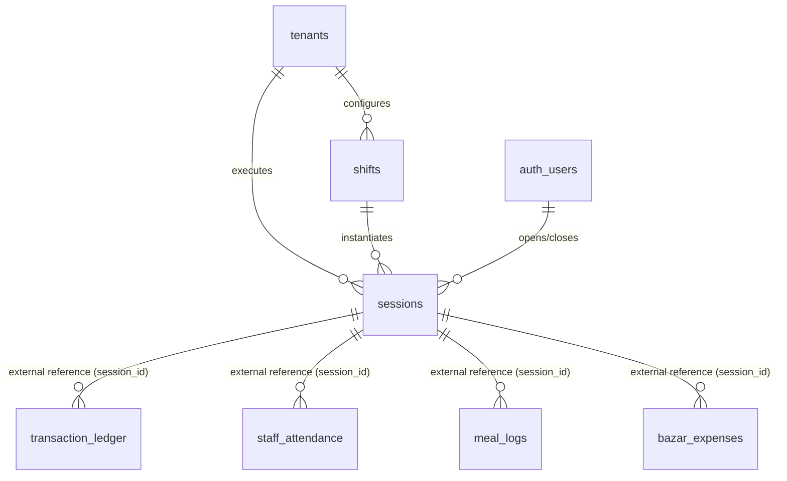
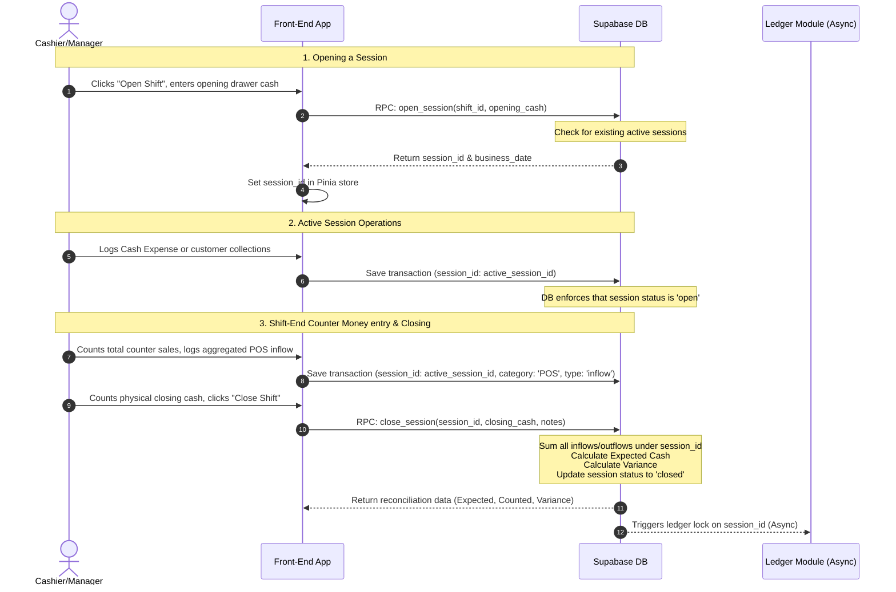

# Detailed Specification: Operational Shifts & Sessions (`shift-sessions`)

This document provides a detailed specification for the **Operational Shifts & Sessions** module. This module forms the temporal and financial baseline for all transactions within the Canteen Management System.

---

## 1. Feature Overview & Objectives

Instead of treating dates and shifts as static attributes on transactions, the system designs operations around a formal **Operational Session**. A session binds a physical manager/operator on duty, a specific recurring shift configuration, a business date, and a cash drawer balance into a single auditable context.

### Key Objectives:
*   **Temporal Context Isolation:** Ensure every transaction (POS sales, market expenses, customer payments, staff advances) is linked to a specific session.
*   **Physical Cash Tracking:** Enforce opening and closing drawer counts to prevent leakage and ensure accountability.
*   **Automatic Financial Reconciliation:** Calculate the expected ending cash based on recorded transactions and compute variances against the physical drawer count.
*   **Immutable Transaction Locking:** Lock all transaction logs associated with a session once that session is closed to prevent retroactive tampering.
*   **Non-Itemized Counter Sales:** Regular cash/digital sales are not logged as individual item transactions. Cashiers count the total counter revenue at shift-end and log it as a single aggregated counter money inflow (Category: `POS`) to simplify operations.

---

## 2. User Stories

### Persona A: Canteen Owner (Admin/Owner Role)
1.  **As a** Canteen Owner,  
    **I want to** define and configure the recurring operational shifts (e.g., Breakfast, Lunch, Dinner) with default target timings,  
    **So that** operators can easily select them when opening a shift.
2.  **As a** Canteen Owner,  
    **I want to** view a history of all closed sessions, including expected cash, actual counted cash, and cash variance,  
    **So that** I can identify operational discrepancies, cash drawer shortages, and auditor exceptions.
3.  **As a** Canteen Owner,  
    **I want to** prevent any staff member from editing or deleting past transactions linked to closed sessions,  
    **So that** the financial records remain fully audit-compliant and tamper-proof.

### Persona B: Shift Manager / Cashier (Member Role)
1.  **As a** Shift Manager,  
    **I want to** open a new session by choosing a shift and entering the starting physical cash drawer amount,  
    **So that** the cash register is initialized and ready for operations.
2.  **As a** Shift Manager,  
    **I want to** see an active session indicator in my UI  
    **So that** I know all my subsequent operations (cash collections, purchases) are being logged to the correct shift context.
3.  **As a** Shift Manager,  
    **I want to** log the total counter cash sales collected during the shift as a single aggregated ledger inflow before closing the shift,  
    **So that** expected cash matches physical drawer counts.
4.  **As a** Shift Manager,  
    **I want to** close the session at the end of my shift by inputting the physical closing drawer cash,  
    **So that** the system can calculate expected versus actual cash and lock the shift.

---

## 3. Data Model

The data model is structured around a decoupled, multi-tenant Postgres schema. Row-Level Security (RLS) is applied using the tenant identifier (`tenant_id`).



### Table Definitions

#### 1. `shifts` (Shift Configurations)
Defines the template of shifts that occur in a 24-hour cycle.

| Column Name | Type | Constraints | Description |
| :--- | :--- | :--- | :--- |
| `id` | `uuid` | Primary Key, `default gen_random_uuid()` | Unique shift identifier. |
| `tenant_id` | `uuid` | Foreign Key -> `tenants.id`, `not null` | Scopes this shift to a tenant. |
| `name` | `text` | `not null` | Name of the shift (e.g., Breakfast, Lunch, Dinner). |
| `start_time` | `time` | `not null` | Expected start time (24h format). |
| `end_time` | `time` | `not null` | Expected end time (24h format). |
| `is_active` | `boolean` | `default true`, `not null` | Soft-disable flag. |
| `created_at` | `timestamptz` | `default now()`, `not null` | Creation timestamp. |
| `updated_at` | `timestamptz` | `default now()`, `not null` | Modification timestamp. |

#### 2. `sessions` (Operational Sessions)
Tracks the active lifecycle and reconciliation metadata of an operational session.

| Column Name | Type | Constraints | Description |
| :--- | :--- | :--- | :--- |
| `id` | `uuid` | Primary Key, `default gen_random_uuid()` | Unique session identifier. |
| `tenant_id` | `uuid` | Foreign Key -> `tenants.id`, `not null` | Scopes this session to a tenant. |
| `shift_id` | `uuid` | Foreign Key -> `shifts.id`, `not null` | The shift configuration template used. |
| `business_date` | `date` | `not null` | The operational date (can differ from calendar date for night shifts). |
| `status` | `text` | `not null`, `check (status in ('open', 'closed'))` | Operational state. |
| `opening_cash` | `numeric(12, 2)` | `not null`, `default 0.00` | Counted cash at shift start. |
| `closing_cash` | `numeric(12, 2)` | Nullable | Counted cash at shift end. |
| `expected_cash` | `numeric(12, 2)` | Nullable | System-calculated expected cash. |
| `variance` | `numeric(12, 2)` | Nullable | `closing_cash - expected_cash`. |
| `opened_by` | `uuid` | Foreign Key -> `auth.users`, `not null` | User profile ID who started the session. |
| `closed_by` | `uuid` | Foreign Key -> `auth.users`, Nullable | User profile ID who ended the session. |
| `opened_at` | `timestamptz` | `default now()`, `not null` | Exact epoch timestamp when session was opened. |
| `closed_at` | `timestamptz` | Nullable | Exact epoch timestamp when session was closed. |
| `notes` | `text` | Nullable | Reason for variances or shifts handovers. |
| `created_at` | `timestamptz` | `default now()`, `not null` | Audit tracking. |
| `updated_at` | `timestamptz` | `default now()`, `not null` | Audit tracking. |

### Constraints & Indexes
1.  **Single Active Session Rule:** Only one session can be in the `open` state per tenant at any given time.
    ```sql
    create unique index unique_active_session_per_tenant 
    on public.sessions (tenant_id) 
    where (status = 'open');
    ```
2.  **Foreign Key Indexes:**
    ```sql
    create index idx_sessions_tenant_id on public.sessions(tenant_id);
    create index idx_sessions_shift_id on public.sessions(shift_id);
    create index idx_sessions_business_date on public.sessions(business_date);
    create index idx_shifts_tenant_id on public.shifts(tenant_id);
    ```

---

## 4. Permission Control & Row-Level Security (RLS)

All tables use standard Row-Level Security (RLS) to isolate data. Rather than relying on hardcoded static roles, permissions are defined dynamically in the `permissions` JSONB field of the `tenant_roles` table, which is mapped to users via `tenant_members`.

### Dynamic Permission Schema

For the **Operational Shifts & Sessions** module, the permissions configuration under `tenant_roles.permissions` is structured as follows:

```json
{
  "modules": {
    "operational_shifts": {
      "shifts_config_read": true,
      "shifts_config_write": false,
      "sessions_read": "self",      // Options: "all" | "self" | "none"
      "sessions_open": true,
      "sessions_close": true,
      "sessions_reopen": false
    }
  }
}
```

### Default System Roles & Immutability

1. **Owner Role (Default & Immutable)**:
   - When a tenant is provisioned, the creator is assigned to the default system-level `Owner` role.
   - **Immutability constraint**: The system-level `Owner` role permissions are immutable and cannot be configured, edited, or deleted at the tenant level. This is enforced by RLS on `tenant_roles` (which only permits modification of rows where `tenant_id is not null`).
   - Consequently, only other roles (such as a Manager role, Cashier, or custom tenant roles) can be dynamically configured, modified, or added later.

2. **Default Role Mapping Matrix**:
   Below is the default permission mapping matrix. Custom roles or modified system-delegates (other than the system `Owner`) will evaluate dynamically against their stored JSONB values.

| Operations | Cashier / Operator (Default Member) | Shift Manager (Default Admin) | Owner (Default Immutable) | Platform Superadmin |
| :--- | :--- | :--- | :--- | :--- |
| **Shifts Config (Read)** | `shifts_config_read` = `true` | `shifts_config_read` = `true` | Yes (All) | Yes (Bypass RLS) |
| **Shifts Config (Write)**| `shifts_config_write` = `false` | `shifts_config_write` = `true` | Yes (All) | Yes (Bypass RLS) |
| **Sessions (Read)** | `sessions_read` = `"self"` | `sessions_read` = `"all"` | Yes (All) | Yes (Bypass RLS) |
| **Sessions (Open)** | `sessions_open` = `true` | `sessions_open` = `true` | Yes (All) | Yes (Bypass RLS) |
| **Sessions (Close)** | `sessions_close` = `true` | `sessions_close` = `true` | Yes (All) | Yes (Bypass RLS) |
| **Sessions (Reopen)** | `sessions_reopen` = `false` | `sessions_reopen` = `false` | Yes (All) | Yes (Bypass RLS) |

### Core RLS Policies (SQL Implementation)

```sql
-- Enable Row-Level Security
alter table public.shifts enable row level security;
alter table public.sessions enable row level security;

-- Helper Function: Check Module Permission Dynamically
create or replace function public.has_module_permission(
  p_tenant_id uuid,
  p_module_name text,
  p_permission_name text
)
returns boolean
security definer
stable
set search_path = public
language plpgsql
as $$
declare
  v_permissions jsonb;
begin
  -- Superadmins bypass RLS and permission checks
  if exists (
    select 1 from public.user_profiles
    where id = auth.uid() and is_superadmin = true
  ) then
    return true;
  end if;

  -- Fetch the active membership's role permissions
  select r.permissions into v_permissions
  from public.tenant_members m
  join public.tenant_roles r on m.role_id = r.id
  where m.tenant_id = p_tenant_id
    and m.user_id = auth.uid()
    and m.status = 'active';

  if v_permissions is null then
    return false;
  end if;

  -- Owner role with {"all": true} bypasses individual checks
  if coalesce((v_permissions->>'all')::boolean, false) = true then
    return true;
  end if;

  -- Check module-specific permission (e.g., modules -> operational_shifts -> shifts_config_write)
  return coalesce(
    (v_permissions->'modules'->p_module_name->>p_permission_name)::boolean,
    false
  );
end;
$$;

-- Helper Function: Get Session Read Scope Dynamically
create or replace function public.get_session_read_scope(
  p_tenant_id uuid
)
returns text
security definer
stable
set search_path = public
language plpgsql
as $$
declare
  v_permissions jsonb;
begin
  if exists (
    select 1 from public.user_profiles
    where id = auth.uid() and is_superadmin = true
  ) then
    return 'all';
  end if;

  select r.permissions into v_permissions
  from public.tenant_members m
  join public.tenant_roles r on m.role_id = r.id
  where m.tenant_id = p_tenant_id
    and m.user_id = auth.uid()
    and m.status = 'active';

  if v_permissions is null then
    return 'none';
  end if;

  if coalesce((v_permissions->>'all')::boolean, false) = true then
    return 'all';
  end if;

  return coalesce(
    v_permissions->'modules'->'operational_shifts'->>'sessions_read',
    'none'
  );
end;
$$;

-- Policies for Shifts
create policy "Users can view shifts in their tenant"
  on public.shifts
  for select
  using (
    public.has_module_permission(tenant_id, 'operational_shifts', 'shifts_config_read')
  );

create policy "Users can manage shifts in their tenant"
  on public.shifts
  for all
  using (
    public.has_module_permission(tenant_id, 'operational_shifts', 'shifts_config_write')
  )
  with check (
    public.has_module_permission(tenant_id, 'operational_shifts', 'shifts_config_write')
  );

-- Policies for Sessions
create policy "Users can view sessions in their tenant"
  on public.sessions
  for select
  using (
    public.get_session_read_scope(tenant_id) = 'all' or (
      public.get_session_read_scope(tenant_id) = 'self' and opened_by = auth.uid()
    )
  );

create policy "Users can open sessions in their tenant"
  on public.sessions
  for insert
  with check (
    public.has_module_permission(tenant_id, 'operational_shifts', 'sessions_open')
  );

create policy "Users can update active sessions in their tenant"
  on public.sessions
  for update
  using (
    public.has_module_permission(tenant_id, 'operational_shifts', 'sessions_close')
  )
  with check (
    -- Prevent editing closed sessions unless the user has 'sessions_reopen' permission
    status = 'open' or public.has_module_permission(tenant_id, 'operational_shifts', 'sessions_reopen')
  );
```

---

## 5. API Flow & Lifecycle Operations



### Database RPC Functions

#### 1. Open Session: `open_session`
Validates that there is no other open session for the tenant, inserts the session record, and initializes the temporal context.

```sql
create or replace function public.open_session(
  p_tenant_id uuid,
  p_shift_id uuid,
  p_opening_cash numeric,
  p_business_date date default current_date
)
returns uuid
security definer
language plpgsql
as $$
declare
  v_session_id uuid;
  v_active_count integer;
begin
  -- 1. Check for active open sessions
  select count(*) into v_active_count
  from public.sessions
  where tenant_id = p_tenant_id and status = 'open';

  if v_active_count > 0 then
    raise exception 'Cannot open session. There is already an active session for this tenant.';
  end if;

  -- 2. Insert new session
  insert into public.sessions (
    tenant_id,
    shift_id,
    business_date,
    status,
    opening_cash,
    opened_by,
    opened_at
  )
  values (
    p_tenant_id,
    p_shift_id,
    p_business_date,
    'open',
    p_opening_cash,
    auth.uid(),
    now()
  )
  returning id into v_session_id;

  return v_session_id;
end;
$$;
```

#### 2. Calculate Expected Cash: `calculate_expected_cash`
Aggregates transactions from the unified cash register to find the expected cash in the drawer.

```sql
create or replace function public.calculate_expected_cash(
  p_session_id uuid
)
returns numeric
security definer
language plpgsql
as $$
declare
  v_opening_cash numeric := 0.00;
  v_inflow numeric := 0.00;
  v_outflow numeric := 0.00;
  v_expected numeric := 0.00;
begin
  -- Get opening cash
  select opening_cash into v_opening_cash
  from public.sessions
  where id = p_session_id;

  -- Aggregate Cash Inflows (POS cash sales, baki collections)
  select coalesce(sum(amount), 0.00) into v_inflow
  from public.transaction_ledger
  where session_id = p_session_id 
    and type = 'inflow' 
    and payment_method = 'cash';

  -- Aggregate Cash Outflows (market expenses, staff advances, supplier payouts in cash)
  select coalesce(sum(amount), 0.00) into v_outflow
  from public.transaction_ledger
  where session_id = p_session_id 
    and type = 'outflow' 
    and payment_method = 'cash';

  v_expected := v_opening_cash + v_inflow - v_outflow;
  return v_expected;
end;
$$;
```

#### 3. Close Session: `close_session`
Invokes the reconciliation calculation, compares it with actual counted cash, logs variance, locks the session, and triggers ledger updates.

```sql
create or replace function public.close_session(
  p_session_id uuid,
  p_closing_cash numeric,
  p_notes text default null
)
returns table (
  expected_cash numeric,
  variance numeric,
  status text
)
security definer
language plpgsql
as $$
declare
  v_expected numeric;
  v_variance numeric;
  v_session_status text;
begin
  -- Check current status
  select status into v_session_status from public.sessions where id = p_session_id;
  if v_session_status = 'closed' then
    raise exception 'Session is already closed.';
  end if;

  -- 1. Calculate the expected cash
  v_expected := public.calculate_expected_cash(p_session_id);

  -- 2. Calculate variance
  v_variance := p_closing_cash - v_expected;

  -- 3. Close and lock the session
  update public.sessions
  set 
    status = 'closed',
    closing_cash = p_closing_cash,
    expected_cash = v_expected,
    variance = v_variance,
    closed_by = auth.uid(),
    closed_at = now(),
    notes = p_notes,
    updated_at = now()
  where id = p_session_id;

  return query 
  select expected_cash, variance, status 
  from public.sessions 
  where id = p_session_id;
end;
$$;
```

---

## 6. Immutable Ledger Constraint Implementation

To prevent tampering, database triggers are used on any transactional tables referencing `session_id`. When an insert, update, or delete is attempted, the trigger checks if the referenced session is closed.

```sql
create or replace function public.enforce_closed_session_lock()
returns trigger as $$
declare
  v_session_status text;
  v_target_session uuid;
begin
  -- Resolve the target session ID depending on the operation
  if TG_OP = 'DELETE' then
    v_target_session := OLD.session_id;
  else
    v_target_session := NEW.session_id;
  end if;

  -- Check the status of the session
  select status into v_session_status 
  from public.sessions 
  where id = v_target_session;

  if v_session_status = 'closed' then
    raise exception 'Transaction is locked. The associated operational session % has been closed.', v_target_session;
  end if;

  return NEW;
end;
$$ language plpgsql;

-- Example: Attaching the trigger to the transaction_ledger
create trigger check_transaction_session_lock
before insert or update or delete
on public.transaction_ledger
for each row
execute function public.enforce_closed_session_lock();
```
