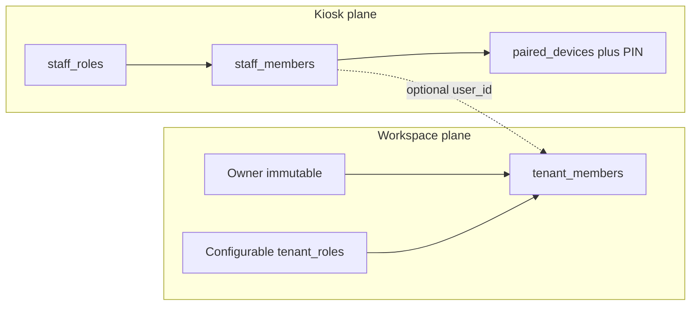
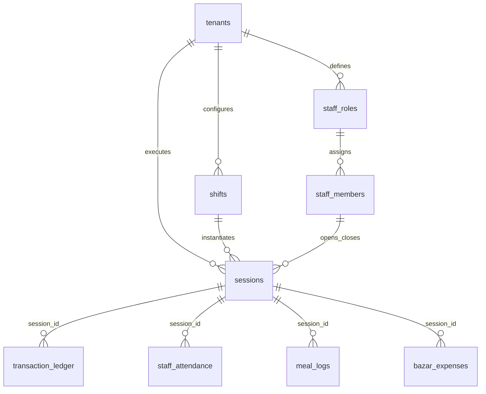
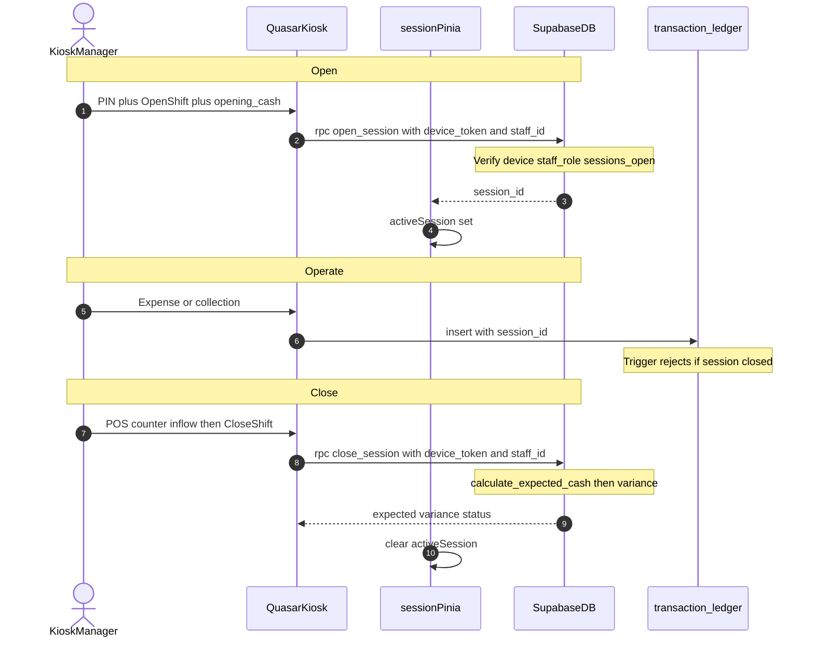

# RFC: Operational Shifts & Sessions (`shift-sessions`)

This document is the Technical Specification (RFC) for the **Operational Shifts & Sessions** module. This module forms the temporal and financial baseline for all transactions within the Canteen Management System.

Instead of treating dates and shifts as static attributes on transactions, the system designs operations around a formal **Operational Session**. A session binds a physical manager/operator on duty, a specific recurring shift configuration, a business date, and a cash drawer balance into a single auditable context.

### Key Objectives
* **Temporal Context Isolation:** Every transaction (POS sales, market expenses, customer payments, staff advances) is linked to a specific session.
* **Physical Cash Tracking:** Enforce opening and closing drawer counts to prevent leakage and ensure accountability.
* **Automatic Financial Reconciliation:** Calculate expected ending cash from recorded cash movements and compute variance against the physical drawer count.
* **Immutable Transaction Locking:** Lock all transaction logs associated with a session once that session is closed.
* **Non-Itemized Counter Sales:** Cashiers count total counter revenue at shift-end and log it as a single aggregated counter money inflow (Category: `POS`).

### Implementation Status (as of this RFC)
| Layer | Status |
| :--- | :--- |
| Feature flag `shift-sessions` | Seeded; admin / tenant toggles exist |
| DB tables / RPCs / RLS | Not migrated |
| Pinia / routes / UI | Not built (CounterDashboard / StaffWorkspace placeholders only) |
| Downstream `transaction_ledger` | Spec-only; close RPC must tolerate its absence |

---

## 1. PRODUCT & SECURITY

### A. User Stories

#### Persona A: Canteen Owner (Owner Role)
1. **As a** Canteen Owner, **I want to** define recurring operational shifts (e.g. Breakfast, Lunch, Dinner) with default timings, **so that** operators can select them when opening a session.
2. **As a** Canteen Owner, **I want to** view history of closed sessions (expected cash, counted cash, variance), **so that** I can identify drawer shortages and auditor exceptions.
3. **As a** Canteen Owner, **I want to** prevent staff from editing or deleting transactions linked to closed sessions, **so that** financial records remain audit-compliant.

#### Persona B: Shift Manager / Cashier (Kiosk Staff Roles)
1. **As a** Shift Manager (kiosk staff), **I want to** open a session on the paired terminal by choosing a shift and entering opening drawer cash, **so that** the register is initialized for operations.
2. **As a** Shift Manager, **I want to** see an active session indicator, **so that** I know subsequent operations bind to the correct session.
3. **As a** Cashier / Manager, **I want to** log aggregated counter cash sales as a single POS inflow before close, **so that** expected cash matches the drawer.
4. **As a** Shift Manager, **I want to** close the session with physical closing cash, **so that** the system reconciles expected vs actual and locks the shift.

### B. Identity & Role Planes (conjunct, not conflated)

Two permission planes share a tenant but use different identities. **Do not merge Manager into `tenant_members`.**

| Plane | Who | Auth | Permission source |
| :--- | :--- | :--- | :--- |
| **Workspace** | Owner (immutable) + configurable `tenant_roles` (Admin, Accountant, custom) | Supabase Auth | `tenant_roles.permissions` |
| **Kiosk / floor** | Manager, Cashier, Staff, custom | Device token + PIN | `staff_roles.permissions` |



**Rules:**
* **Manager is a kiosk `staff_members` row** with the Manager `staff_role`. They open/close sessions on the paired device.
* **Owner** (and optional office roles) use the workspace for shift *config*, session *history*, staff registry, pairing codes.
* Invite a Manager as a `tenant_member` only if they also need the dashboard. Optional link: `staff_members.user_id → auth.users`.
* Free-text `staff_members.role` is replaced by `staff_role_id` → `staff_roles`.

### C. Permission Control Matrices

#### C1. Workspace (`tenant_roles`)

Module key: `operational_shifts`. Used for dashboard ACL only — not for kiosk open/close.

```json
{
  "modules": {
    "operational_shifts": {
      "shifts_config_read": true,
      "shifts_config_write": false,
      "sessions_read": "all",
      "sessions_reopen": false
    }
  }
}
```

`sessions_read` values: `"all"` | `"self"` | `"none"`. Boolean keys are true/false.

| Operation | Configurable office role (e.g. Admin) | Owner (immutable) | Platform Superadmin |
| :--- | :--- | :--- | :--- |
| Shifts Config Read | configurable | Yes (`all`) | Bypass RLS |
| Shifts Config Write | configurable | Yes (`all`) | Bypass RLS |
| Sessions Read (history) | `"all"` or `"self"` | Yes (`all`) | Bypass RLS |
| Sessions Reopen | false by default | Yes (`all`) | Bypass RLS |
| Sessions Open / Close | N/A (kiosk staff plane) | Optional Owner-assisted Auth path | Bypass |

**Owner immutability:** System `Owner` (`tenant_id is null`, `permissions = {"all": true}`) cannot be edited or deleted. Other tenant roles are fully configurable.

#### C2. Kiosk (`staff_roles`)

```json
{
  "modules": {
    "operational_shifts": {
      "sessions_open": true,
      "sessions_close": true,
      "sessions_reopen": false
    },
    "kiosk": {
      "log_pos": true,
      "log_expense": true,
      "log_advance": false,
      "view_active_session": true
    }
  }
}
```

| Operation | Manager (default) | Cashier (default) | Staff (generic) |
| :--- | :--- | :--- | :--- |
| Sessions Open | true | false | false |
| Sessions Close | true | false | false |
| Sessions Reopen | false | false | false |
| Log POS / expense | true | true | limited |
| View active session | true | true | true |

System staff role templates (`tenant_id is null` or seeded per tenant): **Manager**, **Cashier**, **Staff**. Tenants may add/edit non-system staff roles.

**Feature gate:** `enabled_features['shift-sessions'] === true`. Workspace routes: `requiredFeature: 'shift-sessions'`.

### D. Authentication & Authorization

1. **Kiosk open/close (primary path):** Staff authenticates with device token + PIN. Client calls `open_session` / `close_session` with `p_device_token` + `p_staff_id`. RPC validates device, staff membership, and `staff_roles` capabilities (`sessions_open` / `sessions_close`). Session rows store `opened_by_staff_id` / `closed_by_staff_id`.
2. **Workspace (Owner / office roles):** Supabase Auth + `tenant_members`. Used for shift CRUD, session history, reopen. Owner-assisted open/close via Auth is allowed only when the actor has workspace `sessions_open`/`sessions_close` equivalents under Owner `all`, or a linked staff Manager profile is preferred for counter work.
3. **Route guards:** Workspace — `requiredFeature` + `hasModulePermission` on `tenant_roles`. Kiosk — pairing + staff PIN guards; UI hides Open/Close unless staff role grants it.
4. **Database:** RLS on `shifts` / `sessions` for Auth users via `has_module_permission` / `get_session_read_scope`. Lifecycle mutations go through `security definer` RPCs (device-token path for kiosk).

---

## 2. BACKEND & DATA

### A. Data Modeling



#### 0. Table: `public.staff_roles` (Kiosk Role Templates)

Mirrors `tenant_roles` for the floor plane.

| Column | Type | Constraints | Description |
| :--- | :--- | :--- | :--- |
| `id` | `uuid` | PK, `default gen_random_uuid()` | Role id |
| `tenant_id` | `uuid` | FK → `tenants.id`, Nullable | `null` = system template |
| `name` | `text` | `not null` | Manager, Cashier, Staff, custom |
| `description` | `text` | Nullable | Human summary |
| `permissions` | `jsonb` | `not null`, `default '{}'` | Kiosk capability map |
| `is_system_role` | `boolean` | `default false`, `not null` | System templates not deletable |
| `created_at` | `timestamptz` | `default now()`, `not null` | Audit |
| `updated_at` | `timestamptz` | `default now()`, `not null` | Audit |

**Alter `staff_members`:** add `staff_role_id uuid not null references staff_roles(id)`; add `user_id uuid null references auth.users(id)` (dual identity); migrate existing free-text `role` into role rows, then drop column `role`.

#### 1. Table: `public.shifts` (Shift Configurations)

| Column | Type | Constraints | Description |
| :--- | :--- | :--- | :--- |
| `id` | `uuid` | PK, `default gen_random_uuid()` | Unique shift identifier |
| `tenant_id` | `uuid` | FK → `tenants.id`, `not null`, `on delete cascade` | Tenant scope |
| `name` | `text` | `not null` | e.g. Breakfast, Lunch, Dinner |
| `start_time` | `time` | `not null` | Expected start (24h) |
| `end_time` | `time` | `not null` | Expected end (24h) |
| `is_active` | `boolean` | `default true`, `not null` | Soft-disable |
| `created_at` | `timestamptz` | `default now()`, `not null` | Audit |
| `updated_at` | `timestamptz` | `default now()`, `not null` | Audit |

```sql
create index idx_shifts_tenant_id on public.shifts(tenant_id);
```

#### 2. Table: `public.sessions` (Operational Sessions)

| Column | Type | Constraints | Description |
| :--- | :--- | :--- | :--- |
| `id` | `uuid` | PK, `default gen_random_uuid()` | Session id |
| `tenant_id` | `uuid` | FK → `tenants.id`, `not null`, `on delete cascade` | Tenant scope |
| `shift_id` | `uuid` | FK → `shifts.id`, `not null` | Template used |
| `business_date` | `date` | `not null` | Operational date (may differ from calendar for night shifts) |
| `status` | `text` | `not null`, `check (status in ('open', 'closed'))` | Lifecycle |
| `opening_cash` | `numeric(12,2)` | `not null`, `default 0` | Counted at open |
| `closing_cash` | `numeric(12,2)` | Nullable | Counted at close |
| `expected_cash` | `numeric(12,2)` | Nullable | System-calculated |
| `variance` | `numeric(12,2)` | Nullable | `closing_cash - expected_cash` |
| `opened_by_staff_id` | `uuid` | FK → `staff_members`, `not null` | Kiosk staff who opened |
| `closed_by_staff_id` | `uuid` | FK → `staff_members`, Nullable | Kiosk staff who closed |
| `opened_by_user_id` | `uuid` | FK → `auth.users`, Nullable | Set only on Owner-assisted Auth open |
| `closed_by_user_id` | `uuid` | FK → `auth.users`, Nullable | Set only on Owner-assisted Auth close |
| `opened_at` | `timestamptz` | `default now()`, `not null` | Open epoch |
| `closed_at` | `timestamptz` | Nullable | Close epoch |
| `notes` | `text` | Nullable | Variance / handover notes |
| `created_at` | `timestamptz` | `default now()`, `not null` | Audit |
| `updated_at` | `timestamptz` | `default now()`, `not null` | Audit |

```sql
-- Single active session per tenant
create unique index unique_active_session_per_tenant
  on public.sessions (tenant_id)
  where (status = 'open');

create index idx_sessions_tenant_id on public.sessions(tenant_id);
create index idx_sessions_shift_id on public.sessions(shift_id);
create index idx_sessions_business_date on public.sessions(business_date);
create index idx_sessions_status on public.sessions(tenant_id, status);
create index idx_sessions_opened_by_staff on public.sessions(opened_by_staff_id);
```

### B. Database Integration

* **Migration file:** `supabase/migrations/YYYYMMDDHHMMSS_operational_shifts_sessions.sql` (after latest phase migration). May split `staff_roles` into a prior migration if preferred.
* **Contents:** `staff_roles` + seed Manager/Cashier/Staff; alter `staff_members`; `shifts` / `sessions`; indexes; RLS; helpers (`has_module_permission`, `get_session_read_scope`, `has_staff_permission`); RPCs; grants.
* **Existing data:** Backfill `staff_role_id` from free-text `role` (map known names case-insensitively; default unknown → Staff). No session backfill.
* **Types:** Regenerate Supabase TS types after migrate.
* **Feature flag:** Already present (`shift-sessions`).
* **Default workspace role JSONB:** Admin/custom roles get `operational_shifts` config/history keys (not kiosk open/close). Owner unchanged (`{"all": true}`).

### C. API Surface & Design

No separate REST server. Client uses Supabase JS (`supabase.from` / `supabase.rpc`), same pattern as device pairing.

#### 1. List / CRUD shifts

| Op | Client call | Notes |
| :--- | :--- | :--- |
| List | `from('shifts').select('*').eq('tenant_id', tid).order('start_time')` | RLS: `shifts_config_read` |
| Create | `from('shifts').insert({ tenant_id, name, start_time, end_time })` | RLS: `shifts_config_write` |
| Update | `from('shifts').update({ … }).eq('id', id)` | Soft-disable via `is_active` |
| Delete | Prefer soft-disable; hard delete only if no referencing sessions | FK may block delete |

**Response row (example):**
```json
{
  "id": "uuid",
  "tenant_id": "uuid",
  "name": "Lunch",
  "start_time": "11:00:00",
  "end_time": "15:00:00",
  "is_active": true,
  "created_at": "2026-07-18T06:00:00Z",
  "updated_at": "2026-07-18T06:00:00Z"
}
```

#### 2. `rpc('open_session')` — kiosk primary

**Request:**
```json
{
  "p_device_token": "opaque-token",
  "p_staff_id": "uuid",
  "p_shift_id": "uuid",
  "p_opening_cash": 5000.00,
  "p_business_date": "2026-07-18"
}
```
`p_business_date` optional; default `current_date`. Tenant resolved from paired device.

**Success response:** `uuid` (session id).

**Failure:** raised exception (see Error Handling).

#### 3. `rpc('close_session')` — kiosk primary

**Request:**
```json
{
  "p_device_token": "opaque-token",
  "p_staff_id": "uuid",
  "p_session_id": "uuid",
  "p_closing_cash": 12500.50,
  "p_notes": "Short by 50 — broken note"
}
```

**Success response (table row / object):**
```json
{
  "expected_cash": 12600.50,
  "variance": -100.00,
  "status": "closed"
}
```

#### 4. Fetch active / history sessions

| Op | Client call |
| :--- | :--- |
| Active (workspace) | `from('sessions').select('*, shifts(name, start_time, end_time), opened_by_staff:staff_members!opened_by_staff_id(full_name)').eq('tenant_id', tid).eq('status', 'open').maybeSingle()` |
| Active (kiosk) | Same via RPC or select with device-scoped helper if anon client cannot read RLS — prefer `rpc('get_active_session', { p_device_token })` returning row or null |
| History | `from('sessions').select('*, shifts(name)').eq('tenant_id', tid).eq('status', 'closed').order('business_date', { ascending: false }).limit(50)` |

RLS enforces workspace `sessions_read`. For `"self"`, scope to sessions where `opened_by_staff_id` belongs to staff linked via `user_id = auth.uid()`, else treat as `"all"` for Owner.

#### 5. Reopen (Owner only)

Ship `rpc('reopen_session')` in Phase 4; requires Auth + workspace `sessions_reopen`.

### D. API Flow



### E. RLS Helpers & Policies

```sql
alter table public.shifts enable row level security;
alter table public.sessions enable row level security;

create or replace function public.has_module_permission(
  p_tenant_id uuid,
  p_module_name text,
  p_permission_name text
)
returns boolean
security definer
stable
set search_path = public
language plpgsql
as $$
declare
  v_permissions jsonb;
begin
  if exists (
    select 1 from public.user_profiles
    where id = auth.uid() and is_superadmin = true
  ) then
    return true;
  end if;

  select r.permissions into v_permissions
  from public.tenant_members m
  join public.tenant_roles r on m.role_id = r.id
  where m.tenant_id = p_tenant_id
    and m.user_id = auth.uid()
    and m.status = 'active';

  if v_permissions is null then
    return false;
  end if;

  if coalesce((v_permissions->>'all')::boolean, false) = true then
    return true;
  end if;

  return coalesce(
    (v_permissions->'modules'->p_module_name->>p_permission_name)::boolean,
    false
  );
end;
$$;

create or replace function public.get_session_read_scope(p_tenant_id uuid)
returns text
security definer
stable
set search_path = public
language plpgsql
as $$
declare
  v_permissions jsonb;
begin
  if exists (
    select 1 from public.user_profiles
    where id = auth.uid() and is_superadmin = true
  ) then
    return 'all';
  end if;

  select r.permissions into v_permissions
  from public.tenant_members m
  join public.tenant_roles r on m.role_id = r.id
  where m.tenant_id = p_tenant_id
    and m.user_id = auth.uid()
    and m.status = 'active';

  if v_permissions is null then
    return 'none';
  end if;

  if coalesce((v_permissions->>'all')::boolean, false) = true then
    return 'all';
  end if;

  return coalesce(
    v_permissions->'modules'->'operational_shifts'->>'sessions_read',
    'none'
  );
end;
$$;

-- Shifts
create policy "Users can view shifts in their tenant"
  on public.shifts for select
  using (
    public.has_module_permission(tenant_id, 'operational_shifts', 'shifts_config_read')
  );

create policy "Users can manage shifts in their tenant"
  on public.shifts for all
  using (
    public.has_module_permission(tenant_id, 'operational_shifts', 'shifts_config_write')
  )
  with check (
    public.has_module_permission(tenant_id, 'operational_shifts', 'shifts_config_write')
  );

-- Sessions
create policy "Users can view sessions in their tenant"
  on public.sessions for select
  using (
    public.get_session_read_scope(tenant_id) = 'all'
    or (
      public.get_session_read_scope(tenant_id) = 'self'
      and opened_by_staff_id in (
        select id from public.staff_members
        where user_id = auth.uid() and tenant_id = sessions.tenant_id
      )
    )
  );

-- Direct insert/update from clients is discouraged; prefer RPCs.
-- Policies below allow Owner-assisted Auth path only.
create policy "Users can open sessions in their tenant via Auth"
  on public.sessions for insert
  with check (
    public.has_module_permission(tenant_id, 'operational_shifts', 'shifts_config_write')
    or coalesce(
      (select (r.permissions->>'all')::boolean
       from public.tenant_members m
       join public.tenant_roles r on m.role_id = r.id
       where m.tenant_id = sessions.tenant_id
         and m.user_id = auth.uid()
         and m.status = 'active'),
      false
    )
  );

create policy "Users can update sessions in their tenant via Auth"
  on public.sessions for update
  using (
    public.has_module_permission(tenant_id, 'operational_shifts', 'sessions_reopen')
  )
  with check (
    status = 'open'
    or public.has_module_permission(tenant_id, 'operational_shifts', 'sessions_reopen')
  );
```

> Note: `has_module_permission` is for **workspace** JSONB booleans. Kiosk capabilities use `has_staff_permission(p_staff_id, module, key)`. For `sessions_read` string scopes, use `get_session_read_scope`.

```sql
create or replace function public.has_staff_permission(
  p_staff_id uuid,
  p_module_name text,
  p_permission_name text
)
returns boolean
security definer
stable
set search_path = public
language plpgsql
as $$
declare
  v_permissions jsonb;
begin
  select sr.permissions into v_permissions
  from public.staff_members sm
  join public.staff_roles sr on sm.staff_role_id = sr.id
  where sm.id = p_staff_id
    and sm.is_active = true;

  if v_permissions is null then
    return false;
  end if;

  return coalesce(
    (v_permissions->'modules'->p_module_name->>p_permission_name)::boolean,
    false
  );
end;
$$;
```

### F. RPC Implementations

#### 1. `open_session` (device token + staff)

```sql
create or replace function public.open_session(
  p_device_token text,
  p_staff_id uuid,
  p_shift_id uuid,
  p_opening_cash numeric,
  p_business_date date default current_date
)
returns uuid
security definer
set search_path = public
language plpgsql
as $$
declare
  v_tenant_id uuid;
  v_session_id uuid;
begin
  select pd.tenant_id into v_tenant_id
  from public.paired_devices pd
  where pd.device_token = p_device_token
    and pd.is_active = true;

  if v_tenant_id is null then
    raise exception 'Invalid or inactive device.' using errcode = '42501';
  end if;

  if not exists (
    select 1 from public.staff_members sm
    where sm.id = p_staff_id
      and sm.tenant_id = v_tenant_id
      and sm.is_active = true
      and sm.allow_terminal_login = true
  ) then
    raise exception 'Invalid staff for device tenant.' using errcode = '42501';
  end if;

  if not public.has_staff_permission(p_staff_id, 'operational_shifts', 'sessions_open') then
    raise exception 'Permission denied: sessions_open.' using errcode = '42501';
  end if;

  if p_opening_cash is null or p_opening_cash < 0 then
    raise exception 'opening_cash must be >= 0.' using errcode = '22023';
  end if;

  if not exists (
    select 1 from public.shifts
    where id = p_shift_id and tenant_id = v_tenant_id and is_active = true
  ) then
    raise exception 'Invalid or inactive shift for tenant.' using errcode = '22023';
  end if;

  if exists (
    select 1 from public.sessions
    where tenant_id = v_tenant_id and status = 'open'
  ) then
    raise exception 'Cannot open session. There is already an active session for this tenant.'
      using errcode = 'P0001';
  end if;

  insert into public.sessions (
    tenant_id, shift_id, business_date, status,
    opening_cash, opened_by_staff_id, opened_at
  ) values (
    v_tenant_id, p_shift_id, p_business_date, 'open',
    p_opening_cash, p_staff_id, now()
  )
  returning id into v_session_id;

  return v_session_id;
end;
$$;
```

#### 2. `calculate_expected_cash` (ledger-resilient)

Until `public.transaction_ledger` exists, expected cash equals opening cash. When the table exists, aggregate cash inflows/outflows for the session.

```sql
create or replace function public.calculate_expected_cash(p_session_id uuid)
returns numeric
security definer
set search_path = public
language plpgsql
as $$
declare
  v_opening_cash numeric := 0;
  v_inflow numeric := 0;
  v_outflow numeric := 0;
begin
  select opening_cash into v_opening_cash
  from public.sessions
  where id = p_session_id;

  if not found then
    raise exception 'Session not found.' using errcode = 'P0002';
  end if;

  if to_regclass('public.transaction_ledger') is not null then
    execute $q$
      select coalesce(sum(amount), 0)
      from public.transaction_ledger
      where session_id = $1 and type = 'inflow' and payment_method = 'cash'
    $q$ into v_inflow using p_session_id;

    execute $q$
      select coalesce(sum(amount), 0)
      from public.transaction_ledger
      where session_id = $1 and type = 'outflow' and payment_method = 'cash'
    $q$ into v_outflow using p_session_id;
  end if;

  return v_opening_cash + v_inflow - v_outflow;
end;
$$;
```

#### 3. `close_session` (device token + staff)

```sql
create or replace function public.close_session(
  p_device_token text,
  p_staff_id uuid,
  p_session_id uuid,
  p_closing_cash numeric,
  p_notes text default null
)
returns table (
  expected_cash numeric,
  variance numeric,
  status text
)
security definer
set search_path = public
language plpgsql
as $$
declare
  v_tenant_id uuid;
  v_device_tenant uuid;
  v_expected numeric;
  v_variance numeric;
  v_session_status text;
begin
  select pd.tenant_id into v_device_tenant
  from public.paired_devices pd
  where pd.device_token = p_device_token;

  if v_device_tenant is null then
    raise exception 'Invalid or inactive device.' using errcode = '42501';
  end if;

  if not public.has_staff_permission(p_staff_id, 'operational_shifts', 'sessions_close') then
    raise exception 'Permission denied: sessions_close.' using errcode = '42501';
  end if;

  select s.tenant_id, s.status into v_tenant_id, v_session_status
  from public.sessions s
  where s.id = p_session_id;

  if not found then
    raise exception 'Session not found.' using errcode = 'P0002';
  end if;

  if v_tenant_id <> v_device_tenant then
    raise exception 'Session tenant mismatch.' using errcode = '42501';
  end if;

  if v_session_status = 'closed' then
    raise exception 'Session is already closed.' using errcode = 'P0001';
  end if;

  if p_closing_cash is null or p_closing_cash < 0 then
    raise exception 'closing_cash must be >= 0.' using errcode = '22023';
  end if;

  v_expected := public.calculate_expected_cash(p_session_id);
  v_variance := p_closing_cash - v_expected;

  update public.sessions
  set
    status = 'closed',
    closing_cash = p_closing_cash,
    expected_cash = v_expected,
    variance = v_variance,
    closed_by_staff_id = p_staff_id,
    closed_at = now(),
    notes = p_notes,
    updated_at = now()
  where id = p_session_id;

  return query
  select s.expected_cash, s.variance, s.status
  from public.sessions s
  where s.id = p_session_id;
end;
$$;
```

#### 4. Closed-session lock trigger

Attach to any transactional table that references `session_id` (ledger first; attendance/meals/expenses when those land).

```sql
create or replace function public.enforce_closed_session_lock()
returns trigger
language plpgsql
as $$
declare
  v_session_status text;
  v_target_session uuid;
begin
  if TG_OP = 'DELETE' then
    v_target_session := OLD.session_id;
  else
    v_target_session := NEW.session_id;
  end if;

  if v_target_session is null then
    return coalesce(NEW, OLD);
  end if;

  select status into v_session_status
  from public.sessions
  where id = v_target_session;

  if v_session_status = 'closed' then
    raise exception
      'Transaction is locked. The associated operational session % has been closed.',
      v_target_session
      using errcode = 'P0001';
  end if;

  return coalesce(NEW, OLD);
end;
$$;

-- When transaction_ledger exists:
-- create trigger check_transaction_session_lock
-- before insert or update or delete on public.transaction_ledger
-- for each row execute function public.enforce_closed_session_lock();
```

Migration for this module creates the **function** always; the **trigger** is created in the ledger migration (or a follow-up) when `transaction_ledger` ships.

### G. Error Handling (Backend)

| Condition | SQLSTATE / code | Client message (example) | HTTP (PostgREST) |
| :--- | :--- | :--- | :--- |
| Not authenticated | `42501` | Authentication required | 401 / 403 |
| Missing module permission | `42501` | Permission denied: sessions_open | 403 |
| Invalid cash / shift | `22023` | opening_cash must be >= 0 | 400 |
| Active session already open | `P0001` | Cannot open session… | 400 |
| Session already closed | `P0001` | Session is already closed | 400 |
| Session not found | `P0002` | Session not found | 404-ish / 400 |
| Closed-session mutation | `P0001` | Transaction is locked… | 400 |
| Unique index race | `23505` | Concurrent open conflict | 409 |
| Unhandled server error | — | PostgREST generic | 500 |

Client maps `error.code` / `error.message` from Supabase JS; show toast + keep form dirty on validation failures.

**Grants:**
```sql
-- Kiosk clients often call RPCs without an end-user JWT; grant to anon + authenticated
-- (device_token is the real authz gate inside the function).
grant execute on function public.open_session(text, uuid, uuid, numeric, date) to anon, authenticated;
grant execute on function public.close_session(text, uuid, uuid, numeric, text) to anon, authenticated;
grant execute on function public.calculate_expected_cash(uuid) to authenticated;
grant execute on function public.has_staff_permission(uuid, text, text) to authenticated;
```

---

## 3. FRONTEND ARCHITECTURE

### A. State Management

| State | Scope | Location |
| :--- | :--- | :--- |
| Active operational session | Global (tenant workspace + counter) | Pinia `web/src/stores/session.ts` |
| Shift config list | Page-local + optional store cache | Fetch on Shifts page; invalidate after CRUD |
| Open/close dialog form fields | Local component state | `SessionOpenDialog` / `SessionCloseDialog` |
| Feature / role gates | Existing | `web/src/stores/tenant.ts` |

#### Store sketch: `useSessionStore`

```typescript
// web/src/stores/session.ts
import { ref, computed } from 'vue';
import { defineStore } from 'pinia';
import { supabase } from '@/boot/supabase';
import { useTenantStore } from './tenant';

export interface OperationalSession {
  id: string;
  tenant_id: string;
  shift_id: string;
  business_date: string;
  status: 'open' | 'closed';
  opening_cash: number;
  closing_cash: number | null;
  expected_cash: number | null;
  variance: number | null;
  opened_by_staff_id: string;
  closed_by_staff_id: string | null;
  opened_by_user_id: string | null;
  closed_by_user_id: string | null;
  opened_at: string;
  closed_at: string | null;
  notes: string | null;
  shifts?: { name: string; start_time: string; end_time: string };
}

export const useSessionStore = defineStore('session', () => {
  const activeSession = ref<OperationalSession | null>(null);
  const loading = ref(false);
  const lastError = ref<string | null>(null);

  const hasActiveSession = computed(() => activeSession.value?.status === 'open');

  async function fetchActiveSession() {
    const tenant = useTenantStore().activeTenant;
    if (!tenant) {
      activeSession.value = null;
      return;
    }
    loading.value = true;
    lastError.value = null;
    try {
      const { data, error } = await supabase
        .from('sessions')
        .select('*, shifts(name, start_time, end_time)')
        .eq('tenant_id', tenant.id)
        .eq('status', 'open')
        .maybeSingle();
      if (error) throw error;
      activeSession.value = data as OperationalSession | null;
    } catch (e) {
      lastError.value = e instanceof Error ? e.message : 'Failed to load session';
      throw e;
    } finally {
      loading.value = false;
    }
  }

  async function openSession(params: {
    shiftId: string;
    openingCash: number;
    businessDate?: string;
    deviceToken: string;
    staffId: string;
  }) {
    loading.value = true;
    lastError.value = null;
    try {
      const { data, error } = await supabase.rpc('open_session', {
        p_device_token: params.deviceToken,
        p_staff_id: params.staffId,
        p_shift_id: params.shiftId,
        p_opening_cash: params.openingCash,
        p_business_date: params.businessDate ?? undefined,
      });
      if (error) throw error;
      await fetchActiveSession();
      return data as string;
    } catch (e) {
      lastError.value = e instanceof Error ? e.message : 'Open session failed';
      throw e;
    } finally {
      loading.value = false;
    }
  }

  async function closeSession(params: {
    sessionId: string;
    closingCash: number;
    notes?: string;
    deviceToken: string;
    staffId: string;
  }) {
    loading.value = true;
    lastError.value = null;
    try {
      const { data, error } = await supabase.rpc('close_session', {
        p_device_token: params.deviceToken,
        p_staff_id: params.staffId,
        p_session_id: params.sessionId,
        p_closing_cash: params.closingCash,
        p_notes: params.notes ?? null,
      });
      if (error) throw error;
      activeSession.value = null;
      return data as { expected_cash: number; variance: number; status: string }[];
    } catch (e) {
      lastError.value = e instanceof Error ? e.message : 'Close session failed';
      throw e;
    } finally {
      loading.value = false;
    }
  }

  function clearSession() {
    activeSession.value = null;
    lastError.value = null;
  }

  return {
    activeSession,
    loading,
    lastError,
    hasActiveSession,
    fetchActiveSession,
    openSession,
    closeSession,
    clearSession,
  };
});
```

#### Permission helper extension (`tenant.ts`)

Current `hasPermission(module, 'read' | 'write')` only reads `modules[name][action]`. Add:

```typescript
function hasModulePermission(
  moduleName: string,
  permissionName: string
): boolean {
  if (userProfile.value?.is_superadmin) return true;
  if (!activeTenant.value) return false;
  const membership = myTenants.value.find(
    (m) => m.tenants?.id === activeTenant.value?.id
  );
  const permissions = membership?.tenant_roles?.permissions as Record<
    string,
    unknown
  > | null;
  if (!permissions) return false;
  if (permissions.all === true) return true;
  const mod = (permissions.modules as Record<string, Record<string, unknown>>)?.[
    moduleName
  ];
  if (!mod) return false;
  const val = mod[permissionName];
  if (typeof val === 'boolean') return val;
  if (typeof val === 'string') return val !== 'none';
  return false;
}

function getSessionReadScope(): 'all' | 'self' | 'none' {
  // mirror get_session_read_scope using same permissions object
}
```

Cache policy: refetch active session on workspace enter (`WorkspaceLayout` `onMounted` / tenant switch). No persistent localStorage for operational session (server is source of truth).

### B. Routing

Extend workspace children in `web/src/router/routes.ts`:

```typescript
{
  path: 'shifts',
  name: 'workspace-shifts',
  component: () => import('@/pages/workspace/WorkspaceShifts.vue'),
  meta: {
    requiredFeature: 'shift-sessions',
    requiredModulePermission: {
      module: 'operational_shifts',
      permission: 'shifts_config_read',
    },
  },
},
{
  path: 'sessions',
  name: 'workspace-sessions',
  component: () => import('@/pages/workspace/WorkspaceSessions.vue'),
  meta: {
    requiredFeature: 'shift-sessions',
    requiredModulePermission: {
      module: 'operational_shifts',
      permission: 'sessions_read',
    },
  },
},
```

Open/close are **dialogs** launched primarily from kiosk `StaffWorkspace` (Manager-capable staff). Workspace may show `ActiveSessionBanner` (read-only status + link to history). `CounterDashboard` is not the primary open/close surface.

**Guard update** (`guards.ts`): support `meta.requiredModulePermission` via `hasModulePermission`. For `sessions_read`, allow navigate if scope is `all` or `self` (deny `none`).

**Nav:** Add Shifts / Sessions items in `WorkspaceLayout.vue` when `isFeatureEnabled('shift-sessions')` and permission allows.

### C. Lazy Loading

* Pages and dialogs: route-level / async `defineAsyncComponent` for `SessionOpenDialog` / `SessionCloseDialog`.
* Keep `session.ts` store in main workspace chunk (small); do not prefetch shift pages from auth routes.
* Kiosk chunk remains isolated; it only imports store methods for `fetchActiveSession` (read) to gate actions.

---

## 4. UI & ACCESSIBILITY

### A. Component Specification

#### 1. `ActiveSessionBanner.vue`
- **Props:** none (reads `useSessionStore`)
- **Emits:** `@open-request`, `@close-request`
- **UI:** Chip `Open` + shift name + business date + opening cash; CTA Open / Close based on `hasActiveSession` and permissions

#### 2. `SessionOpenDialog.vue`
- **Props:** `modelValue: boolean`
- **Emits:** `update:modelValue`, `@opened(sessionId: string)`
- **Fields:** shift `q-select` (active shifts only), `opening_cash` (`q-input` type number, min 0), `business_date` (`q-date` / input, default today)
- **Actions:** Cancel, Confirm Open (disabled while `loading`)

#### 3. `SessionCloseDialog.vue`
- **Props:** `modelValue: boolean`, `session: OperationalSession`
- **Emits:** `update:modelValue`, `@closed(result)`
- **Fields:** `closing_cash`, `notes` (optional)
- **Post-success panel:** expected, counted, variance (color: negative if `|variance| > 0`)

#### 4. `ShiftConfigList.vue` / `ShiftConfigForm.vue`
- **List props:** `shifts: Shift[]`, `loading`, `canWrite`
- **Emits:** `@edit`, `@toggle-active`, `@create`
- **Form props:** `model: Partial<Shift>`, `saving`
- **Fields:** name, start_time, end_time, is_active

#### 5. `SessionHistoryTable.vue`
- **Props:** `rows: OperationalSession[]`, `loading`
- **Columns:** business_date, shift name, opened_by staff name, opening/closing/expected/variance, closed_at, notes
- **Mobile:** card list instead of table

#### 6. Pages
- `WorkspaceShifts.vue` — config CRUD
- `WorkspaceSessions.vue` — history + filters (date range)
- Wire banner into `WorkspaceLayout` / `CounterDashboard`

### B. Responsive Design

| Breakpoint | Behavior |
| :--- | :--- |
| Desktop (`gt-md`) | History table full columns; dialogs max-width 480px centered |
| Tablet (`sm`–`md`) | Table horizontal scroll; banner compact |
| Mobile (`lt-sm`) | Dialogs `full-width` / maximized; history as stacked cards; banner sticky top |

Touch targets ≥ 48px for Open/Close CTAs on counter tablet.

### C. Style & Visual States

* Match existing workspace Quasar tokens: flat bordered cards, `q-col-gutter-md`, `text-grey-8` secondary labels.
* **States:**
  * Hover: list row `bg-grey-1`
  * Active open chip: `color="positive"`
  * Variance ≠ 0: `text-negative` / `text-warning`
  * Loading: `q-inner-loading` on dialogs; disable primary buttons
  * Disabled: no permission → hide CTA or `disable` + tooltip
* Currency display: tenant locale / BDT formatting helper if one exists; else `toFixed(2)`.

### D. Accessibility (a11y)

* Dialogs: Quasar focus trap; initial focus on first field; Esc closes when not saving.
* Variance result: `role="status"` `aria-live="polite"`.
* Banner: `aria-label` describing shift name and status.
* Forms: visible labels (not placeholder-only); `aria-invalid` + helper text on validation errors.
* Keyboard: Enter submits open/close when focus in form; Tab order logical.

### E. Data Fetching & Error Handling (Frontend)

| Case | UI |
| :--- | :--- |
| No shifts configured | Empty state + link/button “Create shift” (if write) |
| No active session | Banner CTA “Open session”; counter ops that require session show blocking notice |
| No history rows | “No closed sessions yet” |
| Network drop | Toast + retry on banner; dialogs keep local form state |
| Open while already open | Show server message; refetch active |
| Validation | Client: cash ≥ 0, shift required; server errors mapped to field or banner |
| Error boundary | Page-level `QBanner` for store `lastError`; clear on navigate |

Kiosk (`StaffWorkspace`): if feature enabled and no active session, disable money-mutating actions with message “No open operational session”. Show Open/Close CTAs only when `has_staff_permission` for `sessions_open` / `sessions_close` (Manager role by default).

---

## 5. IMPLEMENTATION ROADMAP & CHECKLISTS

### Phase 1: Backend & Data
- [ ] Create migration for `public.staff_roles` (system templates Manager / Cashier / Staff + permissions JSONB).
- [ ] Alter `staff_members`: add `staff_role_id`, optional `user_id`; backfill from free-text `role`; drop `role` column.
- [ ] Create migration `*_operational_shifts_sessions.sql` for `shifts` / `sessions` (`opened_by_staff_id` / `closed_by_staff_id`).
- [ ] Implement `has_module_permission`, `get_session_read_scope`, `has_staff_permission`.
- [ ] Enable RLS + policies on shifts/sessions/staff_roles.
- [ ] Implement `open_session` / `close_session` (device_token + staff_id) and ledger-resilient `calculate_expected_cash`.
- [ ] Create `enforce_closed_session_lock` function (trigger deferred to ledger migration).
- [ ] Grant EXECUTE on kiosk RPCs to `anon` + `authenticated`.
- [ ] Update workspace Admin/custom role JSONB for config/history keys (not kiosk open/close).
- [ ] Regenerate TypeScript DB types; verify migrate / `db reset`.

### Phase 2: UI & Frontend Infrastructure
- [ ] Extend `useTenantStore` with `hasModulePermission` / `getSessionReadScope`.
- [ ] Extend kiosk store / staff login payload to include `staff_role` permissions (or fetch after PIN).
- [ ] Add Pinia `useSessionStore` with device_token + staff_id on open/close.
- [ ] Add routes `/:tenantSlug/shifts` and `/:tenantSlug/sessions` with `requiredFeature: 'shift-sessions'`.
- [ ] Extend `guards.ts` for `requiredModulePermission`.
- [ ] Add nav entries in `WorkspaceLayout.vue` (feature + tenant permission gated).
- [ ] Scaffold `web/src/components/sessions/` (banner, open/close dialogs, history, shift form).

### Phase 3: Assembly & Integration
- [ ] Build `WorkspaceShifts.vue` CRUD and `WorkspaceSessions.vue` history.
- [ ] Mount `ActiveSessionBanner` on workspace layouts; hydrate on tenant enter.
- [ ] Wire Open/Close dialogs on **kiosk** `StaffWorkspace.vue` for Manager-capable staff.
- [ ] Gate Cashier (and others) money actions when no active session; hide Open/Close without capability.
- [ ] Confirm feature toggle off → workspace routes redirect with existing feature-guard message.

### Phase 4: Optimization & Polish
- [ ] Add `reopen_session` RPC + Owner-only workspace UI.
- [ ] Staff role admin UI (create/edit custom staff roles; assign on staff profile).
- [ ] Attach closed-session lock trigger when `transaction_ledger` lands.
- [ ] Variance highlighting, empty/loading/offline states, a11y pass.
- [ ] Optional realtime on `sessions` for multi-device banner sync.
- [ ] Cross-check mobile tablet layout on counter viewport.

---

## Appendix: Downstream Dependencies

| Module doc | Coupling |
| :--- | :--- |
| [transaction_ledger.md](./transaction_ledger.md) | `session_id` FK; cash aggregates for expected drawer; lock trigger |
| [staff_attendance_payroll.md](./staff_attendance_payroll.md) | Attendance / advances bind to active session |
| [meal_customer_management.md](./meal_customer_management.md) | Meal logs reference `session_id` (meal *shift names* are a separate concept) |
| [procurement_supplier_management.md](./procurement_supplier_management.md) | Expenses map to active drawer/session |
| [device_pairing_and_pin_auth.md](./device_pairing_and_pin_auth.md) | Kiosk identity + PIN; staff capabilities via `staff_roles`; open/close session RPCs |
| [multi_tenant_architecture.md](./multi_tenant_architecture.md) | Workspace `tenant_roles` vs kiosk `staff_roles`; Manager is not a default tenant role |
