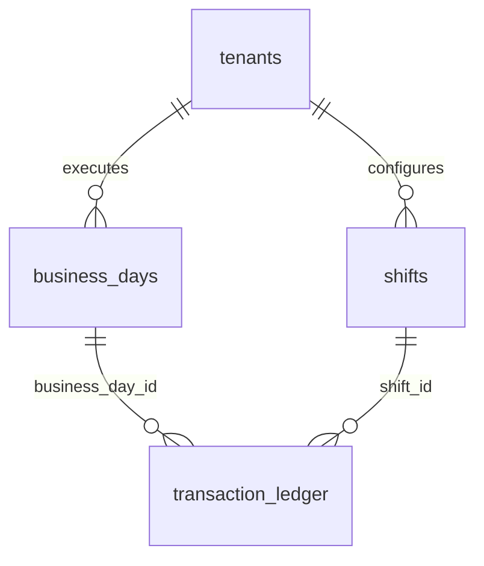

# RFC: Operational Shifts & Day Tracking (`shift-day-tracking`)

This document is the Technical Specification (RFC) for the **Operational Shifts & Day Tracking** module. This module forms the temporal and financial baseline for all transactions within the Canteen Management System.

Instead of treating dates and shifts as static attributes on transactions, the system designs operations around a formal **Business Day**. A business day binds a specific calendar date and a cash drawer balance into a single auditable context. **Shifts** are purely time-based configurations (e.g., 08:00 to 14:00) that are automatically assigned to transactions based on the time they occur.

### Key Objectives
* **Temporal Context Isolation:** Every transaction (POS sales, market expenses, customer payments, staff advances) is linked to a specific business day and automatically assigned a shift.
* **Physical Cash Tracking:** Enforce opening and closing drawer counts at the start and end of the day to prevent leakage and ensure accountability.
* **Sequential Integrity:** A new business day cannot be started unless the previous day has been ended.
* **Resumability:** A day can be resumed and ended again if operations continue within the same date.
* **Automatic Financial Reconciliation:** Calculate expected ending cash from recorded cash movements and compute variance against the physical drawer count.

---

## 1. PRODUCT & SECURITY

### A. User Stories

#### Persona A: Canteen Owner (Owner Role)
1. **As a** Canteen Owner, **I want to** have pre-configured default operational shifts (Morning, Afternoon, Evening, Night) automatically created when a tenant is created, and be able to manage them as needed.
2. **As a** Canteen Owner, **I want to** view the history of closed business days (expected cash, counted cash, variance), **so that** I can identify drawer shortages and auditor exceptions.

#### Persona B: Shift Manager / Cashier (Kiosk Staff Roles)
1. **As a** Shift Manager (kiosk staff), **I want to** "Start Day" on the paired terminal by entering opening drawer cash, **so that** the register is initialized for operations.
2. **As a** Cashier / Manager, **I want to** log Daily Transactions (POS) per sale. The system will automatically tag the transaction with the current active shift based on the time.
3. **As a** Shift Manager, **I want to** "End Day" with physical closing cash, **so that** the system reconciles expected vs actual.
4. **As a** Shift Manager, **I want to** "Resume Day" if I already ended the day but a late customer arrives on the same date.

---

### Default Provisioned Operational Shifts

Upon tenant creation, the system automatically provisions 4 operational shift slots:

| Slot Name | Time Range | Duration | Key Focus / Activity |
| :--- | :--- | :--- | :--- |
| **1. Morning Slot** | `06:30 AM – 11:00 AM` | 4 hr 30 min | Breakfast preparation, early tea/coffee, morning snacks |
| **2. Afternoon Slot** | `11:00 AM – 03:30 PM` | 4 hr 30 min | Heavy lunch prep, peak lunch rush, dining cleanup |
| **3. Evening Slot** | `03:30 PM – 07:30 PM` | 4 hr 00 min | Evening snacks (Singara, Puri, Tea), shift crossover |
| **4. Night Slot** | `07:30 PM – 11:30 PM` | 4 hr 00 min | Dinner prep, late dinner service, closing & deep cleaning |

---

## 2. BACKEND & DATA

### A. Data Modeling

```mermaid
erDiagram
    tenants ||--o{ shifts : configures
    tenants ||--o{ business_days : executes
    business_days ||--o{ transaction_ledger : business_day_id
    shifts ||--o{ transaction_ledger : shift_id
```

#### 1. Table: `public.shifts` (Shift Configurations)

| Column | Type | Constraints | Description |
| :--- | :--- | :--- | :--- |
| `id` | `uuid` | PK | Unique shift identifier |
| `tenant_id` | `uuid` | FK → `tenants.id` | Tenant scope |
| `name` | `text` | `not null` | e.g. Morning Slot, Afternoon Slot |
| `start_time` | `time` | `not null` | Expected start (24h) |
| `end_time` | `time` | `not null` | Expected end (24h) |

#### 2. Table: `public.business_days` (Day Tracking)

| Column | Type | Constraints | Description |
| :--- | :--- | :--- | :--- |
| `id` | `uuid` | PK | Day id |
| `tenant_id` | `uuid` | FK → `tenants.id` | Tenant scope |
| `business_date` | `date` | `not null` | Operational date |
| `status` | `text` | `not null` | 'open' or 'closed' |
| `opening_cash` | `numeric(12,2)` | `not null`, `default 0` | Counted at start |
| `closing_cash` | `numeric(12,2)` | Nullable | Counted at end |
| `expected_cash` | `numeric(12,2)` | Nullable | System-calculated |
| `variance` | `numeric(12,2)` | Nullable | `closing_cash - expected_cash` |

### B. API Surface & Design

#### 1. `rpc('start_business_day')`
- Starts the day. Validates that no other day is currently open. Validates that the previous day was properly closed. Records `opening_cash`.

#### 2. `rpc('end_business_day')`
- Closes the active day. Computes `expected_cash` and `variance` against the provided `closing_cash`.

#### 3. `rpc('resume_business_day')`
- Reopens the current day if `business_date == current_date`.

#### 4. Automatic Shift Resolution
- In transaction RPCs (like `log_pos_sale`), the system internally calls `get_current_shift(tenant_id)` which compares `now()::time` against the configured shifts in `public.shifts`. The `shift_id` is automatically populated in `transaction_ledger` along with `business_day_id`.
