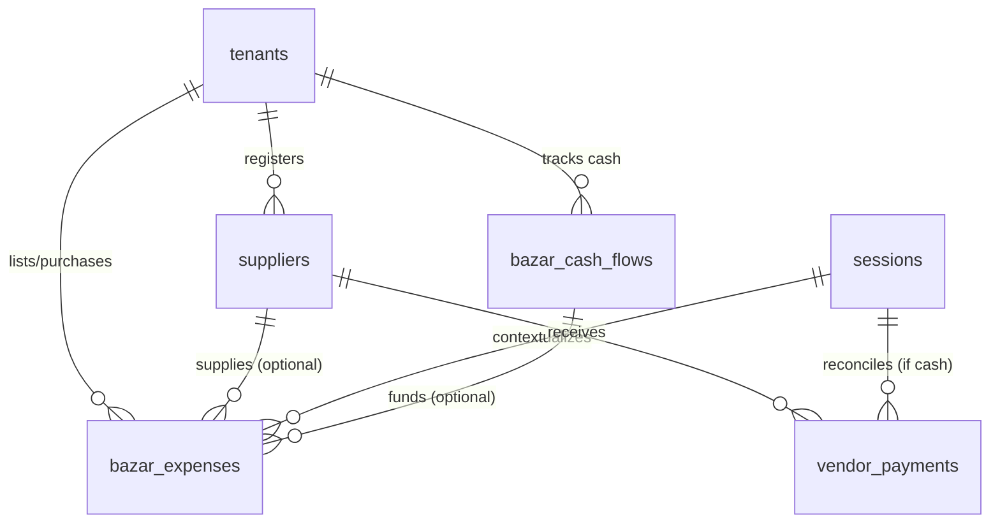

# Detailed Specification: Procurement & Supplier Management (`procurement`)

This document provides a detailed specification for the **Procurement & Supplier Management** module. This module handles vendor/supplier registers, outstanding accounts payable ledger tracking, daily bazar planners, purchase logging with flexible payment routing (Cash Drawer vs. Supplier Credit), and vendor payouts.

---

## 1. Feature Overview & Objectives

The **Procurement & Supplier Management** module manages physical inventory raw ingredients sourcing and accounts payable bookkeeping. It interfaces directly with the temporal and cash-reconciliation context of **Operational Sessions** defined in the `shift-sessions` module, ensuring all cash outlays map to the active drawer.

### Key Objectives:
*   **Supplier Registry & Accounts Payable Tracking**: Maintain a vendor profile record mapping contact metadata and a running calculated dues balance (`outstanding_balance`). Dues represent credit-line liabilities (accounts payable) that increase with credit purchases and decrease with cash/bank payouts.
*   **Unified Bazar Checklist & Purchase Logger**: Managers plan daily bazar needs by creating pending items specifying a name and planned quantity. When purchased, these checklist items are checked off, actual weights and prices are input, and the payment is settled.
*   **Flexible Settlement Routing**: Supports three settlement types for purchased bazar items:
    *   `cash`: Paid in full from checked-out shift drawer cash.
    *   `vendor_baki`: Acquired fully on credit from a registered supplier, increasing their accounts payable dues.
    *   `partial`: Partially paid in cash, and the remainder recorded on supplier credit.
*   **Cash Checkout Register (Bazar Trips)**: Tracks cash taken out of the drawer for marketing (`cash_taken`) and change returned (`cash_returned`). On trip completion, the system sums the actual cash purchases funded by that trip, computes any discrepancy cash variance, and logs it to the central ledger to reconcile the cashier drawer.
*   **Double-Entry Central Ledger Integration**: Automatically post corresponding outflow logs to the central bookkeeping log (`transaction_ledger`) for cash bazar expenses, vendor payouts, and trip discrepancies.
*   **Retroactive Tamper Protection**: Block modifications to bazar logs, cash flow trips, and payout records once the associated operational session has been closed and locked.

---

## 2. User Stories

### Persona A: Canteen Owner (Admin/Owner Role)
1.  **As a** Canteen Owner,  
    **I want to** register supplier profiles (e.g. rice mills, meat shops) and view their running credit balances,  
    **So that** I know exactly how much total debt is outstanding and plan payouts accordingly.
2.  **As a** Canteen Owner,  
    **I want to** review completed bazar trips and check if any buyer returned with a cash discrepancy (missing cash),  
    **So that** I can ensure cashier financial accountability.
3.  **As a** Canteen Owner,  
    **I want to** log payouts to suppliers via bank transfer or mobile banking,  
    **So that** our accounts payable records are accurate and up-to-date.

### Persona B: Shift Manager (Default Admin Role)
1.  **As a** Shift Manager,  
    **I want to** draft a daily Bazar List Planner containing item names and planned quantities,  
    **So that** it becomes a checklist for morning shopping.
2.  **As a** Shift Manager,  
    **I want to** checkout cash from the drawer to hand to a buyer, logging it as an active bazar trip,  
    **So that** the cash removed is tracked separately from shift sales.
3.  **As a** Shift Manager,  
    **I want to** close out a bazar trip when the buyer returns by entering the physical cash change returned,  
    **So that** the system automatically calculates the cash spent against the receipts, logs any discrepancy, and closes the trip.

### Persona C: Cashier / Operator (Default Member Role)
1.  **As a** Cashier,  
    **I want to** view the active daily bazar planner checklist,  
    **So that** I know what items are scheduled to be purchased.
2.  **As a** Cashier,  
    **I want to** check off bought items by entering the actual quantity, unit price, total price, selecting a supplier (if applicable), and choosing whether it was paid in cash, on credit, or partially,  
    **So that** the purchase details are logged and linked to the active bazar trip.
3.  **As a** Cashier,  
    **I want to** record a cash payment made to a supplier directly from the register cash drawer,  
    **So that** the vendor's balance updates and the cashier drawer outflow is balanced.

---

## 3. Data Model

All records are isolated by tenant using a `tenant_id` column protected by Row-Level Security (RLS).



### Table Definitions

#### 1. `suppliers` (Vendor & Supplier Profiles)
Tracks wholesaling vendors and their credit balances.

| Column Name | Type | Constraints | Description |
| :--- | :--- | :--- | :--- |
| `id` | `uuid` | Primary Key, `default gen_random_uuid()` | Unique supplier identifier. |
| `tenant_id` | `uuid` | Foreign Key -> `tenants.id`, `not null` | Scopes this profile to a tenant. |
| `name` | `text` | `not null` | Legal/Trade name of the supplier. |
| `contact_name` | `text` | Nullable | Primary contact person name. |
| `phone` | `text` | Nullable | Primary contact phone number. |
| `outstanding_balance` | `numeric(12, 2)` | `not null`, `default 0.00` | Accrued debt owed to the vendor. Positive represents payable liability. |
| `is_active` | `boolean` | `default true`, `not null` | Soft-disable flag. |
| `created_at` | `timestamptz` | `default now()`, `not null` | Audit tracking. |
| `updated_at` | `timestamptz` | `default now()`, `not null` | Audit tracking. |

#### 2. `bazar_cash_flows` (Bazar Trip Cash Checkout Logs)
Tracks cash checked out and returned per trip.

| Column Name | Type | Constraints | Description |
| :--- | :--- | :--- | :--- |
| `id` | `uuid` | Primary Key, `default gen_random_uuid()` | Unique trip identifier. |
| `tenant_id` | `uuid` | Foreign Key -> `tenants.id`, `not null` | Scopes trip to a tenant. |
| `session_id` | `uuid` | Foreign Key -> `sessions.id`, `not null` | Active operational session context. |
| `cash_taken` | `numeric(12, 2)` | `not null`, `check (cash_taken >= 0)` | Cash drawer money issued to buyer. |
| `cash_returned` | `numeric(12, 2)` | `not null`, `default 0.00`, `check (cash_returned >= 0)` | Cash change returned back to drawer. |
| `actual_expenses_sum`| `numeric(12, 2)` | `not null`, `default 0.00`, `check (actual_expenses_sum >= 0)` | Roll-up sum of `amount_paid` for cash items. |
| `discrepancy` | `numeric(12, 2)` | `not null`, `default 0.00` | Variance: `cash_taken - (actual_expenses_sum + cash_returned)`. |
| `notes` | `text` | Nullable | Notes explaining cash shortages/surpluses. |
| `status` | `text` | `not null`, `check (status in ('open', 'completed')) default 'open'` | Lifecycle of the trip. |
| `issued_to` | `uuid` | Foreign Key -> `auth.users`, `not null` | User profile ID going shopping. |
| `created_at` | `timestamptz` | `default now()`, `not null` | Audit tracking. |
| `updated_at` | `timestamptz` | `default now()`, `not null` | Audit tracking. |

#### 3. `bazar_expenses` (Bazar Planner & Expense Checklist)
Daily bazar items. Starts as `pending` (planned) and is updated when purchased.

| Column Name | Type | Constraints | Description |
| :--- | :--- | :--- | :--- |
| `id` | `uuid` | Primary Key, `default gen_random_uuid()` | Unique item identifier. |
| `tenant_id` | `uuid` | Foreign Key -> `tenants.id`, `not null` | Scopes item to a tenant. |
| `business_date` | `date` | `not null` | Date targeted for purchase. |
| `session_id` | `uuid` | Foreign Key -> `sessions.id`, Nullable | Operational session when purchased. |
| `trip_id` | `uuid` | Foreign Key -> `bazar_cash_flows.id`, Nullable | Bazar trip funding this item (if cash/partial). |
| `item_name` | `text` | `not null` | Ingredient/Item name. |
| `planned_quantity` | `numeric(12, 2)` | `not null`, `check (planned_quantity >= 0)` | Target purchase amount. |
| `planned_unit` | `text` | `not null` | Measurement unit (e.g. kg, pcs, litre). |
| `actual_quantity` | `numeric(12, 2)` | Nullable, `check (actual_quantity >= 0)` | Quantity purchased. |
| `actual_unit` | `text` | Nullable | Unit purchased. |
| `actual_unit_price` | `numeric(12, 2)` | Nullable, `check (actual_unit_price >= 0)` | Price per unit. |
| `actual_total_price` | `numeric(12, 2)` | Nullable, `check (actual_total_price >= 0)` | `actual_quantity * actual_unit_price`. |
| `status` | `text` | `not null`, `check (status in ('pending', 'purchased')) default 'pending'` | Check status. |
| `supplier_id` | `uuid` | Foreign Key -> `suppliers.id`, Nullable | Supplier references. Required if not fully cash. |
| `settlement_type` | `text` | Nullable, `check (settlement_type in ('cash', 'vendor_baki', 'partial'))` | Routing settlement method. |
| `amount_paid` | `numeric(12, 2)` | `not null`, `default 0.00`, `check (amount_paid >= 0)` | Cash amount paid immediately. |
| `amount_credit` | `numeric(12, 2)` | `not null`, `default 0.00`, `check (amount_credit >= 0)` | Credit amount added to vendor accounts payable. |
| `logged_by` | `uuid` | Foreign Key -> `auth.users`, Nullable | Buyer/Operator checking off the item. |
| `created_at` | `timestamptz` | `default now()`, `not null` | Audit tracking. |
| `updated_at` | `timestamptz` | `default now()`, `not null` | Audit tracking. |

#### 4. `vendor_payments` (Vendor Payout Logs)
Records payables payouts to suppliers.

| Column Name | Type | Constraints | Description |
| :--- | :--- | :--- | :--- |
| `id` | `uuid` | Primary Key, `default gen_random_uuid()` | Unique payout identifier. |
| `tenant_id` | `uuid` | Foreign Key -> `tenants.id`, `not null` | Scopes payout to a tenant. |
| `session_id` | `uuid` | Foreign Key -> `sessions.id`, Nullable | Session context. Must be provided if method is cash. |
| `supplier_id` | `uuid` | Foreign Key -> `suppliers.id`, `not null` | Supplier who received payment. |
| `amount` | `numeric(12, 2)` | `not null`, `check (amount > 0)` | Total payout amount. |
| `payment_method` | `text` | `not null`, `check (payment_method in ('cash', 'bank_transfer', 'mobile_wallet'))` | Settlement channel. |
| `paid_by` | `uuid` | Foreign Key -> `auth.users`, `not null` | Manager or owner initiating the payout. |
| `notes` | `text` | Nullable | Receipt numbers, bank reference codes, etc. |
| `created_at` | `timestamptz` | `default now()`, `not null` | Audit tracking. |
| `updated_at` | `timestamptz` | `default now()`, `not null` | Audit tracking. |

### Constraints & Indexes

1.  **Bazar Item Purchased State Integrity Constraint**:
    ```sql
    alter table public.bazar_expenses 
    add constraint chk_bazar_expense_purchased_integrity 
    check (
      (status = 'pending') or 
      (
        status = 'purchased' and 
        session_id is not null and 
        actual_quantity is not null and 
        actual_unit_price is not null and 
        actual_total_price is not null and 
        settlement_type is not null and 
        logged_by is not null and
        actual_total_price = (actual_quantity * actual_unit_price) and
        (amount_paid + amount_credit) = actual_total_price
      )
    );
    ```

2.  **Settlement Specific Mapping Rules**:
    ```sql
    alter table public.bazar_expenses 
    add constraint chk_bazar_settlement_rules 
    check (
      (settlement_type is null) or
      (settlement_type = 'cash' and amount_paid = actual_total_price and amount_credit = 0.00) or
      (settlement_type = 'vendor_baki' and supplier_id is not null and amount_credit = actual_total_price and amount_paid = 0.00) or
      (settlement_type = 'partial' and supplier_id is not null and amount_paid > 0.00 and amount_credit > 0.00)
    );
    ```

3.  **Cash Payout Context Constraint**:
    ```sql
    alter table public.vendor_payments 
    add constraint chk_session_required_for_cash_payout 
    check (
      (payment_method = 'cash' and session_id is not null) or 
      (payment_method in ('bank_transfer', 'mobile_wallet'))
    );
    ```

4.  **Performance Foreign Key Indexes**:
    ```sql
    create index idx_suppliers_tenant_id on public.suppliers(tenant_id);
    create index idx_bazar_expenses_tenant_date on public.bazar_expenses(tenant_id, business_date);
    create index idx_bazar_expenses_session_id on public.bazar_expenses(session_id);
    create index idx_bazar_expenses_supplier_id on public.bazar_expenses(supplier_id);
    create index idx_bazar_expenses_trip_id on public.bazar_expenses(trip_id);
    create index idx_bazar_cash_flows_tenant_session on public.bazar_cash_flows(tenant_id, session_id);
    create index idx_bazar_cash_flows_status on public.bazar_cash_flows(status);
    create index idx_vendor_payments_tenant_id on public.vendor_payments(tenant_id);
    create index idx_vendor_payments_session_id on public.vendor_payments(session_id);
    create index idx_vendor_payments_supplier_id on public.vendor_payments(supplier_id);
    ```

---

## 4. Permission Control & Row-Level Security (RLS)

All tables enforce tenant-level isolation checking configurations stored dynamically under `tenant_roles.permissions`.

### Dynamic Permission Schema

```json
{
  "modules": {
    "procurement": {
      "supplier_read": true,
      "supplier_write": false,
      "bazar_plan_read": true,
      "bazar_plan_write": false,
      "bazar_expense_write": true,
      "cash_checkout_read": true,
      "cash_checkout_write": false,
      "payout_read": true,
      "payout_write": false
    }
  }
}
```

### Default Role Mapping Matrix

| Operations | Cashier / Operator (Default Member) | Shift Manager (Default Admin) | Owner (Default Immutable) | Platform Superadmin |
| :--- | :--- | :--- | :--- | :--- |
| **Supplier Profiles (Read)** | `supplier_read` = `true` | `supplier_read` = `true` | Yes (All) | Yes (Bypass RLS) |
| **Supplier Profiles (Write)**| `supplier_write` = `false` | `supplier_write` = `true` | Yes (All) | Yes (Bypass RLS) |
| **Bazar Planner (Read)** | `bazar_plan_read` = `true` | `bazar_plan_read` = `true` | Yes (All) | Yes (Bypass RLS) |
| **Bazar Planner (Write/Draft)**| `bazar_plan_write` = `false` | `bazar_plan_write` = `true` | Yes (All) | Yes (Bypass RLS) |
| **Bazar Expense (Checking Off)**| `bazar_expense_write` = `true`| `bazar_expense_write` = `true`| Yes (All) | Yes (Bypass RLS) |
| **Cash Checkout Register (Read)**| `cash_checkout_read` = `true`| `cash_checkout_read` = `true`| Yes (All) | Yes (Bypass RLS) |
| **Cash Checkout (Start/End Trips)**| `cash_checkout_write` = `false`| `cash_checkout_write` = `true`| Yes (All) | Yes (Bypass RLS) |
| **Vendor Payouts (Read)** | `payout_read` = `true` | `payout_read` = `true` | Yes (All) | Yes (Bypass RLS) |
| **Vendor Payouts (Write)**| `payout_write` = `false` | `payout_write` = `true` | Yes (All) | Yes (Bypass RLS) |

### Core RLS Policies (SQL Implementation)

```sql
-- Enable Row-Level Security
alter table public.suppliers enable row level security;
alter table public.bazar_cash_flows enable row level security;
alter table public.bazar_expenses enable row level security;
alter table public.vendor_payments enable row level security;

-- Policies for Suppliers
create policy "Users can view suppliers in their tenant"
  on public.suppliers for select
  using (public.has_module_permission(tenant_id, 'procurement', 'supplier_read'));

create policy "Users can manage suppliers in their tenant"
  on public.suppliers for all
  using (public.has_module_permission(tenant_id, 'procurement', 'supplier_write'))
  with check (public.has_module_permission(tenant_id, 'procurement', 'supplier_write'));

-- Policies for Bazar Cash Flows (Trips)
create policy "Users can view cash flows in their tenant"
  on public.bazar_cash_flows for select
  using (public.has_module_permission(tenant_id, 'procurement', 'cash_checkout_read'));

create policy "Users can manage cash flows in their tenant"
  on public.bazar_cash_flows for all
  using (public.has_module_permission(tenant_id, 'procurement', 'cash_checkout_write'))
  with check (public.has_module_permission(tenant_id, 'procurement', 'cash_checkout_write'));

-- Policies for Bazar Expenses Checklist
create policy "Users can view bazar items in their tenant"
  on public.bazar_expenses for select
  using (public.has_module_permission(tenant_id, 'procurement', 'bazar_plan_read'));

create policy "Users can insert plan items in their tenant"
  on public.bazar_expenses for insert
  with check (public.has_module_permission(tenant_id, 'procurement', 'bazar_plan_write'));

create policy "Users can update/log purchases in their tenant"
  on public.bazar_expenses for update
  using (
    public.has_module_permission(tenant_id, 'procurement', 'bazar_expense_write') or
    public.has_module_permission(tenant_id, 'procurement', 'bazar_plan_write')
  );

create policy "Users can delete plans in their tenant"
  on public.bazar_expenses for delete
  using (public.has_module_permission(tenant_id, 'procurement', 'bazar_plan_write'));

-- Policies for Vendor Payments
create policy "Users can view payouts in their tenant"
  on public.vendor_payments for select
  using (public.has_module_permission(tenant_id, 'procurement', 'payout_read'));

create policy "Users can write payouts in their tenant"
  on public.vendor_payments for all
  using (public.has_module_permission(tenant_id, 'procurement', 'payout_write'))
  with check (public.has_module_permission(tenant_id, 'procurement', 'payout_write'));
```

---

## 5. API Flow & Lifecycle Operations

### Database RPC Functions

#### 1. Create Bazar Checklist Item: `create_bazar_plan_item`
Manager drafts planned checklist items.

```sql
create or replace function public.create_bazar_plan_item(
  p_tenant_id uuid,
  p_business_date date,
  p_item_name text,
  p_planned_quantity numeric,
  p_planned_unit text
)
returns uuid
security definer
set search_path = public
language plpgsql
as $$
declare
  v_new_id uuid;
begin
  insert into public.bazar_expenses (
    tenant_id,
    business_date,
    item_name,
    planned_quantity,
    planned_unit,
    status
  )
  values (
    p_tenant_id,
    p_business_date,
    p_item_name,
    p_planned_quantity,
    p_planned_unit,
    'pending'
  )
  returning id into v_new_id;

  return v_new_id;
end;
$$;
```

#### 2. Check Off / Purchase Bazar Item: `purchase_bazar_item`
Operator updates the checklist item when purchased, specifying cost details and settlement routing.

```sql
create or replace function public.purchase_bazar_item(
  p_tenant_id uuid,
  p_id uuid,
  p_session_id uuid,
  p_trip_id uuid,
  p_actual_quantity numeric,
  p_actual_unit text,
  p_actual_unit_price numeric,
  p_settlement_type text,
  p_supplier_id uuid,
  p_amount_paid numeric,
  p_amount_credit numeric
)
returns numeric
security definer
set search_path = public
language plpgsql
as $$
declare
  v_session_status text;
  v_supplier_balance numeric := 0.00;
  v_total_price numeric;
begin
  -- 1. Verify operational session is open
  select status into v_session_status
  from public.sessions
  where id = p_session_id and tenant_id = p_tenant_id;

  if v_session_status is null then
    raise exception 'Session does not exist.';
  elsif v_session_status = 'closed' then
    raise exception 'Cannot log purchases. Operational session is closed.';
  end if;

  v_total_price := p_actual_quantity * p_actual_unit_price;

  -- 2. Verify settlement bounds matches inputs
  if (p_amount_paid + p_amount_credit) <> v_total_price then
    raise exception 'Mathematical mismatch: paid (%) + credit (%) must equal total price (%).', 
      p_amount_paid, p_amount_credit, v_total_price;
  end if;

  -- 3. Run settlement rules
  if p_settlement_type = 'cash' and p_amount_credit <> 0.00 then
    raise exception 'Credit amount must be zero for cash settlements.';
  elsif p_settlement_type = 'vendor_baki' and (p_supplier_id is null or p_amount_paid <> 0.00) then
    raise exception 'Cash paid must be zero and supplier mandatory for credit (baki) settlements.';
  elsif p_settlement_type = 'partial' and (p_supplier_id is null or p_amount_paid = 0.00 or p_amount_credit = 0.00) then
    raise exception 'Both cash and credit amounts must exceed zero, and supplier is required for partial settlements.';
  end if;

  -- 4. Check trip validation if linking to cash register checkout
  if p_trip_id is not null then
    if not exists (
      select 1 from public.bazar_cash_flows 
      where id = p_trip_id and status = 'open' and session_id = p_session_id
    ) then
      raise exception 'Linked bazar trip is either closed or does not belong to active session.';
    end if;
  end if;

  -- 5. Complete purchase updates
  update public.bazar_expenses
  set session_id = p_session_id,
      trip_id = p_trip_id,
      actual_quantity = p_actual_quantity,
      actual_unit = coalesce(p_actual_unit, planned_unit),
      actual_unit_price = p_actual_unit_price,
      actual_total_price = v_total_price,
      status = 'purchased',
      supplier_id = p_supplier_id,
      settlement_type = p_settlement_type,
      amount_paid = p_amount_paid,
      amount_credit = p_amount_credit,
      logged_by = auth.uid(),
      updated_at = now()
  where id = p_id and tenant_id = p_tenant_id;

  -- 6. Fetch supplier balance
  if p_supplier_id is not null then
    select outstanding_balance into v_supplier_balance
    from public.suppliers
    where id = p_supplier_id;
  end if;

  return v_supplier_balance;
end;
$$;
```

#### 3. Start Bazar Trip (Cash Taken): `start_bazar_trip`
Checks cash out of shift drawer to hand to buyer.

```sql
create or replace function public.start_bazar_trip(
  p_tenant_id uuid,
  p_session_id uuid,
  p_cash_taken numeric,
  p_issued_to uuid,
  p_notes text default null
)
returns uuid
security definer
set search_path = public
language plpgsql
as $$
declare
  v_session_status text;
  v_trip_id uuid;
begin
  select status into v_session_status
  from public.sessions
  where id = p_session_id and tenant_id = p_tenant_id;

  if v_session_status is null then
    raise exception 'Session does not exist.';
  elsif v_session_status = 'closed' then
    raise exception 'Cannot start bazar trip. Session context is closed.';
  end if;

  -- Verify user has no active open trip
  if exists (
    select 1 from public.bazar_cash_flows 
    where session_id = p_session_id and issued_to = p_issued_to and status = 'open'
  ) then
    raise exception 'User already has an open bazar trip. Resolve it before checking out more cash.';
  end if;

  insert into public.bazar_cash_flows (
    tenant_id,
    session_id,
    cash_taken,
    cash_returned,
    actual_expenses_sum,
    discrepancy,
    notes,
    status,
    issued_to
  )
  values (
    p_tenant_id,
    p_session_id,
    p_cash_taken,
    0.00,
    0.00,
    0.00,
    p_notes,
    'open',
    p_issued_to
  )
  returning id into v_trip_id;

  return v_trip_id;
end;
$$;
```

#### 4. Complete Bazar Trip (Cash Returned & Reconciled): `complete_bazar_trip`
Finalizes checkout trip, counts total cash purchases linked, and records discrepancies.

```sql
create or replace function public.complete_bazar_trip(
  p_tenant_id uuid,
  p_trip_id uuid,
  p_cash_returned numeric,
  p_notes text default null
)
returns table (
  cash_taken numeric,
  cash_returned numeric,
  actual_expenses_sum numeric,
  discrepancy numeric,
  status text
)
security definer
set search_path = public
language plpgsql
as $$
declare
  v_trip_status text;
  v_cash_taken numeric;
  v_expenses_sum numeric;
  v_discrepancy numeric;
begin
  -- 1. Fetch trip metadata
  select status, cash_taken into v_trip_status, v_cash_taken
  from public.bazar_cash_flows
  where id = p_trip_id and tenant_id = p_tenant_id;

  if v_trip_status is null then
    raise exception 'Bazar trip not found.';
  elsif v_trip_status = 'completed' then
    raise exception 'Bazar trip is already completed.';
  end if;

  -- 2. Sum up all cash transactions funded by this trip
  select coalesce(sum(amount_paid), 0.00) into v_expenses_sum
  from public.bazar_expenses
  where trip_id = p_trip_id 
    and tenant_id = p_tenant_id 
    and status = 'purchased';

  -- 3. Calculate drawer discrepancy
  -- Discrepancy = cash taken out - (total cash spent + cash returned back to drawer)
  v_discrepancy := v_cash_taken - (v_expenses_sum + p_cash_returned);

  -- 4. Finalize trip records
  update public.bazar_cash_flows
  set cash_returned = p_cash_returned,
      actual_expenses_sum = v_expenses_sum,
      discrepancy = v_discrepancy,
      status = 'completed',
      notes = coalesce(p_notes, notes),
      updated_at = now()
  where id = p_trip_id;

  return query 
  select cash_taken, p_cash_returned, v_expenses_sum, v_discrepancy, 'completed'::text
  from public.bazar_cash_flows
  where id = p_trip_id;
end;
$$;
```

---

## 6. Immutable Ledger Constraints & Double-Entry Bookkeeping Triggers

### 1. Closed Operational Session Lock Trigger
Guarantees procurement records are immutable once a session is reconciled and finalized.

```sql
create or replace function public.enforce_procurement_session_lock()
returns trigger as $$
declare
  v_session_id uuid;
  v_session_status text;
begin
  if TG_OP = 'DELETE' then
    v_session_id := OLD.session_id;
  else
    v_session_id := NEW.session_id;
  end if;

  if v_session_id is not null then
    select status into v_session_status 
    from public.sessions 
    where id = v_session_id;

    if v_session_status = 'closed' then
      raise exception 'Write operation rejected. Associated operational session is closed and finalized.';
    end if;
  end if;

  if TG_OP = 'DELETE' then
    return OLD;
  else
    return NEW;
  end if;
end;
$$ language plpgsql;

create trigger check_bazar_expenses_lock
before insert or update or delete
on public.bazar_expenses
for each row
execute function public.enforce_procurement_session_lock();

create trigger check_bazar_cash_flows_lock
before insert or update or delete
on public.bazar_cash_flows
for each row
execute function public.enforce_procurement_session_lock();

create trigger check_vendor_payments_lock
before insert or update or delete
on public.vendor_payments
for each row
execute function public.enforce_procurement_session_lock();
```

### 2. Outstanding Balance Auto-Calculation Trigger
Maintains vendor credit balances in real-time.

```sql
create or replace function public.sync_supplier_outstanding_balance()
returns trigger as $$
declare
  v_diff numeric := 0.00;
  v_supplier_id uuid;
begin
  if TG_OP = 'INSERT' then
    if TG_TABLE_NAME = 'bazar_expenses' then
      v_supplier_id := NEW.supplier_id;
      v_diff := NEW.amount_credit; -- Credit adds to payables dues
    elsif TG_TABLE_NAME = 'vendor_payments' then
      v_supplier_id := NEW.supplier_id;
      v_diff := -NEW.amount; -- Paying supplier reduces payables dues
    end if;
  
  elsif TG_OP = 'UPDATE' then
    if TG_TABLE_NAME = 'bazar_expenses' then
      v_supplier_id := NEW.supplier_id;
      v_diff := NEW.amount_credit - OLD.amount_credit;
    elsif TG_TABLE_NAME = 'vendor_payments' then
      v_supplier_id := NEW.supplier_id;
      v_diff := OLD.amount - NEW.amount;
    end if;

  elsif TG_OP = 'DELETE' then
    if TG_TABLE_NAME = 'bazar_expenses' then
      v_supplier_id := OLD.supplier_id;
      v_diff := -OLD.amount_credit; -- Deleting credit purchase voids debt
    elsif TG_TABLE_NAME = 'vendor_payments' then
      v_supplier_id := OLD.supplier_id;
      v_diff := OLD.amount; -- Deleting payment restores debt liability
    end if;
  end if;

  if v_supplier_id is not null and v_diff <> 0.00 then
    update public.suppliers
    set outstanding_balance = outstanding_balance + v_diff,
        updated_at = now()
    where id = v_supplier_id;
  end if;

  return null;
end;
$$ language plpgsql;

create trigger sync_supplier_balance_expenses
after insert or update or delete
on public.bazar_expenses
for each row
execute function public.sync_supplier_outstanding_balance();

create trigger sync_supplier_balance_payments
after insert or update or delete
on public.vendor_payments
for each row
execute function public.sync_supplier_outstanding_balance();
```

### 3. Transaction Ledger Auto-Reporting Outflow Trigger
Enforces double-entry bookkeeping by copying cash outlays directly into the central transaction ledger.

```sql
create or replace function public.handle_procurement_financial_outflow()
returns trigger as $$
declare
  v_category text;
  v_payment_method text;
  v_operator_id uuid;
  v_desc text;
begin
  if TG_TABLE_NAME = 'bazar_expenses' then
    -- Only log the cash paid portion of the purchase
    if NEW.amount_paid = 0.00 then
      return NEW;
    end if;
    v_category := 'Raw Materials';
    v_payment_method := 'cash';
    v_operator_id := NEW.logged_by;
    v_desc := 'Cash Bazar Purchase - Item: ' || NEW.item_name || ' (' || NEW.actual_quantity || ' ' || NEW.actual_unit || ')';
  
  elsif TG_TABLE_NAME = 'vendor_payments' then
    v_category := 'Supplier Payout';
    v_payment_method := NEW.payment_method;
    v_operator_id := NEW.paid_by;
    v_desc := 'Supplier Payout logged - Supplier ID: ' || NEW.supplier_id;
  end if;

  insert into public.transaction_ledger (
    tenant_id,
    session_id,
    type,
    category,
    amount,
    payment_method,
    operator_id,
    notes,
    created_at
  )
  values (
    NEW.tenant_id,
    NEW.session_id,
    'outflow',
    v_category,
    case 
      when TG_TABLE_NAME = 'bazar_expenses' then NEW.amount_paid
      else NEW.amount 
    end,
    v_payment_method,
    v_operator_id,
    v_desc,
    now()
  );

  return NEW;
end;
$$ language plpgsql;

create trigger report_bazar_cash_outflow
after insert or update
on public.bazar_expenses
for each row
execute function public.handle_procurement_financial_outflow();

create trigger report_vendor_payment_outflow
after insert
on public.vendor_payments
for each row
execute function public.handle_procurement_financial_outflow();
```

### 4. Bazar Trip Cash Discrepancy Reconciliation Trigger
Reconciles bazar trip cash shortages/surpluses to keep the central ledger consistent.

```sql
create or replace function public.handle_bazar_trip_discrepancy_ledger()
returns trigger as $$
declare
  v_ledger_type text;
  v_category text;
  v_amount numeric;
  v_desc text;
begin
  -- Only trigger when a trip is finalized and discrepancy is non-zero
  if NEW.status = 'completed' and OLD.status = 'open' and NEW.discrepancy <> 0.00 then
    if NEW.discrepancy > 0.00 then
      v_ledger_type := 'outflow';
      v_category := 'Bazar Discrepancy';
      v_amount := NEW.discrepancy;
      v_desc := 'Bazar Trip Cash Shortage (Discrepancy) - Trip ID: ' || NEW.id;
    else
      v_ledger_type := 'inflow';
      v_category := 'Bazar Surplus';
      v_amount := abs(NEW.discrepancy);
      v_desc := 'Bazar Trip Cash Surplus (Discrepancy) - Trip ID: ' || NEW.id;
    end if;

    insert into public.transaction_ledger (
      tenant_id,
      session_id,
      type,
      category,
      amount,
      payment_method,
      operator_id,
      notes,
      created_at
    )
    values (
      NEW.tenant_id,
      NEW.session_id,
      v_ledger_type,
      v_category,
      v_amount,
      'cash',
      NEW.issued_to,
      v_desc,
      now()
    );
  end if;

  return NEW;
end;
$$ language plpgsql;

create trigger report_bazar_trip_discrepancy
after update
on public.bazar_cash_flows
for each row
execute function public.handle_bazar_trip_discrepancy_ledger();
```
