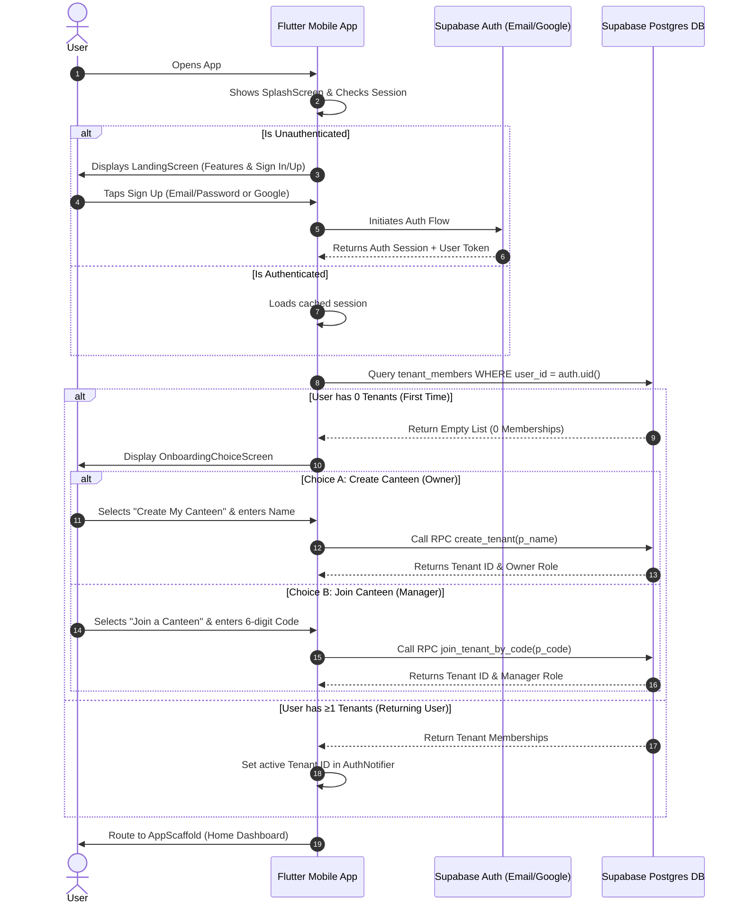

# Smart-Hisab v1.0 — Implementation Tasks Roadmap

> **Release Goal**: Deliver v1.0 (Free Tier) mobile app for canteen owners in Bangladesh to replace paper "hisab khata" notebooks.
> **Architecture**: Flutter (Riverpod), Supabase Auth & Postgres, REST/RPC services, 5-tab unified mobile layout.

---

## 1. Auth & Tenancy Sequence Overview

Before implementing UI screens, the authentication and onboarding sequence is defined as follows:



---

## 2. Implementation Tasks Checklist

### Phase 1: Core Auth & Tenant Onboarding Flow (Micro-Tasks)

**1.1 Data Layer & Services**
#### 1.1.1 Config & Env
* **Goal**: Implement Config & Env
* **File to create or change**: `lib/core/config/env.dart`
* **What to change**: Setup Supabase URL/Anon Key in `lib/core/config/env.dart` and initialize in `main.dart`.

#### 1.1.2 Hive Service
* **Goal**: Implement Hive Service
* **File to create or change**: `lib/core/services/hive_service.dart`
* **What to change**: Create `lib/core/services/hive_service.dart` for local auth/tenant caching.

#### 1.1.3 Supabase Service
* **Goal**: Implement Supabase Service
* **File to create or change**: `lib/core/services/supabase_service.dart`
* **What to change**: Create `lib/core/services/supabase_service.dart` wrapper.

#### 1.1.4 Auth State Model
* **Goal**: Implement Auth State Model
* **File to create or change**: `lib/core/auth/auth_state.dart`
* **What to change**: Create `lib/core/auth/auth_state.dart` (status, userId, tenantId, role).

#### 1.1.5 Auth Notifier
* **Goal**: Implement Auth Notifier
* **File to create or change**: `lib/core/auth/auth_notifier.dart`
* **What to change**: Create `lib/core/auth/auth_notifier.dart` (Google Sign-In, Email Sign-In/Up methods).


**1.2 Startup & Splash UI**
#### 1.2.1 Splash UI
* **Goal**: Implement Splash UI
* **File to create or change**: `lib/features/splash/splash_screen.dart`
* **What to change**: Create `lib/features/splash/splash_screen.dart` with logo and loading indicator.

#### 1.2.2 Splash Routing
* **Goal**: Implement Splash Routing
* **File to create or change**: `TBD / Multiple`
* **What to change**: Implement session check in Splash; route to `LandingScreen` or `AppScaffold`.


**1.3 Landing & Auth UI**
#### 1.3.1 Landing UI
* **Goal**: Implement Landing UI
* **File to create or change**: `lib/features/auth/landing_screen.dart`
* **What to change**: Create `lib/features/auth/landing_screen.dart` featuring app value proposition.

#### 1.3.2 Auth Form Widget
* **Goal**: Implement Auth Form Widget
* **File to create or change**: `lib/features/auth/widgets/email_auth_form.dart`
* **What to change**: Create `lib/features/auth/widgets/email_auth_form.dart` (Email/Pass + Sign In/Up toggle).

#### 1.3.3 Social Auth Widget
* **Goal**: Implement Social Auth Widget
* **File to create or change**: `lib/features/auth/widgets/social_auth_button.dart`
* **What to change**: Create `lib/features/auth/widgets/social_auth_button.dart` (Continue with Google).

#### 1.3.4 Integration
* **Goal**: Implement Integration
* **File to create or change**: `landing_screen.dart`
* **What to change**: Combine widgets in `landing_screen.dart` to trigger `auth_notifier` methods.


**1.4 Canteen Onboarding UI**
#### 1.4.1 Choice Screen
* **Goal**: Implement Choice Screen
* **File to create or change**: `lib/features/auth/onboarding_choice_screen.dart`
* **What to change**: Create `lib/features/auth/onboarding_choice_screen.dart` (Create vs Join cards).

#### 1.4.2 Create Canteen
* **Goal**: Implement Create Canteen
* **File to create or change**: `lib/features/auth/create_canteen_screen.dart`
* **What to change**: Create `lib/features/auth/create_canteen_screen.dart` (Input + `create_tenant` RPC).

#### 1.4.3 Join Canteen
* **Goal**: Implement Join Canteen
* **File to create or change**: `lib/features/auth/join_canteen_screen.dart`
* **What to change**: Create `lib/features/auth/join_canteen_screen.dart` (PIN Input + `join_tenant` RPC).


---

### Phase 2: Navigation & Home Dashboard (Micro-Tasks)

**2.1 App Scaffold & Routing**
#### 2.1.1 Scaffold State
* **Goal**: Implement Scaffold State
* **File to create or change**: `lib/features/app_scaffold_notifier.dart`
* **What to change**: Create `lib/features/app_scaffold_notifier.dart` to manage active tab index and Counter Mode toggle.

#### 2.1.2 Bottom Nav Widget
* **Goal**: Implement Bottom Nav Widget
* **File to create or change**: `lib/features/widgets/custom_bottom_nav.dart`
* **What to change**: Create `lib/features/widgets/custom_bottom_nav.dart` with role-gated tabs (5 tabs for normal, 3 for Counter Mode).

#### 2.1.3 Main Scaffold UI
* **Goal**: Implement Main Scaffold UI
* **File to create or change**: `lib/features/app_scaffold.dart`
* **What to change**: Create `lib/features/app_scaffold.dart` integrating the `IndexedStack` and bottom nav.


**2.2 Business Day State**
#### 2.2.1 Business Day Model
* **Goal**: Implement Business Day Model
* **File to create or change**: `lib/core/models/business_day.dart`
* **What to change**: Create `lib/core/models/business_day.dart` freezed class.

#### 2.2.2 Business Day Notifier
* **Goal**: Implement Business Day Notifier
* **File to create or change**: `lib/features/home/business_day_notifier.dart`
* **What to change**: Create `lib/features/home/business_day_notifier.dart` (fetch active day, start day, end day methods).

#### 2.2.3 Home UI Container
* **Goal**: Implement Home UI Container
* **File to create or change**: `lib/features/home/home_screen.dart`
* **What to change**: Create `lib/features/home/home_screen.dart` that conditionally renders Day Open vs Day Closed widget.


**2.3 Day Operations UI**
#### 2.3.1 Start Day Sheet
* **Goal**: Implement Start Day Sheet
* **File to create or change**: `lib/features/home/open_day_bottom_sheet.dart`
* **What to change**: Create `lib/features/home/open_day_bottom_sheet.dart` (cash input).

#### 2.3.2 End Day Sheet
* **Goal**: Implement End Day Sheet
* **File to create or change**: `lib/features/home/close_day_bottom_sheet.dart`
* **What to change**: Create `lib/features/home/close_day_bottom_sheet.dart` (cash variance input).

#### 2.3.3 Active Day Stats
* **Goal**: Implement Active Day Stats
* **File to create or change**: `lib/features/home/widgets/active_day_stats_card.dart`
* **What to change**: Create `lib/features/home/widgets/active_day_stats_card.dart`.

#### 2.3.4 Quick Actions
* **Goal**: Implement Quick Actions
* **File to create or change**: `lib/features/home/widgets/quick_actions_grid.dart`
* **What to change**: Create `lib/features/home/widgets/quick_actions_grid.dart`.


**2.4 Counter Mode State**
#### 2.4.1 Staff Auth Model
* **Goal**: Implement Staff Auth Model
* **File to create or change**: `lib/core/models/staff_member.dart`
* **What to change**: Create `lib/core/models/staff_member.dart`.

#### 2.4.2 PIN Gate UI
* **Goal**: Implement PIN Gate UI
* **File to create or change**: `lib/features/home/counter_mode_pin_screen.dart`
* **What to change**: Create `lib/features/home/counter_mode_pin_screen.dart` (Avatar grid + 4-digit PIN validator).

#### 2.4.3 Counter Mode Header
* **Goal**: Implement Counter Mode Header
* **File to create or change**: `TBD / Multiple`
* **What to change**: Add logic to display active `staff_id` and "Lock" button in the AppBar when Counter Mode is active.


---

### Phase 3: Customers (Micro-Tasks)

**3.1 Models & Data**
#### 3.1.1 Customer Model
* **Goal**: Implement Customer Model
* **File to create or change**: `lib/core/models/customer.dart`
* **What to change**: Create `lib/core/models/customer.dart`.

#### 3.1.2 Customers Provider
* **Goal**: Implement Customers Provider
* **File to create or change**: `lib/features/customers/customers_notifier.dart`
* **What to change**: Create `lib/features/customers/customers_notifier.dart` (fetch, add, update methods).


**3.2 UI Screens**
#### 3.2.1 Directory Screen
* **Goal**: Implement Directory Screen
* **File to create or change**: `lib/features/customers/customers_screen.dart`
* **What to change**: Create `lib/features/customers/customers_screen.dart` (ListView, search bar, active shift banner).

#### 3.2.2 Customer Detail
* **Goal**: Implement Customer Detail
* **File to create or change**: `lib/features/customers/customer_detail_screen.dart`
* **What to change**: Create `lib/features/customers/customer_detail_screen.dart` (wallet balance header, infinite list).


**3.3 Interaction Bottom Sheets**
#### 3.3.1 Add Customer
* **Goal**: Implement Add Customer
* **File to create or change**: `lib/features/customers/add_customer_bottom_sheet.dart`
* **What to change**: Create `lib/features/customers/add_customer_bottom_sheet.dart` (Name, Phone inputs).

#### 3.3.2 Collect Baki
* **Goal**: Implement Collect Baki
* **File to create or change**: `lib/features/customers/collect_baki_bottom_sheet.dart`
* **What to change**: Create `lib/features/customers/collect_baki_bottom_sheet.dart` (Amount input, optimistic update).


---

### Phase 4: Cashbook (Micro-Tasks)

**4.1 Cashbook UI**
#### 4.1.1 Main Screen
* **Goal**: Implement Main Screen
* **File to create or change**: `lib/features/cashbook/cashbook_screen.dart`
* **What to change**: Create `lib/features/cashbook/cashbook_screen.dart` (Summary header: Inflow/Outflow/Net).

#### 4.1.2 Transactions List
* **Goal**: Implement Transactions List
* **File to create or change**: `lib/features/cashbook/widgets/transaction_list.dart`
* **What to change**: Create `lib/features/cashbook/widgets/transaction_list.dart` rendering `day_entries`.


**4.2 Cashbook Forms**
#### 4.2.1 Add Expense
* **Goal**: Implement Add Expense
* **File to create or change**: `lib/features/cashbook/add_expense_bottom_sheet.dart`
* **What to change**: Create `lib/features/cashbook/add_expense_bottom_sheet.dart` (Category dropdown, amount, note).

#### 4.2.2 Add Note
* **Goal**: Implement Add Note
* **File to create or change**: `lib/features/cashbook/add_day_note_bottom_sheet.dart`
* **What to change**: Create `lib/features/cashbook/add_day_note_bottom_sheet.dart` (Text area for market lists).


---

### Phase 5: Staff (Micro-Tasks)

**5.1 Staff Core**
#### 5.1.1 Staff Provider
* **Goal**: Implement Staff Provider
* **File to create or change**: `lib/features/staff/staff_notifier.dart`
* **What to change**: Create `lib/features/staff/staff_notifier.dart` (fetch staff list).


**5.2 Staff UI**
#### 5.2.1 Staff List
* **Goal**: Implement Staff List
* **File to create or change**: `lib/features/staff/staff_screen.dart`
* **What to change**: Create `lib/features/staff/staff_screen.dart` (Staff avatars, role badges, swipe to pay).

#### 5.2.2 Staff Detail
* **Goal**: Implement Staff Detail
* **File to create or change**: `lib/features/staff/staff_detail_screen.dart`
* **What to change**: Create `lib/features/staff/staff_detail_screen.dart` (Ledger and payout history).


**5.3 Staff Forms**
#### 5.3.1 Add Staff
* **Goal**: Implement Add Staff
* **File to create or change**: `lib/features/staff/add_staff_bottom_sheet.dart`
* **What to change**: Create `lib/features/staff/add_staff_bottom_sheet.dart` (Name, Role picker, Phone).

#### 5.3.2 Salary Payout
* **Goal**: Implement Salary Payout
* **File to create or change**: `lib/features/staff/record_salary_payout_bottom_sheet.dart`
* **What to change**: Create `lib/features/staff/record_salary_payout_bottom_sheet.dart` (Amount, Payment Mode).


---

### Phase 6: Settings (Micro-Tasks)

**6.1 Core Settings UI**
#### 6.1.1 Theme Provider
* **Goal**: Implement Theme Provider
* **File to create or change**: `lib/core/theme/theme_notifier.dart`
* **What to change**: Create `lib/core/theme/theme_notifier.dart` (Light default, toggle dark mode).

#### 6.1.2 Settings Main
* **Goal**: Implement Settings Main
* **File to create or change**: `lib/features/settings/settings_screen.dart`
* **What to change**: Create `lib/features/settings/settings_screen.dart` (Menu list: Profile, Shifts, Vendors, Invites, Theme).


**6.2 Settings Details**
#### 6.2.1 Invite Manager
* **Goal**: Implement Invite Manager
* **File to create or change**: `lib/features/settings/invite_manager_screen.dart`
* **What to change**: Create `lib/features/settings/invite_manager_screen.dart` (RPC generate code, UI countdown).

#### 6.2.2 Shifts & Rates
* **Goal**: Implement Shifts & Rates
* **File to create or change**: `lib/features/settings/shifts_and_rates_screen.dart`
* **What to change**: Create `lib/features/settings/shifts_and_rates_screen.dart` (Shift time window editor).

#### 6.2.3 Vendors
* **Goal**: Implement Vendors
* **File to create or change**: `lib/features/settings/vendors_screen.dart`
* **What to change**: Create `lib/features/settings/vendors_screen.dart` (Accounts payable).

#### 6.2.4 Profile
* **Goal**: Implement Profile
* **File to create or change**: `lib/features/settings/my_profile_screen.dart`
* **What to change**: Create `lib/features/settings/my_profile_screen.dart` (Sign-out logic, switch tenant).


---

## 3. Design & Ergonomic Checklist

- [ ] All modal dialogs use `showModalBottomSheet` with `BorderRadius.vertical(top: Radius.circular(32))`.
- [ ] No modal bottom sheet contains a top-right 'X' or close button.
- [ ] Skeleton loaders (`shimmer` package) implemented for all loading states.
- [ ] Every scrollable view includes `RefreshIndicator`.
- [ ] Primary card headers & titles configured to minimum `16px` bold font size.
- [ ] All views wrapped with `SafeArea`.

---

## 4. Backend RPC Specifications & Response Style

All Supabase PostgreSQL functions (RPCs) MUST follow a unified JSON response envelope style:

### Standard Success Response Format
```json
{
  "success": true,
  "data": { ... },
  "message": "Operation completed successfully"
}
```

### Standard Error Response Format
```json
{
  "success": false,
  "error": {
    "code": "ERROR_CODE_NAME",
    "message": "Human readable error message in Bangla/English"
  }
}
```

---

### Complete v1.0 RPC Reference Matrix

| RPC Function | Input Parameters | Returns | Key Operations & Side Effects |
|---|---|---|---|
| `create_tenant` | `p_name TEXT` | `JSON` | Creates `tenants` row, adds `tenant_members` (role: `owner`), auto-seeds shifts (Breakfast, Lunch, Dinner). |
| `generate_invite_code` | `p_tenant_id UUID`, `p_role TEXT` | `JSON` | Generates unique 6-digit string in `tenant_invites` with 24-hour expiry. |
| `join_tenant_by_code` | `p_code TEXT` | `JSON` | Validates code expiry/usage, creates `tenant_members` (role: `manager`), marks code as used. |
| `start_business_day` | `p_tenant_id UUID`, `p_opening_cash NUMERIC` | `JSON` | Checks no active day exists, creates new `business_days` row with `status = 'open'`. |
| `end_business_day` | `p_tenant_id UUID`, `p_day_id UUID`, `p_closing_cash NUMERIC`, `p_notes TEXT` | `JSON` | Sums inflows & outflows, computes `expected_cash` & `variance`, updates `status = 'closed'`. |
| `get_active_business_day` | `p_tenant_id UUID` | `JSON` | Fetches active day, meal counts, cash collected, and outstanding baki stats. |
| `record_meal_attendance` | `p_tenant_id UUID`, `p_customer_id UUID`, `p_shift_id UUID` | `JSON` | Inserts `meal_attendance`, auto-charges customer wallet, updates running balance. |
| `record_baki_payment` | `p_tenant_id UUID`, `p_customer_id UUID`, `p_amount NUMERIC`, `p_notes TEXT` | `JSON` | Inserts `baki_collections` & `day_entries`, reduces customer wallet balance. |
| `record_expense` | `p_tenant_id UUID`, `p_category TEXT`, `p_amount NUMERIC`, `p_vendor_id UUID`, `p_notes TEXT` | `JSON` | Inserts `expenses` & `day_entries` (outflow). If vendor specified, increases vendor debt balance. |
| `record_salary_payout` | `p_tenant_id UUID`, `p_staff_id UUID`, `p_amount NUMERIC`, `p_payment_mode TEXT`, `p_notes TEXT` | `JSON` | Inserts `salary_payouts` & `day_entries` (outflow), updates staff wallet balance. |
| `record_vendor_payment` | `p_tenant_id UUID`, `p_vendor_id UUID`, `p_amount NUMERIC`, `p_notes TEXT` | `JSON` | Inserts `vendor_payments` & `day_entries` (outflow), reduces vendor debt balance. |

---

### Detailed RPC Payload Contracts

#### 1. `create_tenant`
* **Function Signature**: `create_tenant(p_name TEXT)`
* **Response Payload**:
```json
{
  "success": true,
  "data": {
    "tenant_id": "d3b07384-d113-4607-95e2-632057d227cf",
    "name": "Rahim's Canteen",
    "role": "owner",
    "created_at": "2026-08-12T10:00:00Z"
  }
}
```

#### 2. `join_tenant_by_code`
* **Function Signature**: `join_tenant_by_code(p_code TEXT)`
* **Response Payload**:
```json
{
  "success": true,
  "data": {
    "tenant_id": "d3b07384-d113-4607-95e2-632057d227cf",
    "name": "Rahim's Canteen",
    "role": "manager",
    "joined_at": "2026-08-12T10:15:00Z"
  }
}
```
* **Error Codes**: `INVALID_CODE`, `CODE_EXPIRED`, `CODE_ALREADY_USED`, `ALREADY_MEMBER`.

#### 3. `start_business_day`
* **Function Signature**: `start_business_day(p_tenant_id UUID, p_opening_cash NUMERIC)`
* **Response Payload**:
```json
{
  "success": true,
  "data": {
    "day_id": "e4c18495-e224-5718-a6f3-743168e338da",
    "date": "2026-08-12",
    "status": "open",
    "opening_cash": 5000.00
  }
}
```
* **Error Codes**: `DAY_ALREADY_OPEN`.

#### 4. `end_business_day`
* **Function Signature**: `end_business_day(p_tenant_id UUID, p_day_id UUID, p_closing_cash NUMERIC, p_notes TEXT)`
* **Response Payload**:
```json
{
  "success": true,
  "data": {
    "day_id": "e4c18495-e224-5718-a6f3-743168e338da",
    "status": "closed",
    "opening_cash": 5000.00,
    "total_inflows": 8200.00,
    "total_outflows": 3500.00,
    "expected_cash": 9700.00,
    "actual_closing_cash": 9500.00,
    "variance": -200.00,
    "notes": "Shortage of 200 due to unrecorded market tea expense."
  }
}
```
* **Error Codes**: `DAY_ALREADY_CLOSED`, `INVALID_DAY_ID`.

#### 5. `record_baki_payment`
* **Function Signature**: `record_baki_payment(p_tenant_id UUID, p_customer_id UUID, p_amount NUMERIC, p_notes TEXT)`
* **Response Payload**:
```json
{
  "success": true,
  "data": {
    "transaction_id": "f5d29506-f335-6829-b7g4-854279f449eb",
    "customer_id": "a1b2c3d4-e5f6-7890-abcd-ef1234567890",
    "amount_paid": 500.00,
    "previous_balance": 2400.00,
    "new_balance": 1900.00,
    "created_at": "2026-08-12T11:20:00Z"
  }
}
```

