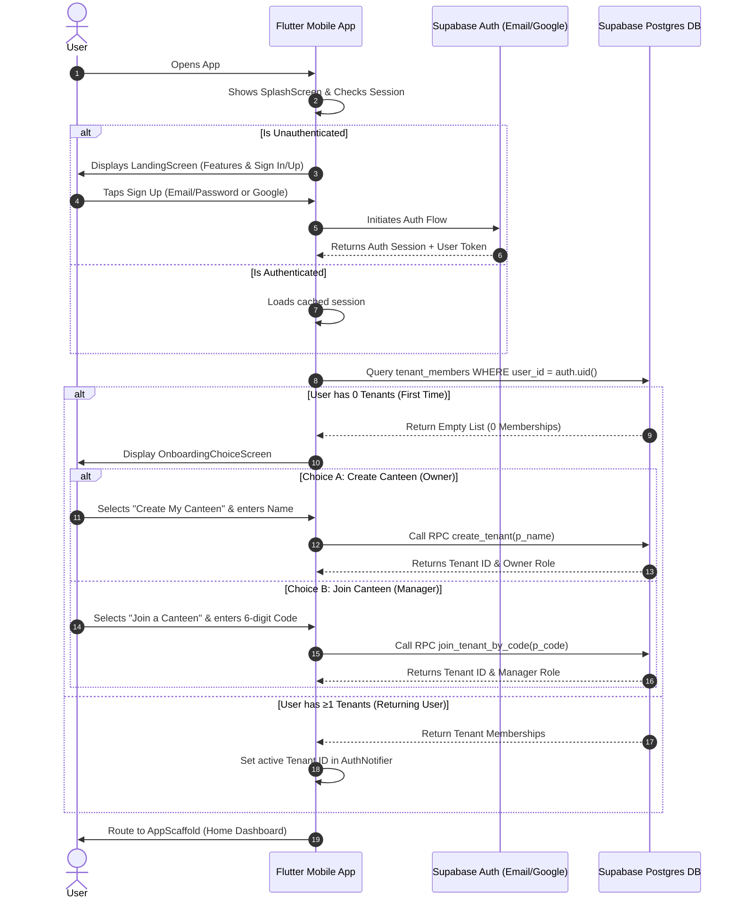

# Smart-Hisab v1.0 — Implementation Tasks Roadmap

> **Release Goal**: Deliver v1.0 (Free Tier) mobile app for canteen owners in Bangladesh to replace paper "hisab khata" notebooks.
> **Architecture**: Flutter (Riverpod), Supabase Auth & Postgres, REST/RPC services, 5-tab unified mobile layout.

---

## 1. Auth & Tenancy Sequence Overview

Before implementing UI screens, the authentication and onboarding sequence is defined as follows:



---

## 2. v1.0 Feature Testing & QA Checklist

### Phase 1: Auth & Onboarding Flow Testing
- [ ] **1.1 Splash Screen & Session Check**
  - Verify app displays splash screen branding on launch.
  - Verify unauthenticated user is navigated to `LandingScreen`.
  - Verify returning authenticated user is navigated directly to `AppScaffold` (Home Dashboard).
- [ ] **1.3 Email Confirmation & Password Auth**
  - Test Sign Up with new email and password, verifying email confirmation notice modal.
  - Test Sign In with confirmed email and password credentials.
- [ ] **1.4 Canteen Creation (Owner)**
  - Select "Create My Canteen" on onboarding choice screen.
  - Enter canteen name and tap submit.
  - Verify RPC `create_tenant` executes and routes user to Home as `owner`.
- [ ] **1.5 Canteen Joining (Manager)**
  - Select "Join a Canteen".
  - Enter valid 6-digit invite code.
  - Verify RPC `join_tenant_by_code` executes and assigns `manager` role.
  - Test entering an invalid/expired 6-digit code and verify error feedback.

---

### Phase 2: Business Day & Home Dashboard Testing
- [ ] **2.1 Day Status Verification**
  - Verify Home header displays "🟡 Day Closed" status chip when no active day exists.
  - Verify "Start Today's Day" CTA card is shown when day is closed.
- [ ] **2.2 Opening a Business Day**
  - Tap "Start Today's Day", enter opening drawer cash (e.g. ৳5,000), and confirm.
  - Verify RPC `start_business_day` runs and UI status updates to "🟢 Day Open".
  - Verify `ActiveDayStatsCard` shows active date, opening cash, meals count, cash collected, and outstanding baki.
- [ ] **2.3 Day Refresh & Pull-To-Refresh**
  - Perform pull-to-refresh (`RefreshIndicator`) on Home screen.
  - Verify active day stats re-fetch seamlessly without UI flicker.
- [ ] **2.4 Closing a Business Day**
  - Tap "Close Today's Day" button.
  - Enter actual closing cash drawer amount and notes in modal bottom sheet.
  - Confirm RPC `end_business_day` calculates expected cash, computes cash variance, and closes the day.

---

### Phase 3: Customers & Baki (AR) Testing
- [ ] **3.1 Customer Directory Listing**
  - Open `Customers` tab. Verify active shift banner displays current meal window & default rate.
  - Test search input debouncing (type name/phone/institution and confirm list filters cleanly after 300ms).
  - Verify pull-to-refresh reloads customer list.
- [ ] **3.2 Add New Customer**
  - Tap "+ Add Customer" button (or empty state CTA card).
  - Enter Name, Phone, Institution, and Address in modal bottom sheet.
  - Submit and verify customer appears immediately (optimistic update) and persists to backend.
  - Test 50-customer free tier limit indicator.
- [ ] **3.3 Meal Attendance Marking**
  - Toggle meal checkbox `[🍽️]` on customer card.
  - Verify RPC `record_meal_attendance` charges customer balance and updates stats card instantly.
  - Toggle off to unmark meal and verify balance deduction reverts.
- [ ] **3.4 Collect Baki Payment**
  - Swipe left on customer card or tap "Collect Payment" on detail page.
  - Enter collection amount in modal bottom sheet (with quick preset chips ৳100, ৳200, ৳500).
  - Submit and verify RPC `record_baki_payment` updates customer wallet balance and records transaction entry.
- [ ] **3.5 Customer Detail Page**
  - Tap customer tile to open detail view.
  - Verify outstanding balance header card and infinite scroll transaction history ledger.

---

### Phase 4: Cashbook & Bazar (AP) Testing
- [ ] **4.1 Cashbook Dashboard**
  - Open `Cashbook` tab. Verify top summary header displays Inflow, Outflow, and Net cash calculation.
  - Verify list renders today's transaction entries (`day_entries`) categorized by type.
- [ ] **4.2 Record Expense / Market Cost**
  - Tap "+ Expense" button. Select category (e.g. `market_cost` / `canteen_expense`), enter amount, optional vendor, and note.
  - Submit and verify expense entry records as cash outflow and updates vendor balance if vendor was selected.
- [ ] **4.3 Record Misc Income**
  - Tap "+ Income" button. Enter amount and note.
  - Verify entry records as cash inflow and updates cashbook summary header.
- [ ] **4.4 Add Day Note / Market List**
  - Tap "+ Note" button. Select type (`market_list` / `general_note` / `issue`) and enter content.
  - Submit and verify note displays in Day Notes section.

---

### Phase 5: Staff & Payroll Testing
- [ ] **5.1 Staff Directory Listing**
  - Open `Staff` tab. Verify staff list renders staff avatars, role badges, and phone metadata.
  - Test 3-staff free tier limit indicator.
- [ ] **5.2 Add New Staff Member**
  - Tap "+ Add Staff" button. Enter Name, Role picker (`Cook`, `Cashier`, `Cleaner`), and Phone.
  - Submit and verify staff member appears in directory.
- [ ] **5.3 Record Salary Payout**
  - Swipe left on staff row and select "Pay", or tap "Record Salary Payout" on Staff Detail.
  - Enter payout amount, payment mode (`cash` / `bank` / `mobile_money`), and notes.
  - Submit and verify RPC `record_salary_payout` inserts outflow transaction and updates staff total paid ledger.
- [ ] **5.4 Staff Detail Page**
  - Tap staff card to view monthly salary overview card and payout history list.

---

### Phase 6: Settings & Configuration Testing
- [ ] **6.1 Canteen Profile**
  - Open `Settings` -> `Canteen Profile`. View canteen name, creation date, and subscription tier status (`Free`).
  - Test editing canteen name and saving changes.
- [ ] **6.2 Shifts & Meal Rates**
  - Open `Settings` -> `Shifts & Meal Configs`. View Breakfast, Lunch, and Dinner shift time windows & rates.
  - Tap "Edit" on a shift, modify rate/timings in bottom sheet, and submit.
  - Verify new `meal_configs` row is created with effective timestamp.
- [ ] **6.3 Invite Manager**
  - Open `Settings` -> `Invite Manager`. Tap "Generate Code".
  - Verify RPC `generate_invite_code` produces a unique 6-digit code with 24-hour countdown timer.
  - Test "Copy" and "Share" actions.
- [ ] **6.4 Vendors Directory & Ledger**
  - Open `Settings` -> `Vendors`. View supplier list with outstanding AP balances.
  - Tap "+ Add Vendor" to create new supplier profile.
  - Swipe left / tap "Pay Vendor" to record vendor settlement via `record_vendor_payment`.
  - Tap vendor card to view detailed transaction ledger.
- [ ] **6.5 Theme System & Switcher (Light Default & Dark Mode)**
  - Default app theme to **Light Theme (White background)** with senior UI/UX Emerald Green (`#059669`) primary palette and Slate surfaces.
  - Implement full adaptive theme support for both Light and Dark modes.
  - Toggle "Dark Mode" switch in Settings. Verify entire UI smoothly switches between Light and Dark themes via Riverpod `themeNotifierProvider` and persists preference in Hive.
- [x] **6.6 My Profile & Sign Out**
  - Open `Settings` -> `My Profile` or `Settings`. View user email, role, and active canteen memberships.
  - Tap "Sign Out" to present the AGENTS.md compliant confirmation modal bottom sheet.
  - Confirm sign out to clear Supabase session, purge Hive cached credentials (`active_tenant`, `active_user`), set `AuthStatus.unauthenticated`, and reactively navigate back to `LoginScreen`.


---

## 3. Design & Ergonomic Checklist [COMPLETED]

- [x] All modal dialogs use `showModalBottomSheet` with `BorderRadius.vertical(top: Radius.circular(32))`.
- [x] No modal bottom sheet contains a top-right 'X' or close button.
- [x] Skeleton loaders (`shimmer` package) implemented for all loading states.
- [x] Every scrollable view includes `RefreshIndicator`.
- [x] Primary card headers & titles configured to minimum `16px` bold font size.
- [x] All views wrapped with `SafeArea`.


---

## 4. Backend RPC Specifications & Response Style

All Supabase PostgreSQL functions (RPCs) MUST follow a unified JSON response envelope style:

### Standard Success Response Format
```json
{
  "success": true,
  "data": { ... },
  "message": "Operation completed successfully"
}
```

### Standard Error Response Format
```json
{
  "success": false,
  "error": {
    "code": "ERROR_CODE_NAME",
    "message": "Human readable error message in Bangla/English"
  }
}
```

---

### Complete v1.0 RPC Reference Matrix

| RPC Function | Input Parameters | Returns | Key Operations & Side Effects |
|---|---|---|---|
| `create_tenant` | `p_name TEXT` | `JSON` | Creates `tenants` row, adds `tenant_members` (role: `owner`), auto-seeds shifts (Breakfast, Lunch, Dinner). |
| `generate_invite_code` | `p_tenant_id UUID`, `p_role TEXT` | `JSON` | Generates unique 6-digit string in `tenant_invites` with 24-hour expiry. |
| `join_tenant_by_code` | `p_code TEXT` | `JSON` | Validates code expiry/usage, creates `tenant_members` (role: `manager`), marks code as used. |
| `start_business_day` | `p_tenant_id UUID`, `p_opening_cash NUMERIC` | `JSON` | Checks no active day exists, creates new `business_days` row with `status = 'open'`. |
| `end_business_day` | `p_tenant_id UUID`, `p_day_id UUID`, `p_closing_cash NUMERIC`, `p_notes TEXT` | `JSON` | Sums inflows & outflows, computes `expected_cash` & `variance`, updates `status = 'closed'`. |
| `get_active_business_day` | `p_tenant_id UUID` | `JSON` | Fetches active day, meal counts, cash collected, and outstanding baki stats. |
| `record_meal_attendance` | `p_tenant_id UUID`, `p_customer_id UUID`, `p_shift_id UUID` | `JSON` | Inserts `meal_attendance`, auto-charges customer wallet, updates running balance. |
| `record_baki_payment` | `p_tenant_id UUID`, `p_customer_id UUID`, `p_amount NUMERIC`, `p_notes TEXT` | `JSON` | Inserts `baki_collections` & `day_entries`, reduces customer wallet balance. |
| `record_expense` | `p_tenant_id UUID`, `p_category TEXT`, `p_amount NUMERIC`, `p_vendor_id UUID`, `p_notes TEXT` | `JSON` | Inserts `expenses` & `day_entries` (outflow). If vendor specified, increases vendor debt balance. |
| `record_salary_payout` | `p_tenant_id UUID`, `p_staff_id UUID`, `p_amount NUMERIC`, `p_payment_mode TEXT`, `p_notes TEXT` | `JSON` | Inserts `salary_payouts` & `day_entries` (outflow), updates staff wallet balance. |
| `record_vendor_payment` | `p_tenant_id UUID`, `p_vendor_id UUID`, `p_amount NUMERIC`, `p_notes TEXT` | `JSON` | Inserts `vendor_payments` & `day_entries` (outflow), reduces vendor debt balance. |

---

### Detailed RPC Payload Contracts

#### 1. `create_tenant`
* **Function Signature**: `create_tenant(p_name TEXT)`
* **Response Payload**:
```json
{
  "success": true,
  "data": {
    "tenant_id": "d3b07384-d113-4607-95e2-632057d227cf",
    "name": "Rahim's Canteen",
    "role": "owner",
    "created_at": "2026-08-12T10:00:00Z"
  }
}
```

#### 2. `join_tenant_by_code`
* **Function Signature**: `join_tenant_by_code(p_code TEXT)`
* **Response Payload**:
```json
{
  "success": true,
  "data": {
    "tenant_id": "d3b07384-d113-4607-95e2-632057d227cf",
    "name": "Rahim's Canteen",
    "role": "manager",
    "joined_at": "2026-08-12T10:15:00Z"
  }
}
```
* **Error Codes**: `INVALID_CODE`, `CODE_EXPIRED`, `CODE_ALREADY_USED`, `ALREADY_MEMBER`.

#### 3. `start_business_day`
* **Function Signature**: `start_business_day(p_tenant_id UUID, p_opening_cash NUMERIC)`
* **Response Payload**:
```json
{
  "success": true,
  "data": {
    "day_id": "e4c18495-e224-5718-a6f3-743168e338da",
    "date": "2026-08-12",
    "status": "open",
    "opening_cash": 5000.00
  }
}
```
* **Error Codes**: `DAY_ALREADY_OPEN`.

#### 4. `end_business_day`
* **Function Signature**: `end_business_day(p_tenant_id UUID, p_day_id UUID, p_closing_cash NUMERIC, p_notes TEXT)`
* **Response Payload**:
```json
{
  "success": true,
  "data": {
    "day_id": "e4c18495-e224-5718-a6f3-743168e338da",
    "status": "closed",
    "opening_cash": 5000.00,
    "total_inflows": 8200.00,
    "total_outflows": 3500.00,
    "expected_cash": 9700.00,
    "actual_closing_cash": 9500.00,
    "variance": -200.00,
    "notes": "Shortage of 200 due to unrecorded market tea expense."
  }
}
```
* **Error Codes**: `DAY_ALREADY_CLOSED`, `INVALID_DAY_ID`.

#### 5. `record_baki_payment`
* **Function Signature**: `record_baki_payment(p_tenant_id UUID, p_customer_id UUID, p_amount NUMERIC, p_notes TEXT)`
* **Response Payload**:
```json
{
  "success": true,
  "data": {
    "transaction_id": "f5d29506-f335-6829-b7g4-854279f449eb",
    "customer_id": "a1b2c3d4-e5f6-7890-abcd-ef1234567890",
    "amount_paid": 500.00,
    "previous_balance": 2400.00,
    "new_balance": 1900.00,
    "created_at": "2026-08-12T11:20:00Z"
  }
}
```

