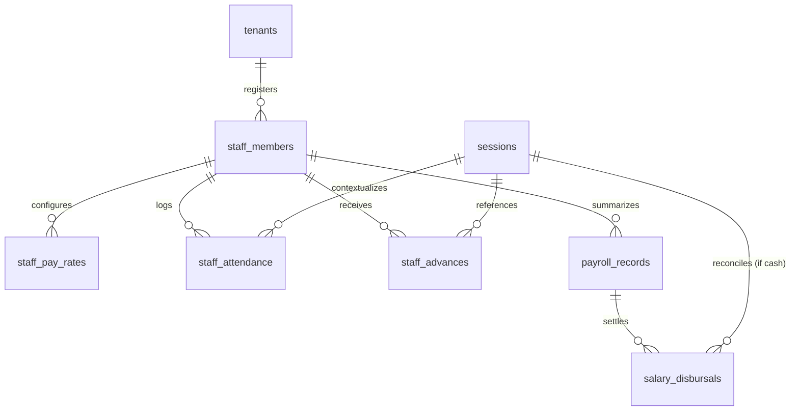
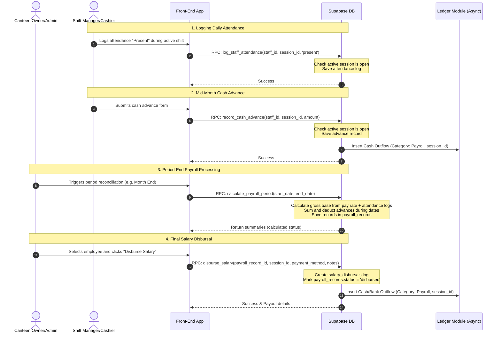

# Detailed Specification: Staff Attendance & Payroll (`staff-payroll`)

This document provides a detailed specification for the **Staff Attendance & Payroll** module. This module governs the registration of employees, daily shift-based attendance tracking, cash advances, payroll reconciliation, and disbursals within the Canteen Management System.

---

## 1. Feature Overview & Objectives

The **Staff Attendance & Payroll** module is decoupled and multi-tenant by design. It isolates employee records and pay settings per tenant, linking daily operational activities (attendance, cash advances) to active temporal contexts (**Operational Sessions**) defined in the `shift-sessions` module.

### Key Objectives:
*   **Decoupled Registry:** Manage employee classifications and active rosters per tenant.
*   **Temporal Context Association:** Force attendance and mid-shift cash advance logs to link directly to an active `session_id`, ensuring accurate ledger integration.
*   **Dynamic Salary Calculations:** Automatically compile base salary based on pay rate configurations (daily, hourly, monthly) and attendance logs.
*   **Deduction Processing:** Track and automatically subtract mid-month cash advances from final payouts.
*   **Double-Entry Ledger Integration:** Trigger automatic expense/outflow transactions inside the unified financial register (`transaction_ledger`) whenever a cash advance or salary payment is processed.
*   **Retroactive Lock Security:** Prevent updates to attendance, advances, or drawer-disbursed salaries once their associated operational session is closed.

---

## 2. User Stories

### Persona A: Canteen Owner (Admin/Owner Role)
1.  **As a** Canteen Owner,  
    **I want to** register staff members, specify their duties (Cook, Server, Manager), and configure their pay rates (hourly, daily, monthly),  
    **So that** payroll calculations can be automated correctly.
2.  **As a** Canteen Owner,  
    **I want to** generate payroll summaries for a selected date range to calculate base pay, deduct advances, and see net salary due,  
    **So that** I can ensure accurate and timely payout settlements.
3.  **As a** Canteen Owner,  
    **I want to** disburse salary payouts and record them as ledger outflows,  
    **So that** my bookkeeping register stays accurate and cash drawer logs reconcile correctly.
4.  **As a** Canteen Owner,  
    **I want to** generate a person-based report summarizing a staff member's attendance, advances, and payroll history,  
    **So that** I can present a clear breakdown of their status and earnings to them.

### Persona B: Shift Manager (Member Role with Elevated Permission)
1.  **As a** Shift Manager,  
    **I want to** record staff attendance (Present, Absent, Half-day) for employees working during the active shift session,  
    **So that** their daily labor is verified.
2.  **As a** Shift Manager,  
    **I want to** register cash advances given to staff members directly from the active drawer balance,  
    **So that** the cash is accounted for in shift reconciliation and is deducted from their salary.
3.  **As a** Shift Manager,  
    **I want to** generate a person-based report of a staff member's attendance and advances,  
    **So that** I can review and show it to the employee at the workplace.

---

## 3. Data Model

The database schema isolates all data per tenant using a `tenant_id` column protected by Row-Level Security (RLS). 



### Table Definitions

#### 1. `staff_members` (Employee Profiles)
Tracks the metadata of canteen staff members.

| Column Name | Type | Constraints | Description |
| :--- | :--- | :--- | :--- |
| `id` | `uuid` | Primary Key, `default gen_random_uuid()` | Unique employee identifier. |
| `tenant_id` | `uuid` | Foreign Key -> `tenants.id`, `not null` | Scopes this profile to a tenant. |
| `full_name` | `text` | `not null` | First and last name of employee. |
| `role` | `text` | `not null` | Employee title (e.g. Cook, Server, Manager). |
| `phone` | `text` | `not null` | Mandatory contact number. Unique within tenant. |
| `is_active` | `boolean` | `default true`, `not null` | Soft-disable flag. |
| `allow_terminal_login`| `boolean` | `default false`, `not null` | Controls PIN-based counter terminal access. |
| `hashed_pin` | `text` | Nullable | Cryptographic hash of the private 4-digit PIN. |
| `temp_pin` | `text` | Nullable | Clear-text temporary setup PIN (displayed to Owner). |
| `created_at` | `timestamptz` | `default now()`, `not null` | Audit timestamp. |
| `updated_at` | `timestamptz` | `default now()`, `not null` | Audit timestamp. |

#### 2. `staff_pay_rates` (Wages Configuration)
Stores the historical/current wage structures. The active rate is determined by matching the date against `effective_from`.

| Column Name | Type | Constraints | Description |
| :--- | :--- | :--- | :--- |
| `id` | `uuid` | Primary Key, `default gen_random_uuid()` | Unique identifier. |
| `tenant_id` | `uuid` | Foreign Key -> `tenants.id`, `not null` | Scopes this rate to a tenant. |
| `staff_id` | `uuid` | Foreign Key -> `staff_members.id`, `not null` | Link to the employee. |
| `rate_type` | `text` | `not null`, `check (rate_type in ('hourly', 'daily', 'monthly'))` | Frequency/mechanism of rate. |
| `amount` | `numeric(12, 2)` | `not null`, `check (amount >= 0)` | Monetary wage amount. |
| `effective_from` | `date` | `not null` | Calendar date from which this rate is active. |
| `created_at` | `timestamptz` | `default now()`, `not null` | Audit tracking. |

#### 3. `staff_attendance` (Shift Attendance Logs)
Daily or shift-based record of attendance.

| Column Name | Type | Constraints | Description |
| :--- | :--- | :--- | :--- |
| `id` | `uuid` | Primary Key, `default gen_random_uuid()` | Unique attendance identifier. |
| `tenant_id` | `uuid` | Foreign Key -> `tenants.id`, `not null` | Scopes this attendance to a tenant. |
| `staff_id` | `uuid` | Foreign Key -> `staff_members.id`, `not null` | Employee being logged. |
| `session_id` | `uuid` | Foreign Key -> `sessions.id`, `not null` | Operational session context. |
| `business_date` | `date` | `not null` | Date of shift. |
| `status` | `text` | `not null`, `check (status in ('present', 'absent', 'half_day'))` | Attendance outcome. |
| `notes` | `text` | Nullable | Reason for absence or delay notes. |
| `created_at` | `timestamptz` | `default now()`, `not null` | Audit tracking. |
| `updated_at` | `timestamptz` | `default now()`, `not null` | Audit tracking. |

#### 4. `staff_advances` (Cash Advance Registry)
Log of cash advances paid mid-period to be deducted from final pay.

| Column Name | Type | Constraints | Description |
| :--- | :--- | :--- | :--- |
| `id` | `uuid` | Primary Key, `default gen_random_uuid()` | Unique advance identifier. |
| `tenant_id` | `uuid` | Foreign Key -> `tenants.id`, `not null` | Scopes this record to a tenant. |
| `staff_id` | `uuid` | Foreign Key -> `staff_members.id`, `not null` | Employee receiving advance. |
| `session_id` | `uuid` | Foreign Key -> `sessions.id`, `not null` | Operational session where cash was drawn. |
| `amount` | `numeric(12, 2)` | `not null`, `check (amount > 0)` | Amount of cash drawn. |
| `reason` | `text` | Nullable | Description/reason. |
| `business_date` | `date` | `not null` | Date advance was given. |
| `created_at` | `timestamptz` | `default now()`, `not null` | Audit tracking. |
| `updated_at` | `timestamptz` | `default now()`, `not null` | Audit tracking. |

#### 5. `payroll_records` (Period Summaries)
Compiled summary of base earnings and deductions over a specific calendar range.

| Column Name | Type | Constraints | Description |
| :--- | :--- | :--- | :--- |
| `id` | `uuid` | Primary Key, `default gen_random_uuid()` | Unique record identifier. |
| `tenant_id` | `uuid` | Foreign Key -> `tenants.id`, `not null` | Scopes this record to a tenant. |
| `staff_id` | `uuid` | Foreign Key -> `staff_members.id`, `not null` | Employee reference. |
| `start_date` | `date` | `not null` | Start date of payroll calculation window. |
| `end_date` | `date` | `not null` | End date of payroll calculation window. |
| `base_salary` | `numeric(12, 2)` | `not null`, `default 0.00` | Calculated gross salary before deductions. |
| `advances_deducted` | `numeric(12, 2)` | `not null`, `default 0.00` | Cash advances applied as deductions. |
| `net_salary` | `numeric(12, 2)` | `not null`, `default 0.00` | `base_salary - advances_deducted`. |
| `status` | `text` | `not null`, `check (status in ('calculated', 'disbursed'))` | Finalization status of this payroll period. |
| `created_at` | `timestamptz` | `default now()`, `not null` | Audit tracking. |
| `updated_at` | `timestamptz` | `default now()`, `not null` | Audit tracking. |

#### 6. `salary_disbursals` (Disbursal Logs)
Registry of payments clearing outstanding payroll record totals.

| Column Name | Type | Constraints | Description |
| :--- | :--- | :--- | :--- |
| `id` | `uuid` | Primary Key, `default gen_random_uuid()` | Unique disbursal identifier. |
| `tenant_id` | `uuid` | Foreign Key -> `tenants.id`, `not null` | Scopes this log to a tenant. |
| `payroll_record_id` | `uuid` | Foreign Key -> `payroll_records.id`, `not null` | Payroll summary cleared. |
| `session_id` | `uuid` | Foreign Key -> `sessions.id` | Nullable. Session ID if paid in cash from active drawer. |
| `amount` | `numeric(12, 2)` | `not null`, `check (amount > 0)` | Disbursed salary amount. |
| `payment_method` | `text` | `not null`, `check (payment_method in ('cash', 'mobile_wallet', 'bank_transfer'))` | Payment method. |
| `disbursed_at` | `timestamptz` | `default now()`, `not null` | Date and time payout occurred. |
| `disbursed_by_user_id`| `uuid` | Foreign Key -> `auth.users`, Nullable | Web/Dashboard administrator who cleared the payout. |
| `disbursed_by_staff_id`| `uuid` | Foreign Key -> `staff_members.id`, Nullable | Counter terminal staff member who cleared the payout. |
| `notes` | `text` | Nullable | Payment references or transaction IDs. |
| `created_at` | `timestamptz` | `default now()`, `not null` | Audit tracking. |

### Constraints & Indexes
1.  **Unique Attendance per Session:** Avoid logging attendance multiple times for the same employee within a single session.
    ```sql
    create unique index unique_staff_attendance_per_session 
    on public.staff_attendance (tenant_id, staff_id, session_id);
    ```
2.  **No Overlapping Payroll Records:** Ensure no employee has overlapping calculated payroll dates.
    ```sql
    -- Note: Enforced via business logic before row insertion
    ```
3.  **Foreign Key Indexes:**
    ```sql
    create index idx_staff_members_tenant_id on public.staff_members(tenant_id);
    create index idx_staff_pay_rates_staff_id on public.staff_pay_rates(staff_id);
    create index idx_staff_attendance_session_id on public.staff_attendance(session_id);
    create index idx_staff_attendance_staff_id on public.staff_attendance(staff_id);
    create index idx_staff_advances_session_id on public.staff_advances(session_id);
    create index idx_staff_advances_staff_id on public.staff_advances(staff_id);
    create index idx_payroll_records_staff_id on public.payroll_records(staff_id);
    create index idx_salary_disbursals_payroll_id on public.salary_disbursals(payroll_record_id);
    create index idx_salary_disbursals_session_id on public.salary_disbursals(session_id);
    ```

---

## 4. Permission Control & Row-Level Security (RLS)

All tables use Row-Level Security (RLS) policies checking the dynamic role definitions stored inside `tenant_roles.permissions`.

### Dynamic Permission Schema

The permissions map under `tenant_roles.permissions` for the **Staff Attendance & Payroll** module is structured as follows:

```json
{
  "modules": {
    "staff_payroll": {
      "staff_read": true,
      "staff_write": false,
      "attendance_read": true,
      "attendance_write": true,
      "advances_read": true,
      "advances_write": true,
      "payroll_read": true,
      "payroll_write": false,
      "payroll_disburse": false
    }
  }
}
```

### Default Role Mapping Matrix

| Operations | Cashier / Operator (Default Member) | Shift Manager (Default Admin) | Owner (Default Immutable) | Platform Superadmin |
| :--- | :--- | :--- | :--- | :--- |
| **Staff Registry (Read)** | `staff_read` = `true` | `staff_read` = `true` | Yes (All) | Yes (Bypass RLS) |
| **Staff Registry (Write)**| `staff_write` = `false` | `staff_write` = `true` | Yes (All) | Yes (Bypass RLS) |
| **Attendance (Read)** | `attendance_read` = `true` | `attendance_read` = `true` | Yes (All) | Yes (Bypass RLS) |
| **Attendance (Write)** | `attendance_write` = `true` | `attendance_write` = `true` | Yes (All) | Yes (Bypass RLS) |
| **Advances (Read)** | `advances_read` = `true` | `advances_read` = `true` | Yes (All) | Yes (Bypass RLS) |
| **Advances (Write)** | `advances_write` = `true` | `advances_write` = `true` | Yes (All) | Yes (Bypass RLS) |
| **Payroll Calc (Read/Write)**| `payroll_read` = `false`, `payroll_write` = `false` | `payroll_read` = `true`, `payroll_write` = `true` | Yes (All) | Yes (Bypass RLS) |
| **Salary Disbursal** | `payroll_disburse` = `false` | `payroll_disburse` = `true` | Yes (All) | Yes (Bypass RLS) |

### Core RLS Policies (SQL Implementation)

```sql
-- Enable Row-Level Security
alter table public.staff_members enable row level security;
alter table public.staff_pay_rates enable row level security;
alter table public.staff_attendance enable row level security;
alter table public.staff_advances enable row level security;
alter table public.payroll_records enable row level security;
alter table public.salary_disbursals enable row level security;

-- Policies for Staff Members
create policy "Users can view staff in their tenant"
  on public.staff_members
  for select
  using (
    public.has_module_permission(tenant_id, 'staff_payroll', 'staff_read')
  );

create policy "Users can manage staff in their tenant"
  on public.staff_members
  for all
  using (
    public.has_module_permission(tenant_id, 'staff_payroll', 'staff_write')
  )
  with check (
    public.has_module_permission(tenant_id, 'staff_payroll', 'staff_write')
  );

-- Policies for Staff Pay Rates
create policy "Users can view pay rates in their tenant"
  on public.staff_pay_rates
  for select
  using (
    public.has_module_permission(tenant_id, 'staff_payroll', 'staff_write') -- pay rates restricted to HR/Write accessors
  );

create policy "Users can manage pay rates in their tenant"
  on public.staff_pay_rates
  for all
  using (
    public.has_module_permission(tenant_id, 'staff_payroll', 'staff_write')
  )
  with check (
    public.has_module_permission(tenant_id, 'staff_payroll', 'staff_write')
  );

-- Policies for Staff Attendance
create policy "Users can view attendance logs in their tenant"
  on public.staff_attendance
  for select
  using (
    public.has_module_permission(tenant_id, 'staff_payroll', 'attendance_read')
  );

create policy "Users can write attendance logs in their tenant"
  on public.staff_attendance
  for all
  using (
    public.has_module_permission(tenant_id, 'staff_payroll', 'attendance_write')
  )
  with check (
    public.has_module_permission(tenant_id, 'staff_payroll', 'attendance_write')
  );

-- Policies for Staff Advances
create policy "Users can view advances in their tenant"
  on public.staff_advances
  for select
  using (
    public.has_module_permission(tenant_id, 'staff_payroll', 'advances_read')
  );

create policy "Users can write advances in their tenant"
  on public.staff_advances
  for all
  using (
    public.has_module_permission(tenant_id, 'staff_payroll', 'advances_write')
  )
  with check (
    public.has_module_permission(tenant_id, 'staff_payroll', 'advances_write')
  );

-- Policies for Payroll Records & Disbursals
create policy "Users can view payroll summaries in their tenant"
  on public.payroll_records
  for select
  using (
    public.has_module_permission(tenant_id, 'staff_payroll', 'payroll_read')
  );

create policy "Users can manage payroll summaries in their tenant"
  on public.payroll_records
  for all
  using (
    public.has_module_permission(tenant_id, 'staff_payroll', 'payroll_write')
  )
  with check (
    public.has_module_permission(tenant_id, 'staff_payroll', 'payroll_write')
  );

create policy "Users can view disbursals in their tenant"
  on public.salary_disbursals
  for select
  using (
    public.has_module_permission(tenant_id, 'staff_payroll', 'payroll_read')
  );

create policy "Users can process disbursals in their tenant"
  on public.salary_disbursals
  for insert
  with check (
    public.has_module_permission(tenant_id, 'staff_payroll', 'payroll_disburse')
  );
```

---

## 5. API Flow & Lifecycle Operations



### Database RPC Functions

#### 1. Log Staff Attendance: `log_staff_attendance`
Logs attendance for a specific employee context, enforcing that the session is active and open.

```sql
create or replace function public.log_staff_attendance(
  p_tenant_id uuid,
  p_staff_id uuid,
  p_session_id uuid,
  p_status text,
  p_notes text default null
)
returns uuid
security definer
language plpgsql
as $$
declare
  v_attendance_id uuid;
  v_session_status text;
  v_business_date date;
begin
  -- 1. Verify active session context is open
  select status, business_date into v_session_status, v_business_date
  from public.sessions
  where id = p_session_id and tenant_id = p_tenant_id;

  if v_session_status is null then
    raise exception 'Session does not exist.';
  elsif v_session_status = 'closed' then
    raise exception 'Cannot log attendance. The operational session has been closed.';
  end if;

  -- 2. Insert or update attendance log
  insert into public.staff_attendance (
    tenant_id,
    staff_id,
    session_id,
    business_date,
    status,
    notes,
    updated_at
  )
  values (
    p_tenant_id,
    p_staff_id,
    p_session_id,
    v_business_date,
    p_status,
    p_notes,
    now()
  )
  on conflict (tenant_id, staff_id, session_id) 
  do update set
    status = excluded.status,
    notes = excluded.notes,
    updated_at = now()
  returning id into v_attendance_id;

  return v_attendance_id;
end;
$$;
```

#### 2. Record Cash Advance: `record_cash_advance`
Logs a cash advance drawn from the drawer, verifying that the session is open.

```sql
create or replace function public.record_cash_advance(
  p_tenant_id uuid,
  p_staff_id uuid,
  p_session_id uuid,
  p_amount numeric,
  p_reason text default null
)
returns uuid
security definer
language plpgsql
as $$
declare
  v_advance_id uuid;
  v_session_status text;
  v_business_date date;
begin
  -- 1. Check session status
  select status, business_date into v_session_status, v_business_date
  from public.sessions
  where id = p_session_id and tenant_id = p_tenant_id;

  if v_session_status is null then
    raise exception 'Session does not exist.';
  elsif v_session_status = 'closed' then
    raise exception 'Cannot record cash advance. Operational session is closed.';
  end if;

  -- 2. Record staff advance
  insert into public.staff_advances (
    tenant_id,
    staff_id,
    session_id,
    amount,
    reason,
    business_date
  )
  values (
    p_tenant_id,
    p_staff_id,
    p_session_id,
    p_amount,
    p_reason,
    v_business_date
  )
  returning id into v_advance_id;

  return v_advance_id;
end;
$$;
```

#### 3. Calculate Period Payroll: `calculate_payroll_period`
Calculates and inserts payroll summary records for a range of dates.

```sql
create or replace function public.calculate_payroll_period(
  p_tenant_id uuid,
  p_staff_id uuid,
  p_start_date date,
  p_end_date date
)
returns uuid
security definer
language plpgsql
as $$
declare
  v_record_id uuid;
  v_rate_type text;
  v_rate_amount numeric;
  v_base_salary numeric := 0.00;
  v_advances_deducted numeric := 0.00;
  v_net_salary numeric := 0.00;
  v_days_present numeric := 0.00;
begin
  -- 1. Fetch effective pay rate configuration
  select rate_type, amount into v_rate_type, v_rate_amount
  from public.staff_pay_rates
  where staff_id = p_staff_id
    and tenant_id = p_tenant_id
    and effective_from <= p_start_date
  order by effective_from desc
  limit 1;

  if v_rate_amount is null then
    raise exception 'No active wage structure configured for this employee.';
  end if;

  -- 2. Calculate base wage based on rate configuration
  if v_rate_type = 'daily' then
    -- Count attendance records
    select sum(
      case status
        when 'present' then 1.0
        when 'half_day' then 0.5
        else 0.0
      end
    ) into v_days_present
    from public.staff_attendance
    where staff_id = p_staff_id
      and tenant_id = p_tenant_id
      and business_date >= p_start_date
      and business_date <= p_end_date;

    v_base_salary := coalesce(v_days_present, 0) * v_rate_amount;

  elsif v_rate_type = 'monthly' then
    v_base_salary := v_rate_amount; -- fixed base rate
  else
    -- Hourly / custom configurations (default fallbacks)
    v_base_salary := v_rate_amount;
  end if;

  -- 3. Sum advances disbursed during the period
  select coalesce(sum(amount), 0.00) into v_advances_deducted
  from public.staff_advances
  where staff_id = p_staff_id
    and tenant_id = p_tenant_id
    and business_date >= p_start_date
    and business_date <= p_end_date;

  v_net_salary := v_base_salary - v_advances_deducted;
  if v_net_salary < 0 then
    v_net_salary := 0.00; -- payroll floor
  end if;

  -- 4. Upsert payroll summary record
  insert into public.payroll_records (
    tenant_id,
    staff_id,
    start_date,
    end_date,
    base_salary,
    advances_deducted,
    net_salary,
    status
  )
  values (
    p_tenant_id,
    p_staff_id,
    p_start_date,
    p_end_date,
    v_base_salary,
    v_advances_deducted,
    v_net_salary,
    'calculated'
  )
  returning id into v_record_id;

  return v_record_id;
end;
$$;
```

#### 4. Disburse Salary: `disburse_salary`
Logs salary disbursal payments, updating payroll states.

```sql
create or replace function public.disburse_salary(
  p_tenant_id uuid,
  p_payroll_record_id uuid,
  p_session_id uuid, -- Nullable if bank transfer
  p_amount numeric,
  p_payment_method text,
  p_notes text default null
)
returns uuid
security definer
language plpgsql
as $$
declare
  v_disbursal_id uuid;
  v_session_status text;
  v_payroll_status text;
begin
  -- 1. Validate payroll summary state
  select status into v_payroll_status
  from public.payroll_records
  where id = p_payroll_record_id and tenant_id = p_tenant_id;

  if v_payroll_status is null then
    raise exception 'Payroll record not found.';
  elsif v_payroll_status = 'disbursed' then
    raise exception 'Payroll has already been disbursed.';
  end if;

  -- 2. Verify operational session context if paid in cash from register drawer
  if p_payment_method = 'cash' then
    if p_session_id is null then
      raise exception 'Session ID is required for cash payments.';
    end if;

    select status into v_session_status
    from public.sessions
    where id = p_session_id and tenant_id = p_tenant_id;

    if v_session_status is null then
      raise exception 'Session not found.';
    elsif v_session_status = 'closed' then
      raise exception 'Cannot disburse salary from a closed operational session.';
    end if;
  end if;

  -- 3. Log disbursal records
  insert into public.salary_disbursals (
    tenant_id,
    payroll_record_id,
    session_id,
    amount,
    payment_method,
    disbursed_by,
    notes
  )
  values (
    p_tenant_id,
    p_payroll_record_id,
    p_session_id,
    p_amount,
    p_payment_method,
    auth.uid(),
    p_notes
  )
  returning id into v_disbursal_id;

  -- 4. Mark payroll record as completed/disbursed
  update public.payroll_records
  set status = 'disbursed',
      updated_at = now()
  where id = p_payroll_record_id;

  return v_disbursal_id;
end;
$$;
```

---

## 6. Immutable Ledger Constraints & Double-Entry Bookkeeping Triggers

### 1. Closed Operational Session Lock Trigger
Prevents manual tampering of log registries once the session registers are shut down. This relies on the pre-existing `public.enforce_closed_session_lock()` function.

```sql
create trigger check_staff_attendance_lock
before insert or update or delete
on public.staff_attendance
for each row
execute function public.enforce_closed_session_lock();

create trigger check_staff_advances_lock
before insert or update or delete
on public.staff_advances
for each row
execute function public.enforce_closed_session_lock();

-- Note: salary_disbursals uses conditional locking since bank/wallet methods may lack session IDs
create or replace function public.enforce_disbursal_session_lock()
returns trigger as $$
declare
  v_session_status text;
begin
  if NEW.session_id is not null then
    select status into v_session_status 
    from public.sessions 
    where id = NEW.session_id;

    if v_session_status = 'closed' then
      raise exception 'Disbursal locked. Associated session % is closed.', NEW.session_id;
    end if;
  end if;
  return NEW;
end;
$$ language plpgsql;

create trigger check_salary_disbursal_lock
before insert or update or delete
on public.salary_disbursals
for each row
execute function public.enforce_disbursal_session_lock();
```

### 2. Transaction Ledger Auto-Reporting Triggers
Automates ledger creation. Whenever an cash advance or salary disbursal record is logged, a matching outflow ledger item is generated to reconcile physical cash flow registers.

```sql
create or replace function public.handle_staff_financial_outflow()
returns trigger as $$
declare
  v_operator_id uuid;
  v_category text;
  v_payment_method text;
  v_desc text;
begin
  -- Resolve specific attributes based on trigger entity
  if TG_TABLE_NAME = 'staff_advances' then
    v_operator_id := auth.uid();
    v_category := 'Payroll';
    v_payment_method := 'cash';
    v_desc := 'Staff Cash Advance - ID: ' || NEW.staff_id;
  elsif TG_TABLE_NAME = 'salary_disbursals' then
    v_operator_id := NEW.disbursed_by;
    v_category := 'Payroll';
    v_payment_method := NEW.payment_method;
    v_desc := 'Salary Settlement - Period Record ID: ' || NEW.payroll_record_id;
  end if;

  -- Insert entry into central transaction ledger
  insert into public.transaction_ledger (
    tenant_id,
    session_id,
    type,
    category,
    amount,
    payment_method,
    operator_id,
    notes,
    created_at
  )
  values (
    NEW.tenant_id,
    NEW.session_id,
    'outflow',
    v_category,
    NEW.amount,
    v_payment_method,
    v_operator_id,
    v_desc,
    now()
  );

  return NEW;
end;
$$ language plpgsql;

-- Attach financial reporting triggers
create trigger report_staff_advance_outflow
after insert
on public.staff_advances
for each row
execute function public.handle_staff_financial_outflow();

create trigger report_salary_disbursal_outflow
after insert
on public.salary_disbursals
for each row
execute function public.handle_staff_financial_outflow();
```
