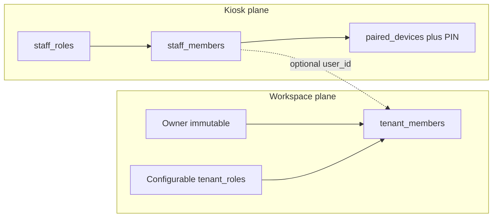
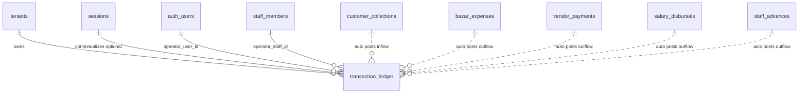
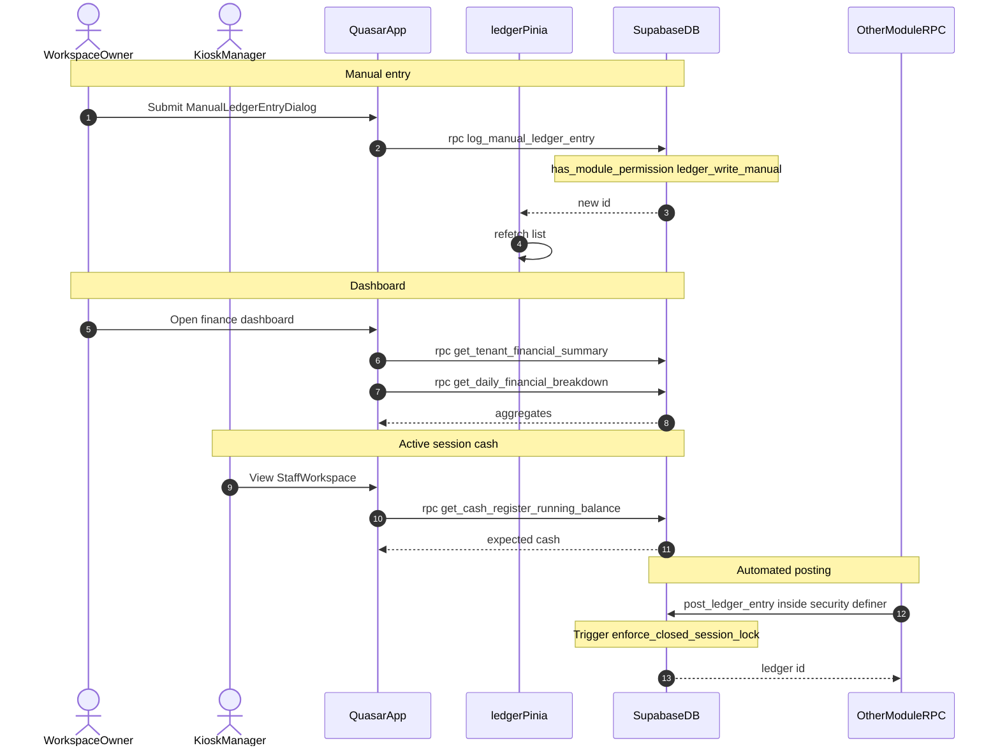

# RFC: Transaction Ledger (`financial-ledger`)

This document is the Technical Specification (RFC) for the **Transaction Ledger** module. This module is the central book of accounts for each tenant: an append-only register of operational cash flows, digital payments, bank transfers, and automated postings from other modules into a single, immutable, auditable ledger.

### Key Objectives
* **Central Bookkeeping Ledger:** Maintain a single consolidated register (`transaction_ledger`) for all inflows and outflows across the tenant workspace.
* **Automated Double-Entry Integration:** Receive postings from Meal & Customer (`POS`, `Debt Collection`), Procurement (`Raw Materials`, `Supplier Payout`), and Staff Attendance & Payroll (`Payroll`, `Staff Advance`), plus session close discrepancies (`Bazar Discrepancy` / `Bazar Surplus`).
* **Temporal & Session Isolation:** Optionally link rows to `session_id` so shift cash reconciliation and drawer expected-cash math work.
* **Immutable Audit Log:** Block `UPDATE` and `DELETE` at RLS and trigger level.
* **Financial Dashboard & Daily Breakdown:** Aggregate net P/L, expenses, receivables, payables, and per-day category cost breakdowns.
* **Localization:** Format amounts with tenant currency (default BDT / `৳`) and locale (default `bn`) via `Intl.NumberFormat` at the presentation layer.

### Implementation Status (as of this RFC)
| Layer | Status |
| :--- | :--- |
| Feature flag `financial-ledger` | Seeded; admin / tenant toggles exist |
| DB table / RPCs / RLS / immutability triggers | Not migrated |
| Pinia / routes / UI | Not built |
| Upstream `sessions` + `enforce_closed_session_lock` | Specced in [operational_shifts_sessions.md](./operational_shifts_sessions.md); lock **trigger** attaches in this module’s migration |
| Downstream auto-posting modules | Spec-only; call internal `post_ledger_entry` when those modules ship |

---

## 1. PRODUCT & SECURITY

### A. User Stories

#### Persona A: Canteen Owner (Owner Role)
1. **As a** Canteen Owner, **I want to** view a consolidated list of all financial inflows and outflows across cash, bank transfers, and mobile wallets, **so that** I have visibility into all financial activity.
2. **As a** Canteen Owner, **I want to** view a financial dashboard (net P/L, total expenses, customer receivables, supplier payables) over any date range, **so that** I can assess business health.
3. **As a** Canteen Owner, **I want to** view a daily financial breakdown (revenue, expense, net, and category costs) for a date range, **so that** I can see which costs erode margin day by day.
4. **As a** Canteen Owner, **I want to** log manual entries (withdrawals, capital, rent, utilities) into the ledger, **so that** off-system costs are bookkept.
5. **As a** Canteen Owner, **I want** past ledger entries to be immutable, **so that** staff cannot falsify records or cover shortages.

#### Persona B: Shift Manager (Kiosk Staff — Manager Role)
1. **As a** Shift Manager, **I want to** view transactions linked to my active session, **so that** I can verify collections and expenses before closing the drawer.
2. **As a** Shift Manager, **I want to** see the running cash balance for the active session, **so that** I know how much physical cash should be in the register.

### B. Identity & Role Planes (conjunct, not conflated)

Two permission planes share a tenant but use different identities. **Do not merge Manager into `tenant_members`.**

| Plane | Who | Auth | Permission source |
| :--- | :--- | :--- | :--- |
| **Workspace** | Owner (immutable) + configurable `tenant_roles` | Supabase Auth | `tenant_roles.permissions` |
| **Kiosk / floor** | Manager, Cashier, Staff | Device token + PIN | `staff_roles.permissions` |



**Rules:**
* **Manual ledger write and finance dashboard** are workspace Auth operations (`ledger_write_manual`, `dashboard_read`).
* **Session-scoped ledger read and cash balance** are primarily kiosk operations (`session_ledger_read`, `cash_balance_read`).
* Owner may also read the full ledger and dashboard via workspace routes.
* Automated postings from other modules never go through the client; they call `post_ledger_entry` inside `security definer` RPCs.

### C. Permission Control Matrices

#### C1. Workspace (`tenant_roles`)

Module key: `financial_ledger`. Feature gate: `enabled_features['financial-ledger'] === true`.

```json
{
  "modules": {
    "financial_ledger": {
      "ledger_read": "all",
      "ledger_write_manual": true,
      "dashboard_read": true
    }
  }
}
```

`ledger_read` values: `"all"` | `"self"` | `"none"`. Boolean keys are true/false.

| Operation | Configurable office role (e.g. Admin / Accountant) | Owner (immutable) | Platform Superadmin |
| :--- | :--- | :--- | :--- |
| Ledger Read | `"all"` or `"self"` (configurable) | Yes (`all`) | Bypass RLS |
| Ledger Manual Insert | configurable (default false for Admin) | Yes | Bypass RLS |
| Dashboard / Daily Breakdown Read | configurable | Yes | Bypass RLS |

**Owner immutability:** System `Owner` (`tenant_id is null`, `permissions = {"all": true}`) cannot be edited or deleted.

**Suggested defaults for seeded office roles:**
| Role | `ledger_read` | `ledger_write_manual` | `dashboard_read` |
| :--- | :--- | :--- | :--- |
| Admin | `"all"` | `false` | `true` |
| Accountant (if seeded) | `"all"` | `false` | `true` |
| Owner | `all` via `permissions.all` | Yes | Yes |

#### C2. Kiosk (`staff_roles`)

```json
{
  "modules": {
    "financial_ledger": {
      "session_ledger_read": true,
      "cash_balance_read": true
    }
  }
}
```

| Operation | Manager (default) | Cashier (default) | Staff (generic) |
| :--- | :--- | :--- | :--- |
| Session ledger read (active session rows) | true | true | false |
| Cash register running balance | true | true | false |

**Feature gate:** Workspace routes use `requiredFeature: 'financial-ledger'`. Kiosk UI for session ledger / cash balance also requires the feature flag.

### D. Authentication & Authorization

1. **Workspace (Owner / office):** Supabase Auth + `tenant_members`. Used for ledger list, manual entry, dashboard, daily breakdown. RPCs check `has_module_permission` / `get_ledger_read_scope`.
2. **Kiosk (Manager / Cashier):** Device token + PIN. Client calls `get_cash_register_running_balance` and session-scoped list via RPC or RLS-safe select after staff context is established. Capabilities from `has_staff_permission(staff_id, 'financial_ledger', …)`.
3. **Route guards:** Workspace — `requiredFeature` + `requiredModulePermission` on `tenant_roles`. Kiosk — pairing + staff PIN; hide session ledger / cash chip unless staff role grants it.
4. **Database:** RLS on `transaction_ledger`. Mutations that insert (manual or automated) go through `security definer` RPCs. Direct client `UPDATE`/`DELETE` denied by RLS and trigger.

---

## 2. BACKEND & DATA

### A. Data Modeling



#### Table: `public.transaction_ledger`

Append-only financial ledger for the tenant.

| Column | Type | Constraints | Description |
| :--- | :--- | :--- | :--- |
| `id` | `uuid` | PK, `default gen_random_uuid()` | Ledger entry id |
| `tenant_id` | `uuid` | FK → `tenants.id`, `not null` | Tenant scope |
| `session_id` | `uuid` | FK → `sessions.id`, nullable | Operational session; null for off-shift events (e.g. bank payouts) |
| `type` | `text` | `not null`, `check (type in ('inflow', 'outflow'))` | Fund direction |
| `category` | `text` | `not null`, see allowed set below | Classification |
| `amount` | `numeric(12, 2)` | `not null`, `check (amount >= 0)` | Absolute amount (sign via `type`) |
| `payment_method` | `text` | `not null`, `check (payment_method in ('cash', 'bank_transfer', 'mobile_wallet'))` | Settlement channel |
| `operator_user_id` | `uuid` | FK → `auth.users`, nullable | Workspace actor who logged the entry |
| `operator_staff_id` | `uuid` | FK → `staff_members.id`, nullable | Kiosk staff who logged the entry |
| `notes` | `text` | nullable | Audit note |
| `created_at` | `timestamptz` | `not null`, `default now()` | Creation epoch |
| `updated_at` | `timestamptz` | `not null`, `default now()` | Present for schema consistency; **never updated** (immutable rows) |

**Allowed `category` values** (enforce with `check`):

| Category | Typical `type` | Source |
| :--- | :--- | :--- |
| `POS` | inflow | Counter aggregated sales / meal module |
| `Debt Collection` | inflow | Customer payments |
| `Raw Materials` | outflow | Bazar / procurement |
| `Supplier Payout` | outflow | Vendor payments |
| `Payroll` | outflow | Salary disbursal |
| `Staff Advance` | outflow | Advances |
| `Bazar Discrepancy` | outflow | Session close short |
| `Bazar Surplus` | inflow | Session close over |
| `Overhead` | outflow | Manual / overhead |
| `Manual Inflow` | inflow | Manual capital / adjustment |
| `Manual Outflow` | outflow | Manual withdrawal / adjustment |

At least one of `operator_user_id` / `operator_staff_id` should be set for human-initiated rows; automated posts may set the initiating staff/user from the calling RPC context.

#### Indexes

```sql
create index idx_transaction_ledger_tenant_id
  on public.transaction_ledger (tenant_id);

create index idx_transaction_ledger_session_id
  on public.transaction_ledger (session_id);

create index idx_transaction_ledger_operator_user_id
  on public.transaction_ledger (operator_user_id);

create index idx_transaction_ledger_operator_staff_id
  on public.transaction_ledger (operator_staff_id);

create index idx_transaction_ledger_created_at
  on public.transaction_ledger (created_at desc);

create index idx_transaction_ledger_type_cat
  on public.transaction_ledger (tenant_id, type, category);

create index idx_transaction_ledger_tenant_created
  on public.transaction_ledger (tenant_id, created_at desc);
```

### B. Database Integration

1. **Migration:** `supabase/migrations/YYYYMMDDHHMMSS_transaction_ledger.sql` (after shifts/sessions migration so `sessions` + `enforce_closed_session_lock` exist).
2. **Contents:** table, indexes, category check, RLS policies, helpers, RPCs, immutability trigger, **attach** `check_transaction_session_lock` → `enforce_closed_session_lock`.
3. **Role JSONB seed:** Update default Admin / custom role templates with `modules.financial_ledger` keys; update Manager / Cashier `staff_roles` with kiosk keys.
4. **Types:** Regenerate `web/src/types/supabase.ts` after migrate.
5. **Existing data:** Table is greenfield; no backfill. Close-session expected cash in sessions module already tolerates missing ledger until this ships.

### C. API Surface & Design

No separate REST server. Client uses Supabase JS (`supabase.from` / `supabase.rpc`).

#### 1. List ledger entries (workspace)

| Op | Client call | Notes |
| :--- | :--- | :--- |
| List | `from('transaction_ledger').select('*, operator_staff:staff_members!operator_staff_id(full_name)').eq('tenant_id', tid).order('created_at', { ascending: false }).range(from, to)` | RLS via `get_ledger_read_scope` |
| Filter | `.eq('type', …)`, `.eq('category', …)`, `.eq('payment_method', …)`, `.eq('session_id', …)`, `.gte/lte('created_at', …)` | Client-side filters |

**Response row (example):**
```json
{
  "id": "uuid",
  "tenant_id": "uuid",
  "session_id": "uuid",
  "type": "inflow",
  "category": "POS",
  "amount": 12500.50,
  "payment_method": "cash",
  "operator_user_id": null,
  "operator_staff_id": "uuid",
  "notes": "Counter sales",
  "created_at": "2026-07-18T14:30:00Z",
  "updated_at": "2026-07-18T14:30:00Z"
}
```

#### 2. `rpc('log_manual_ledger_entry')` — workspace

**Request:**
```json
{
  "p_tenant_id": "uuid",
  "p_session_id": null,
  "p_type": "outflow",
  "p_category": "Overhead",
  "p_amount": 3500.00,
  "p_payment_method": "bank_transfer",
  "p_notes": "July electricity"
}
```

**Success response:** `uuid` (new ledger id). Sets `operator_user_id = auth.uid()`.

**Categories allowed for manual path:** `Overhead`, `Manual Inflow`, `Manual Outflow` (and matching `type`). Reject others with validation error.

#### 3. `rpc('get_tenant_financial_summary')` — workspace dashboard

**Request:**
```json
{
  "p_tenant_id": "uuid",
  "p_start_date": "2026-07-01T00:00:00Z",
  "p_end_date": "2026-07-31T23:59:59Z"
}
```

**Success response (row):**
```json
{
  "total_inflow": 450000.00,
  "total_outflow": 312000.00,
  "net_profit_loss": 138000.00,
  "outstanding_receivables": 22000.00,
  "outstanding_payables": 8500.00,
  "cash_sales_pos": 280000.00,
  "market_expenses": 95000.00,
  "payroll_expenses": 60000.00
}
```

Requires `dashboard_read`. Receivables/payables come from `customers` / `suppliers` outstanding balances when those tables exist; until then return `0` (guard with `to_regclass` or null-safe stubs).

#### 4. `rpc('get_daily_financial_breakdown')` — workspace

**Request:**
```json
{
  "p_tenant_id": "uuid",
  "p_start_date": "2026-07-01",
  "p_end_date": "2026-07-18"
}
```

**Success response:** array of daily rows (see RPC return columns in §F).

#### 5. `rpc('get_cash_register_running_balance')` — workspace or kiosk

**Request:**
```json
{
  "p_tenant_id": "uuid",
  "p_session_id": "uuid"
}
```

**Success response:** `numeric` (expected physical cash).

Formula: `opening_cash + cash inflows − cash outflows` for that session. Used by session close and kiosk banner.

Kiosk clients: grant execute to `anon` + `authenticated`; authorize inside RPC (device/staff path optional Phase 4 — MVP may require Auth-linked staff or call from `security definer` close_session only). MVP: callable by authenticated workspace users with `dashboard_read` or `ledger_read`, and by kiosk via staff-permission check when `p_device_token` + `p_staff_id` overload is added. **Ship single signature first** (tenant + session); kiosk uses it after PIN session with authenticated staff JWT if available, else Phase 4 overload.

#### 6. Internal: `post_ledger_entry` — not a public client RPC

Called only from other modules’ `security definer` functions. Inserts one ledger row with validation + closed-session lock trigger. Do **not** `grant execute` to `anon` / `authenticated` (or grant only to roles used by definer functions).

### D. API Flow



### E. RLS Helpers & Policies

```sql
alter table public.transaction_ledger enable row level security;

create or replace function public.get_ledger_read_scope(p_tenant_id uuid)
returns text
security definer
stable
set search_path = public
language plpgsql
as $$
declare
  v_permissions jsonb;
begin
  if exists (
    select 1 from public.user_profiles
    where id = auth.uid() and is_superadmin = true
  ) then
    return 'all';
  end if;

  select r.permissions into v_permissions
  from public.tenant_members m
  join public.tenant_roles r on m.role_id = r.id
  where m.tenant_id = p_tenant_id
    and m.user_id = auth.uid()
    and m.status = 'active';

  if v_permissions is null then
    return 'none';
  end if;

  if coalesce((v_permissions->>'all')::boolean, false) = true then
    return 'all';
  end if;

  return coalesce(
    v_permissions->'modules'->'financial_ledger'->>'ledger_read',
    'none'
  );
end;
$$;

-- SELECT
create policy "Users can view ledger entries by read scope"
  on public.transaction_ledger for select
  using (
    exists (
      select 1 from public.user_profiles
      where id = auth.uid() and is_superadmin = true
    )
    or public.get_ledger_read_scope(tenant_id) = 'all'
    or (
      public.get_ledger_read_scope(tenant_id) = 'self'
      and (
        operator_user_id = auth.uid()
        or operator_staff_id in (
          select id from public.staff_members
          where user_id = auth.uid()
            and tenant_id = transaction_ledger.tenant_id
        )
      )
    )
  );

-- INSERT: prefer RPCs; policy allows Auth path only when manual write permitted
create policy "Users can insert ledger when manual write allowed"
  on public.transaction_ledger for insert
  with check (
    public.has_module_permission(tenant_id, 'financial_ledger', 'ledger_write_manual')
  );

-- UPDATE / DELETE: deny everyone (immutability also enforced by trigger)
create policy "Ledger entries cannot be updated"
  on public.transaction_ledger for update
  using (false);

create policy "Ledger entries cannot be deleted"
  on public.transaction_ledger for delete
  using (false);
```

> `has_module_permission` is defined in the shifts/sessions RFC (workspace JSONB booleans). Reuse it; do not redefine unless this migration lands first.

### F. RPC Implementations

#### 1. `post_ledger_entry` (internal helper)

```sql
create or replace function public.post_ledger_entry(
  p_tenant_id uuid,
  p_session_id uuid,
  p_type text,
  p_category text,
  p_amount numeric,
  p_payment_method text,
  p_operator_user_id uuid default null,
  p_operator_staff_id uuid default null,
  p_notes text default null
)
returns uuid
security definer
set search_path = public
language plpgsql
as $$
declare
  v_id uuid;
begin
  if p_type not in ('inflow', 'outflow') then
    raise exception 'Invalid transaction type.' using errcode = '22023';
  end if;

  if p_amount is null or p_amount <= 0 then
    raise exception 'Transaction amount must be greater than zero.' using errcode = '22023';
  end if;

  if p_payment_method not in ('cash', 'bank_transfer', 'mobile_wallet') then
    raise exception 'Invalid payment method.' using errcode = '22023';
  end if;

  if p_category not in (
    'POS', 'Debt Collection', 'Raw Materials', 'Supplier Payout',
    'Payroll', 'Staff Advance', 'Bazar Discrepancy', 'Bazar Surplus',
    'Overhead', 'Manual Inflow', 'Manual Outflow'
  ) then
    raise exception 'Invalid ledger category.' using errcode = '22023';
  end if;

  insert into public.transaction_ledger (
    tenant_id, session_id, type, category, amount, payment_method,
    operator_user_id, operator_staff_id, notes
  )
  values (
    p_tenant_id, p_session_id, p_type, p_category, p_amount, p_payment_method,
    p_operator_user_id, p_operator_staff_id, p_notes
  )
  returning id into v_id;

  return v_id;
end;
$$;
```

#### 2. `log_manual_ledger_entry`

```sql
create or replace function public.log_manual_ledger_entry(
  p_tenant_id uuid,
  p_session_id uuid,
  p_type text,
  p_category text,
  p_amount numeric,
  p_payment_method text,
  p_notes text default null
)
returns uuid
security definer
set search_path = public
language plpgsql
as $$
begin
  if auth.uid() is null then
    raise exception 'Authentication required.' using errcode = '42501';
  end if;

  if not public.has_module_permission(p_tenant_id, 'financial_ledger', 'ledger_write_manual') then
    raise exception 'Permission denied: ledger_write_manual.' using errcode = '42501';
  end if;

  if p_category not in ('Overhead', 'Manual Inflow', 'Manual Outflow') then
    raise exception 'Manual entries must use Overhead, Manual Inflow, or Manual Outflow.'
      using errcode = '22023';
  end if;

  if p_category = 'Manual Inflow' and p_type <> 'inflow' then
    raise exception 'Manual Inflow requires type inflow.' using errcode = '22023';
  end if;

  if p_category in ('Manual Outflow', 'Overhead') and p_type <> 'outflow' then
    raise exception 'Overhead / Manual Outflow require type outflow.' using errcode = '22023';
  end if;

  return public.post_ledger_entry(
    p_tenant_id,
    p_session_id,
    p_type,
    p_category,
    p_amount,
    p_payment_method,
    auth.uid(),
    null,
    p_notes
  );
end;
$$;
```

#### 3. `get_tenant_financial_summary`

```sql
create or replace function public.get_tenant_financial_summary(
  p_tenant_id uuid,
  p_start_date timestamptz,
  p_end_date timestamptz
)
returns table (
  total_inflow numeric(12, 2),
  total_outflow numeric(12, 2),
  net_profit_loss numeric(12, 2),
  outstanding_receivables numeric(12, 2),
  outstanding_payables numeric(12, 2),
  cash_sales_pos numeric(12, 2),
  market_expenses numeric(12, 2),
  payroll_expenses numeric(12, 2)
)
security definer
stable
set search_path = public
language plpgsql
as $$
declare
  v_inflow numeric(12, 2) := 0;
  v_outflow numeric(12, 2) := 0;
  v_receivables numeric(12, 2) := 0;
  v_payables numeric(12, 2) := 0;
  v_pos numeric(12, 2) := 0;
  v_market numeric(12, 2) := 0;
  v_payroll numeric(12, 2) := 0;
begin
  if not public.has_module_permission(p_tenant_id, 'financial_ledger', 'dashboard_read') then
    raise exception 'Permission denied: dashboard_read.' using errcode = '42501';
  end if;

  select
    coalesce(sum(case when type = 'inflow' then amount else 0 end), 0),
    coalesce(sum(case when type = 'outflow' then amount else 0 end), 0),
    coalesce(sum(case when category = 'POS' then amount else 0 end), 0),
    coalesce(sum(case when category = 'Raw Materials' then amount else 0 end), 0),
    coalesce(sum(case when category = 'Payroll' then amount else 0 end), 0)
  into v_inflow, v_outflow, v_pos, v_market, v_payroll
  from public.transaction_ledger
  where tenant_id = p_tenant_id
    and created_at >= p_start_date
    and created_at <= p_end_date;

  if to_regclass('public.customers') is not null then
    execute format(
      'select coalesce(sum(outstanding_balance), 0) from public.customers where tenant_id = %L',
      p_tenant_id
    ) into v_receivables;
  end if;

  if to_regclass('public.suppliers') is not null then
    execute format(
      'select coalesce(sum(outstanding_balance), 0) from public.suppliers where tenant_id = %L',
      p_tenant_id
    ) into v_payables;
  end if;

  return query
  select
    v_inflow,
    v_outflow,
    (v_inflow - v_outflow),
    v_receivables,
    v_payables,
    v_pos,
    v_market,
    v_payroll;
end;
$$;
```

#### 4. `get_cash_register_running_balance`

```sql
create or replace function public.get_cash_register_running_balance(
  p_tenant_id uuid,
  p_session_id uuid
)
returns numeric(12, 2)
security definer
stable
set search_path = public
language plpgsql
as $$
declare
  v_opening numeric(12, 2) := 0;
  v_inflow numeric(12, 2) := 0;
  v_outflow numeric(12, 2) := 0;
begin
  select coalesce(opening_cash, 0) into v_opening
  from public.sessions
  where id = p_session_id and tenant_id = p_tenant_id;

  if not found then
    raise exception 'Session not found.' using errcode = 'P0002';
  end if;

  select coalesce(sum(amount), 0) into v_inflow
  from public.transaction_ledger
  where tenant_id = p_tenant_id
    and session_id = p_session_id
    and type = 'inflow'
    and payment_method = 'cash';

  select coalesce(sum(amount), 0) into v_outflow
  from public.transaction_ledger
  where tenant_id = p_tenant_id
    and session_id = p_session_id
    and type = 'outflow'
    and payment_method = 'cash';

  return (v_opening + v_inflow - v_outflow);
end;
$$;
```

> Sessions module `calculate_expected_cash` should call this logic (or duplicate the same cash aggregate) once ledger exists.

#### 5. `get_daily_financial_breakdown`

```sql
create or replace function public.get_daily_financial_breakdown(
  p_tenant_id uuid,
  p_start_date date,
  p_end_date date
)
returns table (
  transaction_date date,
  total_inflow numeric(12, 2),
  total_outflow numeric(12, 2),
  net_profit numeric(12, 2),
  pos_sales numeric(12, 2),
  debt_collections numeric(12, 2),
  raw_materials numeric(12, 2),
  payroll_expenses numeric(12, 2),
  supplier_payouts numeric(12, 2),
  staff_advances numeric(12, 2),
  bazar_discrepancies numeric(12, 2),
  bazar_surpluses numeric(12, 2),
  overhead_expenses numeric(12, 2),
  manual_inflows numeric(12, 2),
  manual_outflows numeric(12, 2)
)
security definer
stable
set search_path = public
language plpgsql
as $$
begin
  if not public.has_module_permission(p_tenant_id, 'financial_ledger', 'dashboard_read') then
    raise exception 'Permission denied: dashboard_read.' using errcode = '42501';
  end if;

  return query
  select
    (tl.created_at at time zone 'UTC')::date as transaction_date,
    coalesce(sum(case when tl.type = 'inflow' then tl.amount else 0 end), 0),
    coalesce(sum(case when tl.type = 'outflow' then tl.amount else 0 end), 0),
    coalesce(sum(case when tl.type = 'inflow' then tl.amount else 0 end), 0)
      - coalesce(sum(case when tl.type = 'outflow' then tl.amount else 0 end), 0),
    coalesce(sum(case when tl.category = 'POS' then tl.amount else 0 end), 0),
    coalesce(sum(case when tl.category = 'Debt Collection' then tl.amount else 0 end), 0),
    coalesce(sum(case when tl.category = 'Raw Materials' then tl.amount else 0 end), 0),
    coalesce(sum(case when tl.category = 'Payroll' then tl.amount else 0 end), 0),
    coalesce(sum(case when tl.category = 'Supplier Payout' then tl.amount else 0 end), 0),
    coalesce(sum(case when tl.category = 'Staff Advance' then tl.amount else 0 end), 0),
    coalesce(sum(case when tl.category = 'Bazar Discrepancy' then tl.amount else 0 end), 0),
    coalesce(sum(case when tl.category = 'Bazar Surplus' then tl.amount else 0 end), 0),
    coalesce(sum(case when tl.category = 'Overhead' then tl.amount else 0 end), 0),
    coalesce(sum(case when tl.category = 'Manual Inflow' then tl.amount else 0 end), 0),
    coalesce(sum(case when tl.category = 'Manual Outflow' then tl.amount else 0 end), 0)
  from public.transaction_ledger tl
  where tl.tenant_id = p_tenant_id
    and (tl.created_at at time zone 'UTC')::date >= p_start_date
    and (tl.created_at at time zone 'UTC')::date <= p_end_date
  group by (tl.created_at at time zone 'UTC')::date
  order by 1 desc;
end;
$$;
```

#### 6. Immutability & closed-session lock triggers

```sql
create or replace function public.block_ledger_modifications()
returns trigger
language plpgsql
as $$
begin
  raise exception
    'Immutable Ledger Rule: updates and deletions of ledger transactions are prohibited.'
    using errcode = 'P0001';
  return null;
end;
$$;

create trigger enforce_ledger_immutability
before update or delete on public.transaction_ledger
for each row
execute function public.block_ledger_modifications();

-- Function defined in operational_shifts_sessions migration
create trigger check_transaction_session_lock
before insert or update or delete on public.transaction_ledger
for each row
execute function public.enforce_closed_session_lock();
```

### G. Error Handling (Backend)

| Condition | SQLSTATE / code | Client message (example) | HTTP (PostgREST) |
| :--- | :--- | :--- | :--- |
| Not authenticated | `42501` | Authentication required | 401 / 403 |
| Missing module permission | `42501` | Permission denied: ledger_write_manual | 403 |
| Invalid type / amount / method / category | `22023` | Transaction amount must be greater than zero | 400 |
| Session not found | `P0002` | Session not found | 404-ish / 400 |
| Closed-session mutation | `P0001` | Transaction is locked… | 400 |
| Immutable update/delete | `P0001` | Immutable Ledger Rule… | 400 |
| Unhandled server error | — | PostgREST generic | 500 |

Client maps `error.code` / `error.message` via `useFeedback` (`showApiError`).

**Grants:**
```sql
grant execute on function public.log_manual_ledger_entry(uuid, uuid, text, text, numeric, text, text)
  to authenticated;

grant execute on function public.get_tenant_financial_summary(uuid, timestamptz, timestamptz)
  to authenticated;

grant execute on function public.get_daily_financial_breakdown(uuid, date, date)
  to authenticated;

grant execute on function public.get_cash_register_running_balance(uuid, uuid)
  to authenticated;

-- Internal helper: no grant to anon/authenticated (called only from other definer RPCs)
revoke all on function public.post_ledger_entry(
  uuid, uuid, text, text, numeric, text, uuid, uuid, text
) from public;
```

---

## 3. FRONTEND ARCHITECTURE

### A. State Management

| State | Scope | Location |
| :--- | :--- | :--- |
| Ledger list + filters | Page / store | Pinia `web/src/stores/ledger.ts` |
| Financial summary + daily breakdown | Store cache keyed by date range | Same store |
| Manual entry form | Local dialog state | `ManualLedgerEntryDialog.vue` |
| Session cash balance | Store (active session) | `ledger.ts` `fetchCashBalance(sessionId)` (keep `session.ts` thin) |
| Feature / role gates | Existing | `web/src/stores/tenant.ts` |

#### Store sketch: `useLedgerStore`

```typescript
// web/src/stores/ledger.ts
import { ref } from 'vue';
import { defineStore } from 'pinia';
import { supabase } from '@/boot/supabase';
import { useTenantStore } from './tenant';

export interface LedgerEntry {
  id: string;
  tenant_id: string;
  session_id: string | null;
  type: 'inflow' | 'outflow';
  category: string;
  amount: number;
  payment_method: 'cash' | 'bank_transfer' | 'mobile_wallet';
  operator_user_id: string | null;
  operator_staff_id: string | null;
  notes: string | null;
  created_at: string;
}

export interface FinancialSummary {
  total_inflow: number;
  total_outflow: number;
  net_profit_loss: number;
  outstanding_receivables: number;
  outstanding_payables: number;
  cash_sales_pos: number;
  market_expenses: number;
  payroll_expenses: number;
}

export const useLedgerStore = defineStore('ledger', () => {
  const entries = ref<LedgerEntry[]>([]);
  const summary = ref<FinancialSummary | null>(null);
  const cashBalance = ref<number | null>(null);
  const loading = ref(false);
  const lastError = ref<string | null>(null);

  async function fetchEntries(filters: {
    type?: string;
    category?: string;
    paymentMethod?: string;
    sessionId?: string;
    start?: string;
    end?: string;
    from?: number;
    to?: number;
  } = {}) {
    const tenant = useTenantStore().activeTenant;
    if (!tenant) return;
    loading.value = true;
    lastError.value = null;
    try {
      let q = supabase
        .from('transaction_ledger')
        .select('*')
        .eq('tenant_id', tenant.id)
        .order('created_at', { ascending: false });
      if (filters.type) q = q.eq('type', filters.type);
      if (filters.category) q = q.eq('category', filters.category);
      if (filters.paymentMethod) q = q.eq('payment_method', filters.paymentMethod);
      if (filters.sessionId) q = q.eq('session_id', filters.sessionId);
      if (filters.start) q = q.gte('created_at', filters.start);
      if (filters.end) q = q.lte('created_at', filters.end);
      if (filters.from != null && filters.to != null) q = q.range(filters.from, filters.to);
      const { data, error } = await q;
      if (error) throw error;
      entries.value = (data ?? []) as LedgerEntry[];
    } catch (e) {
      lastError.value = e instanceof Error ? e.message : 'Failed to load ledger';
      throw e;
    } finally {
      loading.value = false;
    }
  }

  async function logManualEntry(params: {
    sessionId?: string | null;
    type: 'inflow' | 'outflow';
    category: string;
    amount: number;
    paymentMethod: string;
    notes?: string;
  }) {
    const tenant = useTenantStore().activeTenant;
    if (!tenant) throw new Error('No active tenant');
    loading.value = true;
    try {
      const { data, error } = await supabase.rpc('log_manual_ledger_entry', {
        p_tenant_id: tenant.id,
        p_session_id: params.sessionId ?? null,
        p_type: params.type,
        p_category: params.category,
        p_amount: params.amount,
        p_payment_method: params.paymentMethod,
        p_notes: params.notes ?? null,
      });
      if (error) throw error;
      await fetchEntries();
      return data as string;
    } finally {
      loading.value = false;
    }
  }

  async function fetchSummary(start: string, end: string) {
    const tenant = useTenantStore().activeTenant;
    if (!tenant) return;
    const { data, error } = await supabase.rpc('get_tenant_financial_summary', {
      p_tenant_id: tenant.id,
      p_start_date: start,
      p_end_date: end,
    });
    if (error) throw error;
    summary.value = (Array.isArray(data) ? data[0] : data) as FinancialSummary;
  }

  async function fetchCashBalance(sessionId: string) {
    const tenant = useTenantStore().activeTenant;
    if (!tenant) return;
    const { data, error } = await supabase.rpc('get_cash_register_running_balance', {
      p_tenant_id: tenant.id,
      p_session_id: sessionId,
    });
    if (error) throw error;
    cashBalance.value = data as number;
  }

  function clearLedger() {
    entries.value = [];
    summary.value = null;
    cashBalance.value = null;
    lastError.value = null;
  }

  return {
    entries,
    summary,
    cashBalance,
    loading,
    lastError,
    fetchEntries,
    logManualEntry,
    fetchSummary,
    fetchCashBalance,
    clearLedger,
  };
});
```

Currency helper (shared util): `formatMoney(amount, locale = 'bn', currency = 'BDT')` using `Intl.NumberFormat`.

Cache policy: refetch list after manual insert; refetch summary when date range changes; refetch cash balance when active session changes or after money-mutating kiosk actions.

### B. Routing

Extend workspace children in `web/src/router/routes.ts`:

```typescript
{
  path: 'ledger',
  name: 'workspace-ledger',
  component: () => import('@/pages/workspace/WorkspaceLedger.vue'),
  meta: {
    requiredFeature: 'financial-ledger',
    requiredModulePermission: {
      module: 'financial_ledger',
      permission: 'ledger_read',
    },
  },
},
{
  path: 'finance',
  name: 'workspace-finance',
  component: () => import('@/pages/workspace/WorkspaceFinanceDashboard.vue'),
  meta: {
    requiredFeature: 'financial-ledger',
    requiredModulePermission: {
      module: 'financial_ledger',
      permission: 'dashboard_read',
    },
  },
},
```

**Guard:** Existing `requiredModulePermission` + string scopes: allow navigate if `ledger_read` is `all` or `self` (deny `none`). Boolean `dashboard_read` must be true.

**Nav:** Add Ledger / Finance items in `WorkspaceLayout.vue` when `isFeatureEnabled('financial-ledger')` and permission allows.

**Kiosk:** No dedicated ledger route. `StaffWorkspace` shows session transaction strip + cash balance when feature on and staff has `session_ledger_read` / `cash_balance_read`. During Phase 4 implementation, strip unused module tiles from the terminal so only session + cash + session ledger remain for testing (see roadmap).

### C. Lazy Loading

* Pages: route-level dynamic import.
* Dialogs: `defineAsyncComponent` for `ManualLedgerEntryDialog`.
* Keep `ledger.ts` in workspace chunk; do not prefetch from auth/kiosk entry.
* Kiosk imports only `fetchCashBalance` / session-scoped `fetchEntries({ sessionId })`.

---

## 4. UI & ACCESSIBILITY

### A. Component Specification

#### 1. `LedgerFiltersBar.vue`
- **Props:** `modelValue` (filters object), `loading`
- **Emits:** `update:modelValue`, `@apply`
- **Fields:** date range, type, category, payment method, session (optional)

#### 2. `LedgerTable.vue`
- **Props:** `rows: LedgerEntry[]`, `loading`
- **Columns:** created_at, type, category, amount (formatted), payment_method, operator, session, notes
- **Mobile:** card list instead of table

#### 3. `ManualLedgerEntryDialog.vue`
- **Props:** `modelValue: boolean`
- **Emits:** `update:modelValue`, `@created(id)`
- **Fields:** type, category (Overhead / Manual Inflow / Manual Outflow), amount, payment_method, session (optional), notes
- **Actions:** Cancel, Save (disabled while loading; gated by `ledger_write_manual`)

#### 4. `LedgerSummaryCards.vue`
- **Props:** `summary: FinancialSummary | null`, `loading`
- **UI:** Cards/metrics for inflow, outflow, net, receivables, payables, POS, market, payroll

#### 5. `DailyBreakdownTable.vue`
- **Props:** `rows`, `loading`
- **Columns:** date, totals, net, per-category amounts
- **Mobile:** horizontal scroll or stacked day cards

#### 6. `SessionCashBalance.vue`
- **Props:** `balance: number | null`, `loading`
- **UI:** Chip / banner text “Expected cash: ৳…” for kiosk and optional workspace banner

#### 7. Pages
- `WorkspaceLedger.vue` — filters + table + Manual Entry CTA
- `WorkspaceFinanceDashboard.vue` — date range + summary cards + daily breakdown
- Wire `SessionCashBalance` into kiosk `StaffWorkspace` / session banner area

### B. Responsive Design

| Breakpoint | Behavior |
| :--- | :--- |
| Desktop (`gt-md`) | Full tables; dialogs max-width ~480–560px |
| Tablet (`sm`–`md`) | Table horizontal scroll; summary cards 2-column |
| Mobile (`lt-sm`) | Card lists; dialogs full-width; sticky filter sheet optional |

Touch targets ≥ 48px for primary CTAs on counter tablet.

### C. Style & Visual States

* Match workspace Quasar tokens: flat bordered sections, `q-col-gutter-md`, `text-grey-8` secondary labels.
* **States:**
  * Inflow amount: `text-positive`; outflow: `text-negative`
  * Hover: list row `bg-grey-1`
  * Loading: `q-inner-loading` / skeleton on cards
  * Disabled: no `ledger_write_manual` → hide Manual Entry CTA
* Currency: shared `formatMoney` helper (BDT / `bn` default).

### D. Accessibility (a11y)

* Dialogs: Quasar focus trap; Esc closes when not saving.
* Summary metrics: `aria-live="polite"` on net P/L when range changes.
* Tables: proper `<th>` / `scope`; card lists use headings per entry.
* Forms: visible labels; `aria-invalid` + helper text on validation.
* Keyboard: Tab order logical; Enter submits manual entry when focus in form.

### E. Data Fetching & Error Handling (Frontend)

| Case | UI |
| :--- | :--- |
| Empty ledger | Empty state + Manual Entry CTA if write allowed |
| Empty daily breakdown | “No transactions in this range” |
| Network drop | `showApiError` + retry; dialogs keep local form |
| Validation | Client: amount > 0, category/type match; server errors via `showApiError` |
| No permission | Hide routes/nav; redirect with existing feature/permission guard message |
| Feature off | `requiredFeature` redirect |
| Kiosk no session | Hide cash balance / show “No open session” |

Use `web/src/composables/useFeedback.ts` only — no ad-hoc `$q.notify` for errors.

---

## 5. IMPLEMENTATION ROADMAP & CHECKLISTS

### Phase 1: Backend & Data
- [ ] Ensure shifts/sessions migration (incl. `enforce_closed_session_lock` function) is applied first.
- [ ] Create migration `*_transaction_ledger.sql` for table, indexes, category check.
- [ ] Implement `post_ledger_entry`, `log_manual_ledger_entry`, summary / daily / cash-balance RPCs.
- [ ] Enable RLS + `get_ledger_read_scope` policies; deny UPDATE/DELETE.
- [ ] Add `block_ledger_modifications` + attach `check_transaction_session_lock` trigger.
- [ ] Seed/update `tenant_roles` and `staff_roles` JSONB for `financial_ledger`.
- [ ] Grant EXECUTE on public RPCs to `authenticated`; revoke public execute on `post_ledger_entry`.
- [ ] Point sessions `calculate_expected_cash` at ledger cash aggregates (already tolerant if missing).
- [ ] Regenerate TypeScript DB types; verify migrate / `db reset`.

### Phase 2: UI & Frontend Infrastructure
- [ ] Add Pinia `useLedgerStore` + `formatMoney` util.
- [ ] Extend `hasModulePermission` / scope helpers if not already from sessions work.
- [ ] Add routes `/:tenantSlug/ledger` and `/:tenantSlug/finance` with feature + permission meta.
- [ ] Add nav entries in `WorkspaceLayout.vue`.
- [ ] Scaffold `web/src/components/ledger/` (filters, table, dialog, summary, breakdown, cash balance).

### Phase 3: Workspace Assembly & Integration
- [ ] Build `WorkspaceLedger.vue` and `WorkspaceFinanceDashboard.vue`.
- [ ] Wire Manual Entry dialog + feedback toasts/dialogs.
- [ ] Confirm feature toggle off → routes redirect with existing guard message.

### Phase 4: Kiosk Terminal Lean Surface (test-first)
When wiring ledger into the terminal, **strip `StaffWorkspace` down to only what this module needs** so QA can exercise session cash + session ledger without noise from unbuilt modules.

**Keep (visible):**
- [ ] Staff header (name / role) + Clock Out.
- [ ] Operational session banner (Open / Close) when `shift-sessions` is on.
- [ ] `SessionCashBalance` chip (expected drawer cash) for Manager/Cashier with `cash_balance_read`.
- [ ] Active-session ledger strip (read-only list via `fetchEntries({ sessionId })`) when `session_ledger_read`.

**Strip / hide until their modules ship (do not delete permanently — feature- or flag-gate):**
- [ ] Placeholder action cards / CTAs for meal POS, customer debt, bazar, payroll, attendance, and any other non-ledger ops.
- [ ] Shift-duration / decorative chrome that does not affect open-session or cash testing (optional hide behind `dev` or `financial-ledger` lean mode).
- [ ] Any dead “coming soon” tiles that block focus during manual test.

**Test harness rules:**
- [ ] Prefer a single lean layout path: e.g. `v-if="isFinancialLedgerEnabled"` shows cash + session ledger; other module tiles require their own `enabled_features` flags (default off in local test tenants).
- [ ] Document the lean checklist in a short comment at the top of `StaffWorkspace.vue` so later modules re-enable their tiles deliberately.
- [ ] Manual test path: pair device → PIN → open session → seed/post a cash inflow → confirm running balance + list row → close session.

### Phase 5: Optimization & Polish
- [ ] Optional kiosk overload of cash-balance RPC with `device_token` + `staff_id`.
- [ ] Realtime subscribe on `transaction_ledger` for open-session cash chip.
- [ ] Re-enable stripped kiosk tiles as meal / procurement / payroll modules land (remove lean gates per feature).
- [ ] Export CSV of ledger / daily breakdown (Owner only).
- [ ] a11y pass, empty/loading/offline states, mobile table→cards polish.
- [ ] Wire first automated callers (`post_ledger_entry`) when meal / procurement / payroll modules land.

---

## Appendix: Upstream / Downstream Dependencies

| Module doc | Coupling |
| :--- | :--- |
| [operational_shifts_sessions.md](./operational_shifts_sessions.md) | `session_id` FK; opening cash; `enforce_closed_session_lock`; expected cash aggregates |
| [meal_customer_management.md](./meal_customer_management.md) | Auto-post `POS`, `Debt Collection` via `post_ledger_entry` |
| [procurement_supplier_management.md](./procurement_supplier_management.md) | Auto-post `Raw Materials`, `Supplier Payout` |
| [staff_attendance_payroll.md](./staff_attendance_payroll.md) | Auto-post `Payroll`, `Staff Advance` |
| [device_pairing_and_pin_auth.md](./device_pairing_and_pin_auth.md) | Kiosk identity for `operator_staff_id` and session ledger UI |
| [multi_tenant_architecture.md](./multi_tenant_architecture.md) | Feature flag `financial-ledger`; workspace `tenant_roles` vs kiosk `staff_roles` |
