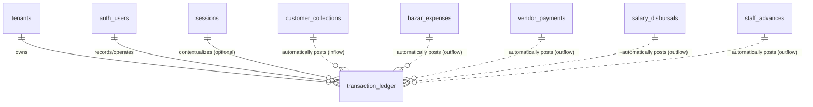

# Detailed Specification: Transaction Ledger (`financial-ledger`)

This document provides a detailed specification for the **Transaction Ledger** module. This module serves as the central book of accounts (ledger) for each tenant, compiling all operational cash flows, digital payments, bank transfers, and automated ledger postings from other modules into a single, immutable, and auditable ledger log.

---

## 1. Feature Overview & Objectives

The **Transaction Ledger** module is the financial foundation of the Canteen Management System. It acts as an append-only transaction repository that integrates with all business operations (meal billing, customer payments, ingredient buying, supplier payouts, and staff salary/advances). It enforces strict double-entry ledger bookkeeping concepts and ensures full auditing transparency.

### Key Objectives:
*   **Central Bookkeeping Ledger**: Maintain a single, consolidated register (`transaction_ledger`) tracking all financial movements (inflows and outflows) across the entire tenant workspace.
*   **Automated Double-Entry Integration**: Receive automated financial postings from external modules:
    *   `POS` (counter sales) and `Debt Collection` (customer payments) from the **Meal & Customer Management** module.
    *   `Raw Materials` (bazar buying) and `Supplier Payout` (payouts to suppliers) from the **Procurement & Supplier Management** module.
    *   `Payroll` (salaries) and `Staff Advance` (employee advances) from the **Staff Attendance & Payroll** module.
*   **Temporal & Session Isolation**: Track the operational cash drawer by linking transactions back to active `session_id` records. This powers the shift cash reconciliation engine.
*   **Immutable Transaction Audit Logs**: Block all database-level `UPDATE` and `DELETE` queries on the ledger table, guaranteeing that once a record is created, it cannot be tampered with or deleted.
*   **Real-Time Tenant Financial Dashboard**: Aggregate historical and active records to calculate metrics including net profit/loss, total expenses, outstanding customer credit, and outstanding supplier debt.
*   **Daily Financial & Cost Breakdown**: Provide a granular reporting query that breaks down daily transaction totals, net profit/loss, and cost breakdowns by category (POS sales, raw ingredients, payroll, staff advances, supplier payouts, and cash discrepancies) to give owners full control over daily trends.
*   **Dynamic Localization & Currency Formatting**: Standardize amount displays utilizing the tenant's chosen currency (default: BDT/`৳`) and language locale (default: `bn`) at the presentation layer using JavaScript localization libraries (`Intl.NumberFormat`).

---

## 2. User Stories

### Persona A: Canteen Owner (Admin/Owner Role)
1.  **As a** Canteen Owner,  
    **I want to** view a consolidated list of all financial inflows and outflows across cash, bank transfers, and mobile wallets,  
    **So that** I have absolute visibility into all financial activities in my business.
2.  **As a** Canteen Owner,  
    **I want to** view a financial dashboard displaying real-time metrics for net profit/loss, total expenses, outstanding customer receivables, and supplier payables over any date range,  
    **So that** I can assess the health of my business and make strategic payouts.
3.  **As a** Canteen Owner,  
    **I want to** view a detailed daily financial breakdown (daily profit, total revenue, total expense, and individual cost category breakdowns like bazar expenses, staff salaries, and cash shortages) for any specific date range,  
    **So that** I can analyze which specific expenses/costs are cutting into my profit margin day by day.
4.  **As a** Canteen Owner,  
    **I want to** log manual entries (e.g. cash withdrawals, capital additions, and overhead costs like utility bills or shop rent) directly into the ledger,  
    **So that** my bookkeeping is comprehensive and reflects off-system costs.
5.  **As a** Canteen Owner,  
    **I want to** ensure that past ledger entries are immutable and cannot be deleted or edited under any circumstances,  
    **So that** my staff cannot falsify financial records or cover up drawer shortages.

### Persona B: Shift Manager (Default Admin Role)
1.  **As a** Shift Manager,  
    **I want to** view a list of all transactions associated with my active shift session,  
    **So that** I can cross-verify sales collections and market expenses before closing the drawer.
2.  **As a** Shift Manager,  
    **I want to** see the running cash balance of the drawer dynamically calculated from active session transactions,  
    **So that** I know exactly how much physical cash should be in the register.

---

## 3. Data Model

All ledger entries are strictly isolated by tenant using a `tenant_id` column protected by Row-Level Security (RLS).



### Table Definitions

#### 1. `transaction_ledger` (Unified Transaction Ledger)
The single table acting as the tenant's append-only financial ledger.

| Column Name | Type | Constraints | Description |
| :--- | :--- | :--- | :--- |
| `id` | `uuid` | Primary Key, `default gen_random_uuid()` | Unique ledger entry identifier. |
| `tenant_id` | `uuid` | Foreign Key -> `tenants.id`, `not null` | Scopes this ledger record to a tenant. |
| `session_id` | `uuid` | Foreign Key -> `sessions.id`, Nullable | Links the transaction to an operational session. Nullable for off-shift ledger events (e.g. bank payouts). |
| `type` | `text` | `not null`, `check (type in ('inflow', 'outflow'))` | Direction of funds. |
| `category` | `text` | `not null` | Category classification (e.g., `POS`, `Debt Collection`, `Raw Materials`, `Payroll`, `Supplier Payout`, `Staff Advance`, `Bazar Discrepancy`, `Bazar Surplus`, `Overhead`, `Manual Inflow`, `Manual Outflow`). |
| `amount` | `numeric(12, 2)` | `not null`, `check (amount >= 0)` | Transaction value. |
| `payment_method` | `text` | `not null`, `check (payment_method in ('cash', 'bank_transfer', 'mobile_wallet'))` | Settled payment channel. |
| `operator_user_id`| `uuid` | Foreign Key -> `auth.users`, Nullable | Web/Dashboard administrator who initiated the ledger log. |
| `operator_staff_id`| `uuid` | Foreign Key -> `staff_members.id`, Nullable | Counter terminal staff member who initiated the ledger log. |
| `notes` | `text` | Nullable | Audit note or descriptive reference. |
| `created_at` | `timestamptz` | `default now()`, `not null` | Epoch timestamp of creation. |
| `updated_at` | `timestamptz` | `default now()`, `not null` | Audit tracking (immutable). |

### Constraints & Indexes

1.  **Foreign Key Indexes**:
    ```sql
    create index idx_transaction_ledger_tenant_id on public.transaction_ledger(tenant_id);
    create index idx_transaction_ledger_session_id on public.transaction_ledger(session_id);
    create index idx_transaction_ledger_operator_user_id on public.transaction_ledger(operator_user_id);
    create index idx_transaction_ledger_operator_staff_id on public.transaction_ledger(operator_staff_id);
    ```
2.  **Performance & Query Optimization Indexes**:
    ```sql
    -- For date range filtering on financial ledger reports
    create index idx_transaction_ledger_created_at on public.transaction_ledger(created_at desc);

    -- For dashboard aggregation queries (Summing inflow/outflow by category per tenant)
    create index idx_transaction_ledger_type_cat on public.transaction_ledger(tenant_id, type, category);
    ```

---

## 4. Permission Control & Row-Level Security (RLS)

All entries are strictly isolated using Tenant Row-Level Security. Permissions are dynamic, evaluated via the `permissions` JSONB field in `tenant_roles`.

### Dynamic Permission Schema

For the **Transaction Ledger** module, the permissions configuration under `tenant_roles.permissions` is structured as follows:

```json
{
  "modules": {
    "financial_ledger": {
      "ledger_read": "all",              // Options: "all" | "self" | "none"
      "ledger_write_manual": true,       // Options: true | false (allows manual inflows/outflows logging)
      "dashboard_read": true             // Options: true | false (allows viewing the financial metrics dashboard)
    }
  }
}
```

### Default Role Mapping Matrix

Below is the default role mapping. The `Owner` role is system-defined and immutable.

| Operations | Cashier / Operator (Default Member) | Shift Manager (Default Admin) | Owner (Default Immutable) | Platform Superadmin |
| :--- | :--- | :--- | :--- | :--- |
| **Ledger (Read)** | `ledger_read` = `"self"` | `ledger_read` = `"all"` | Yes (All) | Yes (Bypass RLS) |
| **Ledger (Manual Insert)** | `ledger_write_manual` = `false` | `ledger_write_manual` = `false` | Yes (All) | Yes (Bypass RLS) |
| **Dashboard (Read)** | `dashboard_read` = `false` | `dashboard_read` = `true` | Yes (All) | Yes (Bypass RLS) |

### Core RLS Policies (SQL Implementation)

```sql
-- Enable Row-Level Security
alter table public.transaction_ledger enable row level security;

-- SELECT: Read Ledger Entries
create policy "Users can view ledger entries based on role scope"
  on public.transaction_ledger for select
  using (
    tenant_id = tenant_id and (
      -- Superadmins bypass RLS checks
      exists (
        select 1 from public.user_profiles
        where id = auth.uid() and is_superadmin = true
      ) or
      -- Check for 'all' scope
      (public.get_ledger_read_scope(tenant_id) = 'all') or
      -- Check for 'self' scope (only transactions logged by the current user)
      (public.get_ledger_read_scope(tenant_id) = 'self' and operator_id = auth.uid())
    )
  );

-- INSERT: Record Manual Ledger Entries
create policy "Users can insert manual ledger entries if authorized"
  on public.transaction_ledger for insert
  with check (
    tenant_id = tenant_id and (
      public.has_module_permission(tenant_id, 'financial_ledger', 'ledger_write_manual')
    )
  );

-- UPDATE/DELETE: Blocked at policy level to enforce absolute immutability
create policy "Ledger entries cannot be updated by anyone"
  on public.transaction_ledger for update
  using (false);

create policy "Ledger entries cannot be deleted by anyone"
  on public.transaction_ledger for delete
  using (false);
```

#### Helper Function: Get Ledger Read Scope Dynamically
```sql
create or replace function public.get_ledger_read_scope(
  p_tenant_id uuid
)
returns text
security definer
stable
set search_path = public
language plpgsql
as $$
declare
  v_permissions jsonb;
begin
  if exists (
    select 1 from public.user_profiles
    where id = auth.uid() and is_superadmin = true
  ) then
    return 'all';
  end if;

  select r.permissions into v_permissions
  from public.tenant_members m
  join public.tenant_roles r on m.role_id = r.id
  where m.tenant_id = p_tenant_id
    and m.user_id = auth.uid()
    and m.status = 'active';

  if v_permissions is null then
    return 'none';
  end if;

  if coalesce((v_permissions->>'all')::boolean, false) = true then
    return 'all';
  end if;

  return coalesce(
    v_permissions->'modules'->'financial_ledger'->>'ledger_read',
    'none'
  );
end;
$$;
```

---

## 5. API Flow & Lifecycle Operations

### Database RPC Functions

#### 1. Record Manual Ledger Entry: `log_manual_ledger_entry`
Allows authorized users (Owners/Admins) to log manual financial inflows/outflows (e.g. utilities, rent, capital injections).

```sql
create or replace function public.log_manual_ledger_entry(
  p_tenant_id uuid,
  p_session_id uuid,
  p_type text,
  p_category text,
  p_amount numeric,
  p_payment_method text,
  p_notes text default null
)
returns uuid
security definer
set search_path = public
language plpgsql
as $$
declare
  v_new_id uuid;
begin
  -- 1. Enforce validation rules
  if p_type not in ('inflow', 'outflow') then
    raise exception 'Invalid transaction type. Must be inflow or outflow.';
  end if;

  if p_amount <= 0.00 then
    raise exception 'Transaction amount must be greater than zero.';
  end if;

  if p_payment_method not in ('cash', 'bank_transfer', 'mobile_wallet') then
    raise exception 'Invalid payment method.';
  end if;

  -- 2. Verify authorization
  if not public.has_module_permission(p_tenant_id, 'financial_ledger', 'ledger_write_manual') then
    raise exception 'Unauthorized. User does not have manual ledger write permissions.';
  end if;

  -- 3. Log the entry
  insert into public.transaction_ledger (
    tenant_id,
    session_id,
    type,
    category,
    amount,
    payment_method,
    operator_id,
    notes
  )
  values (
    p_tenant_id,
    p_session_id,
    p_type,
    p_category,
    p_amount,
    p_payment_method,
    auth.uid(),
    p_notes
  )
  returning id into v_new_id;

  return v_new_id;
end;
$$;
```

#### 2. Get Tenant Financial Summary (Dashboard): `get_tenant_financial_summary`
Aggregates and compiles the financial dashboard reports for a given tenant over a specific date range.

```sql
create or replace function public.get_tenant_financial_summary(
  p_tenant_id uuid,
  p_start_date timestamptz,
  p_end_date timestamptz
)
returns table (
  total_inflow numeric(12, 2),
  total_outflow numeric(12, 2),
  net_profit_loss numeric(12, 2),
  outstanding_receivables numeric(12, 2),
  outstanding_payables numeric(12, 2),
  cash_sales_pos numeric(12, 2),
  market_expenses numeric(12, 2),
  payroll_expenses numeric(12, 2)
)
security definer
set search_path = public
stable
language plpgsql
as $$
declare
  v_inflow numeric(12, 2) := 0.00;
  v_outflow numeric(12, 2) := 0.00;
  v_receivables numeric(12, 2) := 0.00;
  v_payables numeric(12, 2) := 0.00;
  v_pos numeric(12, 2) := 0.00;
  v_market numeric(12, 2) := 0.00;
  v_payroll numeric(12, 2) := 0.00;
begin
  -- 1. Verify authorization
  if not public.has_module_permission(p_tenant_id, 'financial_ledger', 'dashboard_read') then
    raise exception 'Unauthorized to view financial dashboard summary.';
  end if;

  -- 2. Aggregate inflows & category specific metrics
  select 
    coalesce(sum(case when type = 'inflow' then amount else 0.00 end), 0.00),
    coalesce(sum(case when type = 'outflow' then amount else 0.00 end), 0.00),
    coalesce(sum(case when category = 'POS' then amount else 0.00 end), 0.00),
    coalesce(sum(case when category = 'Raw Materials' then amount else 0.00 end), 0.00),
    coalesce(sum(case when category = 'Payroll' then amount else 0.00 end), 0.00)
  into 
    v_inflow, v_outflow, v_pos, v_market, v_payroll
  from public.transaction_ledger
  where tenant_id = p_tenant_id
    and created_at >= p_start_date
    and created_at <= p_end_date;

  -- 3. Fetch outstanding receivables (customer debt balance) from customers
  select coalesce(sum(outstanding_balance), 0.00) into v_receivables
  from public.customers
  where tenant_id = p_tenant_id;

  -- 4. Fetch outstanding payables (supplier debt balance) from suppliers
  select coalesce(sum(outstanding_balance), 0.00) into v_payables
  from public.suppliers
  where tenant_id = p_tenant_id;

  return query 
  select 
    v_inflow,
    v_outflow,
    (v_inflow - v_outflow),
    v_receivables,
    v_payables,
    v_pos,
    v_market,
    v_payroll;
end;
$$;
```

#### 3. Get Cash Register Running Balance: `get_cash_register_running_balance`
Returns the expected physical cash drawer balance for an active session to support reconciliation.

```sql
create or replace function public.get_cash_register_running_balance(
  p_tenant_id uuid,
  p_session_id uuid
)
returns numeric(12, 2)
security definer
set search_path = public
stable
language plpgsql
as $$
declare
  v_opening numeric(12, 2) := 0.00;
  v_inflow numeric(12, 2) := 0.00;
  v_outflow numeric(12, 2) := 0.00;
begin
  -- Fetch opening cash from the session metadata
  select coalesce(opening_cash, 0.00) into v_opening
  from public.sessions
  where id = p_session_id and tenant_id = p_tenant_id;

  -- Sum Cash Inflows for the session
  select coalesce(sum(amount), 0.00) into v_inflow
  from public.transaction_ledger
  where tenant_id = p_tenant_id
    and session_id = p_session_id
    and type = 'inflow'
    and payment_method = 'cash';

  -- Sum Cash Outflows for the session
  select coalesce(sum(amount), 0.00) into v_outflow
  from public.transaction_ledger
  where tenant_id = p_tenant_id
    and session_id = p_session_id
    and type = 'outflow'
    and payment_method = 'cash';

  return (v_opening + v_inflow - v_outflow);
end;
$$;
```

#### 4. Get Daily Financial Breakdown (Daily Profit & Cost Breakdown): `get_daily_financial_breakdown`
Returns a tabular view of daily financial performance with total revenues, total operational expenses, net daily profit, and itemized cost breakdowns for a given date range.

```sql
create or replace function public.get_daily_financial_breakdown(
  p_tenant_id uuid,
  p_start_date date,
  p_end_date date
)
returns table (
  transaction_date date,
  total_inflow numeric(12, 2),
  total_outflow numeric(12, 2),
  net_profit numeric(12, 2),
  pos_sales numeric(12, 2),
  debt_collections numeric(12, 2),
  raw_materials numeric(12, 2),
  payroll_expenses numeric(12, 2),
  supplier_payouts numeric(12, 2),
  staff_advances numeric(12, 2),
  bazar_discrepancies numeric(12, 2),
  bazar_surpluses numeric(12, 2),
  overhead_expenses numeric(12, 2),
  manual_inflows numeric(12, 2),
  manual_outflows numeric(12, 2)
)
security definer
set search_path = public
stable
language plpgsql
as $$
begin
  -- 1. Verify authorization
  if not public.has_module_permission(p_tenant_id, 'financial_ledger', 'dashboard_read') then
    raise exception 'Unauthorized to view financial breakdown reports.';
  end if;

  -- 2. Return daily aggregation table
  return query
  select 
    (created_at timezone 'UTC')::date as trans_date,
    coalesce(sum(case when type = 'inflow' then amount else 0.00 end), 0.00) as total_in,
    coalesce(sum(case when type = 'outflow' then amount else 0.00 end), 0.00) as total_out,
    (
      coalesce(sum(case when type = 'inflow' then amount else 0.00 end), 0.00) -
      coalesce(sum(case when type = 'outflow' then amount else 0.00 end), 0.00)
    ) as net_prof,
    coalesce(sum(case when category = 'POS' then amount else 0.00 end), 0.00) as pos,
    coalesce(sum(case when category = 'Debt Collection' then amount else 0.00 end), 0.00) as debt,
    coalesce(sum(case when category = 'Raw Materials' then amount else 0.00 end), 0.00) as raw,
    coalesce(sum(case when category = 'Payroll' then amount else 0.00 end), 0.00) as payroll,
    coalesce(sum(case when category = 'Supplier Payout' then amount else 0.00 end), 0.00) as payout,
    coalesce(sum(case when category = 'Staff Advance' then amount else 0.00 end), 0.00) as advance,
    coalesce(sum(case when category = 'Bazar Discrepancy' then amount else 0.00 end), 0.00) as discrepancy,
    coalesce(sum(case when category = 'Bazar Surplus' then amount else 0.00 end), 0.00) as surplus,
    coalesce(sum(case when category = 'Overhead' then amount else 0.00 end), 0.00) as overhead,
    coalesce(sum(case when category = 'Manual Inflow' then amount else 0.00 end), 0.00) as man_in,
    coalesce(sum(case when category = 'Manual Outflow' then amount else 0.00 end), 0.00) as man_out
  from public.transaction_ledger
  where tenant_id = p_tenant_id
    and (created_at timezone 'UTC')::date >= p_start_date
    and (created_at timezone 'UTC')::date <= p_end_date
  group by (created_at timezone 'UTC')::date
  order by trans_date desc;
end;
$$;
```

---

## 6. Immutable Ledger Constraints & Closed Session Locks

To guarantee strict compliance, the central ledger table incorporates database triggers preventing any structural adjustments after record ingestion.

### 1. Closed Operational Session Lock Trigger
When other modules trigger automated double-entry postings to the ledger, the ledger ensures the associated session is not already closed. This prevents retroactively adding transactions to a closed business date/shift.

```sql
-- Trigger attached to transaction_ledger checking session locking status
create trigger check_transaction_session_lock
before insert or update or delete
on public.transaction_ledger
for each row
execute function public.enforce_closed_session_lock();
```
*(Note: `public.enforce_closed_session_lock()` is defined under the **Operational Shifts & Sessions** specifications).*

### 2. Absolute Audit Record Immutability Trigger
To ensure the audit log is completely append-only and cannot be tampered with by any database user (including superadmins/owners), updates and deletions are hard-blocked at the database constraint level.

```sql
create or replace function public.block_ledger_modifications()
returns trigger as $$
begin
  raise exception 'Immutable Ledger Rule: Manual updates and deletions of ledger transactions are strictly prohibited.';
  return null;
end;
$$ language plpgsql;

create trigger enforce_ledger_immutability
before update or delete
on public.transaction_ledger
for each row
execute function public.block_ledger_modifications();
```
