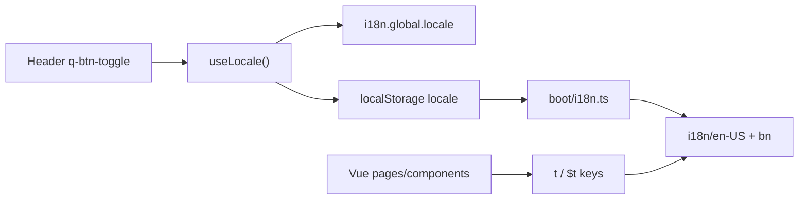

# i18n Language Toggle + Full EN/BN Coverage

**Overview:** Add a persistent EN/বাং language toggle in workspace and kiosk headers, then migrate ~450–550 hardcoded UI strings to vue-i18n across six phases so English and Bangla stay in sync.

## Phase checklist

- [ ] Phase 0: useLocale + boot persistence + EN/বাং toggle in Workspace/Kiosk layouts + nav/layout/feedback keys
- [ ] Phase 1: Auth pages + AuthLayout + 404/403 error pages
- [ ] Phase 2: Workspace dashboard/shifts/sessions/ledger/finance/counter pages
- [ ] Phase 3: WorkspaceMembers + WorkspaceSettings (split 3a/3b if needed)
- [ ] Phase 4: sessions/* and ledger/* components
- [ ] Phase 5: Kiosk PIN/StaffWorkspace/PairDevice + kiosk components
- [ ] Phase 6: Admin layout/pages + store fallbacks + final grep cleanup

---

## Current state

- Boot: [`web/src/boot/i18n.ts`](web/src/boot/i18n.ts) — `vue-i18n`, `locale: 'en-US'`, `legacy: false`, `globalInjection: true`
- Messages: [`web/src/i18n/en-US/index.ts`](web/src/i18n/en-US/index.ts) + [`web/src/i18n/bn/index.ts`](web/src/i18n/bn/index.ts) — stub only (`app.*`, `common.*`)
- Registry: [`web/src/i18n/index.ts`](web/src/i18n/index.ts) maps `'en-US'` and `bn`
- **Zero** `$t()` / `useI18n()` usage in the app today; all copy is hardcoded English



## Locked decisions

| Decision | Choice |
|----------|--------|
| Toggle UI | Dense `q-btn-toggle` with labels `EN` / `বাং` |
| Placement | [`WorkspaceLayout.vue`](web/src/layouts/WorkspaceLayout.vue) and [`KioskLayout.vue`](web/src/layouts/KioskLayout.vue) headers (after `<q-space />`) |
| Locales | `en-US` and `bn` (existing keys) |
| Persistence | `localStorage` key `smart-hisab-locale`; restore in boot before `createI18n` |
| API | Small composable `useLocale()` — not a Pinia store |
| Quasar lang pack | Leave unset for now (component chrome stays English); app strings only |
| Numbers/dates | Keep Latin digits / existing format helpers in v1; no Bangla numeral conversion |
| Untranslated | Tenant names, staff names, emails, slugs, money amounts, API-returned enums that are data |

## Key conventions

Nested by feature; mirror schema in both locale files:

```ts
common.cancel
layouts.workspace.signOut
nav.dashboard
auth.login.title
feedback.errorTitle
sessions.open.title
ledger.filters.dateFrom
kiosk.status.online
admin.tenants.provision
```

- Templates: `$t('…')` or `useI18n().t` in script (`computed` nav labels).
- Every new/changed English key gets a Bangla value in the same PR/phase.
- Toast/dialog call sites pass `t('…')`, not only default args in `useFeedback`.

---

## Phase 0 — Locale infrastructure + toggle (ship first)

**Goal:** Switching language works and persists; shell chrome reacts.

### Files

1. **[`web/src/composables/useLocale.ts`](web/src/composables/useLocale.ts)** (new)
   - `LOCALE_KEY = 'smart-hisab-locale'`
   - `supportedLocales = ['en-US', 'bn'] as const`
   - `setLocale(code)` → set `i18n.global.locale`, write storage
   - `locale` computed from i18n
   - `toggleOptions` for `q-btn-toggle`: `{ value: 'en-US', label: 'EN' }`, `{ value: 'bn', label: 'বাং' }`

2. **[`web/src/boot/i18n.ts`](web/src/boot/i18n.ts)**
   - Read storage; if valid, use as initial `locale`, else `'en-US'`
   - Keep `fallbackLocale: 'en-US'`

3. **Locale catalogs** — expand:
   - `layouts.workspace.*` (powered by, sign out, switch workspace, create-workspace dialog labels/validation)
   - `layouts.kiosk.*` (terminal, online/offline, clock out, offline banner)
   - `nav.*` (Dashboard, Members, Settings, Shifts Config, Sessions, Ledger, Finance)
   - `feedback.*` (`errorTitle`, `ok`, `somethingWentWrong`)
   - Keep existing `common.*` / `app.*`

4. **Header toggle**
   - [`WorkspaceLayout.vue`](web/src/layouts/WorkspaceLayout.vue): add `q-btn-toggle` dense, unelevated/flat bordered, bind `v-model` via `useLocale`
   - [`KioskLayout.vue`](web/src/layouts/KioskLayout.vue): same control in status row
   - Wire nav `label`s and layout strings to `t()`

5. **[`web/src/composables/useFeedback.ts`](web/src/composables/useFeedback.ts)**
   - Resolve default title/OK/fallback via `i18n.global.t('feedback.*')` so dialogs follow locale without every caller changing yet

**Done when:** Reload keeps locale; toggle flips nav + layout + default error dialog chrome.

---

## Phase 1 — Auth + error pages

**Scope (~80–100 strings):** [`pages/auth/*`](web/src/pages/auth/), AuthLayout copy, [`ErrorNotFound.vue`](web/src/pages/ErrorNotFound.vue), [`ErrorForbidden.vue`](web/src/pages/ErrorForbidden.vue)

| Namespace | Covers |
|-----------|--------|
| `auth.login.*` | Welcome, admin subtitle, email/password, Sign In, Google, pair device CTA |
| `auth.signup.*` | Create account, verify email, Register |
| `auth.noTenant.*` / `auth.pending.*` | Empty/pending states, refresh, CTAs |
| `auth.pair.*` / `auth.counter.*` | Pairing + PIN clock-in flows |
| `errors.*` | 404 / 403 |

Also migrate call-site `showSuccess` / `showApiError` strings on these pages to `t()`.

**Done when:** Full auth + error flows readable in Bangla end-to-end.

---

## Phase 2 — Workspace shell pages (non-members/settings)

**Scope (~50–70 strings):** lighter workspace pages first (Members/Settings are huge — Phase 3).

| Page | Namespace |
|------|-----------|
| [`WorkspaceDashboard.vue`](web/src/pages/workspace/WorkspaceDashboard.vue) | `workspace.dashboard.*` |
| [`WorkspaceShifts.vue`](web/src/pages/workspace/WorkspaceShifts.vue) | `workspace.shifts.*` |
| [`WorkspaceSessions.vue`](web/src/pages/workspace/WorkspaceSessions.vue) | `workspace.sessions.*` |
| [`WorkspaceLedger.vue`](web/src/pages/workspace/WorkspaceLedger.vue) | `workspace.ledger.*` |
| [`WorkspaceFinanceDashboard.vue`](web/src/pages/workspace/WorkspaceFinanceDashboard.vue) | `workspace.finance.*` |
| [`CounterDashboard.vue`](web/src/pages/workspace/CounterDashboard.vue) | `workspace.counter.*` |

Titles, buttons, empty states, page-level toasts only. Shared dialogs stay Phase 4.

**Done when:** Those six pages switch language; nav already done in Phase 0.

---

## Phase 3 — Members + Settings (densest)

**Scope (~160–195 strings)** — split into two PR-sized chunks if needed:

### 3a — [`WorkspaceMembers.vue`](web/src/pages/workspace/WorkspaceMembers.vue)
`workspace.members.*`: tabs, table headers, invite/remove/staff/PIN/role dialogs, permission labels+captions, validation, toasts.

### 3b — [`WorkspaceSettings.vue`](web/src/pages/workspace/WorkspaceSettings.vue)
`workspace.settings.*`: General / Preferences / Kiosk tabs, branding, danger zone, device table, pair/revoke dialogs, preference *option labels* (currency/TZ display names that are UI chrome).

**Done when:** Members and Settings fully bilingual including dialogs and toasts.

---

## Phase 4 — Sessions + ledger components

**Scope (~90–110 strings)** under [`components/sessions/`](web/src/components/sessions/) and [`components/ledger/`](web/src/components/ledger/):

| Component | Namespace |
|-----------|-----------|
| SessionOpenDialog / SessionCloseDialog | `sessions.open.*` / `sessions.close.*` |
| SessionHistoryTable / ActiveSessionBanner | `sessions.history.*` / `sessions.banner.*` |
| ShiftConfigForm | `sessions.shiftForm.*` |
| LedgerFiltersBar / LedgerTable / DailyBreakdownTable | `ledger.filters.*` / `ledger.table.*` / `ledger.daily.*` |
| LedgerSummaryCards / ManualLedgerEntryDialog / SessionCashBalance | `ledger.summary.*` / `ledger.manual.*` / `ledger.cash.*` |

Include filter/option enums shown as UI labels (income/expense, cash/bkash, etc.).

**Done when:** Opening/closing sessions and ledger UI are fully bilingual.

---

## Phase 5 — Kiosk floor UI

**Scope (~90–110 strings):**

- Pages: [`PINLogin.vue`](web/src/pages/kiosk/PINLogin.vue), [`StaffWorkspace.vue`](web/src/pages/kiosk/StaffWorkspace.vue), [`PairDevice.vue`](web/src/pages/kiosk/PairDevice.vue)
- Components: [`KioskPinPad.vue`](web/src/components/kiosk/KioskPinPad.vue), [`StaffSelectorGrid.vue`](web/src/components/kiosk/StaffSelectorGrid.vue)
- Namespace: `kiosk.*` (login, workspace actions, POS/meal/advance dialogs, table headers, pair, a11y labels)

Toggle already in KioskLayout from Phase 0 — this phase fills remaining copy.

**Done when:** Clock-in → staff workspace → record entry flows work in Bangla.

---

## Phase 6 — Admin + cleanup

**Scope (~70–85 + leftovers):**

- [`AdminLayout.vue`](web/src/layouts/AdminLayout.vue) + toggle (same control)
- [`AdminDashboard.vue`](web/src/pages/admin/AdminDashboard.vue), [`AdminTenants.vue`](web/src/pages/admin/AdminTenants.vue), [`AdminBilling.vue`](web/src/pages/admin/AdminBilling.vue) → `admin.*`
- Store fallback strings in [`session.ts`](web/src/stores/session.ts) / [`ledger.ts`](web/src/stores/ledger.ts) if still English
- Skip or delete unused [`MainLayout.vue`](web/src/layouts/MainLayout.vue) starter strings (no product traffic)
- Grep pass: no remaining user-facing hardcoded English in `web/src/pages` / `components` / `layouts` (exclude tests, comments)

**Done when:** Admin is bilingual; repo grep is clean for UI copy.

---

## Per-phase checklist (every phase)

1. Add keys to **both** `en-US` and `bn` with identical structure
2. Replace hardcoded strings with `t()` / `$t()`
3. Manually flip toggle and spot-check the phase’s screens
4. Do not change business logic, permissions, or formatting helpers except to wrap strings

## Out of scope (explicit)

- Translating backend/API error payloads (map known codes to keys later if needed)
- Quasar built-in component language packs
- RTL (Bangla is LTR)
- Auto-detect browser language on first visit (default stays `en-US` until user toggles; storage wins thereafter)

## Recommended delivery order

Implement **Phase 0 first**, then 1→6 in order. Do not start Phase 3–5 in the same change set as Phase 0 (scope guard: Members alone can exceed a single edit).
